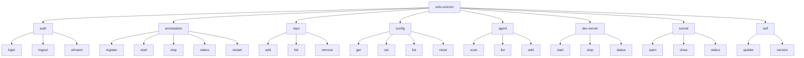
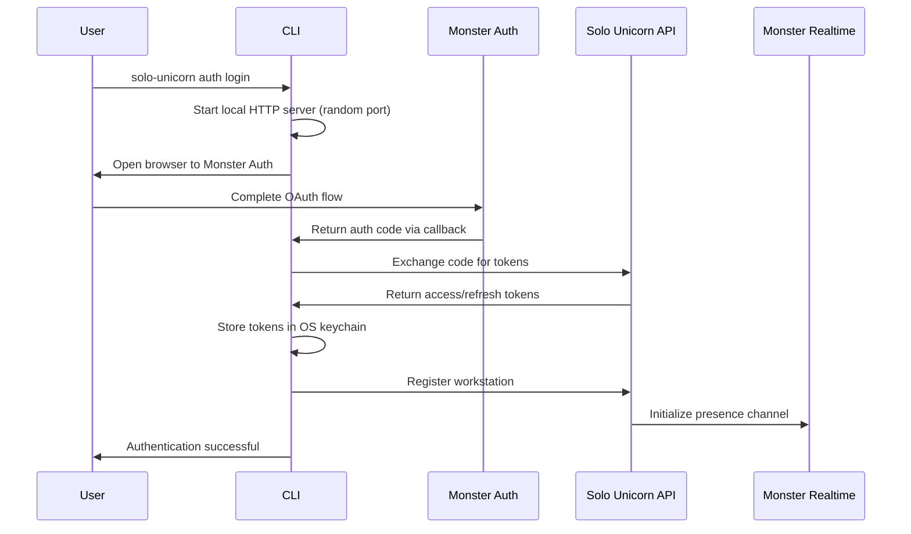
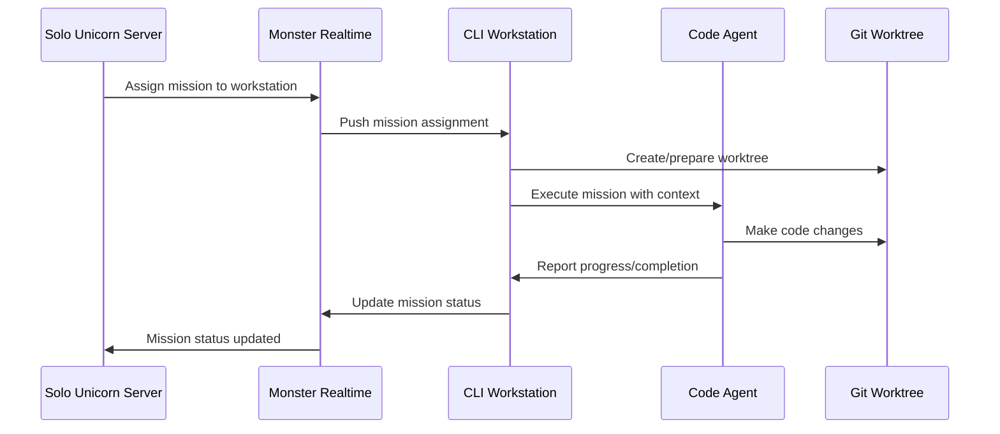

# UI Design - CLI

## Information Architecture

### Command Structure Overview



### Navigation Structure

**Primary Commands:**
- Authentication: User identity and session management
- Workstation: Local machine lifecycle and presence
- Repository: Git worktree and project linking
- Configuration: Settings and preferences management
- Agent: Code agent detection and configuration
- Dev Server: Local development hosting (post-MVP)
- Tunnel: Public URL access (post-MVP)
- Self: CLI maintenance and updates

**Ergonomic Aliases:**
- `solo-unicorn start` → `solo-unicorn workstation start`
- `solo-unicorn stop` → `solo-unicorn workstation stop`
- `solo-unicorn status` → `solo-unicorn workstation status`
- `solo-unicorn restart` → `solo-unicorn workstation restart`

## User Flows

### UF-CLI-AUTH-001 Authentication Flow

**User Goal:** Authenticate with Solo Unicorn using Monster Auth and register workstation

**Entry Points:**
- First CLI usage
- Expired token scenarios
- Explicit login command

**Success Criteria:**
Authenticated user with registered workstation ready for mission assignment

**Flow Diagram:**


**Steps:**
1. Run `solo-unicorn auth login`
2. Local HTTP server starts on random ephemeral port
3. Browser opens to Monster Auth OAuth page
4. User completes OAuth authentication
5. CLI receives authorization code via callback
6. Tokens exchanged and stored securely in OS keychain
7. Workstation automatically registered with system info
8. Monster Realtime connection configured
9. Ready for workstation operations

**Error Handling:**
- Browser not available → Manual URL copy/paste fallback
- Port conflicts → Auto-retry with different ports
- Invalid tokens → Clear error with format guidance
- Network issues → Retry with exponential backoff

### UF-CLI-WORKSTATION-001 Workstation Lifecycle

**User Goal:** Manage workstation presence and availability for mission assignment

**Entry Points:**
- After authentication
- System startup automation
- Manual workstation management

**Success Criteria:**
Workstation online and available for AI code agent mission assignment

**Steps:**
1. `solo-unicorn workstation start` (or alias `solo-unicorn start`)
2. Connect to Monster Realtime WebSocket gateway
3. Join workstation-specific channel: `workstation:{workstation_id}`
4. Send presence update with available code agents
5. Listen for mission assignment messages
6. Report status via `solo-unicorn workstation status`
7. Graceful shutdown with `solo-unicorn workstation stop`

**Background Mode:**
```bash
solo-unicorn workstation start --background
# Or use system service integration (systemd/launchd/Windows Service)
```

**Status Display:**
```
Solo Unicorn Workstation Status
===============================

Workstation: MacBook-Pro-2023 (ws_abc123def)
Organization: acme-corp
Status: Online (Connected 2h 34m)

Authentication:
✓ Logged in as john@acme.com
✓ Personal access token valid (expires in 30d)
✓ Monster Realtime connected

Monster Realtime:
✓ Connected to: realtime.monstermake.limited
✓ Channels: workstation:ws_abc123def, project:proj_123:workstations
✓ Latency: 45ms

Code Agents (Client-Side):
🤖 Claude Code v2.1.4 - Available (1/2 slots used)
🤖 Cursor v0.42.0 - Available
🤖 OpenCode v1.3.2 - Not installed

Active Missions:
📋 mission_789 - Implement auth system (claude-code, 15m ago)
   Working in: /Users/john/workspace/solo-unicorn-feature-auth
```

### UF-CLI-REPO-001 Repository Management

**User Goal:** Link GitHub repositories and manage git worktrees for parallel development

**Entry Points:**
- Project setup
- Adding new repositories to existing project
- Mission assignment requiring new repo/branch

**Success Criteria:**
Repository cloned with worktree structure ready for AI code agent operations

**Steps:**
1. `solo-unicorn repo add https://github.com/user/repo --path ~/workspace/repo`
2. Validate repository access and permissions
3. Clone main repository to specified or default path
4. Register repository with Solo Unicorn API
5. Configure worktree pool for efficient branch management
6. Ready for automatic worktree creation on mission assignment

**Automatic Worktree Management:**
- Main repository: `WORKSPACE_PATH/repo-name`
- Feature worktrees: `WORKSPACE_PATH/repo-name-branch-name`
- Smart reuse: Existing worktree for same branch when available
- Pool management: Keep 3 vacant worktrees per repo
- Cleanup policy: Remove worktrees unused for 7+ days

**Repository List Display:**
```
📁 solo-unicorn (repo_123)
   Main: /Users/john/repos/solo-unicorn (main)
   Worktrees:
   - /Users/john/workspace/solo-unicorn-feature-auth (feature/auth) • Active
   - /Users/john/workspace/solo-unicorn-hotfix (hotfix/critical-bug) • Idle

📁 my-app (repo_456)
   Main: /Users/john/workspace/my-app (develop)
   Status: 🔄 Cloning... (45% complete)
```

### UF-CLI-AGENT-001 Code Agent Discovery and Configuration

**User Goal:** Detect, configure, and manage AI code agents on workstation

**Entry Points:**
- Initial workstation setup
- Adding new code agents
- Troubleshooting agent availability

**Success Criteria:**
Code agents detected, configured, and reporting availability via presence

**Steps:**
1. `solo-unicorn agent scan` - Detect available code agents
2. `solo-unicorn agent list` - Show current configuration
3. `solo-unicorn agent add claude-code` - Register detected agent
4. Configuration stored in `~/.solo-unicorn/code-agents.json`
5. Agent availability reported via Monster Realtime presence
6. Health monitoring and rate limit tracking

**Agent Detection Output:**
```
🔍 Scanning for code agents...

Found:
🤖 Claude Code v2.1.4
   Path: ~/.claude
   Status: Available
   Model: claude-3.5-sonnet
   [Add] [Configure]

🤖 Cursor v0.42.0  
   Path: /Applications/Cursor.app
   Status: Available
   Model: GPT-4
   [Add] [Configure]

🤖 OpenCode v1.3.2
   Status: Not installed
   [Install Guide]
```

### UF-CLI-CONFIG-001 Configuration Management

**User Goal:** Manage CLI settings, workspace paths, and preferences

**Entry Points:**
- Initial setup
- Workspace reconfiguration
- Troubleshooting configuration issues

**Success Criteria:**
Configuration updated and synchronized across workstation operations

**Common Configuration Operations:**
```bash
# View all configuration
solo-unicorn config list

# Get specific setting
solo-unicorn config get workspace.rootPath

# Update workspace path
solo-unicorn config set workspace.rootPath /Users/john/dev

# Reset to defaults
solo-unicorn config reset workspace

# Organization settings
solo-unicorn config set organization acme-corp
```

**Configuration Categories:**
- **Workspace**: Root path, auto-clone, naming conventions
- **Authentication**: Organization, token management
- **Real-time**: Monster Realtime gateway settings
- **Development**: Dev server, tunneling preferences
- **Agents**: Code agent discovery and health check intervals

### UF-CLI-MISSION-001 Mission Assignment Handling

**User Goal:** Receive and execute AI code agent missions automatically

**Entry Points:**
- Mission assigned by server via Monster Realtime
- Manual mission execution (future)

**Success Criteria:**
Mission executed by appropriate code agent with results reported back

**Flow Diagram:**


**Execution Steps:**
1. Receive mission assignment via WebSocket
2. Prepare appropriate git worktree for target branch
3. Launch configured code agent with mission context
4. Monitor agent execution and progress
5. Report status updates via Monster Realtime
6. Handle completion, errors, or timeout scenarios

**Mission Context Provided to Agent:**
- Mission ID, title, description, and specification
- Target repository and branch information
- Project memory and relevant documentation
- Flow stage and acceptance criteria
- PR mode configuration (if enabled)

## Wireframes & Mockups

### Command Output Patterns

#### Successful Operation
```
✓ Repository added successfully

Repository: user/solo-unicorn (repo_123)
Main path: /Users/john/workspace/solo-unicorn
Branch: main
Ready for mission assignments!
```

#### Progress Indication
```
🔍 Validating repository access...
✓ Repository accessible
📁 Cloning repository to workspace...
   ████████████████████▓▓▓▓ 70% (350MB/500MB)
🌲 Setting up git worktree structure...
🔗 Registering with Solo Unicorn API...
```

#### Error Display
```
❌ Error: Not logged in

Please run 'solo-unicorn auth login' first to authenticate with Monster Auth.

Need help? Visit https://docs.solounicorn.lol/cli/authentication
```

#### Status Dashboard
```
Solo Unicorn Workstation Status
===============================

Workstation: MacBook-Pro-2023 (ws_abc123def)
Organization: acme-corp
Status: Online (Connected 2h 34m)

Authentication:
✓ Logged in as john@acme.com
✓ Personal access token valid (expires in 30d)
✓ Monster Realtime connected

Repositories (Git Worktrees):
📁 solo-unicorn (repo_123)
   Main: /Users/john/repos/solo-unicorn (main)
   Worktrees:
   - /Users/john/workspace/solo-unicorn-feature-auth (feature/auth)
   - /Users/john/workspace/solo-unicorn-hotfix (hotfix/critical-bug)

Code Agents:
🤖 Claude Code v2.1.4 - Available (1/2 slots used)
🤖 Cursor v0.42.0 - Available
🤖 OpenCode v1.3.2 - Not installed

Active Missions:
📋 mission_789 - Implement auth system (claude-code, 15m ago)
   Working in: /Users/john/workspace/solo-unicorn-feature-auth
```

#### Help System
```
Solo Unicorn CLI v1.2.3

USAGE:
    solo-unicorn <COMMAND>

COMMANDS:
    auth         Authentication and login management
    workstation  Workstation lifecycle and presence
    repo         Repository and git worktree management
    config       Configuration management
    agent        Code agent detection and setup
    start        Start workstation (alias for workstation start)
    status       Show workstation status (alias for workstation status)
    help         Show this help message

Run 'solo-unicorn <COMMAND> --help' for more information on a command.
```

### Interactive Flows

#### OAuth Authentication Flow
```
$ solo-unicorn auth login

🔑 Starting authentication with Monster Auth...
🌐 Opening browser to: https://auth.monstermake.limited/authorize...
🎯 Waiting for authentication... (timeout in 5 minutes)

✓ Authentication successful!
👤 Logged in as: john@acme.com
🏢 Organization: acme-corp
🖥️  Registering workstation...
✓ Workstation registered: MacBook-Pro-2023 (ws_abc123def)

Ready to start workstation with: solo-unicorn start
```

#### Repository Addition
```
$ solo-unicorn repo add https://github.com/user/solo-unicorn

🔍 Validating repository access...
✓ Repository accessible
📁 Cloning repository to workspace...
   ████████████████████████ 100% (250MB/250MB)
🌲 Setting up git worktree structure...
🔗 Registering with Solo Unicorn API...
✓ Repository added successfully

Repository: user/solo-unicorn (repo_123)
Main path: /Users/john/workspace/solo-unicorn
Branch: main
Worktree pool: 3 vacant worktrees ready
Ready for mission assignments!
```

#### Background Workstation Start
```
$ solo-unicorn workstation start --background

🔌 Connecting to Monster Realtime...
✓ WebSocket connection established
🏠 Joining workstation channel...
✓ Presence registered
🤖 Scanning for available agents...
   - Claude Code v2.1.4 ✓
   - Cursor v0.42.0 ✓
   - OpenCode (not installed)
🚀 Workstation ready for missions

Background process started (PID: 12345)
Use 'solo-unicorn workstation status' to monitor
Use 'solo-unicorn workstation stop' to shutdown
```

## Theming & Style Guide

### Visual Design Language

#### Typography & Formatting
- **Monospace Font**: Optimized for terminal display
- **Unicode Icons**: Emoji and symbols for visual hierarchy
- **Color Coding**: ANSI colors for status indication
- **Consistent Spacing**: Aligned columns and clear groupings

#### Status Indicators
```
✓ Success states (green)
❌ Error states (red)  
⚠ Warning states (yellow)
🔄 Progress/loading states (blue)
🔍 Discovery/scanning states (blue)
📁 File system operations (default)
🔗 Network operations (blue)
🤖 Code agent operations (purple)
📋 Mission operations (blue)
```

#### Progress Visualization
```
████████████████████▓▓▓▓ 70% (350MB/500MB)
[Loading...] ⠋ ⠙ ⠹ ⠸ ⠼ ⠴ ⠦ ⠧ ⠇ ⠏
```

#### Information Hierarchy
```
Main Header
===========

Section Title
─────────────

✓ Status Line with icon
  Indented detail line
  - Bullet point details
    - Sub-bullet points

📁 Resource Group
   Resource details
   - Nested resource info
```

### Command Design Patterns

#### Consistent Flag Patterns
- `--json`: Machine-readable output for all status commands
- `--force`: Override safety checks and confirmations
- `--background`: Run long-running commands in background
- `--help`: Contextual help for any command
- `--verbose`: Detailed logging and debug information

#### Output Format Standards
- **Human-Readable**: Default colorized, formatted output
- **Machine-Readable**: `--json` flag for programmatic consumption
- **Progress**: Real-time updates for long-running operations
- **Errors**: Clear problem statement + actionable solutions
- **Success**: Confirmation + next steps or status summary

#### Configuration File Integration
- **TypeScript Types**: Strongly typed configuration interfaces
- **JSON Schema**: Validation and auto-completion support
- **Environment Variables**: Override for CI/CD and automation
- **OS Integration**: Keychain for secure credentials, system services

### Cross-Platform Considerations

#### Windows Adaptations
- **PowerShell Integration**: Native cmdlet-style help and completion
- **Windows Terminal**: Enhanced display with proper Unicode support
- **Service Management**: Windows Service wrapper for background operation
- **Path Handling**: Windows-style path display and management

#### macOS Optimizations
- **Keychain Integration**: Secure credential storage via Security framework
- **LaunchAgent**: System service integration for background operation
- **Homebrew**: Native package manager distribution
- **Terminal.app**: Optimized for default macOS terminal experience

#### Linux Compatibility
- **Systemd Integration**: Service file generation for background operation
- **Package Formats**: .deb, .rpm, AppImage, and tar.gz distributions
- **Shell Integration**: Bash and Zsh completion scripts
- **Distribution Support**: Ubuntu, Debian, RHEL, Arch, and derivatives

### Security & Privacy Design

#### Credential Handling
- **No Plaintext Storage**: All tokens encrypted in OS credential store
- **Minimal Exposure**: Tokens never logged or displayed
- **Automatic Cleanup**: Secure token removal on logout
- **Rotation Support**: Seamless token refresh without user intervention

#### Network Security
- **TLS Everywhere**: HTTPS/WSS for all network communication
- **Certificate Validation**: Proper certificate pinning for Monster services
- **Proxy Support**: Corporate proxy auto-detection and configuration
- **Rate Limiting**: Respectful API usage with backoff strategies

#### Local Security
- **File Permissions**: Restricted access to configuration and logs
- **Process Isolation**: Secure code agent execution environments
- **Audit Logging**: Track file system operations for security review
- **Sandboxing**: Isolated execution contexts for code agent operations