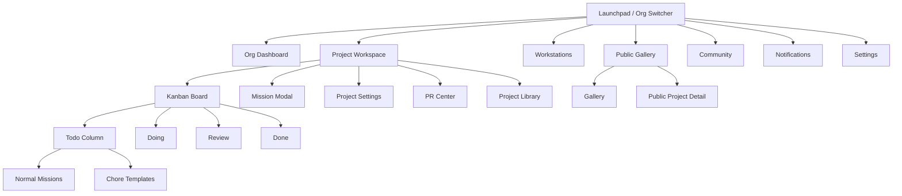

# GUI design - web

## Design Principles
- Friendly-first copy and layout so users always know status and next step
- Mobile-first compositions that rely on shadcn/ui Kanban + DnD for touch interactions
- Monster Theme tokens for color, spacing, typography, and elevation
- Centered modals for primary flows; drawers avoided
- Consistent Ready toggle across cards, modals, and mobile UI

## Information Architecture

### Site Map / Screen Inventory


### Navigation
- **Top header:** Logo, project picker, dark/light toggle, user menu
- **Sub header:** Project name, PR mode indicator (🔄 / ⚡), active members, online workstations, Pause/Resume AI, Settings
- **Mobile:** Bottom tab bar mirrors top-level nav; horizontal scroll Kanban with shadcn/ui DnD gestures
- **Quick actions:** `+ Mission`, `Invite teammate`, `Edit project`

## Mission Board Pattern

### Kanban Board Layout
```
┌──────────────────────────────────────────────────────────────────────────────┐
│ [LOGO] [Project ▼]                           [🌙/☀️] [👤 User ▼]            │
├──────────────────────────────────────────────────────────────────────────────┤
│ Project Name                👤👤👤 🟢 Workstations: 2  [⏸️ Pause] [⚙️ Settings] │
├──────────────────────────────────────────────────────────────────────────────┤
│                                                                              │
│ ┌─────────┬─────────┬─────────┬─────────┐                                    │
│ │  TODO   │  DOING  │ REVIEW  │  DONE   │                                    │
│ ├─────────┼─────────┼─────────┼─────────┤                                    │
│ │┌───────┐│         │         │         │                                    │
│ ││Normal ▼││        │         │         │                                    │
│ │├───────┤│         │         │         │                                    │
│ ││┌─────┐││┌───────┐│┌───────┐│┌───────┐│                                    │
│ │││Mission │││ Mission  ││ Mission  ││ Mission  ││                                    │
│ │││P H   │││ P L    ││ P M    ││ P H    ││                                   │
│ │││Code  │││ Plan   ││ Review ││ Done   ││                                   │
│ │││🔄    │││🤖 AI   ││        ││        ││                                  │
│ │││Desc  │││ Desc   ││ Desc   ││ Desc   ││                                   │
│ │││Ready │││ Ready  ││ Review ││        ││                                   │
│ ││└─────┘││└───────┘│└───────┘│└───────┘│                                    │
│ │├───────┤│         │         │         │                                    │
│ ││Chore ▶ ││         │         │         │                                 │
│ │└───────┘│         │         │         │                                    │
│ └─────────┴─────────┴─────────┴─────────┘                                    │
│                                                                              │
└──────────────────────────────────────────────────────────────────────────────┘
```

- Todo column splits into **Normal missions** and **Chore templates** (collapsible). Chore items are reusable placeholders; selecting one opens a pre-filled Mission Modal, creates a mission in Todo, and leaves the template in place to fill idle agent time when no Ready missions exist.
- Chore cards show a "next eligible" timer (minimum wait) and a rotation weight pill so agents understand how chores will cycle when multiple templates are available.
- Doing, Review, Done columns follow traditional Kanban. Drag/drop updates `mission.list`.
- Ready toggle appears on every mission card footer (Todo/Doing) with the same styling as Mission Modal.

### Mission Card Structure

#### Todo / Doing Card
```
┌───────────────────────────────────────┐
│ Mission Title Here                [⋮] │
├───────────────────────────────────────┤
│ P High [Code]                         │
├───────────────────────────────────────┤
│ Branch: solo-unicorn/mission-auth-123 │
├───────────────────────────────────────┤
│ Description text… (3.5 lines, collapsible)│
│ ⋮                                      │
├───────────────────────────────────────┤
│ Ready status: ☐ Not Ready              │
│ [ Toggle Ready ]                       │
└───────────────────────────────────────┘
```
- Dropdown menu (⋮): View & Edit, Reset AI, Delete Mission.

#### Review Card (PR Mode)
```
┌─────────────────────────────────────┐
│ Mission Title Here                  │
├─────────────────────────────────────┤
│ P Medium [Plan]  👀 PR #42           │
├─────────────────────────────────────┤
│ Branch: solo-unicorn/mission-auth-123│
│ Description preview…                │
├─────────────────────────────────────┤
│ GitHub PR → https://github.com/...  │
│ [Approve] [Request Changes]         │
└─────────────────────────────────────┘
```

#### Done Card
```
┌─────────────────────────────────────┐
│ Mission Title Here                  │
├─────────────────────────────────────┤
│ P Low [Code]  ✅ Merged              │
├─────────────────────────────────────┤
│ Branch: solo-unicorn/mission-auth-123│
│ Description preview…                │
├─────────────────────────────────────┤
│ Merged by sarah@example.com         │
└─────────────────────────────────────┘
```

## Mission Modal (Popup)

Mission Modal replaces the “Mission Room”. Content is identical to the original MissionPopup design.
```
┌─────────────────────────────────────────────────────────────────────────────┐
│ Mission Title Here                                    [⟳ Refresh]  [×]      │
├─────────────────────────────────────────────────────────────────────────────┤
│ Tabs: Overview | Activity | Flow | Files | Review | History                  │
├─────────────────────────────────────────────────────────────────────────────┤
│ Overview                                                                    │
│ • Priority: P High                                                          │
│ • Stage: Plan                                                               │
│ • Process: Queueing                                                         │
│ • Ready status: [ Toggle Ready ]                                            │
│ • Repository: solo-unicorn/mission-auth-123                                 │
│ • Branch: mission-auth-123                                                  │
│ • Actor: Claude Code                                                        │
│ • Flow: Normal (Clarify → Plan → Code)                                      │
│ • Dependencies: Mission #123                                                │
│ • Description: …                                                            │
│ • Acceptance Criteria: …                                                    │
├─────────────────────────────────────────────────────────────────────────────┤
│ Activity log (Agent + Human events)                                         │
├─────────────────────────────────────────────────────────────────────────────┤
│ Flow tab: edit stages, toggle reviews, skip stage                           │
├─────────────────────────────────────────────────────────────────────────────┤
│ Files tab: list changed files + view diff                                   │
├─────────────────────────────────────────────────────────────────────────────┤
│ Review tab: Approve / Request changes with feedback box                     │
├─────────────────────────────────────────────────────────────────────────────┤
│ History tab: timeline of mission state                                      │
└─────────────────────────────────────────────────────────────────────────────┘
```

## Mission Creation Modal
```
┌─────────────────────────────────────────────────────────────────────────────┐
│ Create New Mission                                                       [×] │
├─────────────────────────────────────────────────────────────────────────────┤
│ Title, Description (+ attachments)                                         │
│ Priority, List, Repository, Workstation, Actor                             │
│ Flow (primary): stages with enable/review toggles                           │
│ Dependencies (optional)                                                    │
│ Ready toggle (default off)                                                 │
└─────────────────────────────────────────────────────────────────────────────┘
```

## Project & Organization Views

### Project Settings – PR Configuration
```
┌─────────────────────────────────────────────────────────────────────────────┐
│ Project Settings — PR Mode                                                 │
├─────────────────────────────────────────────────────────────────────────────┤
│ Branch Prefix: [solo-unicorn/]                                             │
│ Target Branch: [main ▼]                                                    │
│ Require Review: [✓]                                                         │
│ Auto-merge: [✓]                                                             │
│ Delete Branch After Merge: [✓]                                              │
│ PR Template: [Edit Template…]                                               │
└─────────────────────────────────────────────────────────────────────────────┘
```

### Workstation View
```
┌─────────────────────────────────────────────────────────────────────────────┐
│ Workstations                                             [Register Workstation] │
├─────────────────────────────────────────────────────────────────────────────┤
│ 🟢 Delta (macOS)  •  Agents: Claude Code  •  Active Missions: 1             │
│ Ready to accept chore templates when backlog is empty.                     │
├─────────────────────────────────────────────────────────────────────────────┤
│ 🟡 Echo (Linux)   •  Agents: Cursor       •  Active Missions: 0             │
│ Recommend toggling Ready on queued missions to keep agents busy.           │
└─────────────────────────────────────────────────────────────────────────────┘
```

### Organization Page
```
┌─────────────────────────────────────────────────────────────────────────────┐
│ Organization: My Org                                   [⚙️ Settings]        │
├─────────────────────────────────────────────────────────────────────────────┤
│ Projects grid, Workstations list, Team members list                         │
└─────────────────────────────────────────────────────────────────────────────┘
```

### Organization Settings
```
┌─────────────────────────────────────────────────────────────────────────────┐
│ Organization Settings                                                 [×]   │
├─────────────────────────────────────────────────────────────────────────────┤
│ [General] [Members] [Security] [Integrations]                                │
├─────────────────────────────────────────────────────────────────────────────┤
│ General: Name, Domain, Logo; Defaults (project template, workstation reg)    │
│ Members: Invite/manage roles (Owner/Admin/Member)                            │
│ Security: Token policies; SSO providers (via Monster Auth)                   │
│ Integrations: GitHub linking; repo access guidance                           │
└─────────────────────────────────────────────────────────────────────────────┘
```

## Public Surfaces

### Public Project Gallery
```
┌─────────────────────────────────────────────────────────────────────────────┐
│ [LOGO] Discover Projects                              [Sign In] [Sign Up]   │
├─────────────────────────────────────────────────────────────────────────────┤
│ Search + Category filter + Featured + Recent projects with stats             │
└─────────────────────────────────────────────────────────────────────────────┘
```

### Public Project View
```
┌─────────────────────────────────────────────────────────────────────────────┐
│ [← Back] Project Title                      [⭐ Star] [🍴 Use Template]      │
├─────────────────────────────────────────────────────────────────────────────┤
│ Overview, Tags, Progress, Activity, Read-only Kanban, Permission-aware CTA  │
└─────────────────────────────────────────────────────────────────────────────┘
```

### Access Request Modal
```
┌─────────────────────────────────────────────────────────────────────────────┐
│ Request Access                                                          [×] │
├─────────────────────────────────────────────────────────────────────────────┤
│ Levels: ○ Contributor  ○ Collaborator                                       │
│ Why do you want to contribute? (optional)                                   │
│ GitHub Profile (optional): github.com/[username]                            │
│ Project may auto-approve Contributor requests                               │
│                                                       [Cancel] [Request]     │
└─────────────────────────────────────────────────────────────────────────────┘
```

### Project Permissions Panel
```
┌─────────────────────────────────────────────────────────────────────────────┐
│ Project Permissions                                                          │
├─────────────────────────────────────────────────────────────────────────────┤
│ Visibility: [Private ▼ | Public]                                            │
│ Anonymous Users Can: [✓ Read completed missions] [✓ Read docs] [✓ Repo info] │
│ Workstation Visibility: [Hidden | Status Only | Full Details]                │
│ Contributors Can: [✓ Create/Edit missions] [✓ Comment]                       │
│ Collaborators Can: [✓ Review] [✓ View workstation details]                   │
│ Maintainers Can: [✓ Execute missions] [✓ Manage repositories]                │
│ Owners: Full control                                                         │
└─────────────────────────────────────────────────────────────────────────────┘
```

## Mobile Patterns
- Uses shadcn/ui Kanban with DnD for horizontal scroll; cards stack vertically within each column.
- Ready toggle sits at bottom of each card with large tap target.
- Mission Modal becomes full-screen sheet on mobile.
- Todo column preserves Normal vs Chore accordion sections (default closed for Chore).
- PR review experiences link out to GitHub but show status chips on cards.

## States & Feedback
- **Ready toggle:** consistent component across card footers and modal; label clarifies effect on AI eligibility.
- **Chore templates:** remain even after mission creation; show last-generated timestamp plus next-eligible timer to indicate freshness.
- **Errors:** Inline banners and toasts with retry; chore failure links to template edit.
- **Notifications:** Severity badges (⚠️, ✅) align with Monster Theme colors.

## Theme

Always use this shadcn theme.

```css
:root {
  --background: oklch(0.9911 0 0);
  --foreground: oklch(0.2755 0.0218 329.4324);
  --card: oklch(1.0000 0 0);
  --card-foreground: oklch(0.2755 0.0218 329.4324);
  --popover: oklch(1.0000 0 0);
  --popover-foreground: oklch(0.2755 0.0218 329.4324);
  --primary: oklch(0.8988 0.0587 341.4299);
  --primary-foreground: oklch(0.2755 0.0218 329.4324);
  --secondary: oklch(0.9672 0.0909 103.9278);
  --secondary-foreground: oklch(0.2755 0.0218 329.4324);
  --muted: oklch(0.9672 0 0);
  --muted-foreground: oklch(0.4568 0 0);
  --accent: oklch(0.9519 0.0704 190.5613);
  --accent-foreground: oklch(0.1907 0.0666 259.7112);
  --destructive: oklch(0.2755 0.0218 329.4324);
  --destructive-foreground: oklch(1.0000 0 0);
  --border: oklch(0.9221 0.0211 342.5513);
  --input: oklch(1.0000 0 0);
  --ring: oklch(0.8988 0.0587 341.4299);
  --chart-1: oklch(0.8988 0.0587 341.4299);
  --chart-2: oklch(0.9273 0.0767 190.8500);
  --chart-3: oklch(0.9672 0.0909 103.9278);
  --chart-4: oklch(0.2755 0.0218 329.4324);
  --chart-5: oklch(1.0000 0 0);
  --sidebar: oklch(0.9260 0.1155 94.6447);
  --sidebar-foreground: oklch(0.2755 0.0218 329.4324);
  --sidebar-primary: oklch(0.8988 0.0587 341.4299);
  --sidebar-primary-foreground: oklch(0.2755 0.0218 329.4324);
  --sidebar-accent: oklch(0.9672 0.0909 103.9278);
  --sidebar-accent-foreground: oklch(0.2755 0.0218 329.4324);
  --sidebar-border: oklch(0.8452 0 0);
  --sidebar-ring: oklch(0.8988 0.0587 341.4299);
  --font-sans: Outfit, sans-serif;
  --font-serif: ui-serif, Georgia, Cambria, "Times New Roman", Times, serif;
  --font-mono: Fira Code, monospace;
  --radius: 0.725rem;
  --shadow-2xs: 0px 4px 8px -2px hsl(0 0% 0% / 0.03);
  --shadow-xs: 0px 4px 8px -2px hsl(0 0% 0% / 0.03);
  --shadow-sm: 0px 4px 8px -2px hsl(0 0% 0% / 0.05), 0px 1px 2px -3px hsl(0 0% 0% / 0.05);
  --shadow: 0px 4px 8px -2px hsl(0 0% 0% / 0.05), 0px 1px 2px -3px hsl(0 0% 0% / 0.05);
  --shadow-md: 0px 4px 8px -2px hsl(0 0% 0% / 0.05), 0px 2px 4px -3px hsl(0 0% 0% / 0.05);
  --shadow-lg: 0px 4px 8px -2px hsl(0 0% 0% / 0.05), 0px 4px 6px -3px hsl(0 0% 0% / 0.05);
  --shadow-xl: 0px 4px 8px -2px hsl(0 0% 0% / 0.05), 0px 8px 10px -3px hsl(0 0% 0% / 0.05);
  --shadow-2xl: 0px 4px 8px -2px hsl(0 0% 0% / 0.13);
  --tracking-normal: 0em;
  --spacing: 0.25rem;
}

.dark {
  --background: oklch(0.2755 0.0218 329.4324);
  --foreground: oklch(0.9791 0 0);
  --card: oklch(0.3199 0.0198 339.8537);
  --card-foreground: oklch(0.9791 0 0);
  --popover: oklch(0.3199 0.0198 339.8537);
  --popover-foreground: oklch(0.9791 0 0);
  --primary: oklch(0.8988 0.0587 341.4299);
  --primary-foreground: oklch(0.2755 0.0218 329.4324);
  --secondary: oklch(0.8109 0.1509 83.0999);
  --secondary-foreground: oklch(0.2755 0.0218 329.4324);
  --muted: oklch(0.3199 0.0198 339.8537);
  --muted-foreground: oklch(0.7731 0 0);
  --accent: oklch(0.8830 0.0977 211.9987);
  --accent-foreground: oklch(0.2755 0.0218 329.4324);
  --destructive: oklch(0.6100 0.1947 24.1101);
  --destructive-foreground: oklch(1.0000 0 0);
  --border: oklch(0.3816 0.0189 339.6094);
  --input: oklch(0.3816 0.0189 339.6094);
  --ring: oklch(0.8830 0.0977 211.9987);
  --chart-1: oklch(0.2755 0.0218 329.4324);
  --chart-2: oklch(0.8988 0.0587 341.4299);
  --chart-3: oklch(0.8109 0.1509 83.0999);
  --chart-4: oklch(0.6100 0.1947 24.1101);
  --chart-5: oklch(0.8830 0.0977 211.9987);
  --sidebar: oklch(0.2755 0.0218 329.4324);
  --sidebar-foreground: oklch(0.9791 0 0);
  --sidebar-primary: oklch(0.8830 0.0977 211.9987);
  --sidebar-primary-foreground: oklch(0.2755 0.0218 329.4324);
  --sidebar-accent: oklch(0.8109 0.1509 83.0999);
  --sidebar-accent-foreground: oklch(0.2755 0.0218 329.4324);
  --sidebar-border: oklch(0.3816 0.0189 339.6094);
  --sidebar-ring: oklch(0.8830 0.0977 211.9987);
  --font-sans: Outfit, sans-serif;
  --font-serif: ui-serif, Georgia, Cambria, "Times New Roman", Times, serif;
  --font-mono: Fira Code, monospace;
  --radius: 0.725rem;
  --shadow-2xs: 0px 4px 8px -2px hsl(0 0% 0% / 0.03);
  --shadow-xs: 0px 4px 8px -2px hsl(0 0% 0% / 0.03);
  --shadow-sm: 0px 4px 8px -2px hsl(0 0% 0% / 0.05), 0px 1px 2px -3px hsl(0 0% 0% / 0.05);
  --shadow: 0px 4px 8px -2px hsl(0 0% 0% / 0.05), 0px 1px 2px -3px hsl(0 0% 0% / 0.05);
  --shadow-md: 0px 4px 8px -2px hsl(0 0% 0% / 0.05), 0px 2px 4px -3px hsl(0 0% 0% / 0.05);
  --shadow-lg: 0px 4px 8px -2px hsl(0 0% 0% / 0.05), 0px 4px 6px -3px hsl(0 0% 0% / 0.05);
  --shadow-xl: 0px 4px 8px -2px hsl(0 0% 0% / 0.05), 0px 8px 10px -3px hsl(0 0% 0% / 0.05);
  --shadow-2xl: 0px 4px 8px -2px hsl(0 0% 0% / 0.13);
}

@theme inline {
  --color-background: var(--background);
  --color-foreground: var(--foreground);
  --color-card: var(--card);
  --color-card-foreground: var(--card-foreground);
  --color-popover: var(--popover);
  --color-popover-foreground: var(--popover-foreground);
  --color-primary: var(--primary);
  --color-primary-foreground: var(--primary-foreground);
  --color-secondary: var(--secondary);
  --color-secondary-foreground: var(--secondary-foreground);
  --color-muted: var(--muted);
  --color-muted-foreground: var(--muted-foreground);
  --color-accent: var(--accent);
  --color-accent-foreground: var(--accent-foreground);
  --color-destructive: var(--destructive);
  --color-destructive-foreground: var(--destructive-foreground);
  --color-border: var(--border);
  --color-input: var(--input);
  --color-ring: var(--ring);
  --color-chart-1: var(--chart-1);
  --color-chart-2: var(--chart-2);
  --color-chart-3: var(--chart-3);
  --color-chart-4: var(--chart-4);
  --color-chart-5: var(--chart-5);
  --color-sidebar: var(--sidebar);
  --color-sidebar-foreground: var(--sidebar-foreground);
  --color-sidebar-primary: var(--sidebar-primary);
  --color-sidebar-primary-foreground: var(--sidebar-primary-foreground);
  --color-sidebar-accent: var(--sidebar-accent);
  --color-sidebar-accent-foreground: var(--sidebar-accent-foreground);
  --color-sidebar-border: var(--sidebar-border);
  --color-sidebar-ring: var(--sidebar-ring);

  --font-sans: var(--font-sans);
  --font-mono: var(--font-mono);
  --font-serif: var(--font-serif);

  --radius-sm: calc(var(--radius) - 4px);
  --radius-md: calc(var(--radius) - 2px);
  --radius-lg: var(--radius);
  --radius-xl: calc(var(--radius) + 4px);

  --shadow-2xs: var(--shadow-2xs);
  --shadow-xs: var(--shadow-xs);
  --shadow-sm: var(--shadow-sm);
  --shadow: var(--shadow);
  --shadow-md: var(--shadow-md);
  --shadow-lg: var(--shadow-lg);
  --shadow-xl: var(--shadow-xl);
  --shadow-2xl: var(--shadow-2xl);
}
```
