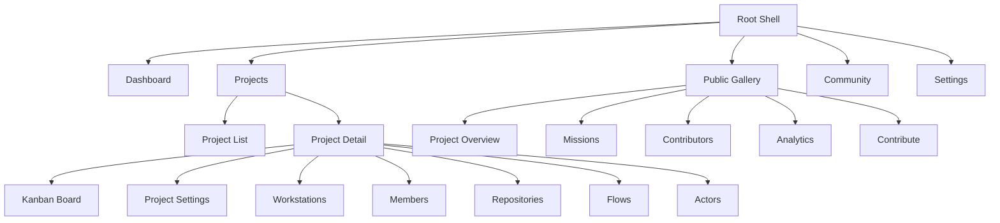
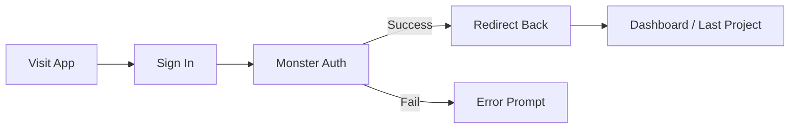
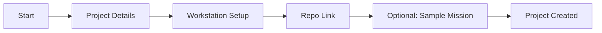
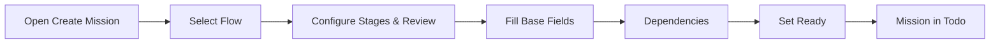
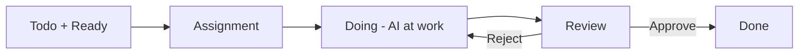
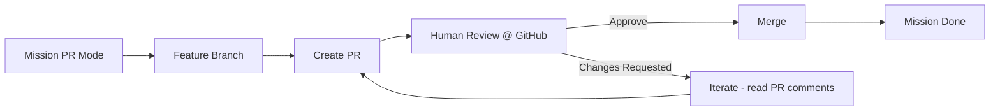

# GUI design - web

## Information Architecture

### Site Map / Screen Inventory


### Navigation Structure
Primary: Dashboard, Projects, Public Gallery, Community, Settings

Secondary: Kanban Board, Project Settings, Workstations, Members, Repositories, Flows, Actors

Breadcrumbs: Organization / Project / Area / Item

## User Flows

### UF-AUTH-001 - Authentication Flow
User Goal: Access Solo Unicorn securely as org member or public visitor

Entry Points: Sign In; deep links; public pages

Success Criteria: Authenticated and routed to org/project context or public page with permission-aware content

Steps:
1. Visit app and click Sign In
2. Redirect to Monster Auth and complete OAuth
3. Callback sets secure cookies
4. Land on Dashboard or last project

Interface References:
- GET /api/oauth/callback
- /rpc cookie-authenticated calls

Flow Diagram:


### UF-PROJ-001 - Project Creation Flow
User Goal: Create a new project and prepare it for missions

Entry Points: Create New Project (Dashboard/Projects)

Success Criteria: Project ready; optional sample mission created

Steps:
1. Open Project Create
2. Fill details (name, description)
3. Associate workstation (hints if none online)
4. Link repository (validate URL)
5. Optionally create sample mission

Flow Diagram:


### UF-MISSION-001 - Mission Creation Flow
User Goal: Create a mission with flow-first settings and set Ready

Entry Points: Create Mission from Kanban

Success Criteria: Mission appears in Todo with Ready enabled

Steps:
1. Select a Flow (primary selection)
2. Configure stages (enable/require review; choose start stage)
3. Fill Base fields (title, description, priority, list)
4. Add optional dependencies
5. Set Ready

Flow Diagram:


### UF-MISSION-002 - Mission Execution Flow
User Goal: Agent executes code; real-time updates; human review if required

Entry Points: Mission moves Todo → Doing → Review → Done

Success Criteria: Mission approved (if required) and completed

Steps:
1. Assignment when Ready and dependencies clear
2. Doing: AI at work; status updates live
3. Review: Approve or Reject with feedback
4. Done or Iterate back to Doing on reject

Flow Diagram:


Flow Diagram:
```mermaid
flowchart LR
  T[Todo + Ready] --> A[Assignment]
  A --> Do[Doing - AI at work]
  Do --> Rev[Review (if configured)]
  Rev -->|Approve| X[Done]
  Rev -->|Reject| Do
```

Process Badges
- Todo: Queueing
- Doing: AI at work
- Review/Done: no process badge

Stage Badges
- Display-only on cards; click opens Flow tab to make changes

### UF-PUBLIC-001 - Public Project Discovery
User Goal: Browse public projects and request access

Success Criteria: Understand project quickly; optionally request access

Steps:
1. Browse/search gallery; filter/sort
2. Open project and view overview/kanban read-only
3. Request access (Contributor/Collaborator)
4. Await owner decision

### UF-PR-001 - PR Mode Workflow
User Goal: Use PR-based change management with review

Success Criteria: PR approved and merged; mission Done

Steps:
1. Feature branch created on Doing
2. Create PR on entering Review
3. Human review on GitHub; if changes requested, iterate
4. Merge and Done

Flow Diagram:


## Wireframes & Mockups

### KanbanBoard
```
┌──────────────────────────────────────────────────────────────────────────────┐
│ [LOGO] [Project ▼]                           [🌙/☀️] [👤 User ▼]            │
├──────────────────────────────────────────────────────────────────────────────┤
│ Project Name      👤👤👤  🟢 Workstations: 2  [⏸️ Pause] [⚙️ Settings]       │
├──────────────────────────────────────────────────────────────────────────────┤
│                                                                              │
│ ┌─────────┬─────────┬─────────┬─────────┐                                    │
│ │  TODO   │  DOING  │ REVIEW  │  DONE   │                                    │
│ ├─────────┼─────────┼─────────┼─────────┤                                    │
│ │┌───────┐│         │         │         │                                    │
│ ││Normal ▼││         │         │         │                                    │
│ │├───────┤│         │         │         │                                    │
│ ││┌─────┐││┌───────┐│┌───────┐│┌───────┐│                                    │
│ │││Mission│││ Mission ││ Mission ││ Mission ││                                    │
│ │││P H   │││ P L    ││ P M    ││ P H    ││                                    │
│ │││Code  │││ Plan   ││ Review ││ Done   ││                                    │
│ │││🔄    │││🤖 AI   ││        ││        ││                                    │
│ │││Desc  │││ Desc   ││ Desc   ││ Desc   ││                                    │
│ │││Ready │││ Ready  ││ Review ││        ││                                    │
│ ││└─────┘││└───────┘│└───────┘│└───────┘│                                    │
│ │├───────┤│         │         │         │                                    │
│ ││Loop ▶ ││         │         │         │                                    │
│ │└───────┘│         │         │         │                                    │
│ └─────────┴─────────┴─────────┴─────────┘                                    │
└──────────────────────────────────────────────────────────────────────────────┘
```

### MissionCard (Todo)
```
┌───────────────────────────────────────┐
│ Mission Title Here                [⋮] │
├───────────────────────────────────────┤
│ P High [Code]                         │
├───────────────────────────────────────┤
│ Branch: solo-unicorn/mission-auth-123 │
├───────────────────────────────────────┤
│ Description snippet (3.5 lines max)   │
├───────────────────────────────────────┤
│                     [✓ Ready]          │
└───────────────────────────────────────┘
```
Overflow Menu [⋮]
- View & Edit (open MissionModal)
- Reset AI (when active)
- Delete Mission

### MissionCard (Review)
```
┌─────────────────────────────────────┐
│ Mission Title Here                  │
├─────────────────────────────────────┤
│ P Low [Code] [📝 PR #12]            │
├─────────────────────────────────────┤
│ Description snippet (3.5 lines max) │
├─────────────────────────────────────┤
│                       [Review]       │
└─────────────────────────────────────┘
```

### MissionModal
```
┌─────────────────────────────────────────────────────────────────────────────┐
│ Mission: Implement user authentication                                   [×]│
├─────────────────────────────────────────────────────────────────────────────┤
│ [Base] [Flow] [Clarify] [Plan] [Review] [Dependencies] [Settings]          │
├─────────────────────────────────────────────────────────────────────────────┤
│ Base Tab: Title, Description, Spec, Priority, List, Stage (display-only)    │
│ Attachments, Real-time status, Danger zone (Reset/Delete)                   │
└─────────────────────────────────────────────────────────────────────────────┘
```

Tabs
- Base: Title, Description, Spec, Priority, List; Stage display-only on card
- Flow: Switch flow; enable/disable stages; per-stage review; skip to later stage
- Clarify/Plan: Show raw input vs AI output, editing controls
- Review: Review instructions; Approve/Reject (Reject requires feedback)
- Dependencies: Depends-on and Blocks lists with add/remove
- Settings: Workstation/Repository; IDs; Danger zone (Reset AI/Delete)

### MissionCreatePopup
```
┌─────────────────────────────────────────────────────────────────────────────┐
│ Create New Mission                                                       [×] │
├─────────────────────────────────────────────────────────────────────────────┤
│ Title, Description (+ attachments)                                         │
│ Priority, List, Repository, Workstation, Agent, Model, Actor               │
│ Flow (primary): stages with enable/review toggles; tips for skipping ahead  │
│ Dependencies (optional)                                                    │
└─────────────────────────────────────────────────────────────────────────────┘
```

### Project Settings (PR Configuration)
```
┌─────────────────────────────────────────────────────────────────────────────┐
│ Project Settings — PR Mode                                                 │
├─────────────────────────────────────────────────────────────────────────────┤
│ Branch Prefix: [solo-unicorn/]                                             │
│ Target Branch: [main ▼]                                                    │
│ Require Review: [✓]                                                         │
│ Auto-merge: [✓]                                                             │
│ Delete Branch After Merge: [✓]                                              │
│ PR Template: [Edit Template…]                                               │
└─────────────────────────────────────────────────────────────────────────────┘
```

### Organization Page (Overview)
```
┌─────────────────────────────────────────────────────────────────────────────┐
│ Organization: My Org                                   [⚙️ Settings]        │
├─────────────────────────────────────────────────────────────────────────────┤
│ Projects grid, Workstations list, Team members list                         │
└─────────────────────────────────────────────────────────────────────────────┘
```

### PublicProjectGallery
```
┌─────────────────────────────────────────────────────────────────────────────┐
│ [LOGO] Discover Projects                              [Sign In] [Sign Up]   │
├─────────────────────────────────────────────────────────────────────────────┤
│ Search + Category filter + Featured + Recent projects with stats             │
└─────────────────────────────────────────────────────────────────────────────┘
```

### PublicProjectView
```
┌─────────────────────────────────────────────────────────────────────────────┐
│ [← Back] Project Title                      [⭐ Star] [🍴 Use Template]      │
├─────────────────────────────────────────────────────────────────────────────┤
│ Overview, Tags, Progress, Activity, Read-only Kanban, Permission-aware CTA  │
└─────────────────────────────────────────────────────────────────────────────┘
```

## Theming & Style Guide

Visual Identity: Use existing brand; Tailwind tokens with dark/light mode

Color Palette: semantic tokens for Primary/Secondary/Accent/Success/Warning/Error/Neutral

Typography: project-standard fonts; accessible contrast and sizes

Spacing & Layout: 12-col grid; 4/8 spacing scale; mobile-first responsive

Accessibility
- Target WCAG 2.2 AA; keyboard-first workflows; clear focus; alt text; semantic structure

Responsiveness
- Breakpoints: Mobile/Tablet/Desktop/Wide; Kanban horizontal scroll on mobile; tabs collapse into overflow

Animation & Micro-interactions
- DnD affordances on Kanban (150–200ms, ease-out); Ready toggle transitions; modal open/close 160–220ms; respect reduce-motion

PR Status Badges
- ⚡ Direct (YOLO)
- 📝 PR #N (created and linked)
- ✅ Merged / ❌ Closed
- (Post-MVP) ✅ Approved / 👎 Changes
- Iterations: 👎 PR #N (iterate #k)
