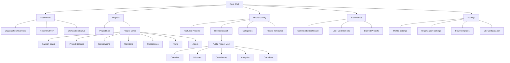
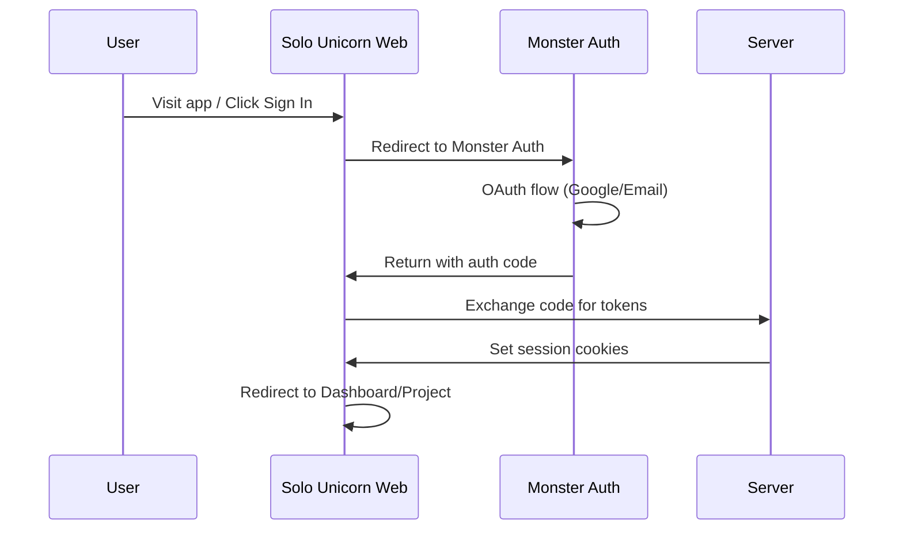
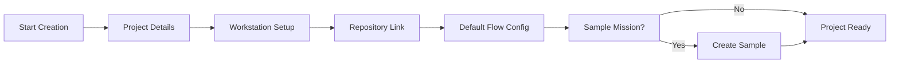
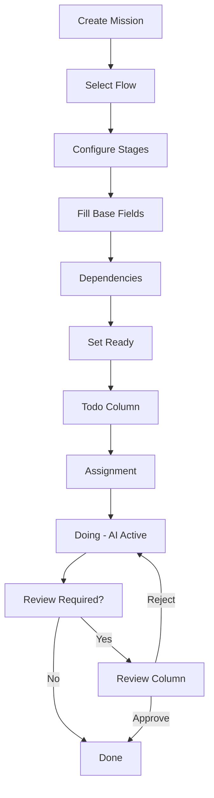
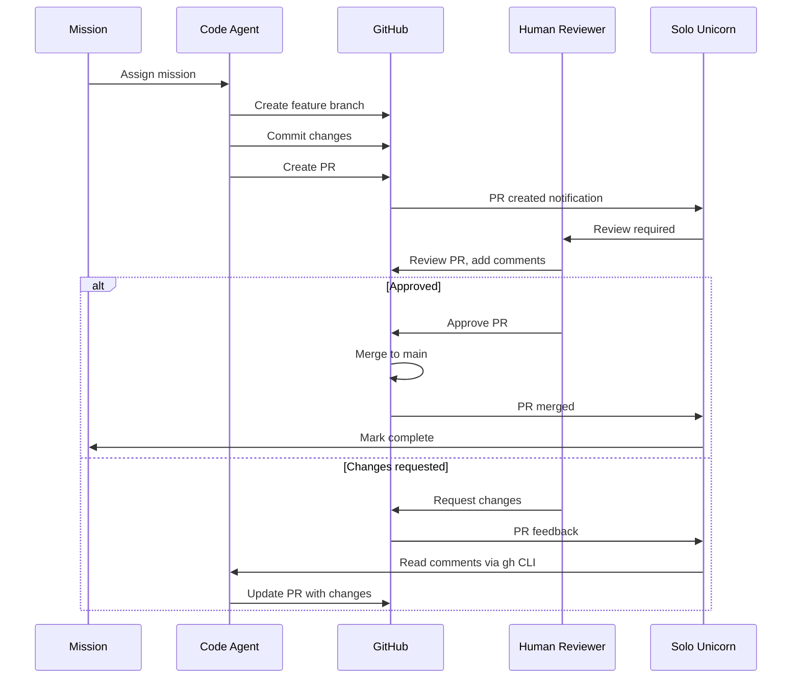

# GUI Design - Web

## Information Architecture

### Site Map / Screen Inventory



### Navigation Structure

**Primary Navigation:**
- Dashboard: Organization overview and recent activity
- Projects: Project portfolio and management
- Public Gallery: Public project discovery and templates
- Community: User contributions and social features
- Settings: User and organization configuration

**Secondary Navigation (Project-level):**
- Kanban Board: Mission visualization and flow management
- Project Settings: Configuration and preferences
- Workstations: Workstation status and management
- Members: Team management and permissions
- Repositories: Git repository configuration
- Flows: Custom flow templates and stages
- Actors: AI agent personas and methodologies

**Breadcrumbs:**
Organization / Project / Area / Item (e.g., Solo Unicorn / My Project / Missions / mission_123)

## User Flows

### UF-AUTH-001 - Authentication Flow

**User Goal:** Access Solo Unicorn securely as an organization member

**Entry Points:**
- Sign In button from landing page
- Deep links from invites
- Public project pages

**Success Criteria:**
Authenticated and routed to organization dashboard or last visited project

**Flow Diagram:**


### UF-WORKSTATION-001 - Workstation Management

**User Goal:** Register and manage workstations for AI code agent hosting

**Entry Points:**
- Project settings workstation tab
- CLI registration prompt
- Dashboard workstation status

**Success Criteria:**
Workstation online and available for mission assignment

**Steps:**
1. Navigate to Project Settings → Workstations
2. Click "Add Workstation" or follow CLI registration link
3. Run CLI registration command: `solo-unicorn workstation register`
4. Workstation appears online in web interface
5. Configure workstation permissions and project access

### UF-AGENT-001 - Code Agent Configuration

**User Goal:** Configure and monitor AI code agents on workstations

**Entry Points:**
- Workstation detail view
- Project settings agents tab

**Success Criteria:**
Code agents available and reported in workstation presence

**Steps:**
1. Navigate to Workstation → Agents tab
2. Review detected code agents (Claude Code, Cursor, etc.)
3. Configure agent settings and preferences
4. Monitor agent availability and rate limits
5. Review agent session history and performance

### UF-REPO-001 - Repository Management

**User Goal:** Link GitHub repositories to projects for mission development

**Entry Points:**
- Project creation wizard
- Project settings repositories tab

**Success Criteria:**
Repository linked and available for mission assignment

**Steps:**
1. Navigate to Project Settings → Repositories
2. Click "Add Repository"
3. Enter GitHub URL and validate access
4. Configure PR mode settings (enabled/disabled)
5. Set concurrency limits and default branch
6. Repository available for mission creation

### UF-PROJECT-001 - Project Creation

**User Goal:** Create new project and prepare for missions

**Entry Points:**
- Dashboard "Create Project" button
- Projects page "New Project" action

**Success Criteria:**
Project created with basic configuration and first mission ready

**Flow Diagram:**


### UF-MISSION-001 - Mission Creation and Execution

**User Goal:** Create mission with flow-first configuration and execute via AI agent

**Entry Points:**
- Kanban board "Create Mission" button
- Mission templates from gallery

**Success Criteria:**
Mission completed with PR created (if enabled) or changes pushed to main branch

**Flow Diagram:**


### UF-REVIEW-001 - Mission Review Process

**User Goal:** Review AI-generated code changes and provide feedback

**Entry Points:**
- Review column in Kanban board
- Mission detail review tab
- PR review notifications

**Success Criteria:**
Mission approved and moved to Done, or rejected with actionable feedback

**Steps:**
1. Click mission card in Review column
2. Open Review tab in mission modal
3. Examine code changes and PR
4. Provide approval or detailed rejection feedback
5. Mission proceeds to Done or returns to Doing for iteration

### UF-PR-001 - Pull Request Workflow

**User Goal:** Use PR-based change management for production-grade control

**Entry Points:**
- Mission with PR mode enabled
- Repository settings PR configuration

**Success Criteria:**
PR approved and merged with mission marked complete

**Flow Diagram:**


### UF-PUBLIC-001 - Public Project Discovery

**User Goal:** Browse public projects and request contributor access

**Entry Points:**
- Public Gallery landing page
- Project share links
- Search results

**Success Criteria:**
User understands project goals and optionally gains contributor access

**Steps:**
1. Browse Public Gallery or search for specific technologies
2. Click on project to view public details
3. Review project overview, missions, and contributor activity
4. Request contributor or collaborator access (if desired)
5. Receive access decision from project owner
6. Begin contributing missions (if approved)

### UF-DISCOVERY-001 - Project Discovery and Templates

**User Goal:** Discover interesting projects and create from templates

**Entry Points:**
- Public Gallery featured section
- Category browsing
- Template marketplace

**Success Criteria:**
User finds relevant project or creates new project from template

**Steps:**
1. Navigate to Public Gallery
2. Filter by category, technology, or activity level
3. Browse featured projects and community highlights
4. Select template for new project creation
5. Customize template during project creation
6. New project created with template structure

### UF-CONFIG-001 - Configuration Management

**User Goal:** Configure CLI, flows, and organizational settings

**Entry Points:**
- Settings navigation
- CLI configuration prompts
- Project-specific settings

**Success Criteria:**
Configuration updated and synchronized across workstations

**Steps:**
1. Navigate to Settings → appropriate tab
2. Update configuration values
3. Save changes with validation
4. CLI/workstations receive updated configuration
5. Verify changes applied correctly

## Wireframes & Mockups

### Kanban Board Component

**Component:** KanbanBoard

```
┌──────────────────────────────────────────────────────────────────────────────┐
│ [LOGO] [Project ▼]                           [🌙/☀️] [👤 User ▼]            │
├──────────────────────────────────────────────────────────────────────────────┤
│ Project Name                👤👤👤 🟢 Workstations: 2  [⏸️ Pause] [⚙️ Settings] │
│ 🔄 PR Mode | ⚡ Direct Push (visual indicator of current mode)               │
├──────────────────────────────────────────────────────────────────────────────┤
│                                                                              │
│ ┌─────────┬─────────┬─────────┬─────────┐                                    │
│ │  TODO   │  DOING  │ REVIEW  │  DONE   │                                    │
│ ├─────────┼─────────┼─────────┼─────────┤                                    │
│ │┌───────┐│         │         │         │                                    │
│ ││Normal ▼││         │         │         │                                    │
│ │├───────┤│         │         │         │                                    │
│ ││┌─────┐││┌───────┐│┌───────┐│┌───────┐│                                    │
│ │││Mission │││ Mission  ││ Mission  ││ Mission  ││                                    │
│ │││P H   │││ P L    ││ P M    ││ P H    ││                                    │
│ │││Code  │││ Plan   ││ 👀 PR #12││ ✅ Merged││                                    │
│ │││🔄    │││🤖 AI   ││ [Review] ││ 2d ago  ││                                    │
│ │││Desc  │││ Desc   ││ 🔗 GitHub││ Direct  ││                                    │
│ │││Ready │││ Ready  ││ Status  ││        ││                                    │
│ ││└─────┘││└───────┘│└───────┘│└───────┘│                                    │
│ │├───────┤│         │         │         │                                    │
│ ││Loop  ▶││         │         │         │                                    │
│ ││┌─────┐││         │         │         │                                    │
│ │││Loop   ││         │         │         │                                    │
│ │││P M   ││         │         │         │                                    │
│ │││⚡ Dir ││         │         │         │                                    │
│ │││🔄 24h ││         │         │         │                                    │
│ │││Weekly ││         │         │         │                                    │
│ │││Auto  ││         │         │         │                                    │
│ ││└─────┘││         │         │         │                                    │
│ │└───────┘│         │         │         │                                    │
│ └─────────┴─────────┴─────────┴─────────┘                                    │
│                                                                              │
└──────────────────────────────────────────────────────────────────────────────┘
```

**Design Notes:**
- **Todo Column Split**: Special layout with collapsible "Normal Missions" and "Loop Missions" sections
  - Normal section (default open) for regular missions
  - Loop section (default closed) for recurring missions
  - 50/50 vertical split when both open
  - Smooth expand/collapse animations
- **PR Mode Integration**: Visual indicators (🔄 PR Mode | ⚡ Direct Push) in sub-header
- **Online Users**: Stacked avatars like Figma showing active project members
- **AI Agent Controls**: Pause/Resume button controls mission processing queue
- Horizontal scroll on mobile with snap points
- Drag-and-drop for mission reordering
- Color-coded priority and status badges
- Real-time updates via WebSocket
- Ready toggle controls assignment eligibility

### Mission Card PR Mode Indicators & Badges

**PR Mode Badges (shown in card headers):**
- `🔄` - PR mode enabled (default for project)
- `⚡` - Direct push mode (override)
- `👀 PR #42` - PR created and linked to GitHub
- `✅ PR #42` - PR approved and ready for merge
- `❌ PR #42` - PR closed without merging
- `🔄 PR #42` - PR pending review
- `👎 PR #42` - Changes requested (requires iteration)

**Mission Card Structure with PR Integration:**

#### Todo Column Cards
```
┌─────────────────────────────────────┐
│ Implement OAuth integration      [⋮]│
├─────────────────────────────────────┤
│ P High   🔄 PR Mode (default)       │
├─────────────────────────────────────┤
│ Set up Monster Auth integration     │
│ with secure token management       │
│ and refresh flow support           │
├─────────────────────────────────────┤
│ Ready: ✓ | Repo: solo-unicorn       │
└─────────────────────────────────────┘

┌─────────────────────────────────────┐
│ Fix mobile responsive issues     [⋮]│
├─────────────────────────────────────┤
│ P Medium ⚡ Direct (override)       │
├─────────────────────────────────────┤
│ Update CSS Grid layout for mobile   │
│ breakpoints and touch gestures     │
├─────────────────────────────────────┤
│ Ready: ✓ | Repo: my-app             │
└─────────────────────────────────────┘
```

#### Doing Column Cards
```
┌─────────────────────────────────────┐
│ Add payment integration          [⋮]│
├─────────────────────────────────────┤
│ P High   🤖 Claude Code (Active)    │
├─────────────────────────────────────┤
│ 🔄 Creating PR: solo-unicorn/mission-payment-789 │
│ Working on Stripe integration...    │
│ Progress: Setting up webhooks       │
├─────────────────────────────────────┤
│ Started: 15m ago | Branch: feature/payment │
└─────────────────────────────────────┘
```

#### Review Column Cards
```
┌─────────────────────────────────────┐
│ Implement OAuth integration      [⋮]│
├─────────────────────────────────────┤
│ P High   👀 PR #42 (pending)        │
├─────────────────────────────────────┤
│ 🔗 [View GitHub PR] [💬 2 comments]  │
│ Branch: solo-unicorn/mission-oauth-456 │
│ Checks: ✅ Tests | ✅ TypeScript     │
├─────────────────────────────────────┤
│ [👍 Approve] [👎 Request Changes]    │
└─────────────────────────────────────┘

┌─────────────────────────────────────┐
│ Update API documentation         [⋮]│
├─────────────────────────────────────┤
│ P Low    👎 PR #38 (iterate #2nd)   │
├─────────────────────────────────────┤
│ 🔄 AI iterating on feedback...     │
│ Previous feedback addressed         │
│ New changes requested               │
├─────────────────────────────────────┤
│ [🔗 View PR] [📝 View Feedback]     │
└─────────────────────────────────────┘
```

#### Done Column Cards
```
┌─────────────────────────────────────┐
│ Set up CI/CD pipeline            [⋮]│
├─────────────────────────────────────┤
│ P High   ✅ Merged (#35)            │
├─────────────────────────────────────┤
│ GitHub Actions configured with      │
│ automated testing and deployment    │
├─────────────────────────────────────┤
│ Completed: 2 days ago | Direct     │
└─────────────────────────────────────┘

┌─────────────────────────────────────┐
│ Add user profile page            [⋮]│
├─────────────────────────────────────┤
│ P Medium ✅ Merged (#29)            │
├─────────────────────────────────────┤
│ Created responsive profile page     │
│ with avatar upload and settings     │
├─────────────────────────────────────┤
│ Completed: 1 week ago | PR Mode    │
└─────────────────────────────────────┘
```

**PR Iteration Workflow:**
1. **First Review**: `👀 PR #42 (pending)` - Initial submission
2. **Changes Requested**: `👎 PR #42 (iterate #1st)` - First iteration cycle
3. **Additional Changes**: `👎 PR #42 (iterate #2nd)` - Second iteration cycle
4. **Approved**: `✅ PR #42 (approved)` - Ready for merge
5. **Merged**: `✅ Merged (#42)` - Completed mission

**Direct Push Mode Indicators:**
- `⚡ Direct` - Mission configured for direct push
- `⚡ Dir` - Compact version for smaller cards
- No PR workflow UI elements shown
- Faster completion cycle

### Mission Modal Component

**Component:** MissionModal

```
┌─────────────────────────────────────────────────────────────────────────────────┐
│ Mission: Implement Authentication System                               [✕ Close] │
├─────────────────────────────────────────────────────────────────────────────────┤
│ [📝 Base] [🔄 Flow] [❓ Clarify] [📋 Plan] [👤 Review] [🔗 Dependencies] [⚙️]   │
├─────────────────────────────────────────────────────────────────────────────────┤
│                                                                                 │
│ Title: Implement Authentication System                                          │
│ ┌─────────────────────────────────────────────────────────────────────────────┐ │
│ │ Implement Monster Auth integration with OAuth support and secure token     │ │
│ │ management for CLI and web access.                                         │ │
│ └─────────────────────────────────────────────────────────────────────────────┘ │
│                                                                                 │
│ Repository: ┌─────────────────┐ Branch: ┌─────────────┐ Priority: ┌─────────┐   │
│            │ solo-unicorn    │        │ feature/auth│          │ High 🔴 │   │
│            └─────────────────┘        └─────────────┘          └─────────┘   │
│                                                                                 │
│ Status: ┌────────────┐ Stage: ┌──────────┐ Ready: ┌─────────┐                  │
│        │ Todo       │       │ clarify  │       │ ✓ Yes   │                  │
│        └────────────┘       └──────────┘       └─────────┘                  │
│                                                                                 │
│ Clarification (by AI):                                                             │
│ ┌─────────────────────────────────────────────────────────────────────────────┐ │
│ │ ## Intent                                                                   │ │
│ │ Enable secure authentication via Monster Auth with support for:            │ │
│ │ - OAuth (Google) integration                                               │ │
│ │ - Personal access tokens for CLI                                           │ │
│ │ - Organization API keys                                                     │ │
│ │ - Automatic token refresh                                                   │ │
│ │                                                                             │ │
│ │ ## Acceptance Criteria                                                      │ │
│ │ - [ ] OAuth login flow redirects to Monster Auth                           │ │
│ │ - [ ] CLI authentication with PAT support                                  │ │
│ │ - [ ] Org API keys for service accounts                                    │ │
│ │ - [ ] Token refresh handling                                               │ │
│ │ - [ ] Session persistence across browser restarts                          │ │
│ └─────────────────────────────────────────────────────────────────────────────┘ │
│                                                                                 │
│ 📎 Attachments: [+ Upload] wireframe-auth.png, auth-flow.md                    │
│                                                                                 │
│ ┌─────────────────────────────────────────────────────────────────────────────┐ │
│ │                               [🎯 Set Ready] [📝 Edit] [🗑️ Delete]        │ │
│ └─────────────────────────────────────────────────────────────────────────────┘ │
└─────────────────────────────────────────────────────────────────────────────────┘
```

**MissionModal Tab Structure:**

#### 📝 Base Tab (Default View)
Shows mission title, description, repository, branch, priority, status, spec, and attachments (shown above)

#### 🔄 Flow Tab
```
┌─────────────────────────────────────────────────────────────────────────────────┐
│ Flow Configuration                                                              │
├─────────────────────────────────────────────────────────────────────────────────┤
│                                                                                 │
│ Selected Flow: ┌─────────────────┐ Actor: ┌─────────────────┐                  │
│               │ Standard Dev    │       │ Senior Engineer │                  │
│               └─────────────────┘       └─────────────────┘                  │
│                                                                                 │
│ Flow Stages (3/4 completed):                                                   │
│ ┌─────────────────────────────────────────────────────────────────────────────┐ │
│ │ ✅ clarify   → ✅ plan      → 🔄 code (current) → ⏸️  review             │ │
│ │    2h           1.5h          45m                                          │ │
│ └─────────────────────────────────────────────────────────────────────────────┘ │
│                                                                                 │
│ Current Stage: code                                                             │
│ ┌─────────────────────────────────────────────────────────────────────────────┐ │
│ │ 🤖 Claude Code v2.1.4 (Active)                                             │ │
│ │ Progress: Implementing OAuth integration endpoints...                       │ │
│ │ Last activity: Added token refresh logic (5 minutes ago)                   │ │
│ │ ETA: ~30 minutes remaining                                                  │ │
│ └─────────────────────────────────────────────────────────────────────────────┘ │
│                                                                                 │
│ Stage Configuration:                                                            │
│ ┌─────────────────────────────────────────────────────────────────────────────┐ │
│ │ Review Stage: [✓] Require human approval before completion                  │ │
│ │ Auto-advance: [✓] Move to next stage automatically on success              │ │
│ │ Retry Policy: [3 attempts] [✓] Human escalation on failure                 │ │
│ └─────────────────────────────────────────────────────────────────────────────┘ │
│                                                                                 │
└─────────────────────────────────────────────────────────────────────────────────┘
```

#### ❓ Clarify Tab
```
┌─────────────────────────────────────────────────────────────────────────────────┐
│ Mission Clarification                                                           │
├─────────────────────────────────────────────────────────────────────────────────┤
│                                                                                 │
│ AI Questions & Clarifications:                                                 │
│ ┌─────────────────────────────────────────────────────────────────────────────┐ │
│ │ 🤖 Claude Code • 2 hours ago                                               │ │
│ │                                                                             │ │
│ │ I need clarification on a few implementation details:                      │ │
│ │                                                                             │ │
│ │ 1. Should we support multiple OAuth providers simultaneously, or start     │ │
│ │    with Google OAuth only?                                                 │ │
│ │                                                                             │ │
│ │ 2. What should be the token refresh interval? Standard OAuth suggests      │ │
│ │    1 hour, but longer intervals reduce API calls.                         │ │
│ │                                                                             │ │
│ │ 3. For CLI authentication, should we use device flow or redirect flow?    │ │ │
│ │    Device flow is more secure but requires user interaction.               │ │
│ └─────────────────────────────────────────────────────────────────────────────┘ │
│                                                                                 │
│ ┌─────────────────────────────────────────────────────────────────────────────┐ │
│ │ 👤 Human Response • 1.5 hours ago                                          │ │
│ │                                                                             │ │
│ │ Good questions! Here are the answers:                                      │ │
│ │                                                                             │ │
│ │ 1. Start with Google OAuth only for MVP, but architect for multiple       │ │
│ │    providers later                                                         │ │
│ │                                                                             │ │
│ │ 2. Use 1 hour refresh interval initially - we can optimize later          │ │
│ │                                                                             │ │
│ │ 3. Use redirect flow for CLI - create local server on random port         │ │
│ └─────────────────────────────────────────────────────────────────────────────┘ │
│                                                                                 │
│ ┌─────────────────────────────────────────────────────────────────────────────┐ │
│ │ 📝 Add Clarification                                                        │ │
│ │ [Type your question or clarification...]                                   │ │
│ │                                                [🔄 Ask AI] [✅ Submit]      │ │
│ └─────────────────────────────────────────────────────────────────────────────┘ │
│                                                                                 │
└─────────────────────────────────────────────────────────────────────────────────┘
```

#### 📋 Plan Tab
```
┌─────────────────────────────────────────────────────────────────────────────────┐
│ Mission Plan                                                                    │
├─────────────────────────────────────────────────────────────────────────────────┤
│                                                                                 │
│ Generated Plan (AI-created):                                                   │
│ ┌─────────────────────────────────────────────────────────────────────────────┐ │
│ │ ## Implementation Plan                                                      │ │
│ │                                                                             │ │
│ │ ### Phase 1: Monster Auth Integration                                      │ │
│ │ - [ ] Set up Monster Auth client configuration                             │ │
│ │ - [ ] Create OAuth callback endpoints                                      │ │
│ │ - [ ] Implement token exchange logic                                       │ │
│ │                                                                             │ │
│ │ ### Phase 2: Token Management                                              │ │
│ │ - [ ] Build token refresh system                                           │ │
│ │ - [ ] Add secure storage for refresh tokens                                │ │
│ │ - [ ] Implement token validation middleware                                │ │
│ │                                                                             │ │
│ │ ### Phase 3: CLI Integration                                               │ │
│ │ - [ ] Create local server for OAuth redirect                               │ │
│ │ - [ ] Add personal access token support                                    │ │
│ │ - [ ] Build CLI authentication flow                                        │ │
│ │                                                                             │ │
│ │ ### Phase 4: Testing & Documentation                                       │ │
│ │ - [ ] Unit tests for auth endpoints                                        │ │
│ │ - [ ] Integration tests for OAuth flow                                     │ │
│ │ - [ ] Update API documentation                                             │ │
│ └─────────────────────────────────────────────────────────────────────────────┘ │
│                                                                                 │
│ Estimated Duration: 4-6 hours                                                  │
│ Dependencies: Monster Auth service setup, Test OAuth application              │
│                                                                                 │
│ [📝 Edit Plan] [🔄 Regenerate Plan] [✅ Approve Plan]                          │
│                                                                                 │
└─────────────────────────────────────────────────────────────────────────────────┘
```

#### 👤 Review Tab
```
┌─────────────────────────────────────────────────────────────────────────────────┐
│ Mission Review                                                                  │
├─────────────────────────────────────────────────────────────────────────────────┤
│                                                                                 │
│ Review Status: ⏳ Awaiting Review                                               │
│                                                                                 │
│ ┌─────────────────────────────────────────────────────────────────────────────┐ │
│ │ 🤖 Implementation Complete                                                  │ │
│ │                                                                             │ │
│ │ I have successfully implemented the OAuth authentication system:           │ │
│ │                                                                             │ │
│ │ ✅ Monster Auth integration configured                                      │ │
│ │ ✅ Google OAuth flow working                                                │ │
│ │ ✅ Token refresh system implemented                                         │ │
│ │ ✅ CLI authentication support added                                         │ │
│ │ ✅ Unit tests passing (12/12)                                              │ │
│ │                                                                             │ │
│ │ Files changed: 8 files, +245 lines, -12 lines                             │ │
│ │ Test coverage: 94% (auth module)                                           │ │
│ │                                                                             │ │
│ │ 🔗 [View Code Changes] [📊 Test Results] [📝 Implementation Notes]         │ │
│ └─────────────────────────────────────────────────────────────────────────────┘ │
│                                                                                 │
│ Human Review:                                                                   │
│ ┌─────────────────────────────────────────────────────────────────────────────┐ │
│ │ 📝 Review Notes                                                             │ │
│ │ [Enter your review feedback here...]                                       │ │
│ │                                                                             │ │
│ │                                                                             │ │
│ │                                                                             │ │
│ │ Review Decision:                                                            │ │
│ │ ○ ✅ Approve (complete mission)                                             │ │
│ │ ○ 👎 Request Changes (return to implementation)                            │ │
│ │ ○ ❌ Reject (cancel mission)                                                │ │
│ │                                                                             │ │
│ │                                        [Cancel] [Submit Review]            │ │
│ └─────────────────────────────────────────────────────────────────────────────┘ │
│                                                                                 │
└─────────────────────────────────────────────────────────────────────────────────┘
```

#### 🔗 Dependencies Tab
```
┌─────────────────────────────────────────────────────────────────────────────────┐
│ Mission Dependencies                                                            │
├─────────────────────────────────────────────────────────────────────────────────┤
│                                                                                 │
│ Blocking Dependencies (must complete first):                                   │
│ ┌─────────────────────────────────────────────────────────────────────────────┐ │
│ │ ✅ Set up Monster Auth service configuration                                │ │
│ │    Completed 3 days ago by @admin                                          │ │
│ └─────────────────────────────────────────────────────────────────────────────┘ │
│                                                                                 │
│ ┌─────────────────────────────────────────────────────────────────────────────┐ │
│ │ ✅ Create test OAuth application in Google Cloud Console                    │ │
│ │    Completed 2 days ago by @devops                                         │ │
│ └─────────────────────────────────────────────────────────────────────────────┘ │
│                                                                                 │
│ Related Missions (soft dependencies):                                          │
│ ┌─────────────────────────────────────────────────────────────────────────────┐ │
│ │ 🔄 Update user registration flow (mission_456)                             │ │
│ │    In Progress • Should be updated after auth implementation               │ │
│ │    [View Mission] [Set as Blocker]                                         │ │
│ └─────────────────────────────────────────────────────────────────────────────┘ │
│                                                                                 │
│ ┌─────────────────────────────────────────────────────────────────────────────┐ │
│ │ ⏳ Add user profile management (mission_789)                                │ │
│ │    Todo • Depends on authentication being complete                         │ │
│ │    [View Mission] [Set as Dependent]                                       │ │
│ └─────────────────────────────────────────────────────────────────────────────┘ │
│                                                                                 │
│ External Dependencies:                                                          │
│ • Monster Auth service availability                                            │
│ • Google OAuth API quotas                                                      │
│ • Development database access                                                  │
│                                                                                 │
│ [+ Add Dependency] [🔄 Refresh Status]                                         │
│                                                                                 │
└─────────────────────────────────────────────────────────────────────────────────┘
```

#### ⚙️ Settings Tab
```
┌─────────────────────────────────────────────────────────────────────────────────┐
│ Mission Settings                                                                │
├─────────────────────────────────────────────────────────────────────────────────┤
│                                                                                 │
│ Assignment Settings:                                                            │
│ ┌─────────────────────────────────────────────────────────────────────────────┐ │
│ │ Agent Preference: ┌─────────────────┐ Workstation: ┌─────────────────────┐   │ │
│ │                  │ Any Available   │              │ Any Available       │   │ │
│ │                  └─────────────────┘              └─────────────────────┘   │ │
│ │                                                                             │ │
│ │ Priority Override: ┌─────────┐ Timeout: ┌──────────────┐                   │ │
│ │                   │ Default │          │ 4 hours      │                   │ │
│ │                   └─────────┘          └──────────────┘                   │ │
│ │                                                                             │ │
│ │ Retry Policy: ┌──────────┐ Max Attempts: ┌─────┐                           │ │
│ │              │ Standard │                │  3  │                           │ │
│ │              └──────────┘                └─────┘                           │ │
│ └─────────────────────────────────────────────────────────────────────────────┘ │
│                                                                                 │
│ Notification Settings:                                                          │
│ ┌─────────────────────────────────────────────────────────────────────────────┐ │
│ │ ✓ Notify on assignment        ✓ Notify on completion                        │ │
│ │ ✓ Notify on failure           ✓ Notify on review request                   │ │
│ │ ○ Notify on progress updates  ✓ Notify on comments                         │ │
│ └─────────────────────────────────────────────────────────────────────────────┘ │
│                                                                                 │
│ Advanced Settings:                                                              │
│ ┌─────────────────────────────────────────────────────────────────────────────┐ │
│ │ Archive after completion: [✓] 30 days                                       │ │
│ │ Auto-cleanup worktree: [✓] After merge                                     │ │
│ │ Branch naming: solo-unicorn/mission-{id}-{slug}                            │ │
│ │ PR template: [Use project default] [Custom template]                       │ │
│ └─────────────────────────────────────────────────────────────────────────────┘ │
│                                                                                 │
│ Danger Zone:                                                                    │
│ ┌─────────────────────────────────────────────────────────────────────────────┐ │
│ │ [⏸️ Pause Mission] [🔄 Reset to Todo] [🗑️ Delete Mission]                 │ │
│ └─────────────────────────────────────────────────────────────────────────────┘ │
│                                                                                 │
└─────────────────────────────────────────────────────────────────────────────────┘
```

**Design Notes:**
- **Comprehensive Tab System**: All 6 tabs provide complete mission context and control
- **Real-time Updates**: Flow progress, AI status, and dependency changes update automatically
- **Interactive Elements**: Plans can be edited, clarifications added, reviews submitted
- **Permission-Aware**: Tab visibility and edit controls respect user permissions
- **Context Preservation**: All tab states persist during mission lifecycle

### Project Settings Modal

**Component:** ProjectSettingsModal

```
┌─────────────────────────────────────────────────────────────────────────────────┐
│ Project Settings: My Project                                           [✕ Close] │
├─────────────────────────────────────────────────────────────────────────────────┤
│ [⚙️ General] [👥 Members] [📁 Repositories] [🎭 Actors] [🔄 Flows] [👁️ Public]  │
├─────────────────────────────────────────────────────────────────────────────────┤
│                                                                                 │
│ Project Details                                                                 │
│ ─────────────────                                                              │
│ Name: ┌─────────────────────────────────────┐                                  │
│      │ My Project                          │                                  │
│      └─────────────────────────────────────┘                                  │
│                                                                                 │
│ Description:                                                                    │
│ ┌─────────────────────────────────────────────────────────────────────────────┐ │
│ │ AI-assisted development project for building authentication system         │ │
│ └─────────────────────────────────────────────────────────────────────────────┘ │
│                                                                                 │
│ Default Configuration                                                           │
│ ──────────────────────                                                         │
│ Flow: ┌─────────────────┐ Actor: ┌─────────────────┐                          │
│      │ Standard Dev    │       │ Senior Engineer │                          │
│      └─────────────────┘       └─────────────────┘                          │
│                                                                                 │
│ PR Mode: ┌─────────────────┐ Require Review: ┌─────────────┐                   │
│         │ ✓ Enabled       │                 │ ✓ Yes       │                   │
│         └─────────────────┘                 └─────────────┘                   │
│                                                                                 │
│ Project Memory                                                                  │
│ ──────────────                                                                 │
│ ┌─────────────────────────────────────────────────────────────────────────────┐ │
│ │ # Project Context                                                           │ │
│ │ This project focuses on implementing secure authentication using Monster    │ │
│ │ Auth integration. Key considerations:                                       │ │
│ │ - Email as canonical identity                                              │ │
│ │ - Multi-provider OAuth support                                             │ │
│ │ - Token management and refresh                                             │ │
│ │ - CLI and web access patterns                                              │ │
│ └─────────────────────────────────────────────────────────────────────────────┘ │
│                                                                                 │
│ ┌─────────────────────────────────────────────────────────────────────────────┐ │
│ │                                    [💾 Save Changes] [🚫 Cancel]           │ │
│ └─────────────────────────────────────────────────────────────────────────────┘ │
└─────────────────────────────────────────────────────────────────────────────────┘
```

### Public Project View

**Component:** PublicProjectView

```
┌─────────────────────────────────────────────────────────────────────────────────┐
│ 🌟 Featured Project: Open Source Chat App                     [⭐ Star] [👥 Join] │
├─────────────────────────────────────────────────────────────────────────────────┤
│ [📖 Overview] [🎯 Missions] [👥 Contributors] [📊 Analytics] [🤝 Contribute]      │
├─────────────────────────────────────────────────────────────────────────────────┤
│                                                                                 │
│ Modern chat application built with AI assistance                                │
│ 🏷️ Web Development • React • TypeScript • Socket.io                           │
│ ⭐ 142 stars • 👥 23 contributors • 🔄 Active (2 missions this week)           │
│                                                                                 │
│ ## Project Goals                                                                │
│ - Build scalable real-time chat with modern web technologies                   │
│ - Demonstrate AI-assisted development workflows                                │
│ - Create reusable components for community projects                            │
│                                                                                 │
│ ## Recent Activity                                                              │
│ ┌─────────────────────────────────────────────────────────────────────────────┐ │
│ │ ✅ Mission: "Add emoji reactions" completed 2h ago by @alice                │ │
│ │ 🔄 Mission: "Implement voice messages" in progress by @bob                  │ │
│ │ 🎯 Mission: "Add file sharing support" ready for assignment                 │ │
│ │ 👥 @charlie joined as contributor 1d ago                                    │ │
│ └─────────────────────────────────────────────────────────────────────────────┘ │
│                                                                                 │
│ ## Tech Stack                                                                   │
│ Frontend: React, TypeScript, Vite, TailwindCSS                                │
│ Backend: Node.js, Express, Socket.io, PostgreSQL                              │
│ AI Tools: Claude Code, GitHub Copilot                                         │
│                                                                                 │
│ ## How to Contribute                                                            │
│ 1. Request contributor access (auto-approved for this project)                 │
│ 2. Browse available missions or propose new ones                               │
│ 3. Missions are executed by AI agents with human review                        │
│ 4. Join our community Discord for discussions                                  │
│                                                                                 │
│ Repository: https://github.com/community/chat-app • License: MIT               │
│                                                                                 │
│ ┌─────────────────────────────────────────────────────────────────────────────┐ │
│ │ [🚀 Use as Template] [📋 Request Access] [🔗 Share] [👁️ Watch Updates]     │ │
│ └─────────────────────────────────────────────────────────────────────────────┘ │
└─────────────────────────────────────────────────────────────────────────────────┘
```

**Design Notes:**
- Permission-aware content display
- Clear contribution pathways
- Social proof elements (stars, contributors)
- Template usage for project replication

### Workstation Dashboard

**Component:** WorkstationView

```
┌─────────────────────────────────────────────────────────────────────────────────┐
│ Workstation: MacBook-Pro-2023 (ws_abc123def)                    [⚙️ Configure] │
├─────────────────────────────────────────────────────────────────────────────────┤
│ [📊 Overview] [🤖 Agents] [📁 Repositories] [📈 Activity] [⚙️ Settings]        │
├─────────────────────────────────────────────────────────────────────────────────┤
│                                                                                 │
│ Status: 🟢 Online (Connected 2h 34m) • Organization: acme-corp                 │
│ System: macOS 14.2 (arm64) • CLI: v1.2.3 • Latency: 45ms                     │
│                                                                                 │
│ Active Projects                                                                 │
│ ───────────────                                                                │
│ ┌─────────────────┐ ┌─────────────────┐ ┌─────────────────┐                   │
│ │ 🎯 My Project   │ │ 📱 Mobile App   │ │ 🔧 DevOps Tools │                   │
│ │ 2 missions      │ │ 1 mission       │ │ 0 missions      │                   │
│ │ Last: 15m ago   │ │ Last: 2h ago    │ │ Last: 1d ago    │                   │
│ └─────────────────┘ └─────────────────┘ └─────────────────┘                   │
│                                                                                 │
│ Code Agents                                                                     │
│ ───────────                                                                    │
│ ┌─────────────────────────────────────────────────────────────────────────────┐ │
│ │ 🤖 Claude Code v2.1.4        🟢 Available (1/2 slots used)                 │ │
│ │    Last used: 15m ago • 42 missions completed • Avg: 20m                   │ │
│ │    Rate limit: 450/500 per hour • Reset: 45m                               │ │
│ ├─────────────────────────────────────────────────────────────────────────────┤ │
│ │ 🎯 Cursor v0.42.0            🟢 Available                                   │ │
│ │    Last used: 2h ago • 18 missions completed • Avg: 15m                    │ │
│ │    Model: GPT-4 • Workspace: /Users/john/workspace                         │ │
│ ├─────────────────────────────────────────────────────────────────────────────┤ │
│ │ 🔧 OpenCode v1.3.2           🔴 Not Available                               │ │
│ │    Status: Rate limited • Reset: 2h 15m                                    │ │
│ │    Provider: Anthropic • Model: Claude-3.5-Sonnet                          │ │
│ └─────────────────────────────────────────────────────────────────────────────┘ │
│                                                                                 │
│ Repository Worktrees                                                            │
│ ────────────────────                                                           │
│ 📁 solo-unicorn (repo_123)                                                     │
│   Main: /Users/john/repos/solo-unicorn (main)                                 │
│   Worktrees:                                                                   │
│   - /Users/john/workspace/solo-unicorn-feature-auth (feature/auth) • Active   │
│   - /Users/john/workspace/solo-unicorn-hotfix (hotfix/critical-bug) • Idle    │
│                                                                                 │
│ 📁 my-app (repo_456)                                                           │
│   Main: /Users/john/workspace/my-app (develop)                                 │
│   Status: 🔄 Cloning... (45% complete)                                         │
│                                                                                 │
│ ┌─────────────────────────────────────────────────────────────────────────────┐ │
│ │                        [🔄 Refresh Status] [📋 View Logs] [⚠️ Restart]     │ │
│ └─────────────────────────────────────────────────────────────────────────────┘ │
└─────────────────────────────────────────────────────────────────────────────────┘
```

**Design Notes:**
- Real-time status monitoring via WebSocket
- Agent capacity and rate limit visualization
- Repository and worktree management interface
- Quick actions for common operations

## Theming & Style Guide

### Visual Identity

**Brand Guidelines:** Link to brand guidelines (TBD)

### Color Palette

| Color Type | Hex Code | Usage |
|------------|----------|-------|
| Primary | #3B82F6 | Primary actions, links, highlights |
| Secondary | #6366F1 | Secondary actions, complementary elements |
| Accent | #8B5CF6 | Accents, special highlights, code agents |
| Success | #10B981 | Positive feedback, confirmations, completed states |
| Warning | #F59E0B | Cautions, important notices, pending states |
| Error | #EF4444 | Errors, destructive actions, failed states |
| Neutral | #6B7280 | Text, borders, backgrounds, neutral elements |

### Typography

#### Font Families
- **Primary:** Inter (system font stack)
- **Secondary:** -apple-system, BlinkMacSystemFont, "Segoe UI", Roboto
- **Monospace:** "SF Mono", Monaco, Inconsolata, "Roboto Mono", monospace

#### Type Scale

| Element | Size | Weight | Line Height |
|---------|------|--------|-------------|
| H1 | 2.25rem (36px) | 700 | 1.2 |
| H2 | 1.875rem (30px) | 600 | 1.3 |
| H3 | 1.5rem (24px) | 600 | 1.4 |
| Body | 1rem (16px) | 400 | 1.6 |
| Small | 0.875rem (14px) | 400 | 1.5 |

### Iconography

**Icon Library:** Heroicons v2 (outline and solid variants)

**Usage Guidelines:**
- Use outline icons for inactive/secondary states
- Use solid icons for active/primary states
- Maintain consistent 20px or 24px sizing
- Provide descriptive alt text for informative icons

### Spacing & Layout

**Grid System:** 12-column responsive grid with CSS Grid

**Spacing Scale:**
- Base unit: 0.25rem (4px)
- Scale: 1, 2, 3, 4, 6, 8, 12, 16, 20, 24, 32, 40, 48, 64, 80, 96
- Common patterns: 4px, 8px, 12px, 16px, 24px, 32px, 48px

**Layout Principles:**
- Consistent 24px padding for cards and containers
- 16px spacing between related elements
- 32px spacing between sections
- 8px spacing for tight groupings (badges, buttons)

### Component Specifications

#### Mission Card
```
Anatomy:
- 16px padding all sides
- 8px border radius
- 1px border (neutral-200)
- 4px spacing between elements
- Badge spacing: 4px horizontal, 2px vertical

States:
- Default: white background, neutral border
- Ready: green-50 background, green-200 border
- Active: blue-50 background, blue-200 border
- Review: yellow-50 background, yellow-200 border
- Completed: gray-50 background, gray-200 border
```

#### Priority Badge
```
Anatomy:
- 6px horizontal padding, 2px vertical padding
- 12px font size, 500 weight
- 12px border radius (pill shape)
- Uppercase text transform

Variants:
- High: red-500 background, white text
- Medium: yellow-500 background, white text
- Low: green-500 background, white text
- Loop: purple-500 background, white text
```

#### Stage Badge
```
Anatomy:
- 8px horizontal padding, 4px vertical padding
- 14px font size, 500 weight
- 8px border radius
- Lowercase text

Variants:
- clarify: blue-100 background, blue-700 text
- plan: purple-100 background, purple-700 text
- code: green-100 background, green-700 text
- review: yellow-100 background, yellow-700 text
```

#### Status Indicators
```
Agent Status:
- Available: green-400 dot + "Available" text
- Busy: yellow-400 dot + "Busy (2/3 slots)" text
- Rate Limited: red-400 dot + "Rate limited" text
- Offline: gray-400 dot + "Offline" text

Workstation Status:
- Online: green-400 dot + "Online (2h 34m)" text
- Offline: gray-400 dot + "Offline" text
- Connecting: yellow-400 dot + "Connecting..." text
```

### Responsive Design Strategy

#### Breakpoints
- Mobile: 0-768px (single column, horizontal scroll)
- Tablet: 769px-1024px (2-3 columns, compact navigation)
- Desktop: 1025px-1440px (full layout, all features)
- Wide: 1441px+ (expanded spacing, more content per row)

#### Mobile Adaptations
- Kanban board: horizontal scroll with snap points
- Navigation: collapsible sidebar with hamburger menu
- Mission modal: full-screen overlay
- Tables: convert to stacked cards
- Touch targets: minimum 44px for interactive elements

#### Accessibility Features
- High contrast mode support
- Focus indicators: 2px blue ring with 2px offset
- Screen reader: semantic HTML with ARIA labels
- Keyboard navigation: Tab order, Enter/Space activation
- Color independence: never rely solely on color for meaning
- Text scaling: support up to 200% zoom without horizontal scroll

## Additional Comprehensive Components

### Mission Create Popup Component

**Component:** MissionCreatePopup (Flow-First Creation)

```
┌─────────────────────────────────────────────────────────────────────────────┐
│ Create New Mission                                                       [×]  │
├─────────────────────────────────────────────────────────────────────────────┤
│                                                                             │
│ Title *                                                                     │
│ ┌─────────────────────────────────────────────────────────────────────────┐ │
│ │ Mission title here...                                                      │ │
│ └─────────────────────────────────────────────────────────────────────────┘ │
│                                                                             │
│ Description                                                                 │
│ ┌─────────────────────────────────────────────────────────────────────────┐ │
│ │ Describe what needs to be done...                                       │ │
│ │                                                                         │ │
│ │ ┌─────────────┐ ┌───────────────────────────────────────────────────┐   │ │
│ │ │ 📎 Drop     │ │ 📄 wireframe.sketch                              │   │ │
│ │ │ files here  │ │ 🖼️ mockup.png                                     │   │ │
│ │ │ or click    │ │                                          [Remove] │   │ │
│ │ └─────────────┘ └───────────────────────────────────────────────────┘   │ │
│ └─────────────────────────────────────────────────────────────────────────┘ │
│                                                                             │
│ ┌─────────────────┬─────────────────┬─────────────────┐                   │
│ │ Priority        │ List            │ Repository      │                   │
│ │ [Medium ▼]      │ [Todo ▼]        │ [Main Repo ▼]  │                   │
│ └─────────────────┴─────────────────┴─────────────────┘                   │
│                                                                             │
│ ┌─────────────────┬─────────────────┬─────────────────┬─────────────────┐   │
│ │ Workstation     │ Agent           │ Model           │ Actor           │   │
│ │ [MacBook Pro ▼] │ [Claude Code ▼] │ [GPT-4 ▼]      │ [Default ▼]    │   │
│ └─────────────────┴─────────────────┴─────────────────┴─────────────────┘   │
│                                                                             │
│ │ Flow: [Standard Development ▼] ← PRIMARY SELECTION                         │
│ │ (Shared with MissionView → Flow tab)                                       │
│ │ Stages in selected flow:                                                   │
│ │ ┌─────────────────────────────────────────────────────────────────────────┐ │
│ │ │ 1. Clarify     [☑ Enabled] [☑ Require Review]                          │ │
│ │ │ 2. Plan        [☑ Enabled] [☑ Require Review]                          │ │
│ │ │ 3. Code        [☑ Enabled] [☐ Require Review]                          │ │
│ │ └─────────────────────────────────────────────────────────────────────────┘ │
│ │ Tip: To start later, untick Enabled for earlier stages                     │
│                                                                             │
│ Dependencies (Optional)                                                     │
│ ┌─────────────────────────────────────────────────────────────────────────┐ │
│ │ ┌─ No dependencies selected ────────────────────────────────────────┐   │ │
│ │ │                                            [+ Add Dependency ▼]   │   │ │
│ │ └────────────────────────────────────────────────────────────────────┘   │ │
│ └─────────────────────────────────────────────────────────────────────────┘ │
│                                                                             │
│ Ready: [☑] Mission is ready for AI to pick up immediately                  │
│                                                                             │
│ 🔄 Pull Request Mode                                                        │
│ ○ Use project default (PR Mode)                                            │
│ ○ Direct Push (override)                                                  │
│ ● PR Mode (override)                                                      │
│   └─ Target Branch: [main ▼] Custom Branch: [ ]                           │
│                                                                             │
│                                             [Cancel] [Create Mission]       │
└─────────────────────────────────────────────────────────────────────────────┘
```

### Project Settings Popup Component

**Component:** ProjectSettingsPopup (5-Tab Modal)

```
┌─────────────────────────────────────────────────────────────────────────────┐
│ Project Settings: My App                                              [×]  │
├─────────────────────────────────────────────────────────────────────────────┤
│ [General] [Members] [Repositories] [Actors] [Flows]                       │
├─────────────────────────────────────────────────────────────────────────────┤
│                                                                             │
│ ┌─ GENERAL TAB ─────────────────────────────────────────────────────────────┐│
│ │ Project Details:                                                         ││
│ │ Name: [My App                                                          ] ││
│ │ Description: [E-commerce application with AI features                 ] ││
│ │                                                                         ││
│ │ Project Memory (Shared Context):                                        ││
│ │ ┌─────────────────────────────────────────────────────────────────────┐ ││
│ │ │ Tech Stack: React + Node.js + PostgreSQL                           │ ││
│ │ │ Architecture: Microservices with REST APIs                         │ ││
│ │ │ Key Dependencies: Stripe for payments, Redis for caching           │ ││
│ │ │ Coding Standards: ESLint + Prettier, TypeScript strict mode        │ ││
│ │ │ ...                                                                 │ ││
│ │ └─────────────────────────────────────────────────────────────────────┘ ││
│ │                                                                         ││
│ │ Danger Zone:                                                            ││
│ │ [🗑️ Delete Project]                                                    ││
│ └─────────────────────────────────────────────────────────────────────────┘│
│                                                                             │
│                                                      [Cancel] [Save]       │
└─────────────────────────────────────────────────────────────────────────────┘
```

**Members Tab:**
```
┌─ MEMBERS TAB ─────────────────────────────────────────────────────────────┐
│ ┌─────────────────────────────────────────────────────────────────────┐   │
│ │ 👤 John Doe (Owner)                                    [Edit] [×]   │   │
│ │ john@company.com  •  Active 2 hours ago                            │   │
│ │ Role: Owner  •  Joined: Dec 1, 2024                                │   │
│ └─────────────────────────────────────────────────────────────────────┘   │
│                                                                           │
│ ┌─────────────────────────────────────────────────────────────────────┐   │
│ │ 👤 Jane Smith (Member)                                 [Edit] [×]   │   │
│ │ jane@company.com  •  Active 1 day ago                              │   │
│ │ Role: Member  •  Joined: Dec 10, 2024                              │   │
│ └─────────────────────────────────────────────────────────────────────┘   │
│                                                                           │
│ [+ Add Member] (Also adds user to organization)                          │
└───────────────────────────────────────────────────────────────────────────┘
```

**Repositories Tab:**
```
┌─ REPOSITORIES TAB ────────────────────────────────────────────────────────┐
│ Connected Repositories:                                                   │
│                                                                           │
│ ┌─────────────────────────────────────────────────────────────────────┐   │
│ │ 📁 github.com/company/my-app (Primary)                    [Edit] [×] │   │
│ │ Default branch: main  •  Last sync: 2 minutes ago                  │   │
│ │ Worktrees: 3 active  •  Auto-sync: ✓  •  PR Mode: ✓              │   │
│ │ Permissions: Full access  •  Size: 245 MB                         │   │
│ └─────────────────────────────────────────────────────────────────────┘   │
│                                                                           │
│ ┌─────────────────────────────────────────────────────────────────────┐   │
│ │ 📁 github.com/company/shared-utils                     [Edit] [×] │   │
│ │ Default branch: develop  •  Last sync: 1 hour ago                  │   │
│ │ Worktrees: 1 active  •  Auto-sync: ✓  •  PR Mode: ○              │   │
│ │ Permissions: Read-only  •  Size: 12 MB                            │   │
│ └─────────────────────────────────────────────────────────────────────┘   │
│                                                                           │
│ Repository Settings:                                                      │
│ ┌─────────────────────────────────────────────────────────────────────┐   │
│ │ Default PR settings:                                               │   │
│ │ ✓ Create PRs by default    ✓ Auto-merge approved PRs              │   │
│ │ ✓ Delete branch after merge    Target: main                       │   │
│ │                                                                     │   │
│ │ Branch naming: [solo-unicorn/mission-{id}-{slug}                 ] │   │
│ │ Commit format: [feat: {mission-title} (#mission-{id})            ] │   │
│ └─────────────────────────────────────────────────────────────────────┘   │
│                                                                           │
│ [+ Add Repository] [🔄 Sync All] [⚙️ Advanced Settings]                   │
└───────────────────────────────────────────────────────────────────────────┘
```

**Actors Tab:**
```
┌─ ACTORS TAB ──────────────────────────────────────────────────────────────┐
│ Project Actors (AI Personalities):                                       │
│                                                                           │
│ ┌─────────────────────────────────────────────────────────────────────┐   │
│ │ 🎯 Senior Engineer (Default)                           [Edit] [×]   │   │
│ │ Expertise: Full-stack development, architecture, best practices    │   │
│ │ Style: Thorough planning, comprehensive testing, detailed docs     │   │
│ │ Used in: 42 missions  •  Success rate: 94%  •  Avg time: 3.2h     │   │
│ └─────────────────────────────────────────────────────────────────────┘   │
│                                                                           │
│ ┌─────────────────────────────────────────────────────────────────────┐   │
│ │ ⚡ Rapid Prototyper                                    [Edit] [×]   │   │
│ │ Expertise: Quick iteration, MVP development, proof of concepts     │   │
│ │ Style: Fast implementation, minimal viable features, iterate      │   │
│ │ Used in: 18 missions  •  Success rate: 87%  •  Avg time: 1.1h     │   │
│ └─────────────────────────────────────────────────────────────────────┘   │
│                                                                           │
│ ┌─────────────────────────────────────────────────────────────────────┐   │
│ │ 🔍 Code Reviewer                                       [Edit] [×]   │   │
│ │ Expertise: Code quality, security, performance optimization       │   │
│ │ Style: Detailed analysis, thorough testing, security focus       │   │
│ │ Used in: 7 missions  •  Success rate: 98%  •  Avg time: 2.8h      │   │
│ └─────────────────────────────────────────────────────────────────────┘   │
│                                                                           │
│ Actor Configuration:                                                      │
│ ┌─────────────────────────────────────────────────────────────────────┐   │
│ │ Default Actor: [Senior Engineer                               ▼]   │   │
│ │ Mission Auto-assignment: ✓ Match actor to mission type            │   │
│ │ Fallback Actor: [Senior Engineer                              ▼]   │   │
│ └─────────────────────────────────────────────────────────────────────┘   │
│                                                                           │
│ [+ Create Actor] [📋 Import from Template] [📊 View Performance]          │
└───────────────────────────────────────────────────────────────────────────┘
```

**Flows Tab:**
```
┌─ FLOWS TAB ───────────────────────────────────────────────────────────────┐
│ Project Flows (Mission Workflows):                                       │
│                                                                           │
│ ┌─────────────────────────────────────────────────────────────────────┐   │
│ │ 🔄 Standard Development (Default)                      [Edit] [×]   │   │
│ │ Stages: clarify → plan → code → review                            │   │
│ │ Duration: ~4-6 hours  •  Review: Required  •  Auto-advance: ✓      │   │
│ │ Used in: 38 missions  •  Success rate: 91%                        │   │
│ └─────────────────────────────────────────────────────────────────────┘   │
│                                                                           │
│ ┌─────────────────────────────────────────────────────────────────────┐   │
│ │ ⚡ Quick Fix                                           [Edit] [×]   │   │
│ │ Stages: code → review (optional)                                   │   │
│ │ Duration: ~1-2 hours  •  Review: Optional  •  Auto-advance: ✓      │   │
│ │ Used in: 15 missions  •  Success rate: 89%                        │   │
│ └─────────────────────────────────────────────────────────────────────┘   │
│                                                                           │
│ ┌─────────────────────────────────────────────────────────────────────┐   │
│ │ 🔍 Research & Plan                                     [Edit] [×]   │   │
│ │ Stages: research → clarify → plan                                  │   │
│ │ Duration: ~2-3 hours  •  Review: Required  •  Auto-advance: ○      │   │
│ │ Used in: 8 missions  •  Success rate: 95%                         │   │
│ └─────────────────────────────────────────────────────────────────────┘   │
│                                                                           │
│ Flow Configuration:                                                       │
│ ┌─────────────────────────────────────────────────────────────────────┐   │
│ │ Default Flow: [Standard Development                           ▼]   │   │
│ │ Mission Auto-routing: ✓ Auto-select flow based on mission type    │   │
│ │ Stage Timeouts: ✓ Enable  •  Escalation: ✓ Human review          │   │
│ │                                                                     │   │
│ │ Global Flow Settings:                                              │   │
│ │ ✓ Allow flow override per mission                                  │   │
│ │ ✓ Track stage performance metrics                                  │   │
│ │ ○ Require justification for flow changes                          │   │
│ └─────────────────────────────────────────────────────────────────────┘   │
│                                                                           │
│ [+ Create Flow] [📋 Import Template] [📊 Flow Analytics]                  │
└───────────────────────────────────────────────────────────────────────────┘
```

**Design Notes:**
- **Complete 5-Tab System**: General, Members, Repositories, Actors, Flows tabs provide comprehensive project configuration
- **Repository Management**: GitHub integration with branch/PR settings and permissions
- **AI Actor Personalities**: Customizable AI behavior profiles with performance tracking
- **Flow Management**: Configurable workflows with stage definitions and routing logic
- **Performance Metrics**: Success rates and timing data for actors and flows
- **Template System**: Import/export capabilities for actors and flows
- **Permission Controls**: Role-based access to different configuration sections

### Project Create Popup Component

**Component:** ProjectCreatePopup (3-Step Wizard)

#### Step 1: Project Details
```
┌─────────────────────────────────────────────────────────────────────────────┐
│ Create New Project (Step 1 of 3)                                      [×]  │
├─────────────────────────────────────────────────────────────────────────────┤
│ [●] Project Details    [○] Configuration    [○] Repository               │
├─────────────────────────────────────────────────────────────────────────────┤
│                                                                             │
│ ┌─ PROJECT BASICS ────────────────────────────────────────────────────────┐ │
│ │                                                                         │ │
│ │ Project Name: *                                                         │ │
│ │ ┌─────────────────────────────────────────────────────────────────────┐ │ │
│ │ │ My AI Assistant                                                    │ │ │
│ │ └─────────────────────────────────────────────────────────────────────┘ │ │
│ │                                                                         │ │
│ │ Description:                                                            │ │
│ │ ┌─────────────────────────────────────────────────────────────────────┐ │ │
│ │ │ An intelligent chat assistant with AI-powered features and modern │ │ │
│ │ │ web technologies. Designed for personal productivity and learning.  │ │ │
│ │ │                                                                     │ │ │
│ │ └─────────────────────────────────────────────────────────────────────┘ │ │
│ │                                                                         │ │
│ │ Project Type: *                                                         │ │
│ │ ┌─────────────────────────────────────────────────────────────────────┐ │ │
│ │ │ ○ Web Application          ● Desktop Application                    │ │ │
│ │ │ ○ Mobile App               ○ API/Backend Service                    │ │ │
│ │ │ ○ Library/Package          ○ AI/ML Project                         │ │ │
│ │ │ ○ Documentation Site       ○ Other                                 │ │ │
│ │ └─────────────────────────────────────────────────────────────────────┘ │ │
│ │                                                                         │ │
│ │ Technology Stack: (select multiple)                                    │ │
│ │ ┌─────────────────────────────────────────────────────────────────────┐ │ │
│ │ │ Frontend: ☑ React  ☑ TypeScript  ○ Vue  ○ Angular  ○ Svelte       │ │ │
│ │ │ Backend:  ☑ Node.js  ○ Python  ○ Java  ○ Go  ○ PHP  ○ C#          │ │ │
│ │ │ Database: ☑ PostgreSQL  ○ MySQL  ○ MongoDB  ○ SQLite  ○ Redis      │ │ │
│ │ │ Tools:    ☑ Docker  ☑ GitHub Actions  ○ AWS  ○ Vercel             │ │ │
│ │ └─────────────────────────────────────────────────────────────────────┘ │ │
│ │                                                                         │ │
│ └─────────────────────────────────────────────────────────────────────────┘ │
│                                                                             │
│ ┌─ VISIBILITY & ACCESS ───────────────────────────────────────────────────┐ │
│ │                                                                         │ │
│ │ Project Visibility: *                                                   │ │
│ │ ○ Private (Organization only)                                           │ │
│ │ ● Public (Community can discover and contribute)                       │ │
│ │                                                                         │ │
│ │ Auto-approve contributor requests: ☑ Yes  ○ No                         │ │
│ │                                                                         │ │
│ └─────────────────────────────────────────────────────────────────────────┘ │
│                                                                             │
│                                                          [Cancel] [Next]   │
└─────────────────────────────────────────────────────────────────────────────┘
```

#### Step 2: Configuration
```
┌─────────────────────────────────────────────────────────────────────────────┐
│ Create New Project (Step 2 of 3)                                      [×]  │
├─────────────────────────────────────────────────────────────────────────────┤
│ [●] Project Details    [●] Configuration    [○] Repository               │
├─────────────────────────────────────────────────────────────────────────────┤
│                                                                             │
│ ┌─ DEVELOPMENT WORKFLOW ──────────────────────────────────────────────────┐ │
│ │                                                                         │ │
│ │ Default Flow: *                                                         │ │
│ │ ┌─────────────────────────────────────────────────────────────────────┐ │ │
│ │ │ ● Standard Development (clarify → plan → code → review)            │ │ │
│ │ │ ○ Quick Fix (code → review)                                         │ │ │
│ │ │ ○ Research & Plan (research → clarify → plan)                      │ │ │
│ │ │ ○ Custom Flow (define later)                                       │ │ │
│ │ └─────────────────────────────────────────────────────────────────────┘ │ │
│ │                                                                         │ │
│ │ Default Actor: *                                                        │ │
│ │ ┌─────────────────────────────────────────────────────────────────────┐ │ │
│ │ │ ● Senior Engineer (thorough, comprehensive, best practices)         │ │ │
│ │ │ ○ Rapid Prototyper (fast iteration, MVP focus)                     │ │ │
│ │ │ ○ Code Reviewer (quality focus, security emphasis)                 │ │ │
│ │ │ ○ Custom Actor (define later)                                      │ │ │
│ │ └─────────────────────────────────────────────────────────────────────┘ │ │
│ │                                                                         │ │
│ └─────────────────────────────────────────────────────────────────────────┘ │
│                                                                             │
│ ┌─ CODE MANAGEMENT ───────────────────────────────────────────────────────┐ │
│ │                                                                         │ │
│ │ Pull Request Mode: *                                                    │ │
│ │ ● Create PRs for all missions (recommended for team projects)          │ │
│ │ ○ Direct push to main branch (faster, good for solo projects)          │ │
│ │                                                                         │ │
│ │ Review Requirements:                                                    │ │
│ │ ☑ Require human review before merge                                    │ │
│ │ ☑ Auto-merge approved PRs                                              │ │
│ │ ☑ Delete branch after merge                                            │ │
│ │                                                                         │ │
│ │ Branch Naming:                                                          │ │
│ │ ┌─────────────────────────────────────────────────────────────────────┐ │ │
│ │ │ solo-unicorn/mission-{id}-{slug}                                   │ │ │
│ │ └─────────────────────────────────────────────────────────────────────┘ │ │
│ │                                                                         │ │
│ └─────────────────────────────────────────────────────────────────────────┘ │
│                                                                             │
│ ┌─ PROJECT MEMORY ────────────────────────────────────────────────────────┐ │
│ │                                                                         │ │
│ │ Shared Context (AI will use this information for all missions):        │ │
│ │ ┌─────────────────────────────────────────────────────────────────────┐ │ │
│ │ │ ## Architecture                                                     │ │ │
│ │ │ Modern React + TypeScript frontend with Node.js backend            │ │ │
│ │ │ PostgreSQL database with Drizzle ORM                               │ │ │
│ │ │                                                                     │ │ │
│ │ │ ## Coding Standards                                                 │ │ │
│ │ │ - ESLint + Prettier for code formatting                            │ │ │
│ │ │ - TypeScript strict mode enabled                                   │ │ │
│ │ │ - Component-driven development                                      │ │ │
│ │ │ - Comprehensive test coverage                                       │ │ │
│ │ │                                                                     │ │ │
│ │ │ ## Dependencies                                                     │ │ │
│ │ │ - UI: Tailwind CSS, Headless UI                                    │ │ │
│ │ │ - State: React Query, Zustand                                      │ │ │
│ │ │ - Backend: Express, joi validation                                 │ │ │
│ │ └─────────────────────────────────────────────────────────────────────┘ │ │
│ │                                                                         │ │
│ └─────────────────────────────────────────────────────────────────────────┘ │
│                                                                             │
│                                                          [Back] [Next]     │
└─────────────────────────────────────────────────────────────────────────────┘
```

#### Step 3: Repository
```
┌─────────────────────────────────────────────────────────────────────────────┐
│ Create New Project (Step 3 of 3)                                      [×]  │
├─────────────────────────────────────────────────────────────────────────────┤
│ [●] Project Details    [●] Configuration    [●] Repository               │
├─────────────────────────────────────────────────────────────────────────────┤
│                                                                             │
│ ┌─ REPOSITORY SETUP ──────────────────────────────────────────────────────┐ │
│ │                                                                         │ │
│ │ Repository Connection: *                                                │ │
│ │ ● Connect existing GitHub repository                                    │ │
│ │ ○ Create new GitHub repository                                          │ │
│ │ ○ Add repository later                                                  │ │
│ │                                                                         │ │
│ │ GitHub Repository:                                                      │ │
│ │ ┌─────────────────────────────────────────────────────────────────────┐ │ │
│ │ │ https://github.com/username/my-ai-assistant                        │ │ │
│ │ └─────────────────────────────────────────────────────────────────────┘ │ │
│ │                                                                         │ │
│ │ Default Branch: ┌─────────────┐  Access Level: ┌─────────────────┐     │ │
│ │                │ main        │                 │ Full Access     │     │ │
│ │                └─────────────┘                 └─────────────────┘     │ │
│ │                                                                         │ │
│ │ Repository Validation:                                                  │ │
│ │ ✅ Repository accessible                                                │ │
│ │ ✅ Push permissions verified                                            │ │
│ │ ✅ Branch exists and available                                          │ │
│ │ ⚠️  No package.json found - will be created during first mission       │ │
│ │                                                                         │ │
│ └─────────────────────────────────────────────────────────────────────────┘ │
│                                                                             │
│ ┌─ WORKSTATION ASSIGNMENT ────────────────────────────────────────────────┐ │
│ │                                                                         │ │
│ │ Available Workstations:                                                 │ │
│ │ ┌─────────────────────────────────────────────────────────────────────┐ │ │
│ │ │ ☑ MacBook-Pro-2023 (ws_abc123)  🟢 Online                          │ │ │
│ │ │   • Claude Code v2.1.4  • Available (1/2 slots)                    │ │ │
│ │ │   • /Users/john/workspace/                                          │ │ │
│ │ └─────────────────────────────────────────────────────────────────────┘ │ │
│ │                                                                         │ │
│ │ ┌─────────────────────────────────────────────────────────────────────┐ │ │
│ │ │ ☑ Ubuntu-Desktop (ws_def456)     🟢 Online                          │ │ │
│ │ │   • Claude Code v2.0.8  • Available (2/2 slots)                    │ │ │
│ │ │   • /home/dev/projects/                                             │ │ │
│ │ └─────────────────────────────────────────────────────────────────────┘ │ │
│ │                                                                         │ │
│ │ Clone repository to all selected workstations on creation              │ │
│ │                                                                         │ │
│ └─────────────────────────────────────────────────────────────────────────┘ │
│                                                                             │
│ ┌─ INITIAL MISSIONS (OPTIONAL) ───────────────────────────────────────────┐ │
│ │                                                                         │ │
│ │ Start with these missions:                                              │ │
│ │ ☑ Set up project structure and configuration                           │ │
│ │ ☑ Initialize CI/CD pipeline with GitHub Actions                        │ │
│ │ ☑ Create basic README and documentation                                 │ │
│ │ ○ Set up testing framework and example tests                           │ │
│ │ ○ Implement basic authentication system                                 │ │
│ │ ○ Create initial UI components and layout                               │ │
│ │                                                                         │ │
│ └─────────────────────────────────────────────────────────────────────────┘ │
│                                                                             │
│                                                    [Back] [Create Project] │
└─────────────────────────────────────────────────────────────────────────────┘
```

#### Post-Creation Success
```
┌─────────────────────────────────────────────────────────────────────────────┐
│ Project Created Successfully! 🎉                                      [×]  │
├─────────────────────────────────────────────────────────────────────────────┤
│                                                                             │
│ ✅ Project "My AI Assistant" created                                        │
│ ✅ Repository connected: github.com/username/my-ai-assistant                │ │
│ ✅ Workstations configured: 2 workstations ready                           │ │
│ ✅ Initial missions queued: 3 missions in Todo                             │ │
│                                                                             │
│ ┌─ NEXT STEPS ────────────────────────────────────────────────────────────┐ │
│ │                                                                         │ │
│ │ Your project is ready to go! Here's what happens next:                 │ │
│ │                                                                         │ │
│ │ 1. 🤖 AI agents will automatically start working on initial missions   │ │
│ │ 2. 📁 Repository will be cloned to selected workstations               │ │
│ │ 3. 🔄 You'll receive notifications as missions are completed            │ │
│ │ 4. 📋 Review mission results and provide feedback as needed            │ │
│ │                                                                         │ │
│ │ Estimated time for initial setup: ~2-3 hours                           │ │
│ │                                                                         │ │
│ └─────────────────────────────────────────────────────────────────────────┘ │
│                                                                             │
│ ┌─ QUICK ACTIONS ─────────────────────────────────────────────────────────┐ │
│ │ [🎯 View Project] [📋 Manage Missions] [⚙️ Project Settings]           │ │
│ │ [📖 Project Guide] [💬 Join Community] [🔗 Share Project]               │ │
│ └─────────────────────────────────────────────────────────────────────────┘ │
│                                                                             │
└─────────────────────────────────────────────────────────────────────────────┘
```

**Design Notes:**
- **3-Step Progressive Disclosure**: Complex project creation broken into manageable steps
- **Smart Defaults**: Pre-selected common choices based on project type
- **Real-time Validation**: Repository access and permissions checked immediately
- **Workstation Integration**: Automatic repository cloning to selected workstations
- **Initial Mission Templates**: Common setup missions pre-configured
- **Success Flow**: Clear next steps and quick actions after project creation
- **Form State Persistence**: All form data preserved when navigating between steps
- **Accessibility**: Clear step indicators and validation feedback

### Public Project Gallery Component

**Component:** PublicProjectGallery (Landing Page)

```
┌─────────────────────────────────────────────────────────────────────────────┐
│ [LOGO] Discover Projects                              [Sign In] [Sign Up]     │
├─────────────────────────────────────────────────────────────────────────────┤
│ Build AI-powered apps with the community                                      │
│ Explore, star, and contribute to public projects                              │
├─────────────────────────────────────────────────────────────────────────────┤
│                                                                             │
│ 🔍 [Search projects...                    ] [All Categories ▼] [🔥 Trending] │
│                                                                             │
│ ┌─ Featured Projects ────────────────────────────────────────────────────┐   │
│ │ ┌─────────────────┬─────────────────┬─────────────────┬─────────────────┐ │   │
│ │ │ ⭐ E-commerce    │ 🤖 AI Chatbot   │ 📱 Mobile App   │ 🎨 Design Tool  │ │   │
│ │ │ React + Stripe  │ OpenAI + Vector │ React Native    │ Figma Plugin    │ │   │
│ │ │ ⭐ 42 ✅ 23/25   │ ⭐ 38 ✅ 12/15   │ ⭐ 35 ✅ 8/12    │ ⭐ 29 ✅ 18/20   │ │   │
│ │ │ 💻 2 workstations│ 💻 1 workstation │ 💻 3 workstations│ 💻 1 workstation │ │   │
│ │ │ [View Project]  │ [View Project]  │ [View Project]  │ [View Project]  │ │   │
│ │ └─────────────────┴─────────────────┴─────────────────┴─────────────────┘ │   │
│ └───────────────────────────────────────────────────────────────────────────┘   │
│                                                                             │
│ ┌─ Recent Projects (12) ────────────────────────────────────────────────────┐   │
│ │ ┌─────────────────────────────────────────────────────────────────────┐   │   │
│ │ │ 📄 Todo App with AI Assistant                          ⭐ 15 ✅ 8/10  │   │   │
│ │ │ by @johndoe • React, OpenAI, TypeScript • Updated 2h ago            │   │   │
│ │ │ Build a smart todo app that suggests missions and priorities using AI   │   │   │
│ │ │ [View] [⭐ Star] [🍴 Use Template] [💬 3 comments]                   │   │   │
│ │ └─────────────────────────────────────────────────────────────────────┘   │   │
│ │                                                                         │   │
│ │ [Load More Projects...]                                                 │   │
│ └─────────────────────────────────────────────────────────────────────────┘   │
│                                                                             │
└─────────────────────────────────────────────────────────────────────────────┘
```

### Pull Request Workflow UI Components

**Enhanced Mission Cards with PR Integration:**

#### Review Column Card with PR Integration
```
┌─────────────────────────────────────┐
│ Implement OAuth integration      [⋮]│
├─────────────────────────────────────┤
│ P High 👀 PR #42 (pending) │
├─────────────────────────────────────┤
│ 🔗 [View GitHub PR] [💬 PR Comments] │
│ Branch: solo-unicorn/mission-oauth-456 │
├─────────────────────────────────────┤
│ Description text here that can be   │
│ multiple lines long and will show   │
│ only first 3.5 lines by default... │
│ ⋮                                   │
├─────────────────────────────────────┤
│ GitHub Status: [✓ Checks passed]    │
│ [👍 Approve] [👎 Request Changes]    │
└─────────────────────────────────────┘
```

#### PR Mode Badges
- `⚡ Direct` - Mission using direct push mode
- `👀 PR #42` - PR created and linked
- `✅ Merged` - PR successfully merged
- `❌ Closed` - PR closed without merging
- `✅ Approved` - Review approved
- `👎 Changes` - Changes requested
- Iteration Badges:
  - `👎 PR #42 (iterate #1st)` - First iteration
  - `👎 PR #42 (iterate #2nd)` - Second iteration

### Mobile-First Responsive Design

**Mobile Kanban Implementation:**
```typescript
// Mobile kanban implementation
const MobileKanban = () => (
  <div className="overflow-x-auto">
    <div className="flex space-x-4 pb-4">
      <div className="min-w-80">
        <TodoColumn />
      </div>
      <div className="min-w-80">
        <DoingColumn />
      </div>
      <div className="min-w-80">
        <ReviewColumn />
      </div>
      <div className="min-w-80">
        <DoneColumn />
      </div>
    </div>
  </div>
);

// Desktop: 4-column grid layout
const DesktopKanban = () => (
  <div className="grid grid-cols-4 gap-4">
    <TodoColumn />
    <DoingColumn />
    <ReviewColumn />
    <DoneColumn />
  </div>
);
```

**Key Mobile Features:**
- Horizontal scroll with snap points
- Touch-friendly card interactions
- Full-screen modal popups
- Thumb-reachable navigation
- Same loop mission design as desktop (Regular Missions/Loop Missions sections)

### Access Request Modal Component

**Component:** AccessRequestModal

```
┌─────────────────────────────────────────────────────────────────────────────┐
│ Request Access to: E-commerce Starter Kit                            [×]  │
├─────────────────────────────────────────────────────────────────────────────┤
│                                                                             │
│ Current Access: 👁️ Public (View only)                                       │
│                                                                             │
│ Request Permission Level:                                                   │
│ ┌─────────────────────────────────────────────────────────────────────────┐ │
│ │ ○ Contributor                                                           │ │
│ │   ✓ Create missions                                            │ │
│ │   ✓ Edit missions created by you                                       | |
│ │   ✓ Comment on missions and pull requests                              │ │
│ │   ✗ View workstation details                                            │ │
│ └─────────────────────────────────────────────────────────────────────────┘ │
│ ┌─────────────────────────────────────────────────────────────────────────┐ │
│ │ ○ Collaborator                                                          │ │
│ │   ✓ All contributor permissions                                         │ │
│ │   ✓ Edit missions created by other users                                | |
│ │   ✓ Review missions - approve or reject with feedback                   │ │
│ │   ✓ Access detailed analytics                                           │ │
│ │   ✓ Create flows                                                       │ │
│ │   ✓ View workstation details                                            │ │
│ └─────────────────────────────────────────────────────────────────────────┘ │
│                                                                             │
│ Why do you want to contribute? (optional)                                  │
│ ┌─────────────────────────────────────────────────────────────────────────┐ │
│ │ I have 5 years of React experience and would love to help improve      │ │
│ │ the authentication flow. I've built similar e-commerce systems         │ │
│ │ before and can contribute meaningful features.                          │ │
│ └─────────────────────────────────────────────────────────────────────────┘ │
│                                                                             │
│ GitHub Profile (optional): github.com/[myusername                       ] │
│                                                                             │
│ ℹ️  This project has automatic approval for Contributor access              │
│                                                                             │
│                                                    [Cancel] [Request Access]│
└─────────────────────────────────────────────────────────────────────────────┘
```

### Community Dashboard Component

**Component:** CommunityDashboard (User Dashboard for Public Project Involvement)

```
┌─────────────────────────────────────────────────────────────────────────────┐
│ [LOGO] My Community Dashboard                          [🌙/☀️] [👤 User ▼]  │
├─────────────────────────────────────────────────────────────────────────────┤
│ Side bar: [My Projects] [Contributing] [Starred] [Templates] [Activity]     │
├─────────────────────────────────────────────────────────────────────────────┤
│                                                                             │
│ ┌─ Contributing To (3) ─────────────────────────────────────────────────────┐ │
│ │ ┌─────────────────────────────────────────────────────────────────────┐   │ │
│ │ │ 🌍 E-commerce Starter Kit                   📍 Collaborator Role     │   │ │
│ │ │ Your contributions: 5 missions created, 12 comments                 │   │ │
│ │ │ Recent: Added mobile responsive design mission (2 days ago)         │   │ │
│ │ │ [View Project] [View My Contributions]                             │   │ │
│ │ └─────────────────────────────────────────────────────────────────────┘   │ │
│ │                                                                         │ │
│ │ ┌─────────────────────────────────────────────────────────────────────┐   │ │
│ │ │ 🌍 AI Chatbot Framework                     📍 Contributor Role      │   │ │
│ │ │ Your contributions: 2 missions created, 8 comments                  │   │ │
│ │ │ Recent: Reviewed prompt optimization mission (1 week ago)              │   │ │
│ │ │ [View Project] [View My Contributions]                             │   │ │
│ │ └─────────────────────────────────────────────────────────────────────┘   │ │
│ └─────────────────────────────────────────────────────────────────────────┘ │
│                                                                             │
│ ┌─ Community Stats ─────────────────────────────────────────────────────────┐ │
│ │ Your Impact:                                                               │ │
│ │ 🎯 7 missions contributed • 🌟 24 stars received • 🍴 7 templates used     │ │
│ │ 💬 45 helpful comments • 🏆 Contributor level reached                      │ │
│ │                                                                           │ │
│ │ Recent Activity:                                                          │ │
│ │ • Starred "Mobile Game Engine" project                                    │ │
│ │ • Added comment to "E-commerce Starter Kit"                              │ │
│ │ • Created "Payment Integration" mission                                   │ │
│ └─────────────────────────────────────────────────────────────────────────┘ │
│                                                                             │
│ [Discover More Projects] [Create Public Project]                            │
└─────────────────────────────────────────────────────────────────────────────┘
```

## Summary

**Key Public Project UI Features:**

1. **Permission-Aware Display**: UI adapts based on user's permission level
2. **Access Request Flow**: Self-service permission requests with approval workflow
3. **Public Gallery**: Browse, search, and discover public projects
4. **Community Features**: Starring, templating, and contribution tracking
5. **Privacy Controls**: Granular settings for workstation visibility and data exposure
6. **Role Management**: Visual role hierarchy with clear permission boundaries
7. **Activity Tracking**: Public activity feeds and contribution analytics
8. **PR Integration**: Comprehensive pull request workflow with AI feedback loops
9. **Mobile-First**: Horizontal scroll kanban with touch-friendly interactions
10. **Loop Mission Support**: Dedicated Todo column sections for regular vs loop missions
