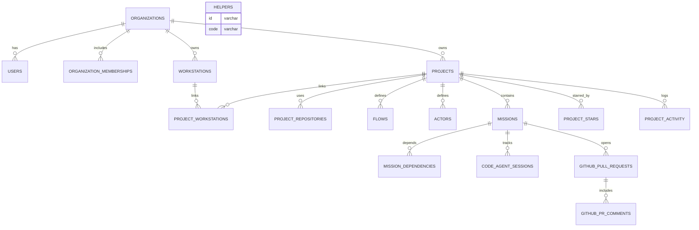

# Data Design

## Overview
Workstation-centric, multi-tenant schema with projects, missions, flexible flows, optional PR support, and public projects. Hybrid storage persists Solution & Tasks in filesystem with DB progress tracking. Agent configurations live client-side; server stores minimal availability state for orchestration.

## Data Relations Diagram


## Conceptual Entities

### ENT-ORG - Organization
Purpose: Tenant boundary; owns projects, workstations
Relationships: has memberships (users), owns projects/workstations

### ENT-USER - User
Purpose: Canonical identity (email via Monster Auth)
Relationships: member of organizations; stars public projects

### ENT-MEM - Organization Membership
Purpose: Role in org (owner/admin/member)
Relationships: links user↔org

### ENT-WS - Workstation
Purpose: Registered machine hosting agents
Relationships: belongs to org; linked to projects; reports presence

### ENT-PROJ - Project
Purpose: Unit of collaboration and configuration
Relationships: repositories, flows, actors, missions; stars/activity

### ENT-REPO - Project Repository
Purpose: GitHub repository linkage (stable by GitHub numeric ID)
Relationships: belongs to project; referenced by missions/PRs

### ENT-FLOW - Flow
Purpose: Stage sequence with review flags
Relationships: used by missions

### ENT-ACTOR - Actor
Purpose: AI persona/methodology
Relationships: referenced by missions

### ENT-MISSION - Mission
Purpose: Work item with stage/flow, PR mode, tasks/solution
Relationships: depends on missions; has agent sessions; PRs

### ENT-PR - GitHub Pull Request
Purpose: Track PR metadata/status
Relationships: belongs to mission and repository

### ENT-PRC - GitHub PR Comment
Purpose: PR feedback for AI iteration
Relationships: belongs to PR

### ENT-STAR - Project Star
Purpose: Community engagement
Relationships: user stars project

### ENT-ACT - Project Activity
Purpose: Public analytics feed
Relationships: project-scoped events; optional user/mission/ws context

### ENT-HLP - Helpers
Purpose: System helpers (e.g., DB locking)
Relationships: standalone

## Database Schema (key tables)

Note: SQL defines enums and indexes optimized for high-frequency monitoring and mission assignment. AuthZ is enforced in the app layer; SQL helper functions exist for reference only.

```sql
-- Organizations
CREATE TABLE organizations (
  id VARCHAR(26) PRIMARY KEY,
  name VARCHAR(255) NOT NULL,
  slug VARCHAR(100) UNIQUE NOT NULL,
  domain VARCHAR(255),
  owner_email VARCHAR(255) NOT NULL,
  api_key VARCHAR(100) UNIQUE,
  api_key_created_at TIMESTAMP,
  api_key_expires_at TIMESTAMP,
  default_flow_id VARCHAR(26),
  auto_invite_to_projects BOOLEAN DEFAULT true,
  created_at TIMESTAMP DEFAULT NOW(),
  updated_at TIMESTAMP DEFAULT NOW(),
  deleted_at TIMESTAMP NULL
);

-- Users
CREATE TABLE users (
  id VARCHAR(26) PRIMARY KEY,
  email VARCHAR(255) UNIQUE NOT NULL,
  name VARCHAR(255),
  avatar TEXT,
  monster_auth JSONB,
  timezone VARCHAR(50) DEFAULT 'UTC',
  email_verified BOOLEAN DEFAULT false,
  status ENUM('active','suspended','deleted') DEFAULT 'active',
  created_at TIMESTAMP DEFAULT NOW(),
  updated_at TIMESTAMP DEFAULT NOW(),
  last_active_at TIMESTAMP DEFAULT NOW()
);

-- Organization Memberships
CREATE TABLE organization_memberships (
  id VARCHAR(26) PRIMARY KEY,
  organization_id VARCHAR(26) NOT NULL,
  user_id VARCHAR(26) NOT NULL,
  role ENUM('owner','admin','member') DEFAULT 'member',
  status ENUM('active','invited','suspended') DEFAULT 'active',
  invited_by VARCHAR(26),
  invited_at TIMESTAMP,
  joined_at TIMESTAMP,
  created_at TIMESTAMP DEFAULT NOW(),
  updated_at TIMESTAMP DEFAULT NOW()
);

-- Workstations
CREATE TABLE workstations (
  id VARCHAR(26) PRIMARY KEY,
  organization_id VARCHAR(26) NOT NULL,
  name VARCHAR(255) NOT NULL,
  hostname VARCHAR(255),
  os VARCHAR(50), arch VARCHAR(50), platform_version VARCHAR(100),
  cli_version VARCHAR(20), registration_token VARCHAR(100),
  last_ip_address INET, last_user_agent TEXT,
  status ENUM('online','offline','suspended') DEFAULT 'offline',
  last_seen_at TIMESTAMP, last_heartbeat_at TIMESTAMP,
  available_code_agents JSON,
  realtime_member_key JSON, realtime_presence_meta JSON,
  dev_server_enabled BOOLEAN DEFAULT false,
  dev_server_port INTEGER,
  dev_server_public_url TEXT,
  created_at TIMESTAMP DEFAULT NOW(),
  updated_at TIMESTAMP DEFAULT NOW(),
  deleted_at TIMESTAMP NULL
);

-- Projects
CREATE TABLE projects (
  id VARCHAR(26) PRIMARY KEY,
  organization_id VARCHAR(26) NOT NULL,
  name VARCHAR(255) NOT NULL,
  description TEXT,
  slug VARCHAR(100),
  visibility ENUM('private','public') DEFAULT 'private',
  public_slug VARCHAR(100) UNIQUE,
  category VARCHAR(50), tags JSON, featured BOOLEAN DEFAULT false,
  star_count INTEGER DEFAULT 0,
  public_mission_read BOOLEAN DEFAULT true,
  public_memory_read BOOLEAN DEFAULT true,
  public_repository_read BOOLEAN DEFAULT true,
  contributor_mission_write BOOLEAN DEFAULT true,
  collaborator_workstation_read BOOLEAN DEFAULT false,
  maintainer_mission_execute BOOLEAN DEFAULT false,
  workstation_visibility ENUM('hidden','status_only','full_details') DEFAULT 'hidden',
  default_flow_id VARCHAR(26), default_actor_id VARCHAR(26),
  memory TEXT,
  pr_mode_default ENUM('disabled','enabled') DEFAULT 'disabled',
  pr_require_review BOOLEAN DEFAULT true,
  pr_auto_merge BOOLEAN DEFAULT false,
  pr_delete_branch_after_merge BOOLEAN DEFAULT true,
  pr_template TEXT,
  status ENUM('active','archived','suspended') DEFAULT 'active',
  created_at TIMESTAMP DEFAULT NOW(), updated_at TIMESTAMP DEFAULT NOW(), archived_at TIMESTAMP NULL
);

-- Project Repositories
CREATE TABLE project_repositories (
  id VARCHAR(26) PRIMARY KEY,
  project_id VARCHAR(26) NOT NULL,
  name VARCHAR(255) NOT NULL,
  github_repo_id BIGINT,
  github_owner VARCHAR(100) NOT NULL,
  github_name VARCHAR(100) NOT NULL,
  github_full_name VARCHAR(255) NOT NULL,
  github_url TEXT NOT NULL,
  default_branch VARCHAR(100) DEFAULT 'main'
);

-- Project Stars
CREATE TABLE project_stars (
  id VARCHAR(26) PRIMARY KEY,
  project_id VARCHAR(26) NOT NULL,
  user_id VARCHAR(26) NOT NULL,
  created_at TIMESTAMP DEFAULT NOW()
);

-- Project Activity
CREATE TABLE project_activity (
  id VARCHAR(26) PRIMARY KEY,
  project_id VARCHAR(26) NOT NULL,
  user_id VARCHAR(26),
  activity_type ENUM('mission_created','mission_completed','user_joined','star_added','repository_updated') NOT NULL,
  activity_data JSON,
  mission_id VARCHAR(26),
  workstation_id VARCHAR(26),
  created_at TIMESTAMP DEFAULT NOW()
);

-- Project Workstations
CREATE TABLE project_workstations (
  id VARCHAR(26) PRIMARY KEY,
  project_id VARCHAR(26) NOT NULL,
  workstation_id VARCHAR(26) NOT NULL,
  can_receive_missions BOOLEAN DEFAULT true,
  priority INTEGER DEFAULT 100,
  created_at TIMESTAMP DEFAULT NOW(), updated_at TIMESTAMP DEFAULT NOW()
);

-- Flows
CREATE TABLE flows (
  id VARCHAR(26) PRIMARY KEY,
  project_id VARCHAR(26) NOT NULL,
  name VARCHAR(255) NOT NULL,
  description TEXT,
  stage_sequence JSON NOT NULL,
  is_default BOOLEAN DEFAULT false,
  is_system BOOLEAN DEFAULT false,
  missions_using_count INTEGER DEFAULT 0,
  created_at TIMESTAMP DEFAULT NOW(), updated_at TIMESTAMP DEFAULT NOW()
);

-- Flow Stages
CREATE TABLE flow_stages (
  id VARCHAR(26) PRIMARY KEY,
  project_id VARCHAR(26) NULL,
  name VARCHAR(50) NOT NULL,
  display_name VARCHAR(255) NOT NULL,
  description TEXT,
  prompt_template TEXT,
  is_system BOOLEAN DEFAULT false,
  requires_code_execution BOOLEAN DEFAULT true,
  usage_count INTEGER DEFAULT 0,
  created_at TIMESTAMP DEFAULT NOW(), updated_at TIMESTAMP DEFAULT NOW()
);

-- Actors
CREATE TABLE actors (
  id VARCHAR(26) PRIMARY KEY,
  project_id VARCHAR(26) NOT NULL,
  name VARCHAR(255) NOT NULL,
  description TEXT,
  system_prompt TEXT,
  methodology TEXT,
  focus_areas JSON,
  is_default BOOLEAN DEFAULT false,
  missions_assigned_count INTEGER DEFAULT 0,
  created_at TIMESTAMP DEFAULT NOW(), updated_at TIMESTAMP DEFAULT NOW()
);

-- Missions
CREATE TABLE missions (
  id VARCHAR(26) PRIMARY KEY,
  project_id VARCHAR(26) NOT NULL,
  title VARCHAR(500) NOT NULL,
  description TEXT,
  clarification TEXT,
  priority INTEGER DEFAULT 3,
  list ENUM('todo','doing','review','done','loop') DEFAULT 'todo',
  list_order DECIMAL(10,5) DEFAULT 1000.00000,
  stage VARCHAR(50) DEFAULT 'clarify',
  flow_id VARCHAR(26),
  flow_config JSON,
  current_flow_task INTEGER DEFAULT 0,
  requires_review BOOLEAN DEFAULT false,
  repository_id BIGINT,
  project_repository_id VARCHAR(26),
  target_branch VARCHAR(100) DEFAULT 'main',
  actor_id VARCHAR(26),
  pr_mode ENUM('disabled','enabled','auto') DEFAULT 'auto',
  pr_created BOOLEAN DEFAULT false,
  github_pr_number INTEGER,
  github_pr_url TEXT,
  pr_branch_name VARCHAR(255),
  pr_merge_strategy ENUM('merge','squash','rebase') DEFAULT 'squash',
  is_loop BOOLEAN DEFAULT false,
  loop_schedule JSON,
  ready BOOLEAN DEFAULT false,
  agent_session_status ENUM('INACTIVE','PUSHING','ACTIVE') DEFAULT 'INACTIVE',
  agent_session_status_changed_at TIMESTAMP DEFAULT NOW(),
  code_agent_type VARCHAR(50),
  code_agent_name VARCHAR(255),
  last_code_agent_session_id VARCHAR(100),
  solution TEXT,
  tasks JSON,
  tasks_current INTEGER DEFAULT 0,
  review_status ENUM('pending','approved','rejected') DEFAULT NULL,
  review_feedback TEXT,
  review_requested_at TIMESTAMP NULL,
  review_completed_at TIMESTAMP NULL,
  reviewed_by_user_id VARCHAR(26),
  dependency_count INTEGER DEFAULT 0,
  created_at TIMESTAMP DEFAULT NOW(), updated_at TIMESTAMP DEFAULT NOW()
);

-- Mission Dependencies
CREATE TABLE mission_dependencies (
  id VARCHAR(26) PRIMARY KEY,
  mission_id VARCHAR(26) NOT NULL,
  depends_on_mission_id VARCHAR(26) NOT NULL,
  status ENUM('active','resolved') DEFAULT 'active',
  created_at TIMESTAMP DEFAULT NOW()
);

-- Code Agent Sessions
CREATE TABLE code_agent_sessions (
  id VARCHAR(26) PRIMARY KEY,
  mission_id VARCHAR(26) NOT NULL,
  code_agent_id VARCHAR(255),
  workstation_id VARCHAR(26),
  status ENUM('starting','active','stopped','failed') DEFAULT 'starting',
  started_at TIMESTAMP DEFAULT NOW(),
  ended_at TIMESTAMP NULL
);

-- GitHub Pull Requests
CREATE TABLE github_pull_requests (
  id VARCHAR(26) PRIMARY KEY,
  mission_id VARCHAR(26) NOT NULL,
  project_repository_id VARCHAR(26) NOT NULL,
  github_pr_number INTEGER NOT NULL,
  github_pr_id BIGINT,
  github_pr_url TEXT NOT NULL,
  source_branch VARCHAR(255) NOT NULL,
  target_branch VARCHAR(255) NOT NULL,
  title VARCHAR(500) NOT NULL,
  description TEXT,
  status ENUM('open','closed','merged','draft') NOT NULL,
  mergeable BOOLEAN,
  mergeable_state VARCHAR(50),
  review_status ENUM('pending','approved','changes_requested','dismissed') DEFAULT 'pending',
  required_reviews_count INTEGER DEFAULT 0,
  approved_reviews_count INTEGER DEFAULT 0,
  created_by_code_agent_type VARCHAR(50),
  created_by_code_agent_name VARCHAR(255),
  created_by_workstation_id VARCHAR(26),
  github_created_at TIMESTAMP,
  github_updated_at TIMESTAMP,
  github_merged_at TIMESTAMP,
  github_closed_at TIMESTAMP,
  last_synced_at TIMESTAMP DEFAULT NOW(),
  sync_status ENUM('synced','pending','error') DEFAULT 'pending',
  sync_error TEXT,
  created_at TIMESTAMP DEFAULT NOW(), updated_at TIMESTAMP DEFAULT NOW()
);

-- GitHub PR Comments
CREATE TABLE github_pr_comments (
  id VARCHAR(26) PRIMARY KEY,
  github_pr_id VARCHAR(26) NOT NULL,
  github_comment_id BIGINT NOT NULL,
  comment_type ENUM('issue','review','review_comment') NOT NULL,
  body TEXT NOT NULL,
  html_url TEXT,
  author_github_login VARCHAR(100),
  author_github_id BIGINT,
  author_type ENUM('user','bot') DEFAULT 'user',
  file_path TEXT,
  line_number INTEGER,
  diff_hunk TEXT,
  review_id BIGINT,
  review_state ENUM('pending','approved','changes_requested','commented'),
  processed_by_ai BOOLEAN DEFAULT false,
  ai_response TEXT,
  ai_response_at TIMESTAMP,
  github_created_at TIMESTAMP,
  github_updated_at TIMESTAMP,
  last_synced_at TIMESTAMP DEFAULT NOW(),
  created_at TIMESTAMP DEFAULT NOW(), updated_at TIMESTAMP DEFAULT NOW()
);

-- Helpers (DB locking/config)
CREATE TABLE helpers (
  id VARCHAR(26) PRIMARY KEY,
  code VARCHAR(100) UNIQUE NOT NULL,
  description TEXT,
  state JSON,
  active BOOLEAN DEFAULT true,
  created_at TIMESTAMP DEFAULT NOW(), updated_at TIMESTAMP DEFAULT NOW()
);
```

Indexes & Performance (highlights)
- Monitoring every 10s: partial indexes on missions by agent_session_status and list
- Assignment: composite indexes on missions by ready, session status, list, priority DESC, list_order
- Concurrency subqueries: indexes by repository_id and code_agent_type with ACTIVE/PUSHING
- Dependencies: partial index on mission_dependencies where status='active'
- Helpers: index by code/active/updated_at for locking
- Materialized views (post-MVP option): mv_active_mission_counts, mv_agent_capacity
- Reference index names: idx_monitoring_active_missions, idx_monitoring_ready_missions, idx_mission_assignment_complex, idx_repo_active_missions, idx_code_agent_active_missions, idx_mission_dependencies_blocking

Triggers (highlights)
- Update agent_session_status_changed_at on status change
- Update dependency_count on mission_dependencies changes
- Flow usage counter increment on mission insert with flow_id
- Update projects.star_count on star insert/delete
- Project activity on mission done and permission changes

Agent storage strategy
- Server: static code agent type definitions (capabilities, models)
- Client: ~/.solo-unicorn/code-agents.json with paths, env, health, stats

Reference SQL helpers (app-layer authz remains source of truth)
- get_user_project_role(userId, projectId)
- can_user_access_project(userId, projectId, action)

Seed data
- Insert required lock row for helpers: ('helper_01MISSION_PUSH_LOCK','MISSION_PUSH_LOCK', ...)

## Object Storage Layout
- N/A (MVP)

## Client Filesystem

Mission artifacts
```yaml
path: ./solo-unicorn-docs/missions/{mission-id}/
files:
  - solution.md
  - tasks/{n}.md  # detailed per-task notes
git_tracked: true
purpose: Rich solution and session-scoped context across iterations
```

## Lifecycle & Compliance
- PII: user email, names (users table); persisted per org/project with standard retention
- Retention: project data retained until deletion; PR metadata mirrors GitHub state; logs/events per product policy
