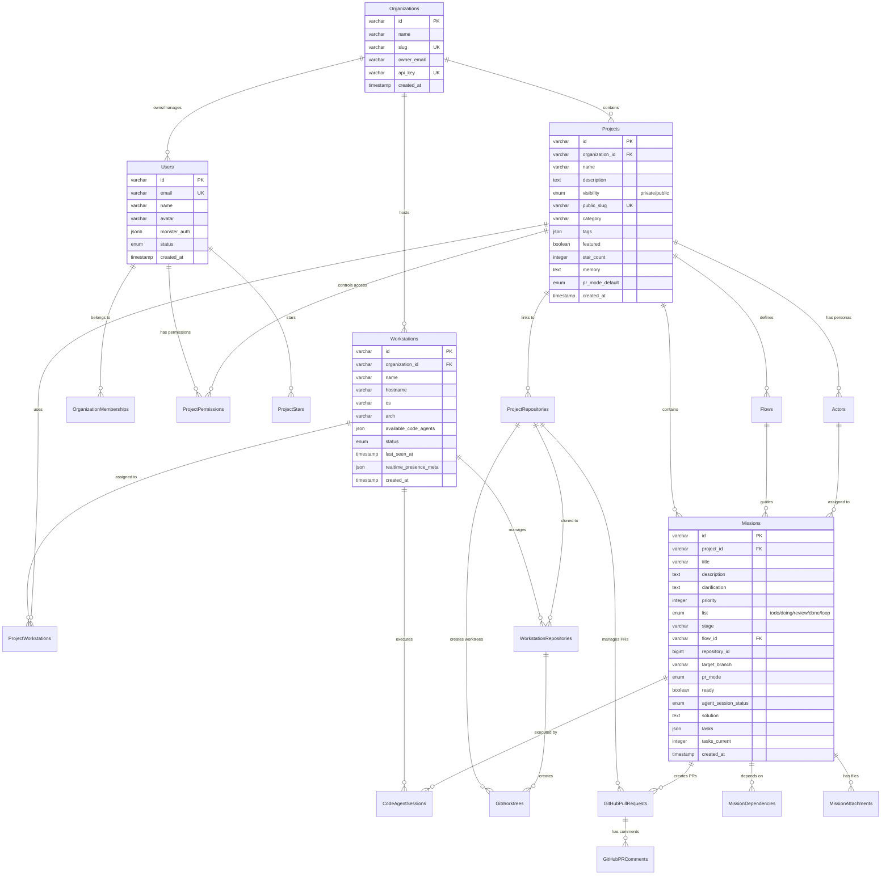

# Data Design

## Overview

Solo Unicorn uses a workstation-centric, multi-tenant data architecture supporting distributed AI code agent orchestration. The system employs a hybrid storage strategy: PostgreSQL for operational data with performance-optimized indexes, filesystem storage for mission artifacts (solution/tasks documents), and Monster services integration for authentication and real-time communication. The design prioritizes mission assignment performance, real-time presence tracking, and granular access control for both private organizations and public project collaboration.

## Data Relations Diagram



## Conceptual Entities

### Organizations
**Purpose:** Top-level multi-tenant container that owns workstations and projects
**Relationships:** Has many Users (via memberships), Workstations, and Projects

### Users
**Purpose:** Individual users with email-based canonical identity across Monster Auth providers
**Relationships:** Belongs to Organizations, has ProjectPermissions, can star Projects

### Workstations
**Purpose:** Physical/virtual machines that host code agents and execute missions
**Relationships:** Belongs to Organization, assigned to Projects, manages local Repositories, executes CodeAgentSessions

### Projects
**Purpose:** Development projects containing missions, with optional public visibility and granular permissions
**Relationships:** Contains Missions, links to ProjectRepositories, defines Flows and Actors, controls access via ProjectPermissions

### Missions
**Purpose:** AI-executable tasks with flow-based stages and optional review gates
**Relationships:** Belongs to Project, follows Flow, assigned to Actor, executed via CodeAgentSessions, creates GitHubPullRequests

### ProjectRepositories
**Purpose:** GitHub repository links with stable identification and PR configuration
**Relationships:** Linked to Projects, cloned to WorkstationRepositories, manages GitHubPullRequests

### GitWorktrees
**Purpose:** Multiple working directories from same repository for parallel development
**Relationships:** Created by WorkstationRepositories, used by CodeAgentSessions

### CodeAgentSessions
**Purpose:** Individual AI agent execution sessions with timing, results, and error tracking
**Relationships:** Executes Missions on Workstations, uses GitWorktrees

## Database Schema

### organizations
```sql
CREATE TABLE organizations (
  id VARCHAR(26) PRIMARY KEY, -- ulid: org_01H123...
  name VARCHAR(255) NOT NULL,
  slug VARCHAR(100) UNIQUE NOT NULL,
  domain VARCHAR(255),
  owner_email VARCHAR(255) NOT NULL,
  api_key VARCHAR(100) UNIQUE, -- org_key_abc123...
  api_key_created_at TIMESTAMP,
  api_key_expires_at TIMESTAMP,
  default_flow_id VARCHAR(26),
  auto_invite_to_projects BOOLEAN DEFAULT true,
  created_at TIMESTAMP DEFAULT NOW(),
  updated_at TIMESTAMP DEFAULT NOW(),
  deleted_at TIMESTAMP NULL
);
```

### users
```sql
CREATE TABLE users (
  id VARCHAR(26) PRIMARY KEY, -- ulid: user_01H123...
  email VARCHAR(255) UNIQUE NOT NULL,
  name VARCHAR(255),
  avatar TEXT,
  monster_auth JSONB, -- {"provider": "google"|"email", "monsterAuthEntity": {...}}
  timezone VARCHAR(50) DEFAULT 'UTC',
  email_verified BOOLEAN DEFAULT false,
  status ENUM('active', 'suspended', 'deleted') DEFAULT 'active',
  created_at TIMESTAMP DEFAULT NOW(),
  updated_at TIMESTAMP DEFAULT NOW(),
  last_active_at TIMESTAMP DEFAULT NOW()
);
```

### workstations
```sql
CREATE TABLE workstations (
  id VARCHAR(26) PRIMARY KEY, -- ulid: ws_01H123...
  organization_id VARCHAR(26) NOT NULL,
  name VARCHAR(255) NOT NULL,
  hostname VARCHAR(255),
  os VARCHAR(50), -- darwin, linux, win32
  arch VARCHAR(50), -- x64, arm64
  platform_version VARCHAR(100),
  cli_version VARCHAR(20),
  registration_token VARCHAR(100),
  last_ip_address INET,
  last_user_agent TEXT,
  status ENUM('online', 'offline', 'suspended') DEFAULT 'offline',
  last_seen_at TIMESTAMP,
  last_heartbeat_at TIMESTAMP,
  available_code_agents JSON, -- [{"type": "claude-code", "name": "Claude Primary", "available": true}]
  realtime_member_key JSON, -- {"workstationId": "ws_123", "userId": "user_456"}
  realtime_presence_meta JSON,
  dev_server_enabled BOOLEAN DEFAULT false,
  dev_server_port INTEGER,
  dev_server_public_url TEXT,
  created_at TIMESTAMP DEFAULT NOW(),
  updated_at TIMESTAMP DEFAULT NOW(),
  deleted_at TIMESTAMP NULL,
  FOREIGN KEY (organization_id) REFERENCES organizations(id) ON DELETE CASCADE
);
```

### projects
```sql
CREATE TABLE projects (
  id VARCHAR(26) PRIMARY KEY, -- ulid: proj_01H123...
  organization_id VARCHAR(26) NOT NULL,
  name VARCHAR(255) NOT NULL,
  description TEXT,
  slug VARCHAR(100),
  visibility ENUM('private', 'public') DEFAULT 'private',
  public_slug VARCHAR(100) UNIQUE,
  category VARCHAR(50), -- 'web-development', 'mobile-app', 'ai-ml', etc.
  tags JSON, -- ["react", "typescript", "api"]
  featured BOOLEAN DEFAULT false,
  star_count INTEGER DEFAULT 0,
  public_mission_read BOOLEAN DEFAULT true,
  public_memory_read BOOLEAN DEFAULT true,
  public_repository_read BOOLEAN DEFAULT true,
  contributor_mission_write BOOLEAN DEFAULT true,
  collaborator_workstation_read BOOLEAN DEFAULT false,
  maintainer_mission_execute BOOLEAN DEFAULT false,
  workstation_visibility ENUM('hidden', 'status_only', 'full_details') DEFAULT 'hidden',
  default_flow_id VARCHAR(26),
  default_actor_id VARCHAR(26),
  memory TEXT, -- markdown content
  pr_mode_default ENUM('disabled', 'enabled') DEFAULT 'disabled',
  pr_require_review BOOLEAN DEFAULT true,
  pr_auto_merge BOOLEAN DEFAULT false,
  pr_delete_branch_after_merge BOOLEAN DEFAULT true,
  pr_template TEXT,
  status ENUM('active', 'archived', 'suspended') DEFAULT 'active',
  created_at TIMESTAMP DEFAULT NOW(),
  updated_at TIMESTAMP DEFAULT NOW(),
  archived_at TIMESTAMP NULL,
  FOREIGN KEY (organization_id) REFERENCES organizations(id) ON DELETE CASCADE
);
```

### missions
```sql
CREATE TABLE missions (
  id VARCHAR(26) PRIMARY KEY, -- ulid: mission_01H123...
  project_id VARCHAR(26) NOT NULL,
  title VARCHAR(500) NOT NULL,
  description TEXT,
  clarification TEXT, -- AI-refined/structured clarification
  priority INTEGER DEFAULT 3, -- 1-5 (5=highest)
  list ENUM('todo', 'doing', 'review', 'done', 'loop') DEFAULT 'todo',
  list_order DECIMAL(10,5) DEFAULT 1000.00000,
  stage VARCHAR(50) DEFAULT 'clarify',
  flow_id VARCHAR(26),
  flow_config JSON,
  current_flow_task INTEGER DEFAULT 0,
  requires_review BOOLEAN DEFAULT false,
  repository_id BIGINT, -- GitHub numeric repository ID
  project_repository_id VARCHAR(26),
  target_branch VARCHAR(100) DEFAULT 'main',
  actor_id VARCHAR(26),
  pr_mode ENUM('disabled', 'enabled', 'auto') DEFAULT 'auto',
  pr_created BOOLEAN DEFAULT false,
  github_pr_number INTEGER,
  github_pr_url TEXT,
  pr_branch_name VARCHAR(255),
  pr_merge_strategy ENUM('merge', 'squash', 'rebase') DEFAULT 'squash',
  is_loop BOOLEAN DEFAULT false,
  loop_schedule JSON,
  ready BOOLEAN DEFAULT false,
  agent_session_status ENUM('INACTIVE', 'PUSHING', 'ACTIVE') DEFAULT 'INACTIVE',
  agent_session_status_changed_at TIMESTAMP DEFAULT NOW(),
  code_agent_type VARCHAR(50),
  code_agent_name VARCHAR(255),
  last_code_agent_session_id VARCHAR(100),
  solution TEXT,
  tasks JSON,
  tasks_current INTEGER DEFAULT 0,
  review_status ENUM('pending', 'approved', 'rejected') DEFAULT NULL,
  review_feedback TEXT,
  review_requested_at TIMESTAMP NULL,
  review_completed_at TIMESTAMP NULL,
  reviewed_by_user_id VARCHAR(26),
  dependency_count INTEGER DEFAULT 0,
  created_at TIMESTAMP DEFAULT NOW(),
  updated_at TIMESTAMP DEFAULT NOW(),
  FOREIGN KEY (project_id) REFERENCES projects(id) ON DELETE CASCADE,
  FOREIGN KEY (flow_id) REFERENCES flows(id) ON DELETE SET NULL,
  FOREIGN KEY (project_repository_id) REFERENCES project_repositories(id) ON DELETE SET NULL,
  FOREIGN KEY (actor_id) REFERENCES actors(id) ON DELETE SET NULL,
  FOREIGN KEY (reviewed_by_user_id) REFERENCES users(id) ON DELETE SET NULL
);
```

### project_repositories
```sql
CREATE TABLE project_repositories (
  id VARCHAR(26) PRIMARY KEY, -- ulid: repo_01H123...
  project_id VARCHAR(26) NOT NULL,
  name VARCHAR(255) NOT NULL,
  github_repo_id BIGINT, -- GitHub numeric ID (most stable)
  github_owner VARCHAR(100) NOT NULL,
  github_name VARCHAR(100) NOT NULL,
  github_full_name VARCHAR(255) NOT NULL,
  github_url TEXT NOT NULL,
  default_branch VARCHAR(100) DEFAULT 'main',
  pr_mode_enabled BOOLEAN DEFAULT false,
  pr_branch_prefix VARCHAR(50) DEFAULT 'solo-unicorn/',
  pr_target_branch VARCHAR(100),
  auto_delete_pr_branches BOOLEAN DEFAULT true,
  max_concurrent_missions INTEGER DEFAULT 1,
  status ENUM('active', 'inactive', 'error') DEFAULT 'active',
  last_accessed_at TIMESTAMP,
  last_mission_pushed_at TIMESTAMP,
  last_pr_sync_at TIMESTAMP,
  github_webhook_id VARCHAR(100),
  github_permissions JSON,
  created_at TIMESTAMP DEFAULT NOW(),
  updated_at TIMESTAMP DEFAULT NOW(),
  FOREIGN KEY (project_id) REFERENCES projects(id) ON DELETE CASCADE
);
```

### git_worktrees
```sql
CREATE TABLE git_worktrees (
  id VARCHAR(26) PRIMARY KEY, -- ulid: worktree_01H123...
  workstation_repository_id VARCHAR(26) NOT NULL,
  branch VARCHAR(100) NOT NULL,
  worktree_path TEXT NOT NULL,
  status ENUM('creating', 'ready', 'busy', 'error') DEFAULT 'creating',
  error_message TEXT,
  last_used_at TIMESTAMP,
  active_mission_count INTEGER DEFAULT 0,
  created_at TIMESTAMP DEFAULT NOW(),
  updated_at TIMESTAMP DEFAULT NOW(),
  FOREIGN KEY (workstation_repository_id) REFERENCES workstation_repositories(id) ON DELETE CASCADE
);
```

### code_agent_sessions
```sql
CREATE TABLE code_agent_sessions (
  id VARCHAR(26) PRIMARY KEY, -- ulid: session_01H123...
  mission_id VARCHAR(26) NOT NULL,
  code_agent_type VARCHAR(50) NOT NULL,
  code_agent_name VARCHAR(255),
  workstation_id VARCHAR(26) NOT NULL,
  external_session_id VARCHAR(100),
  stage VARCHAR(50),
  worktree_id VARCHAR(26),
  working_directory TEXT,
  status ENUM('starting', 'active', 'completed', 'failed', 'timeout') DEFAULT 'starting',
  start_reason TEXT,
  end_reason TEXT,
  output_summary TEXT,
  files_changed JSON, -- ["src/auth.ts", "tests/auth.test.ts"]
  commits_made JSON, -- [{"sha": "abc123", "message": "Add login form"}]
  started_at TIMESTAMP DEFAULT NOW(),
  ended_at TIMESTAMP NULL,
  duration_seconds INTEGER,
  error_type VARCHAR(100),
  error_message TEXT,
  recovery_attempts INTEGER DEFAULT 0,
  FOREIGN KEY (mission_id) REFERENCES missions(id) ON DELETE CASCADE,
  FOREIGN KEY (workstation_id) REFERENCES workstations(id) ON DELETE CASCADE,
  FOREIGN KEY (worktree_id) REFERENCES git_worktrees(id) ON DELETE SET NULL
);
```

### github_pull_requests
```sql
CREATE TABLE github_pull_requests (
  id VARCHAR(26) PRIMARY KEY, -- ulid: ghpr_01H123...
  mission_id VARCHAR(26) NOT NULL,
  project_repository_id VARCHAR(26) NOT NULL,
  github_pr_number INTEGER NOT NULL,
  github_pr_id BIGINT,
  github_pr_url TEXT NOT NULL,
  source_branch VARCHAR(255) NOT NULL,
  target_branch VARCHAR(255) NOT NULL,
  title VARCHAR(500) NOT NULL,
  description TEXT,
  status ENUM('open', 'closed', 'merged', 'draft') NOT NULL,
  mergeable BOOLEAN,
  mergeable_state VARCHAR(50),
  review_status ENUM('pending', 'approved', 'changes_requested', 'dismissed') DEFAULT 'pending',
  required_reviews_count INTEGER DEFAULT 0,
  approved_reviews_count INTEGER DEFAULT 0,
  created_by_code_agent_type VARCHAR(50),
  created_by_code_agent_name VARCHAR(255),
  created_by_workstation_id VARCHAR(26),
  github_created_at TIMESTAMP,
  github_updated_at TIMESTAMP,
  github_merged_at TIMESTAMP,
  github_closed_at TIMESTAMP,
  last_synced_at TIMESTAMP DEFAULT NOW(),
  sync_status ENUM('synced', 'pending', 'error') DEFAULT 'pending',
  sync_error TEXT,
  created_at TIMESTAMP DEFAULT NOW(),
  updated_at TIMESTAMP DEFAULT NOW(),
  FOREIGN KEY (mission_id) REFERENCES missions(id) ON DELETE CASCADE,
  FOREIGN KEY (project_repository_id) REFERENCES project_repositories(id) ON DELETE CASCADE,
  FOREIGN KEY (created_by_workstation_id) REFERENCES workstations(id) ON DELETE SET NULL
);
```

## Object Storage Layout

### Monster Services Integration

**Monster Auth Storage:**
- User OAuth tokens (access/refresh) managed by Monster Auth service
- Personal access tokens (pat_*) stored securely in CLI keychain
- Organization API keys (org_key_*) in encrypted database fields

**Monster Realtime Channels:**
- `workstation:{workstation_id}` - Direct workstation communication
- `project:{project_id}:workstations` - Project-wide workstation updates
- `mission:{mission_id}` - Mission-specific coordination

**Monster Upload (Future):**
- Mission attachments: `attachments/{mission_id}/{filename}`
- Project assets: `projects/{project_id}/assets/{filename}`
- User avatars: `users/{user_id}/avatar.{ext}`

### File Attachments (S3/CDN)

**Mission Attachments:**
- Bucket: `solo-unicorn-attachments`
- Path: `missions/{mission_id}/{attachment_id}/{filename}`
- Properties: Content-Type, file size, upload timestamp
- Access: Authenticated users with mission access permissions

**Project Assets:**
- Bucket: `solo-unicorn-assets`
- Path: `projects/{project_id}/{asset_type}/{filename}`
- Properties: Public/private flag, CDN distribution
- Access: Based on project visibility and user permissions

## Client Filesystem

### CLI Configuration
```yaml
path: "~/.solo-unicorn/config.json"
ttl: "permanent"
rotation: "on version upgrade"
```

### Code Agent Configuration
```yaml
path: "~/.solo-unicorn/code-agents.json"
ttl: "permanent"
rotation: "manual backup on changes"
```

### Mission Documents
```yaml
path: "./solo-unicorn-docs/missions/{mission-id}/"
ttl: "project lifetime"
rotation: "git version control"
```

### Repository Worktrees
```yaml
path: "{workspace_path}/{repo-name}-{branch-name}"
ttl: "7 days unused"
rotation: "automatic cleanup policy"
```

### Development Logs
```yaml
path: "~/.solo-unicorn/logs/{date}.log"
ttl: "30 days"
rotation: "daily, compressed after 7 days"
```

## Lifecycle & Compliance

### PII Classification
- Email addresses (users.email) - Personal Identifier
- Names (users.name) - Personal Information
- IP addresses (workstations.last_ip_address) - Technical Identifier
- Monster Auth tokens - Authentication Data

### Retention Policies
- Mission artifacts: Retained for project lifetime + 1 year
- Code agent sessions: 90 days for performance data
- Workstation logs: 30 days for debugging
- GitHub integration data: Synchronized with repository access
- User personal data: Deleted within 30 days of account deletion
- Audit logs: 7 years for compliance (future implementation)

### Data Security
- Database encryption at rest (provider managed)
- Monster Auth token encryption in transit and storage
- Personal access tokens never stored server-side (CLI keychain only)
- Row-level security for multi-tenant data isolation (future enhancement)
- Regular automated backups with point-in-time recovery
