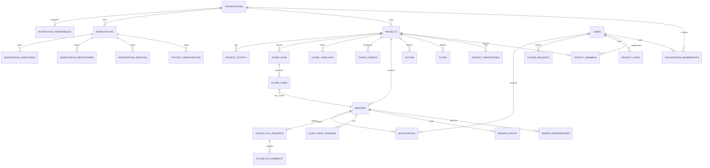

# Data Design

## Overview
The Solo Unicorn schema centers on missions, workstations, and transparent automation. The Chore service replaces loop missions: instead of looping tasks, the system generates new missions from templates when the backlog is low. Those templates appear in the Todo column “Chore” area so users can launch work instantly while the template remains available. Hybrid storage keeps rich mission docs on the filesystem with DB pointers for cross-session continuity.

## Data Relations Diagram


## Conceptual Entities
- **ENT-ORG:** Organization owning projects and workstations.
- **ENT-USER:** Monster Auth identity, receives notifications.
- **ENT-MEM:** Organization membership with role.
- **ENT-PROJECT:** Collaboration container with defaults, privacy, metrics, chore settings.
- **ENT-PROJECT-MEMBER:** Project-level permission overrides.
- **ENT-WORKSTATION / ENT-WORKSTATION-SESSION:** Machines + daemon sessions.
- **ENT-REPOSITORY / ENT-WORKTREE:** GitHub linkage and mission worktrees.
- **ENT-FLOW / ENT-ACTOR:** Workflow templates and personas.
- **ENT-MISSION:** Core task, always ends in Done (no loop list).
- **ENT-MISSION-EVENT:** Timeline events for transparency.
- **ENT-CODE-AGENT-SESSION:** Execution attempts metadata.
- **ENT-CHORE-CONFIG/TEMPLATE/RUN/ITEM:** Configuration, template definitions, run history, and individual mission proposals. Templates power the Todo Chore area; items record each generated mission while leaving the template in place with rotation metadata.
- **ENT-ACCESS-REQUEST / ENT-NOTIFICATION / ENT-AUDIT-EVENT:** Collaboration, alerts, compliance.

## Database Schema (key tables)
(Columns abbreviated; migrations capture full structure.)

```sql
-- Missions (list excludes "loop")
CREATE TABLE missions (
  id VARCHAR(26) PRIMARY KEY,
  project_id VARCHAR(26) NOT NULL,
  title VARCHAR(500) NOT NULL,
  description TEXT,
  clarification TEXT,
  priority INTEGER DEFAULT 3,
  list ENUM('todo','doing','review','done') DEFAULT 'todo',
  list_order DECIMAL(10,5) DEFAULT 1000,
  flow_id VARCHAR(26),
  stage VARCHAR(64) DEFAULT 'clarify',
  requires_review BOOLEAN DEFAULT false,
  actor_id VARCHAR(26),
  repository_id VARCHAR(26),
  target_branch VARCHAR(120) DEFAULT 'main',
  pr_mode ENUM('disabled','enabled','auto') DEFAULT 'auto',
  pr_branch_name VARCHAR(255),
  github_pr_number INTEGER,
  ready BOOLEAN DEFAULT false,
  origin ENUM('manual','chore','imported') DEFAULT 'manual',
  chore_item_id VARCHAR(26),
  agent_session_status ENUM('inactive','pushing','active') DEFAULT 'inactive',
  solution_path TEXT,
  tasks_path TEXT,
  review_status ENUM('pending','approved','rejected') DEFAULT NULL,
  review_feedback TEXT,
  dependency_count INTEGER DEFAULT 0,
  last_event_at TIMESTAMP,
  created_at TIMESTAMP DEFAULT NOW(),
  updated_at TIMESTAMP DEFAULT NOW()
);

-- Chore Configuration
CREATE TABLE chore_configs (
  id VARCHAR(26) PRIMARY KEY,
  project_id VARCHAR(26) NOT NULL UNIQUE,
  backlog_threshold INTEGER DEFAULT 5,
  check_cadence_minutes INTEGER DEFAULT 15,
  auto_accept BOOLEAN DEFAULT false,
  monthly_target_hours INTEGER DEFAULT 120,
  weekly_mission_cap INTEGER DEFAULT 20,
  status ENUM('active','paused','snoozed') DEFAULT 'active',
  minimum_wait_minutes INTEGER DEFAULT 30,
  default_rotation_weight INTEGER DEFAULT 1,
  last_run_at TIMESTAMP,
  created_at TIMESTAMP DEFAULT NOW(),
  updated_at TIMESTAMP DEFAULT NOW()
);

CREATE TABLE chore_templates (
  id VARCHAR(26) PRIMARY KEY,
  project_id VARCHAR(26) NOT NULL,
  name VARCHAR(255) NOT NULL,
  description TEXT,
  flow_id VARCHAR(26) NOT NULL,
  actor_id VARCHAR(26) NOT NULL,
  repository_id VARCHAR(26) NOT NULL,
  priority INTEGER DEFAULT 3,
  estimated_effort_minutes INTEGER NOT NULL,
  acceptance_criteria TEXT,
  enabled BOOLEAN DEFAULT true,
  tags JSONB,
  rotation_weight INTEGER DEFAULT 1,
  cooldown_minutes INTEGER,
  last_generated_at TIMESTAMP,
  created_at TIMESTAMP DEFAULT NOW(),
  updated_at TIMESTAMP DEFAULT NOW()
);

CREATE TABLE chore_runs (
  id VARCHAR(26) PRIMARY KEY,
  project_id VARCHAR(26) NOT NULL,
  triggered_by ENUM('automatic','manual','api') NOT NULL,
  backlog_count_before INTEGER,
  backlog_threshold INTEGER,
  generated_count INTEGER DEFAULT 0,
  accepted_count INTEGER DEFAULT 0,
  discarded_count INTEGER DEFAULT 0,
  status ENUM('pending','awaiting_review','completed','cancelled','errored') DEFAULT 'awaiting_review',
  started_at TIMESTAMP DEFAULT NOW(),
  completed_at TIMESTAMP
);

CREATE TABLE chore_items (
  id VARCHAR(26) PRIMARY KEY,
  chore_run_id VARCHAR(26) NOT NULL,
  template_id VARCHAR(26) NOT NULL,
  project_id VARCHAR(26) NOT NULL,
  title VARCHAR(500) NOT NULL,
  description TEXT,
  flow_id VARCHAR(26) NOT NULL,
  actor_id VARCHAR(26) NOT NULL,
  repository_id VARCHAR(26) NOT NULL,
  priority INTEGER,
  estimated_effort_minutes INTEGER,
  status ENUM('proposed','accepted','discarded') DEFAULT 'proposed',
  mission_id VARCHAR(26),
  feedback TEXT,
  next_eligible_at TIMESTAMP,
  created_at TIMESTAMP DEFAULT NOW(),
  updated_at TIMESTAMP DEFAULT NOW()
);

-- Additional mission / chore indexes
CREATE INDEX idx_missions_project_list_ready ON missions(project_id, list, ready);
CREATE INDEX idx_chore_runs_project ON chore_runs(project_id, started_at DESC);
CREATE INDEX idx_chore_items_run_status ON chore_items(chore_run_id, status);
```

Other core tables (organizations, users, workstations, repositories, mission events, notifications, audit events) remain as in previous revision but remove any `is_loop` or `loop_schedule` columns.

## Mission Events
Mission events capture all lifecycle updates including chore signals.
```sql
ALTER TABLE mission_events ADD COLUMN origin ENUM('system','user','agent','chore') DEFAULT 'system';
```
Chore run completion inserts summary events with payload `{ "runId": "run_123", "generated": 3, "accepted": 2 }`.

## Hybrid Storage
- Mission docs: `solo-unicorn-docs/missions/{missionId}/solution.md`, `tasks/{n}.md`
- Chore run reports (JSON) stored under `solo-unicorn-docs/chore/{runId}.json` for audit
- Agent logs remain in `logs/{sessionId}.log` (gitignored)

## Derived Views & Metrics
- `mv_project_metrics_daily` includes columns `chore_generated`, `chore_accepted`, `chore_discarded`, `avg_backlog_size`.
- `mv_chore_health` summarizes backlog threshold adherence, rotation balance, and guardrail usage.
- `mv_notification_counts` adds chore segment counts.

## Retention & Compliance
- Chore runs retained 180 days; aggregated stats remain in metrics view.
- Notifications older than 180 days archived.
- Access request messages anonymized 30 days post decision.
- Audit events WORM for 400 days.
- When user deleted, mission `reviewed_by` replaced with pseudonymous token; chore feedback retains anonymized reviewer reference.

## Performance
- Mission queries: partial indexes on `(list='todo', ready=true)` for fast backlog checks.
- Chore run listing uses covering index `(project_id, started_at DESC, status)` to keep UI responsive.
- Notification unread counts rely on partial index `WHERE read_at IS NULL`.
- All thresholds ensure mission backlog check stays <20ms.

## Migration Strategy
1. Introduce new chore tables and add `origin`, `chore_item_id` columns to missions.
2. Backfill existing missions with `origin='manual'`.
3. Drop `is_loop`, `loop_schedule`, and `list` enum values referencing loop (with chore conversions to `todo`).
4. Update APIs/CLI to reference new structures.
5. Deploy chore service with feature flag for progressive rollout.

## Data Quality
- Database constraints: `chore_items.mission_id` references missions; `missions.chore_item_id` references items when accepted.
- Guardrail check ensures accepted mission count per week ≤ cap.
- Application enforces backlog threshold evaluation; DB triggers ensure chore runs update counts and next-eligible timers on accept/discard.

## Monster Service Integrations
- Monster Realtime publishes chore events on `project:{id}:chore` channel, payload stored in `chore_runs`.
- Monster Auth metadata remains canonical identity source.

## Open Questions & Future Work
- Template marketplace across organizations (post-MVP).
- Machine learning scoring for template selection (future).
- Auto-accept policies per template once confidence high.
