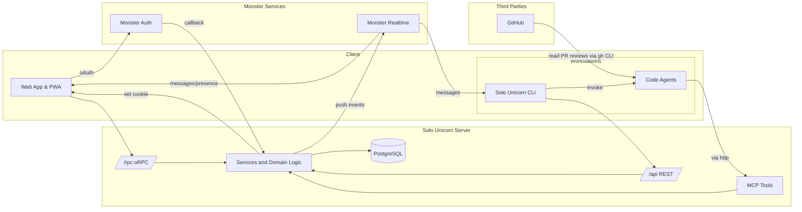
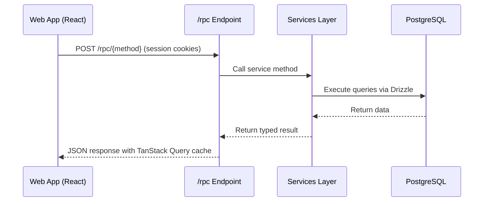
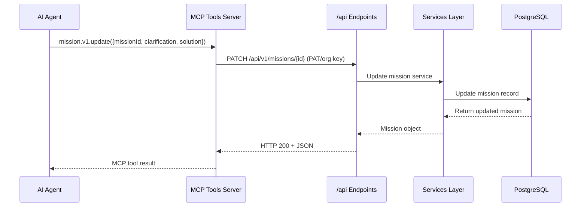
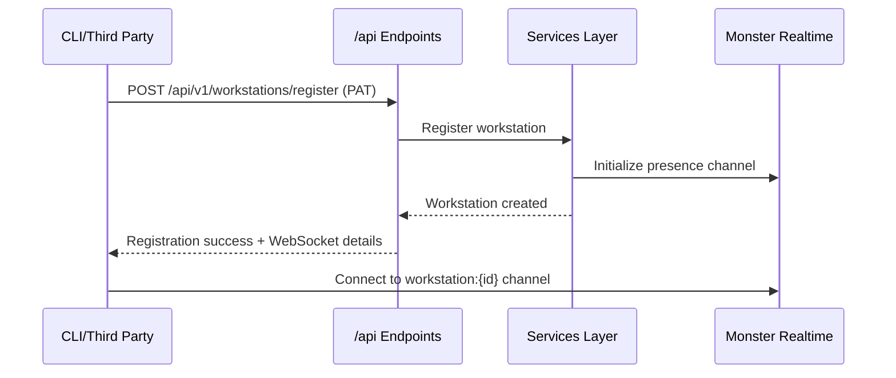
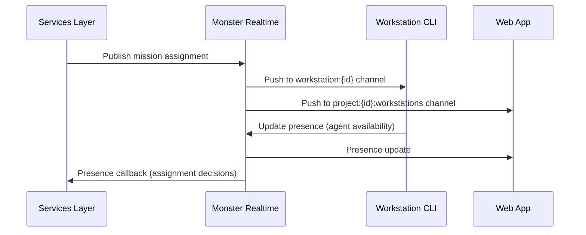

# System Interface Design

## High-Level System Overview

Solo Unicorn employs a unified MCP-first interface architecture with strict interface boundaries and minimal transport protocols. The system is designed around the principle of using the least powerful approach while maintaining clear separation between internal and external communications.

**Architecture Context:**
- **Web App**: Internal communication via /rpc (oRPC) with breaking changes allowed
- **AI Agents**: External communication via MCP tools that delegate to /api (HTTP)
- **CLI & Third Parties**: External communication via /api (REST-like or verb-based)
- **Real-time**: Push-only WebSocket via Monster Realtime (no request/response)

**Trust Boundaries:**
- Internal: Web ↔ Server (bundle deployed together, credentials:include)
- External: MCP/CLI/Third Parties ↔ Server (versioned APIs, auth tokens)
- Real-time: Monster Realtime Gateway (presence and push notifications only)

**Container Relationships:**

## Transport Flows

### Web App → oRPC Internal Flow

**Pattern:** HTTP oRPC
**Path/Channel(s):** /rpc/{method}
**Notes:** Internal communication with session cookies, CORS allowlist, breaking changes allowed

#### Flow Diagram

### MCP Tools → API External Flow

**Pattern:** HTTP via MCP
**Path/Channel(s):** /api/v1/{resource}
**Notes:** MCP tools delegate to versioned HTTP endpoints, stable backwards compatibility

#### Flow Diagram

### CLI/Third Party → API Flow

**Pattern:** HTTP REST-like
**Path/Channel(s):** /api/v1/{operation}
**Notes:** Direct HTTP access for workstation registration, public discovery, OAuth callbacks

#### Flow Diagram

### Real-time Push Flow

**Pattern:** WebSocket Push-Only
**Path/Channel(s):** Monster Realtime channels
**Notes:** Presence updates and mission assignments, no request/response RPC

#### Flow Diagram

## Endpoints

### MISSION-001 Mission Update (MCP)

#### Summary
Update mission specification, solution, tasks, and execution status via MCP tool

#### Meta
- **Kind:** MCP Tool
- **Identifier/Path:** mission.v1.update
- **Method/Verb (if HTTP):** Delegates to PATCH /api/v1/missions/{id}

#### AuthN/AuthZ
Personal access token (pat_*) or organization API key (org_key_*) via MCP context

#### Input Fields
`missionId`, `clarification?`, `solution?`, `priority?`, `list?`, `stage?`, `flowId?`, `tasks?`, `currentTask?`, `activeWorkstationId?`

#### Output Fields
`missionId`, `title`, `description`, `clarification`, `solution`, `tasks`, `currentTask`, `list`, `stage`, `priority`, `ready`, `repositoryId`

#### Notes
Primary interface for AI agents to update mission progress and content

### MISSION-002 Mission Get (MCP)

#### Summary
Retrieve complete mission details including current state and configuration

#### Meta
- **Kind:** MCP Tool
- **Identifier/Path:** mission.v1.get
- **Method/Verb (if HTTP):** Delegates to GET /api/v1/missions/{id}

#### AuthN/AuthZ
PAT/org key with mission read permissions based on project access

#### Input Fields
`missionId`

#### Output Fields
`id`, `projectId`, `title`, `description`, `clarification`, `solution`, `tasks`, `currentTask`, `repositoryId`, `additionalRepositoryIds?`, `prMode`, `list`, `stage`, `priority`, `flowConfig`, `actorId`

#### Notes
Core read operation for AI agents to understand mission context

### WORKSTATION-001 Registration (HTTP)

#### Summary
Register workstation with organization and establish WebSocket connection details

#### Meta
- **Kind:** HTTP
- **Identifier/Path:** /api/v1/workstations/register
- **Method/Verb (if HTTP):** POST

#### AuthN/AuthZ
Personal access token or organization API key in Authorization header

#### Input Fields
`name`, `hostname`, `os`, `arch`, `platformVersion`, `cliVersion`

#### Output Fields
`workstationId`, `organizationId`, `realtimeGatewayUrl`, `realtimeChannels`, `presenceMeta`

#### Notes
Called by CLI during workstation setup, provides WebSocket connection configuration

### PROJECT-001 Public Project List (HTTP)

#### Summary
Browse public projects with filtering, search, and pagination

#### Meta
- **Kind:** HTTP
- **Identifier/Path:** /api/v1/public/projects
- **Method/Verb (if HTTP):** GET

#### AuthN/AuthZ
Optional authentication for permission-aware responses

#### Input Fields
`category?`, `search?`, `tags?`, `featured?`, `limit?`, `offset?`, `sort?`

#### Output Fields
`projects[]`, `totalCount`, `pagination`, `categories[]`, `availableTags[]`

#### Notes
Public endpoint with no authentication required, graceful permission-aware filtering

### AUTH-001 OAuth Callback (HTTP)

#### Summary
Handle Monster Auth OAuth callback and establish session

#### Meta
- **Kind:** HTTP
- **Identifier/Path:** /api/oauth/callback
- **Method/Verb (if HTTP):** GET

#### AuthN/AuthZ
OAuth authorization code from Monster Auth

#### Input Fields
`code`, `state`, `redirectUri?`

#### Output Fields
Session cookies set, redirect URL for successful authentication

#### Notes
Part of web authentication flow, sets httpOnly secure cookies

### RPC-001 Web Mission List (oRPC)

#### Summary
Internal web app mission listing with real-time updates

#### Meta
- **Kind:** oRPC
- **Identifier/Path:** /rpc/missions.list
- **Method/Verb (if HTTP):** POST

#### AuthN/AuthZ
Session cookies from web authentication

#### Input Fields
`projectId`, `filter?`, `sort?`, `pagination?`

#### Output Fields
`missions[]`, `totalCount`, `realtimeChannels[]`, `userPermissions`

#### Notes
Internal web interface, includes real-time channel information for live updates

### RPC-002 Web Project Settings (oRPC)

#### Summary
Internal project configuration management for web interface

#### Meta
- **Kind:** oRPC
- **Identifier/Path:** /rpc/projects.updateSettings
- **Method/Verb (if HTTP):** POST

#### AuthN/AuthZ
Session cookies with project admin permissions

#### Input Fields
`projectId`, `name?`, `description?`, `memory?`, `prModeDefault?`, `visibility?`, `publicSlug?`

#### Output Fields
`project`, `validationErrors?`, `permissionChanges?`

#### Notes
Internal web settings updates with validation and permission checking

## Events

### mission.assigned

#### Channel/Topic
workstation:{workstationId}

#### Producers
- Services Layer (mission assignment logic)

#### Consumers
- CLI workstation daemon
- Web app (via project channels)

#### Payload Fields
- `missionId`
- `projectId`
- `title`
- `repositoryId`
- `targetBranch`
- `stage`
- `codeAgentType`
- `priority`
- `assignedAt`

#### Notes
Triggers AI agent execution on workstation

### mission.status.updated

#### Channel/Topic
mission:{missionId}, project:{projectId}:workstations

#### Producers
- MCP tools (via mission updates)
- Code agent sessions

#### Consumers
- Web app Kanban board
- CLI status monitors
- Review notification systems

#### Payload Fields
- `missionId`
- `list`
- `stage`
- `agentSessionStatus`
- `ready`
- `updatedAt`
- `changedBy`

#### Notes
Real-time mission progress updates for UI synchronization

### workstation.presence.updated

#### Channel/Topic
workstation:{workstationId}, project:{projectId}:workstations

#### Producers
- CLI workstation daemon
- Workstation status monitors

#### Consumers
- Web app workstation dashboard
- Mission assignment logic
- Organization overview

#### Payload Fields
- `workstationId`
- `status`
- `availableCodeAgents`
- `activeProjects`
- `currentMissionCount`
- `devServerPort?`
- `lastSeenAt`

#### Notes
Critical for mission assignment decisions and workstation monitoring

### pr.review.required

#### Channel/Topic
mission:{missionId}, project:{projectId}:members

#### Producers
- GitHub PR creation logic
- Mission flow progression

#### Consumers
- Web app review interface
- Email notification service
- Slack/Discord integrations

#### Payload Fields
- `missionId`
- `prNumber`
- `prUrl`
- `title`
- `description`
- `requestedReviewers`
- `createdBy`
- `createdAt`

#### Notes
Triggers human review workflow for PR-enabled missions

### project.member.joined

#### Channel/Topic
project:{projectId}:members

#### Producers
- Project permission management
- Public project access requests

#### Consumers
- Web app member list
- Activity feed
- Welcome automation

#### Payload Fields
- `projectId`
- `userId`
- `role`
- `invitedBy?`
- `joinedAt`
- `permissions`

#### Notes
Updates project team visibility and permissions

### organization.workstation.registered

#### Channel/Topic
organization:{organizationId}:workstations

#### Producers
- Workstation registration API
- CLI registration flow

#### Consumers
- Organization dashboard
- Project assignment logic
- Billing/usage tracking

#### Payload Fields
- `organizationId`
- `workstationId`
- `name`
- `os`
- `arch`
- `cliVersion`
- `registeredBy`
- `registeredAt`

#### Notes
Organization-level workstation tracking for capacity planning
