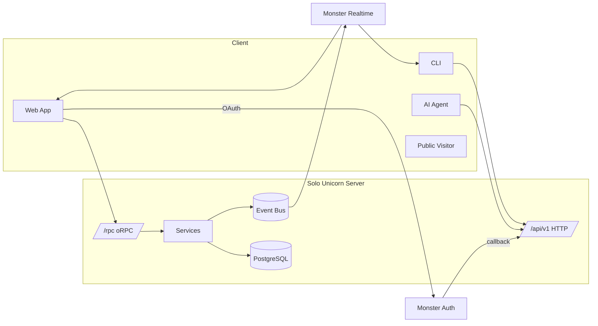

# System Interface Design

## High-Level System Overview
Solo Unicorn server (Bun + Hono) serves:
- `/rpc` — internal oRPC for web (cookie auth, breakable)
- `/api/v1` — versioned HTTP for CLI, MCP, third parties
- Monster Realtime — push-only channels for missions, workstations, notifications, Chore
- OAuth callbacks with Monster Auth

Design goals: human-friendly errors, traceable `request_id`, idempotent mutations, and transparency in automation.

### Architecture Diagram


### Versioning & Compatibility
- `/rpc` ships with web; breaking changes acceptable.
- `/api/v1` stable; additive changes preferred; breaking changes → `/api/v2`.
- MCP tools map to `/api/v1` namespaces (e.g., `mission.v1.list`).
- Deprecation via `Sunset`/`Deprecation` headers with ≥90-day notice.
- `GET /api/v1/meta/status` provides server version, min CLI version, feature flags.

### Authentication & Context
- `/rpc`: cookie auth + CSRF token in headers.
- `/api/v1`: `Authorization: Bearer <pat|org_key>`.
- Responses include `context` block (organizationId, projectId, workstationId) when relevant.
- Idempotency: clients send `Idempotency-Key` header for POST/PATCH; server stores 24h dedupe window.

## Transport Patterns
- Web uses `/rpc` with TanStack Query.
- CLI/MCP use `/api/v1` JSON with cursor pagination (`cursor`, `limit`).
- Monster Realtime channels:
  - `workstation:{id}` — presence, mission assignment, tunnel updates
  - `mission:{id}` — mission timeline, review events
  - `user:{id}:notifications` — notification inbox updates
  - `project:{id}:chore` — chore status and runs

## Endpoint Catalog

### Auth & Meta
- **GET /api/oauth/callback** — set cookies from Monster Auth and redirect.
- **POST /api/v1/auth/pat** — exchange org key/PAT for token.
- **DELETE /api/v1/auth/pat** — revoke current token.
- **GET /api/v1/meta/status** — version info, feature flags, min CLI version.
- **GET /api/v1/meta/features** — enabled features, limits, guardrails.

### Organizations & Projects
- **GET /api/v1/organizations/{organizationId}** — org summary.
- **GET /api/v1/organizations/{organizationId}/projects** — paginated list.
- **POST /api/v1/projects** — create project.
- **GET /api/v1/projects/{projectId}** — workspace summary, defaults, chore status.
- **PATCH /api/v1/projects/{projectId}** — update defaults, privacy, featured flags.
- **POST /api/v1/projects/{projectId}/members** — invite/update member.
- **DELETE /api/v1/projects/{projectId}/members/{memberId}** — remove member.
- **GET /api/v1/projects/{projectId}/metrics** — mission throughput, review SLA, chore stats.

### Workstations
- **POST /api/v1/workstations** — register/reregister workstation.
- **GET /api/v1/workstations/{workstationId}** — workstation profile, agents, sessions.
- **PATCH /api/v1/workstations/{workstationId}** — pause/resume, labels, concurrency.
- **POST /api/v1/workstations/{workstationId}/sessions** — start/stop daemon session.
- **POST /api/v1/workstations/{workstationId}/diagnostics** — upload diagnostics snapshot.
- **POST /api/v1/workstations/{workstationId}/tunnels** — manage tunnel tokens.
- **POST /api/v1/workstations/{workstationId}/worktrees/sync** — sync worktree metadata.

### Repositories
- **POST /api/v1/projects/{projectId}/repositories** — link GitHub repo.
- **GET /api/v1/projects/{projectId}/repositories** — list repositories w/ status.
- **DELETE /api/v1/project-repositories/{repositoryId}** — unlink repository.

### Missions
- **POST /api/v1/projects/{projectId}/missions** — create mission (manual or chore accept).
- **GET /api/v1/projects/{projectId}/missions** — list missions (`list`, `actor`, `ready`, `origin` filters). Response includes `choreTemplates[]` metadata when the Todo column needs to render the Chore panel.
- **GET /api/v1/missions/{missionId}** — detail (timeline, docs, PR info).
- **PATCH /api/v1/missions/{missionId}** — update stage, ready, actor, description.
- **POST /api/v1/missions/{missionId}/ready** — toggle ready state with validation.
- **POST /api/v1/missions/{missionId}/review** — submit review decision.
- **POST /api/v1/missions/{missionId}/handoff** — reassign to workstation.
- **POST /api/v1/missions/{missionId}/documents/sync** — update doc metadata.
- **POST /api/v1/missions/{missionId}/pull-request** — sync PR metadata.
- **GET /api/v1/missions/{missionId}/events** — timeline pagination.

### Chore Service
- **GET /api/v1/projects/{projectId}/chores/config** — fetch configuration (thresholds, cadence, rotation defaults).
- **PATCH /api/v1/projects/{projectId}/chores/config** — update configuration.
- **GET /api/v1/projects/{projectId}/chores/templates** — list templates (drives Todo Chore panel and Chore modals).
- **POST /api/v1/projects/{projectId}/chores/templates** — create template.
- **PATCH /api/v1/chores/templates/{templateId}** — update/enable/disable template.
- **DELETE /api/v1/chores/templates/{templateId}** — delete template.
- **POST /api/v1/projects/{projectId}/chores/run** — trigger manual run; response includes run id and generated items with rotation metadata.
- **GET /api/v1/projects/{projectId}/chores/runs** — list recent runs.
- **POST /api/v1/chores/runs/{runId}/accept** — accept proposed missions (optionally subset, respecting rotation timers).
- **POST /api/v1/chores/runs/{runId}/discard** — discard missions with optional feedback.

### Notifications
- **GET /api/v1/notifications** — list notifications grouped by project/type.
- **POST /api/v1/notifications/{notificationId}/read** — mark read.
- **POST /api/v1/notifications/{notificationId}/snooze** — set snooze window.
- **GET /api/v1/notifications/preferences** — fetch quiet hours, digest settings.
- **PATCH /api/v1/notifications/preferences** — update preferences.

### Access Requests
- **POST /api/v1/public/projects/{slug}/access-requests** — submit request.
- **GET /api/v1/projects/{projectId}/access-requests** — list requests.
- **POST /api/v1/access-requests/{requestId}/decision** — approve/decline.

### Search & Command
- **GET /api/v1/search** — global search (missions, projects, docs, chore templates) with `scopes[]` filter.
- **POST /api/v1/commands/execute** — run server-side command (open mission, pause workstation, run chore) with idempotency.

### Observability & Audit
- **GET /api/v1/projects/{projectId}/timeline** — combined activity feed.
- **GET /api/v1/audit-events** — audit log.

### Public Discovery
- **GET /api/v1/public/projects** — featured/trending list.
- **GET /api/v1/public/projects/search** — search.
- **GET /api/v1/public/projects/{slug}** — public detail.
- **GET /api/v1/public/projects/{slug}/missions** — permission-aware missions.
- **GET /api/v1/public/categories** — category counts.
- **GET /api/v1/public/system-schema** — schema snapshot.

## Error Model
Standard response:
```json
{
  "error": {
    "code": "CHORE_GUARDRAIL",
    "message": "Weekly mission cap reached. Increase cap or wait until Monday.",
    "details": { "cap": 20, "resetsAt": "2025-02-03T00:00:00Z" },
    "trace_id": "req_8JA3"
  }
}
```

### Error Catalog (selected)
- `AUTH_INVALID_TOKEN`
- `CONTEXT_PROJECT_REQUIRED`
- `MISSION_BLOCKED_DEPENDENCY`
- `MISSION_ALREADY_ASSIGNED`
- `CHORE_DISABLED`
- `CHORE_GUARDRAIL`
- `CHORE_NOTHING_GENERATED`
- `WORKSTATION_OFFLINE`
- `ACCESS_REQUIRES_REVIEW`
- `NOTIFICATION_ALREADY_READ`
- `RATE_LIMITED`

## Events

### Workstation Events (`workstation:{id}`)
- `presence.update`: `{ status, agents, concurrency, devServer, daemonUptime, issues[] }`
- `mission.assign`: `{ missionId, repositoryId, branch, actorId, flowId, mode, idempotencyKey }`
- `tunnel.updated`: `{ tunnelId, status, url?, expiresAt }`

### Mission Events (`mission:{id}`)
- `mission.updated`: state diff with `updatedBy`.
- `mission.review.requested`: `{ reviewerIds, prUrl?, checklist }`.
- `mission.review.decision`: `{ decision, feedback, decidedBy }`.
- `mission.event.appended`: timeline entry, including chore acceptance note.

### Chore Events (`project:{id}:chore`)
- `chore.status`: `{ status, backlog, threshold, nextCheckAt, minimumWaitMinutes }`
- `chore.generated`: `{ runId, generated, templatesUsed[], backlogBefore, rotationWeights }` (UI refreshes Todo Chore panel with latest template usage and next-eligible timers)
- `chore.accepted`: `{ runId, missionIds[], acceptedCount }`
- `chore.discarded`: `{ runId, missionIds[], feedback? }`

### Notification Events (`user:{id}:notifications`)
- `notification.created`: new notification summary.
- `notification.snoozed`: quiet window update.

## Performance Targets
- `/api/v1/search` median 200ms (p95 500ms).
- Mission list median 120ms (filter indexes).
- Chore run creation <250ms for 10 proposals including rotation scoring.
- Notification unread count fetch <50ms via materialized view.

## Security
- Access control enforced before hitting services (org membership, project roles).
- Rate limits: 100/hour/IP (anon), 1000/hour (auth), 5000/hour (contributors+).
- CORS allowlist per environment; public endpoints cached with `Vary: Authorization`.
- Input validation via zod; sanitized responses.
- Audit log entries for chore runs, template edits, configuration changes.

## Observability
- Structured logs include `request_id`, `user_id`, `organization_id`, `project_id`.
- Chore runs generate metrics (`chore.generated`, `chore.accepted`, `chore.discarded`, `chore.wait_time_avg`).
- Tracing spans: mission create → assign → review; chore run → accept/discard.
- CLI surfaces `trace_id` when `--debug`.

## Deprecation Workflow
1. Mark endpoint with `Deprecation` header; link documentation.
2. Capture usage metrics.
3. Notify CLI (update message) and Chore service via feature flags.
4. Remove after usage <1% for ≥90 days with alternative stable.
