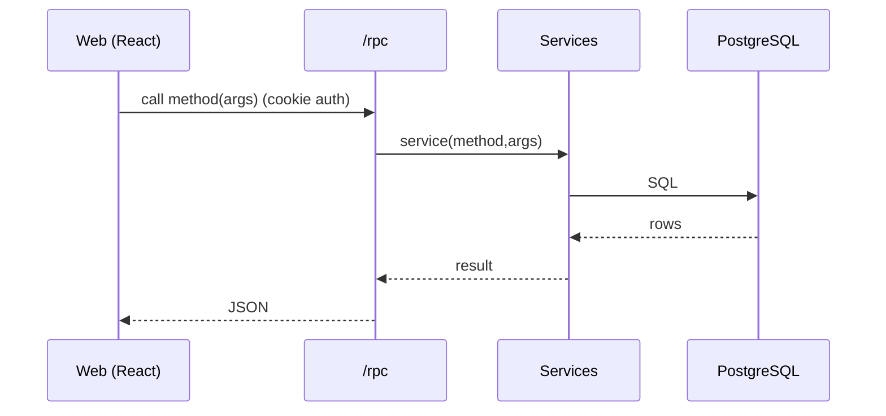
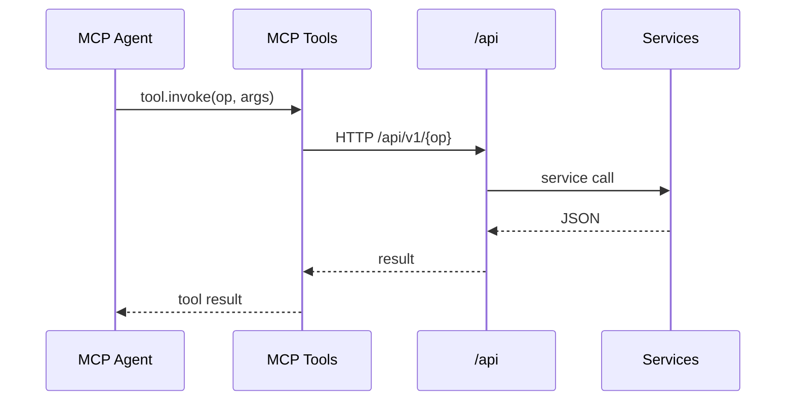

# System Interface Design

## High-Level System Overview

### Architecture Context
Consumers: Web app (/rpc), CLI and AI agents (/api via MCP), public users (public /api), Monster Auth (OAuth callback), Monster Realtime (push). Producers: Server services expose oRPC (/rpc) and versioned HTTP APIs (/api). WebSocket is strictly push-only.

### Boundaries
- Trust: /rpc for first-party web only (cookie auth, breakable); /api versioned and backward-compatible; MCP tools map to /api and are versioned (mission.v1.*)
- Deployment: Co-hosted Hono server (Bun) with MCP tools; PostgreSQL DB; Monster Realtime external service
- Security: Auth via Monster Auth tokens; PAT/org keys via Authorization header; CORS allowlist; CSRF for cookie APIs
- OpenAPI: /api uses oRPC API-format and emits OpenAPI (Swagger)
 - Repository identification: canonical GitHub numeric repo ID; future providers may use `provider:id` (e.g., `github:123`); MVP supports GitHub only

### Architecture Diagram
```mermaid
graph LR
  subgraph Client
    Web[Web App]
    CLI[CLI]
    Agent[AI Agents (MCP)]
  end

  subgraph Server["Solo Unicorn Server"]
    RPC[/ /rpc oRPC /]
    API[/ /api HTTP /]
    MCP[MCP Tools]
    Svc[Services]
    DB[(PostgreSQL)]
  end

  MR[Monster Realtime]
  MA[Monster Auth]
  GH[GitHub]

  Web --> RPC
  RPC --> Svc
  Svc --> DB

  Agent -- HTTP --> MCP
  MCP --> API
  API --> Svc

  CLI --> API

  Svc -- push --> MR
  MR -- presence/events --> Web
  MR -- assignments --> CLI

  Web -- OAuth --> MA
  MA -- callback --> API

  Agent -- "gh CLI" --> GH
```

## Transport Flows

### Web → /rpc
Pattern: HTTP
Path/Channel(s): POST /rpc/{method}
Notes: Internal only; typed; TanStack Query cache keys map to RPC methods

Flow Diagram:


### MCP Agent → MCP Tools → /api
Pattern: HTTP
Path/Channel(s): /api/v1/{resource}
Notes: Tools are versioned (mission.v1.*) and map 1:1 to /api

Flow Diagram:


### CLI/3P → /api and Realtime push
Pattern: HTTP + WS push
Path/Channel(s): /api/v1/*; WS channels workstation:{id}, project:{id}:workstations, mission:{id}
Notes: PAT/org key auth; push-only WS

## Endpoints (MVP)

### INT-AUTH-001 - OAuth Callback
- Purpose: Complete Monster Auth flow and set cookies
- Kind: HTTP
- Identifier/Path: GET /api/oauth/callback
- Input Fields: { code, state }
- Output Fields: redirect
- Notes: Sets httpOnly cookies for /rpc

### INT-WS-001 - Register Workstation
- Purpose: Register/re-register workstation
- Kind: HTTP
- Identifier/Path: POST /api/v1/workstations/register
- Input Fields: { name, os, arch, hostname, cliVersion }
- Output Fields: { workstationId }
- Notes: Idempotent; safe to run repeatedly

### INT-MISS-001 - List Missions
- Purpose: List missions by project
- Kind: HTTP
- Identifier/Path: GET /api/v1/projects/{projectId}/missions
- Input Fields: { filter? }
- Output Fields: Mission[] (id, title, list, stage, priority, pr info)

### INT-MISS-002 - Get Mission
- Purpose: Fetch mission details
- Kind: HTTP
- Identifier/Path: GET /api/v1/missions/{id}
- Output Fields: Mission

### INT-MISS-003 - Update Mission
- Purpose: Update mission fields
- Kind: HTTP
- Identifier/Path: PATCH /api/v1/missions/{id}
- Input Fields: { clarification?, solution?, priority?, list?, stage?, flowId?, tasks?, currentTask?, repositoryId?, prMode? }
- Output Fields: Mission

### INT-PUB-001 - Public Projects (discovery)
- Purpose: Browse/search public projects
- Kind: HTTP
- Identifier/Path: GET /api/v1/public/projects, /api/v1/public/projects/search
- Input Fields: { q?, filters? }
- Output Fields: { projects, pagination }

### INT-PUB-002 - Public Project Details
- Purpose: Get public project info
- Kind: HTTP
- Identifier/Path: GET /api/v1/public/projects/{slug}
- Output Fields: { project, missions? }

### INT-PUB-003 - Public Categories
- Purpose: List categories and counts
- Kind: HTTP
- Identifier/Path: GET /api/v1/public/categories
- Output Fields: { categories: Array<{ id, name, count }> }

### INT-PUB-004 - Public Featured Projects
- Purpose: Get featured projects
- Kind: HTTP
- Identifier/Path: GET /api/v1/public/featured
- Output Fields: { projects }

### INT-PUB-005 - Public Project Missions
- Purpose: List public missions for a project (permission-aware)
- Kind: HTTP
- Identifier/Path: GET /api/v1/public/projects/{slug}/missions
- Output Fields: Mission[] (filtered by public settings)

### INT-SYS-001 - System Schema
- Purpose: Machine-readable schema for system (API key auth)
- Kind: HTTP
- Identifier/Path: GET /api/v1/public/system-schema
- Output Fields: { version, resources }

## Error Model

- HTTP APIs: status code + `{ error: { code: string, message: string, details?: Object } }`
- MCP tools: `{ error: { code: string, message: string, details?: Object } }`

## Events

### EVT-WS-001 - presence.update
- Channel/Topic: workstation:{workstation_id}
- Producers: CLI (workstation)
- Consumers: Web, Server services
- Payload Fields: { status, availableCodeAgents[], activeProjects[], devServerPort?, currentMissionCount, maxConcurrency }
- Notes: Used for assignment and status indicators

### EVT-WS-002 - mission.assign
- Channel/Topic: workstation:{workstation_id}
- Producers: Server services
- Consumers: CLI (workstation)
- Payload Fields: { missionId, repositoryId, branch, actor, flow, prMode }
- Notes: CLI auto-prepares worktree and starts agent
