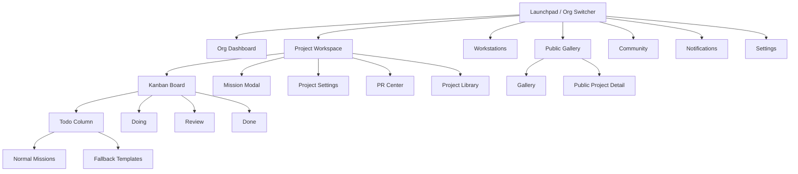
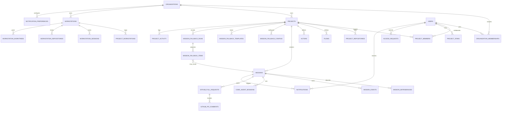
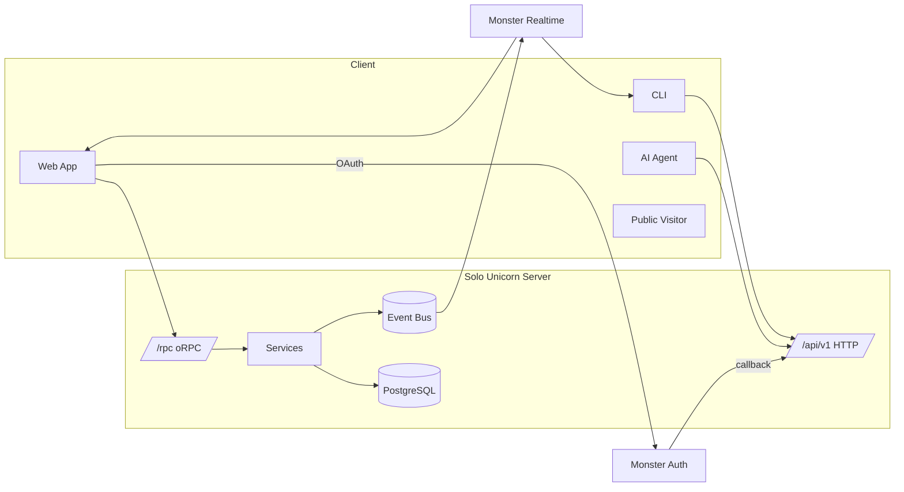

<!-- Generated by agents-md: DO NOT EDIT DIRECTLY. Edit *.agents.md fragments instead. Higher priority fragments appear first and win conflicts. -->

<!-- source: .ai/rules/shared/rules/communication.mdc priority=0 -->
---
description: Communication style
globs:
alwaysApply: true
---
# Communication Style

- Be direct and actionable in suggestions
- Explain the "why" behind recommendations
- Act as a knowledgeable owner, not just an assistant
- Keep explanations concise but thorough
<!-- /source: .ai/rules/shared/rules/communication.mdc -->

<!-- source: .ai/rules/shared/rules/documentation-rules.mdc priority=0 -->
---
description: Documentation rules
globs: *.mission.md
alwaysApply: false
---
# Documentation Rules

- Update documentations before Git commit.
- Create diagrams with MermaidJS syntax.
<!-- /source: .ai/rules/shared/rules/documentation-rules.mdc -->

<!-- source: .ai/rules/shared/rules/js-rules.mdc priority=0 -->
---
description: JavaScript & TypeScript rules
globs:
alwaysApply: true
---
# JavaScript & TypeScript Rules

## Core

- Write typed, functional code without mutations or side effects when possible
- Prefer functions over classes; but avoid complex FP patterns like monads
- Create self-explanatory code with descriptive variable names (isLoading, hasError)
- Follow YAGNI (You Aren't Gonna Need It) to prevent speculatives
- Proactively address potential UX issues

## Functional Style

- Prefer `map`/`reduce` over loops
- Use ternary expressions over if/else when appropriate
- Use ts-pattern `match` over variable mutation
- Favor composition over duplication
- Avoid mutations and for loops

## Code Organization

- **Code Style**: Follow existing patterns in the codebase. Otherwise, as declarative as possible.
- **Documentation**: Update relevant documentation when making significant changes.
- **Security**: Never commit sensitive data or credentials
- **Files**: ~300 lines maximum
- **Action**: Proactively suggest refactoring when approaching these limits
- **Prefer native solutions** over third-party libraries when possible. Only suggest external dependencies if they provide significant value
- Place exported (public) functions and constants at the top of files
- Structure exported functions to orchestrate small, private helper functions:
  - Each private function handles one clear step
  - Exported functions represent the high-level flow
- Prefer named exports over default exports
- Import from source files directly (avoid index re-exports) for better tree-shakability
- Write comments only to explain logic, assumptions, edge cases, and trade-offs; never include progress/meta notes (e.g., "updated this", "now changed", "this is new code").

## Naming & Style

- Indent with 2 spaces
- Use single quotes
- Omit line-ending semicolons in JavaScript/TypeScript
- Declare functions with `function name()` instead of `const name = () =>`
- Add jsdoc header comments to big exported functions to explain what, how and why.

## TypeScript Specifics

- Use interfaces over types
- Use string unions instead of enums
- Type annotations: prefer `Array<T>` over `T[]`

## Avoiding Indirections

- "Rule of Three" - only abstract after seeing at least three concrete implementations
- Consolidate related functionality into cohesive modules
- Use composition over inheritance
- Eliminate abstractions that don't provide clear benefits
- Ensure newcomers can understand the system without learning numerous abstraction concepts
<!-- /source: .ai/rules/shared/rules/js-rules.mdc -->

<!-- source: .ai/rules/shared/rules/mission-rules.mdc priority=0 -->
---
description: Basic guidline for all AI missions
globs: *.mission.md
alwaysApply: false
---
# AI Mission Guidelines

## Overview

AI Mission is a core component in this agentic workflow framework, analogous to sprints in Agile methodologies but without size constraints. Each mission focuses on a single work unit, allowing for horizontal slicing of complex tasks.

## Mission Structure

- Mission files use the `.mission.md` extension
- Each mission should focus on a single element or functional unit
- Missions are horizontally sliced for focus. Ignore time/effort estimates and constraints.
- Each mission contains multiple tasks, with each task representing one story point

### Example Mission Slicing

1-jbhifi-search-planning
2-jbhifi-search-fetch-search-hits
3-jbhifi-search-transform-to-items
4-jbhifi-search-scoring
5-jbhifi-search-save-to-db

### Task Format

Tasks are recorded and updated in mission file.

Example:

```md
## Tasks

- [x] Task 1: [title] 
  - Description: [description]
  - Log: [to-be-summarised]
- [ ] Task 2: [title]
  - Description: [description]
  - Acceptance Criteria: [acceptance criteria]
  - Outcome: [outcome]
  - Log: [to-be-summarised]
```

## AI Agent Responsibilities

### Task Management

- Tasks should be executed one by one
- Add, update, reorder, and cancel tasks as needed
- Mark cancelled tasks as complete with `[cancelled]` tag and explain the reason
- Prioritize tasks based on dependencies, importance, and complexity. Low-hanging fruits first.
- Keep tasks small, focused, and achievable in a single sitting
- Write tasks with clear, concise language and specific outcomes
- Include acceptance criteria when needed
- User may manually add tasks with the `[new]` tag
- AI agent may ask questions and raise challenge when pick up the `[new]` tasks
  
#### Task Completion

After working on each task, AI agent should:

1. Update mission file, tick task checkbox, i.e. change from `- [ ]` to `- [x]` to mark completion
2. Update the completed task's log
3. Update documentations in `/notes/` and maybe `/wiki/docs` but only when necessary according to Documentation Rules.

### Log

- Maintain a summarized log for each task including:
  - Work completed
  - Significant insights (assumptions, challenges, decisions, rationales, solutions, compromises, tech debt)
  - Only log key insights when significant, not when workflows are smooth or obvious

### Execution

- Execute all tasks until completion except when need to pause for user input like the first three tasks.
- When blocked:
  - Log the blocker/challenge, attempts, and rationales
  - Suggest potential workarounds and alternative approaches
  - Ask the user for help, offering options to:
    - Manually fix the blocker
    - Approve the workaround
    - Pivot to a different approach
    - Skip to the next task

### Mission Completion

When all tasks are completed and the user requests to "Conclude a mission", add a "Mission Review and Retrospective" section above the "Tasks" section that:

1. Summarizes work done, compromises, lessons learned, challenges, solutions, and tech debt
2. Suggests ideas for the next mission
3. Lists both workflow and implementation retrospective points (good, bad, questions, improvement ideas)

## Kickoff

- Always start a mission with the kickoff steps. 
- Create Kickoff files at `[path-of-current-mission]/kickoffs/<mission-number>-<mission-name>.kickoff.md`.
- Pause and ask for user feedback in each kickoff step. 
- DO NOT jump to the next kickoff step until user provided feedback and prompt to continue. 
- Like tasks, tick checkbox to mark kickoff step complete after each step.

Kickoff steps:

- [ ] Step 1: "Clarify the Mission Goal"
   1. List questions in the Kickoff file to clarify the mission (context, scope, constraints, priorities)
   2. Pause and ask user to answer the questions
   3. User will provide feedback and then prompt to continue. 
   4. Update mission goal in mission file based on feedback

- [ ] Step 2: "Are we doing the right thing?"
   1. Consider blind spots in business and technical aspects. Challenge the mission goal. List them in the Kickoff file.
   2. Pause and ask user to confirm and provide feedback
   3. User will provide feedback and then prompt to continue. 
   4. Update mission goal in mission file based on feedback

- [ ] Step 3: "List and rank solution options"
   1. List and rank potential solutions in Kickoff file
   2. Pause and ask user to select an option
   3. User will provide feedback and then prompt to continue. 
   4. Update mission goal in mission file
   4. Draft tasks based on feedback

- [ ] Step 4: "Specification"
   1. List behaviour specifications of happy path, unhappy path, edge cases in Kickoff file
   2. Pause and ask user to confirm and provide feedback
   3. User will provide feedback and then prompt to continue. 
   4. Update mission goal in mission file
   5. Update tasks based on feedback

## Version Control

- start the mission with checking and setting git branch to: `mission-<mission-number>-<mission-name>`
<!-- /source: .ai/rules/shared/rules/mission-rules.mdc -->

<!-- source: .ai/rules/shared/rules/principles.mdc priority=0 -->
---
description: Core principles
globs:
alwaysApply: true
---
# Principles

Value end-user UX over everything including tech difficulty, complexity, and performance.

1. **UX obsessed**
   - Minimum friction: least clicks required on common operations
   - Maximum magic:
     - Smart pro-active UX design. Provide before user starts thinking. E.g. prefill dropdown if there is only one option.
     - Battery included - default best config. Optimal defaults out-of-the-box, minimal user configuration required.
   - Reactive UXUI: implement real-time feeling UI. Patterns include but not limited to
     - optimistic updates
     - invalidating all queries after user updates
     - WebSocket push to client after system updates

2. Tech wise:
   - **Think Small**: Ignore performance, cost, and scalability. Day-0 mindset with extreme simplicity. However, security is still important.
   - **Idempotency**: All operations safe to retry with proper deduplication.
   - **Auth**: Every non-public endpoint/operation must pass through authn and authz.
   - At planning, always start with thinking reusing and building reusable modules to improve system consitencies.
<!-- /source: .ai/rules/shared/rules/principles.mdc -->

<!-- source: .ai/rules/shared/rules/shadcn.mdc priority=0 -->
---
description: shadcn/ui
globs:
alwaysApply: true
---

# shadcn/ui rules

- Apply shadcn components wherever applicable; do not handcraft equivalents!
- As shadcn get super frequent updates, for any shadcn-related planning or anytime in doubt, use the shadcn MCP tools.
- At planning, always start with thinking reusing and building reusable modules to improve UI consitencies.

## Implementation

- First call the shadcn mcp tool to see correct usage.
- Install components via MCP; do not write files manually.
- Then implement using the demonstrated pattern.

## shadcn.io complex Components

- Kanban board: https://www.shadcn.io/components/data/kanban.mdx
- AI Chat: https://www.shadcn.io/ai
- Data List: https://www.shadcn.io/components/data/list
- Data Table: https://www.shadcn.io/components/data/table
- Menu Dock: https://www.shadcn.io/components/dock/menu-dock
- Message Dock: https://www.shadcn.io/components/dock/message-dock
- Combobox: https://www.shadcn.io/components/forms/combobox
- Editor: https://www.shadcn.io/components/forms/editor
- Minimal Tiptap: https://www.shadcn.io/components/forms/minimal-tiptap
- Status: https://www.shadcn.io/components/visualization/status
<!-- /source: .ai/rules/shared/rules/shadcn.mdc -->

<!-- source: .solo/designs/10-features.md priority=0 -->
# Features Design

## Problems
- AI missions feel opaque and hard to monitor
- Workstation setup requires confusing manual steps
- Reviews stall missions without timely nudges
- Public collaborators lack clarity on permissions
- Mission backlog dries up when Todo empties, wasting AI capacity

## Overview

### Vision
Deliver a mission-first development companion where humans feel in control, AI agents stay transparent, and collaboration across web, CLI, and public surfaces feels consistent and friendly from day one.

### Product Goals
- Make mission progress legible with live context and actionable nudges
- Keep workstation setup under five minutes with guided guardrails
- Support flexible change management (YOLO or PR) without configuration fatigue
- Enable secure public discovery with clear permission messaging and low-friction access requests
- Maintain a healthy mission backlog using the Mission Fallback so AI capacity is always productive

## Features

### FEAT-001 - Authentication & Authorization
- **ID:** FEAT-001
- **Name:** Authentication & Authorization
- **Status:** Draft (MVP)

#### Intent
Authenticate through Monster Auth and authorize by org/project roles so every surface knows who the user is and what they can do.

#### Goals
- Support Google OAuth and password flows via Monster Auth
- Provide PAT/org keys for CLI and MCP usage
- Keep cookie-based /rpc sessions with CSRF protection
- Expose role-based context to UI and CLI responses

#### Non-Goals
- Support non-Monster Auth providers in MVP
- Manage passwords or MFA locally

#### Solution
Monster Auth handles identity; server issues HTTP-only cookies for web and scoped PAT/org keys for CLI/MCP. A context resolver injects org/project roles into every request, and UI surfaces assumed context clearly.

#### User Flow Links
- [UF-LAUNCH-001](./20-gui/web.md#uf-launch-001---organization-launchpad)

#### Transport Flow Links
- HTTP: GET /api/oauth/callback
- HTTP: POST /api/v1/auth/pat

#### Risks & Mitigations
- Token leak → PAT stored in OS keychain with scoped expiry and revoke endpoint

---

### FEAT-002 - Workstation Management
- **ID:** FEAT-002
- **Name:** Workstation Management
- **Status:** Draft (MVP)

#### Intent
Let humans register, monitor, and pause workstations quickly so agents run where expected.

#### Goals
- Guided workstation onboarding wizard with real-time status
- Daemon supervision with diagnostics and pause/resume controls
- Cross-platform auto-start helpers (launchd, systemd, Task Scheduler)
- Workstation health widgets on Launchpad + CLI parity

#### Non-Goals
- Remote desktop or shell access

#### Solution
Web wizard pairs with CLI register command; realtime updates drive checklist completion. Workstation console and CLI status share the same `/api/v1/workstations/*` endpoints.

#### User Flow Links
- [UF-WORKSTATION-ONBOARD-001](./20-gui/web.md#uf-workstation-onboard-001---workstation-onboarding)

#### Transport Flow Links
- HTTP: POST /api/v1/workstations
- HTTP: POST /api/v1/workstations/{id}/sessions
- WS: workstation:{id}

#### Risks & Mitigations
- Daemon crash → watchdog restarts plus `doctor` command bundling logs

---

### FEAT-003 - Code Agent Orchestration
- **ID:** FEAT-003
- **Name:** Code Agent Orchestration
- **Status:** Draft (MVP)

#### Intent
Discover local agents, track health, and respect concurrency so missions land on capable machines.

#### Goals
- CLI agent scan/add/check commands with friendly prompts
- Presence payload includes agent type, version, capacity
- Mission assignment considers agent load and repo compatibility

#### Non-Goals
- Persist agent configuration server-side

#### Solution
Agents remain in `code-agents.json`; workstation presence publishes metadata consumed by assignment service, Mission Room, and CLI status.

#### Transport Flow Links
- WS: workstation:{id} presence payload
- HTTP: PATCH /api/v1/workstations/{id}

---

### FEAT-004 - Repositories & Worktrees
- **ID:** FEAT-004
- **Name:** Repositories & Worktrees
- **Status:** Draft (MVP)

#### Intent
Keep git operations predictable with managed clones and worktree pools per mission.

#### Goals
- Repository linking via GitHub ID with validation
- Auto-create worktrees on mission accept; reuse when idle
- CLI clean-up with preview; server visibility of worktree state

#### Non-Goals
- Supporting non-git VCS in MVP

#### Solution
CLI manages clones/worktrees; server stores repo metadata and receives worktree telemetry for dashboards and conflicts prevention.

#### Transport Flow Links
- HTTP: POST /api/v1/projects/{projectId}/repositories
- HTTP: POST /api/v1/workstations/{id}/worktrees/sync

---

### FEAT-005 - Missions & Flows
- **ID:** FEAT-005
- **Name:** Missions & Flows
- **Status:** Draft (MVP)

#### Intent
Create missions with flow-first configuration, provide live mission rooms, and keep agents aligned with human intent.

#### Goals
- Flow templates with stage toggles and review flags
- Mission Room with live transcript, diff preview, and Ready guardrails
- Dependencies and priority management without "Loop" list (all missions complete in Done)

#### Non-Goals
- Dragging tasks between missions in MVP

#### Solution
Mission creation modal highlights flow preview and prerequisites. Mission Room unifies status, transcripts, flow editing, and PR view. Board lists remain Todo → Doing → Review → Done for simple mental model.

#### User Flow Links
- [UF-MISSION-CREATE-001](./20-gui/web.md#uf-mission-create-001---mission-creation)
- [UF-MISSION-EXECUTE-001](./20-gui/web.md#uf-mission-execute-001---mission-execution)

#### Transport Flow Links
- HTTP: POST /api/v1/projects/{projectId}/missions
- HTTP: PATCH /api/v1/missions/{id}
- Event: mission.updated

---

### FEAT-006 - Change Management (PR & YOLO)
- **ID:** FEAT-006
- **Name:** Change Management (PR/YOLO)
- **Status:** Draft (MVP)

#### Intent
Let teams choose YOLO or PR mode per mission with effortless review handling.

#### Goals
- Per-project default change policy with per-mission override
- Auto-branching, PR creation, and status syncing
- Inline diff preview even for YOLO missions

#### Non-Goals
- Hosting PR comments natively in MVP

#### Solution
When review required, mission entering Review triggers PR creation via GitHub. UI surfaces PR state, comments digest, and approval controls; YOLO missions get diff summary + confirm commit CTA.

#### User Flow Links
- [UF-MISSION-REVIEW-001](./20-gui/web.md#uf-mission-review-001---mission-review--iteration)

#### Transport Flow Links
- HTTP: POST /api/v1/missions/{id}/pull-request
- HTTP: POST /api/v1/missions/{id}/review
- Event: mission.review.requested

---

### FEAT-007 - Realtime Presence & Push
- **ID:** FEAT-007
- **Name:** Realtime Presence & Push
- **Status:** Draft (MVP)

#### Intent
Keep UI and CLI live with push-only updates while falling back gracefully when offline.

#### Goals
- Presence updates for workstations, missions, notifications
- Assignment events with idempotent payloads
- Offline fallback with 15s polling and stale markers

#### Solution
Monster Realtime handles push events; watchers degrade to HTTP polls when disconnected while surfacing offline badges in UI.

#### Transport Flow Links
- WS: workstation:{id}
- Event: mission.assign
- Event: notification.created

---

### FEAT-008 - Projects & Organizations
- **ID:** FEAT-008
- **Name:** Projects & Organizations
- **Status:** Draft (MVP)

#### Intent
Structure work by org and project with defaults for flows, actors, repositories, and team roles.

#### Goals
- Org Launchpad with health snapshot and quick actions
- Project workspace with board, mission room, workstations, library, PR center
- Project defaults for flow/actor/PR policy and workstation priority

#### Non-Goals
- Cross-org shared projects in MVP

#### Solution
Launchpad surfaces org summary, recents, and alerts. Projects expose tabbed workspace. Settings manage defaults and invites with guardrails.

#### User Flow Links
- [UF-LAUNCH-001](./20-gui/web.md#uf-launch-001---organization-launchpad)
- [UF-ACCESS-REQUEST-001](./20-gui/web.md#uf-access-request-001---access-request--approval)

#### Transport Flow Links
- HTTP: GET /api/v1/organizations/{id}
- HTTP: POST /api/v1/projects

---

### FEAT-009 - Configuration Management
- **ID:** FEAT-009
- **Name:** Configuration Management
- **Status:** Draft (MVP)

#### Intent
Keep configuration typed, discoverable, and safe across CLI and server.

#### Goals
- `apps/*/env.ts` typed access; no direct `process.env`
- CLI config editing with validation and backup
- Config diff hints when CLI/server versions mismatch

#### Solution
Config service validates schema on load, surfaces context in CLI and Mission Room. Version negotiation endpoint shares supported ranges.

#### Transport Flow Links
- HTTP: GET /api/v1/meta/features

---

### FEAT-010 - Flow Reviews
- **ID:** FEAT-010
- **Name:** Flow Reviews
- **Status:** Draft (MVP)

#### Intent
Deliver review queue with approve/reject workflows, shortcuts, and rationale capture.

#### Goals
- Review column with keyboard shortcuts
- Review history metadata with who/when/feedback
- Quick assign reviewer plus optional auto-assign policies

#### Solution
Mission Room review tab surfaces diffs, comment digest, and required checklist before approval.

#### User Flow Links
- [UF-MISSION-REVIEW-001](./20-gui/web.md#uf-mission-review-001---mission-review--iteration)

#### Transport Flow Links
- HTTP: POST /api/v1/missions/{id}/review
- Event: mission.review.decision

---

### FEAT-011 - Solution & Tasks Docs
- **ID:** FEAT-011
- **Name:** Solution & Tasks Docs
- **Status:** Draft (MVP)

#### Intent
Persist mission reasoning and task lists on filesystem with DB sync so humans and agents share context.

#### Goals
- `solution.md` + `tasks/{n}.md` stored per mission
- DB fields track progress, sync status, and last editor
- CLI and GUI open docs with correct path hints

#### Solution
FS watcher records updates, CLI surfaces path in mission show, Mission Room preview renders Markdown.

#### Transport Flow Links
- HTTP: POST /api/v1/missions/{id}/documents/sync

---

### FEAT-012 - Public Projects & ACL
- **ID:** FEAT-012
- **Name:** Public Projects & ACL
- **Status:** Draft (MVP)

#### Intent
Expose public projects safely, clarify what visitors can see, and respect workstation privacy.

#### Goals
- Permission-aware sections (missions, docs, repositories, workstations)
- Public slug + SEO-friendly metadata
- Workstation visibility levels (hidden, status only, full)

#### Solution
Public project detail uses access matrix to toggle sections. Access requests tie into notifications and approvals.

#### User Flow Links
- [UF-PUBLIC-001](./20-gui/web.md#uf-public-001---public-project-discovery)
- [UF-ACCESS-REQUEST-001](./20-gui/web.md#uf-access-request-001---access-request--approval)

#### Transport Flow Links
- HTTP: GET /api/v1/public/projects
- HTTP: GET /api/v1/public/projects/{slug}
- HTTP: POST /api/v1/public/projects/{slug}/access-requests

---

### FEAT-013 - Discovery & Community
- **ID:** FEAT-013
- **Name:** Discovery & Community
- **Status:** Draft (Beta)

#### Intent
Encourage exploration via gallery, categories, templates, stars, and highlight activity trends.

#### Goals
- Search, filters, categories, trending insights
- Template usage CTA with shareable link
- Activity feed summarizing stars, mission completions, contributors

#### Solution
Gallery page reads from discovery endpoints with caching; cards highlight permission state, achievements, and CTA buttons.

#### Transport Flow Links
- HTTP: GET /api/v1/public/projects/search
- HTTP: GET /api/v1/public/categories

---

### FEAT-014 - Public API & Security
- **ID:** FEAT-014
- **Name:** Public API & Security
- **Status:** Draft (MVP)

#### Intent
Provide stable versioned API for CLI, MCP, and third parties with guardrails and observability.

#### Goals
- `/api/v1` versioning with deprecation headers
- Rate limits by role (anon/auth/contributor)
- OpenAPI docs plus schema endpoint
- Structured error payloads with trace ids

#### Solution
Hono server exposes API format routes via oRPC; middleware handles auth, rate limits, logging, caching.

#### Transport Flow Links
- HTTP: GET /api/v1/public/system-schema
- HTTP: GET /api/v1/meta/status

---

### FEAT-015 - Dev Server & Public Tunneling
- **ID:** FEAT-015
- **Name:** Dev Server & Public Tunneling
- **Status:** Draft (MVP)

#### Intent
Let teams share local previews securely with minimal configuration.

#### Goals
- CLI dev-server start/stop/status commands
- Cloudflare Tunnel integration with TTL tokens
- UI surfaces public URL with expiration indicator

#### Solution
Daemon manages tunnel lifecycle; Mission Room surfaces preview link and revocation control.

#### Transport Flow Links
- HTTP: POST /api/v1/workstations/{id}/tunnels
- WS: workstation:{id} tunnel events

---

### FEAT-016 - Flow Templates & Prompts
- **ID:** FEAT-016
- **Name:** Flow Templates & Prompts
- **Status:** Draft (Beta)

#### Intent
Version flow templates and prompts to keep missions consistent while enabling customization.

#### Goals
- Versioned flow library (semantic versions)
- Prompt preview with quick edit and rollout plan
- Export/import templates for org sharing

#### Solution
Templates stored in DB with JSON schema; Mission creation references them, CLI can pull updates.

#### Transport Flow Links
- HTTP: GET /api/v1/projects/{projectId}/flows
- HTTP: POST /api/v1/projects/{projectId}/flows

---

### FEAT-017 - Unified Notifications
- **ID:** FEAT-017
- **Name:** Unified Notifications
- **Status:** Draft (Beta)

#### Intent
Consolidate mission, workstation, and community events across web and CLI with snooze controls.

#### Goals
- Real-time toasts + inbox with filters and quiet hours
- CLI notifications pull/watch commands
- Weekly digest email option

#### Solution
Notification service writes to DB, emits realtime event, and surfaces restful endpoints for inbox, read receipts, and preferences.

#### User Flow Links
- [UF-NOTIFY-001](./20-gui/web.md#uf-notify-001---notification-inbox)

#### Transport Flow Links
- HTTP: GET /api/v1/notifications
- HTTP: POST /api/v1/notifications/{id}/read
- Event: notification.created

---

### FEAT-018 - Global Search & Command
- **ID:** FEAT-018
- **Name:** Global Search & Command
- **Status:** Draft (Beta)

#### Intent
Give users a lightning-fast command palette to navigate and act without context switching.

#### Goals
- <200ms initial results with keyboard-first navigation
- Search across missions, projects, documentation, commands
- CLI parity via `mission`, `project`, `doc` open commands

#### Solution
Search service indexes DB tables and mission docs; command palette fetches suggestion bundles and executes actions via restful endpoints.

#### User Flow Links
- [UF-SEARCH-001](./20-gui/web.md#uf-search-001---global-search--command-palette)

#### Transport Flow Links
- HTTP: GET /api/v1/search?q=
- HTTP: POST /api/v1/commands/execute

---

### FEAT-019 - Observability & Auditing
- **ID:** FEAT-019
- **Name:** Observability & Auditing
- **Status:** Draft (Beta)

#### Intent
Surface mission health, workstation uptime, and audit trails that humans can trust.

#### Goals
- Launchpad and Project dashboards with SLA and uptime charts
- Mission timeline events stored with diff, actor, agent, reviewer
- Audit logs for sensitive actions with retention policy

#### Solution
Mission events table drives dashboards; analytics endpoints feed UI cards and CLI doctor command.

#### Transport Flow Links
- HTTP: GET /api/v1/projects/{projectId}/metrics
- HTTP: GET /api/v1/audit-events

---

### FEAT-020 - Access Requests & Approvals
- **ID:** FEAT-020
- **Name:** Access Requests & Approvals
- **Status:** Draft (MVP)

#### Intent
Allow visitors to request contributor roles and give maintainers a tidy approval workflow.

#### Goals
- Friendly request form with expectations and SLA estimate
- Maintainer approvals from inbox or CLI
- Timeline updates for requester with status changes

#### Solution
Public request form posts to access request service; maintainers act via notifications or CLI; mission timeline logs outcomes.

#### User Flow Links
- [UF-ACCESS-REQUEST-001](./20-gui/web.md#uf-access-request-001---access-request--approval)

#### Transport Flow Links
- HTTP: POST /api/v1/public/projects/{slug}/access-requests
- HTTP: POST /api/v1/access-requests/{id}/decision
- Event: access-request.updated

---

### FEAT-021 - Mission Fallback
- **ID:** FEAT-021
- **Name:** Mission Fallback
- **Status:** Draft (Beta)

#### Intent
Automatically generate ready-to-start missions when the Todo backlog is empty, and surface those templates inside the Todo "Fallback" area so agents stay productive without manual prep.

#### Goals
- Configurable triggers (Todo count, cadence, manual run)
- Template gallery defining intent, effort, flow, actor, repository
- Approval workflow to accept/discard generated missions
- Analytics on fallback output (accepted vs discarded, time saved)

#### Non-Goals
- Blindly auto-accepting missions without human opt-in (unless explicitly toggled)
- Generating missions without predefined templates in MVP

#### Solution
Mission Fallback service evaluates backlog thresholds and monthly budget. When conditions met, it creates mission proposals using templates and posts them to both the approval queue and the Todo Fallback area. Users can accept via web modal or CLI, or launch directly from the Fallback panel. Accepted missions land in Todo with `Fallback` badge while the template remains available for next time.

#### User Flow Links
- [Kanban Board Layout](./20-gui/web.md#kanban-board-layout)
- [Mission Modal (Popup)](./20-gui/web.md#mission-modal-popup)
- [Mission Creation Modal](./20-gui/web.md#mission-creation-modal)

#### Transport Flow Links
- HTTP: GET /api/v1/projects/{projectId}/mission-fallback/config
- HTTP: PATCH /api/v1/projects/{projectId}/mission-fallback/config
- HTTP: POST /api/v1/projects/{projectId}/mission-fallback/run
- Event: mission-fallback.generated

#### Risks & Mitigations
- Fallback templates spamming irrelevant missions → Template quality review + discard feedback loop
- Budget overspend → Guardrail fields (max missions/week, monthly hour targets) enforced server-side

---

## Design Notes
- Board columns now fixed to Todo, Doing, Review, Done. Loop missions removed; the Todo Fallback panel keeps reusable templates powered by Mission Fallback.
- Mission Fallback produces missions tagged with origin metadata for transparency and leaves templates visible in Fallback after execution.
- All mission creation surfaces are modals centered on screen (mobile sheets) for focus, matching the Mission Modal experience in the board design.
- Ready toggle component stays visually consistent on cards, modals, and mobile layouts.
- Notifications and CLI commands expose mission fallback activity for parity across interfaces.

## Acceptance Criteria
- Mission creation to mission completion remains traceable within Mission Room timeline without leaving the page.
- Workstation onboarding from CTA to healthy online state averages <5 minutes with checklist guidance.
- Mission Fallback keeps Todo backlog ≥ configured threshold 90% of active hours or surfaces actionable alerts when budget guardrails prevent generation; Fallback always offers templates when backlog is empty.
- Access requests receive response (auto or manual) within SLA surfaced to requester and maintainer.
- Notifications stay consistent across web and CLI, with unread counts matching and quiet hours respected.
- Global search results respond in <200ms median with zero dead links.
<!-- /source: .solo/designs/10-features.md -->

<!-- source: .solo/designs/20-gui/web.md priority=0 -->
# GUI design - web

## Design Principles
- Friendly-first copy and layout so users always know status and next step
- Mobile-first compositions that rely on shadcn/ui Kanban + DnD for touch interactions
- Monster Theme tokens for color, spacing, typography, and elevation
- Centered modals for primary flows; drawers avoided
- Consistent Ready toggle across cards, modals, and mobile UI

## Information Architecture

### Site Map / Screen Inventory


### Navigation
- **Top header:** Logo, project picker, dark/light toggle, user menu
- **Sub header:** Project name, PR mode indicator (🔄 / ⚡), active members, online workstations, Pause/Resume AI, Settings
- **Mobile:** Bottom tab bar mirrors top-level nav; horizontal scroll Kanban with shadcn/ui DnD gestures
- **Quick actions:** `+ Mission`, `Invite teammate`, `Edit project`

## Mission Board Pattern

### Kanban Board Layout
```
┌──────────────────────────────────────────────────────────────────────────────┐
│ [LOGO] [Project ▼]                           [🌙/☀️] [👤 User ▼]            │
├──────────────────────────────────────────────────────────────────────────────┤
│ Project Name                👤👤👤 🟢 Workstations: 2  [⏸️ Pause] [⚙️ Settings] │
├──────────────────────────────────────────────────────────────────────────────┤
│                                                                              │
│ ┌─────────┬─────────┬─────────┬─────────┐                                    │
│ │  TODO   │  DOING  │ REVIEW  │  DONE   │                                    │
│ ├─────────┼─────────┼─────────┼─────────┤                                    │
│ │┌───────┐│         │         │         │                                    │
│ ││Normal ▼││        │         │         │                                    │
│ │├───────┤│         │         │         │                                    │
│ ││┌─────┐││┌───────┐│┌───────┐│┌───────┐│                                    │
│ │││Mission │││ Mission  ││ Mission  ││ Mission  ││                                    │
│ │││P H   │││ P L    ││ P M    ││ P H    ││                                   │
│ │││Code  │││ Plan   ││ Review ││ Done   ││                                   │
│ │││🔄    │││🤖 AI   ││        ││        ││                                  │
│ │││Desc  │││ Desc   ││ Desc   ││ Desc   ││                                   │
│ │││Ready │││ Ready  ││ Review ││        ││                                   │
│ ││└─────┘││└───────┘│└───────┘│└───────┘│                                    │
│ │├───────┤│         │         │         │                                    │
│ ││Fallback▶││         │         │         │                                 │
│ │└───────┘│         │         │         │                                    │
│ └─────────┴─────────┴─────────┴─────────┘                                    │
│                                                                              │
└──────────────────────────────────────────────────────────────────────────────┘
```

- Todo column splits into **Normal missions** and **Fallback templates** (collapsible). Fallback items are reusable placeholders; selecting one opens a pre-filled Mission Modal, creates a mission in Todo, and leaves the template in place to fill idle agent time when no Ready missions exist.
- Doing, Review, Done columns follow traditional Kanban. Drag/drop updates `mission.list`.
- Ready toggle appears on every mission card footer (Todo/Doing) with the same styling as Mission Modal.

### Mission Card Structure

#### Todo / Doing Card
```
┌───────────────────────────────────────┐
│ Mission Title Here                [⋮] │
├───────────────────────────────────────┤
│ P High [Code]                         │
├───────────────────────────────────────┤
│ Branch: solo-unicorn/mission-auth-123 │
├───────────────────────────────────────┤
│ Description text… (3.5 lines, collapsible)│
│ ⋮                                      │
├───────────────────────────────────────┤
│ Ready status: ☐ Not Ready              │
│ [ Toggle Ready ]                       │
└───────────────────────────────────────┘
```
- Dropdown menu (⋮): View & Edit, Reset AI, Delete Mission.

#### Review Card (PR Mode)
```
┌─────────────────────────────────────┐
│ Mission Title Here                  │
├─────────────────────────────────────┤
│ P Medium [Plan]  👀 PR #42           │
├─────────────────────────────────────┤
│ Branch: solo-unicorn/mission-auth-123│
│ Description preview…                │
├─────────────────────────────────────┤
│ GitHub PR → https://github.com/...  │
│ [Approve] [Request Changes]         │
└─────────────────────────────────────┘
```

#### Done Card
```
┌─────────────────────────────────────┐
│ Mission Title Here                  │
├─────────────────────────────────────┤
│ P Low [Code]  ✅ Merged              │
├─────────────────────────────────────┤
│ Branch: solo-unicorn/mission-auth-123│
│ Description preview…                │
├─────────────────────────────────────┤
│ Merged by sarah@example.com         │
└─────────────────────────────────────┘
```

## Mission Modal (Popup)

Mission Modal replaces the “Mission Room”. Content is identical to the original MissionPopup design.
```
┌─────────────────────────────────────────────────────────────────────────────┐
│ Mission Title Here                                    [⟳ Refresh]  [×]      │
├─────────────────────────────────────────────────────────────────────────────┤
│ Tabs: Overview | Activity | Flow | Files | Review | History                  │
├─────────────────────────────────────────────────────────────────────────────┤
│ Overview                                                                    │
│ • Priority: P High                                                          │
│ • Stage: Plan                                                               │
│ • Process: Queueing                                                         │
│ • Ready status: [ Toggle Ready ]                                            │
│ • Repository: solo-unicorn/mission-auth-123                                 │
│ • Branch: mission-auth-123                                                  │
│ • Actor: Claude Code                                                        │
│ • Flow: Normal (Clarify → Plan → Code)                                      │
│ • Dependencies: Mission #123                                                │
│ • Description: …                                                            │
│ • Acceptance Criteria: …                                                    │
├─────────────────────────────────────────────────────────────────────────────┤
│ Activity log (Agent + Human events)                                         │
├─────────────────────────────────────────────────────────────────────────────┤
│ Flow tab: edit stages, toggle reviews, skip stage                           │
├─────────────────────────────────────────────────────────────────────────────┤
│ Files tab: list changed files + view diff                                   │
├─────────────────────────────────────────────────────────────────────────────┤
│ Review tab: Approve / Request changes with feedback box                     │
├─────────────────────────────────────────────────────────────────────────────┤
│ History tab: timeline of mission state                                      │
└─────────────────────────────────────────────────────────────────────────────┘
```

## Mission Creation Modal
```
┌─────────────────────────────────────────────────────────────────────────────┐
│ Create New Mission                                                       [×] │
├─────────────────────────────────────────────────────────────────────────────┤
│ Title, Description (+ attachments)                                         │
│ Priority, List, Repository, Workstation, Actor                             │
│ Flow (primary): stages with enable/review toggles                           │
│ Dependencies (optional)                                                    │
│ Ready toggle (default off)                                                 │
└─────────────────────────────────────────────────────────────────────────────┘
```

## Project & Organization Views

### Project Settings – PR Configuration
```
┌─────────────────────────────────────────────────────────────────────────────┐
│ Project Settings — PR Mode                                                 │
├─────────────────────────────────────────────────────────────────────────────┤
│ Branch Prefix: [solo-unicorn/]                                             │
│ Target Branch: [main ▼]                                                    │
│ Require Review: [✓]                                                         │
│ Auto-merge: [✓]                                                             │
│ Delete Branch After Merge: [✓]                                              │
│ PR Template: [Edit Template…]                                               │
└─────────────────────────────────────────────────────────────────────────────┘
```

### Workstation View
```
┌─────────────────────────────────────────────────────────────────────────────┐
│ Workstations                                             [Register Workstation] │
├─────────────────────────────────────────────────────────────────────────────┤
│ 🟢 Delta (macOS)  •  Agents: Claude Code  •  Active Missions: 1             │
│ Ready to accept fallback templates when backlog is empty.                   │
├─────────────────────────────────────────────────────────────────────────────┤
│ 🟡 Echo (Linux)   •  Agents: Cursor       •  Active Missions: 0             │
│ Recommend toggling Ready on queued missions to keep agents busy.           │
└─────────────────────────────────────────────────────────────────────────────┘
```

### Organization Page
```
┌─────────────────────────────────────────────────────────────────────────────┐
│ Organization: My Org                                   [⚙️ Settings]        │
├─────────────────────────────────────────────────────────────────────────────┤
│ Projects grid, Workstations list, Team members list                         │
└─────────────────────────────────────────────────────────────────────────────┘
```

### Organization Settings
```
┌─────────────────────────────────────────────────────────────────────────────┐
│ Organization Settings                                                 [×]   │
├─────────────────────────────────────────────────────────────────────────────┤
│ [General] [Members] [Security] [Integrations]                                │
├─────────────────────────────────────────────────────────────────────────────┤
│ General: Name, Domain, Logo; Defaults (project template, workstation reg)    │
│ Members: Invite/manage roles (Owner/Admin/Member)                            │
│ Security: Token policies; SSO providers (via Monster Auth)                   │
│ Integrations: GitHub linking; repo access guidance                           │
└─────────────────────────────────────────────────────────────────────────────┘
```

## Public Surfaces

### Public Project Gallery
```
┌─────────────────────────────────────────────────────────────────────────────┐
│ [LOGO] Discover Projects                              [Sign In] [Sign Up]   │
├─────────────────────────────────────────────────────────────────────────────┤
│ Search + Category filter + Featured + Recent projects with stats             │
└─────────────────────────────────────────────────────────────────────────────┘
```

### Public Project View
```
┌─────────────────────────────────────────────────────────────────────────────┐
│ [← Back] Project Title                      [⭐ Star] [🍴 Use Template]      │
├─────────────────────────────────────────────────────────────────────────────┤
│ Overview, Tags, Progress, Activity, Read-only Kanban, Permission-aware CTA  │
└─────────────────────────────────────────────────────────────────────────────┘
```

### Access Request Modal
```
┌─────────────────────────────────────────────────────────────────────────────┐
│ Request Access                                                          [×] │
├─────────────────────────────────────────────────────────────────────────────┤
│ Levels: ○ Contributor  ○ Collaborator                                       │
│ Why do you want to contribute? (optional)                                   │
│ GitHub Profile (optional): github.com/[username]                            │
│ Project may auto-approve Contributor requests                               │
│                                                       [Cancel] [Request]     │
└─────────────────────────────────────────────────────────────────────────────┘
```

### Project Permissions Panel
```
┌─────────────────────────────────────────────────────────────────────────────┐
│ Project Permissions                                                          │
├─────────────────────────────────────────────────────────────────────────────┤
│ Visibility: [Private ▼ | Public]                                            │
│ Anonymous Users Can: [✓ Read completed missions] [✓ Read docs] [✓ Repo info] │
│ Workstation Visibility: [Hidden | Status Only | Full Details]                │
│ Contributors Can: [✓ Create/Edit missions] [✓ Comment]                       │
│ Collaborators Can: [✓ Review] [✓ View workstation details]                   │
│ Maintainers Can: [✓ Execute missions] [✓ Manage repositories]                │
│ Owners: Full control                                                         │
└─────────────────────────────────────────────────────────────────────────────┘
```

## Mobile Patterns
- Uses shadcn/ui Kanban with DnD for horizontal scroll; cards stack vertically within each column.
- Ready toggle sits at bottom of each card with large tap target.
- Mission Modal becomes full-screen sheet on mobile.
- Todo column preserves Normal vs Fallback accordion sections (default closed for Fallback).
- PR review experiences link out to GitHub but show status chips on cards.

## States & Feedback
- **Ready toggle:** consistent component across card footers and modal; label clarifies effect on AI eligibility.
- **Fallback templates:** remain even after mission creation; show last-used timestamp to indicate freshness.
- **Errors:** Inline banners and toasts with retry; fallback failure links to template edit.
- **Notifications:** Severity badges (⚠️, ✅) align with Monster Theme colors.

## Theme

Always use this shadcn theme.

```css
:root {
  --background: oklch(0.9911 0 0);
  --foreground: oklch(0.2755 0.0218 329.4324);
  --card: oklch(1.0000 0 0);
  --card-foreground: oklch(0.2755 0.0218 329.4324);
  --popover: oklch(1.0000 0 0);
  --popover-foreground: oklch(0.2755 0.0218 329.4324);
  --primary: oklch(0.8988 0.0587 341.4299);
  --primary-foreground: oklch(0.2755 0.0218 329.4324);
  --secondary: oklch(0.9672 0.0909 103.9278);
  --secondary-foreground: oklch(0.2755 0.0218 329.4324);
  --muted: oklch(0.9672 0 0);
  --muted-foreground: oklch(0.4568 0 0);
  --accent: oklch(0.9519 0.0704 190.5613);
  --accent-foreground: oklch(0.1907 0.0666 259.7112);
  --destructive: oklch(0.2755 0.0218 329.4324);
  --destructive-foreground: oklch(1.0000 0 0);
  --border: oklch(0.9221 0.0211 342.5513);
  --input: oklch(1.0000 0 0);
  --ring: oklch(0.8988 0.0587 341.4299);
  --chart-1: oklch(0.8988 0.0587 341.4299);
  --chart-2: oklch(0.9273 0.0767 190.8500);
  --chart-3: oklch(0.9672 0.0909 103.9278);
  --chart-4: oklch(0.2755 0.0218 329.4324);
  --chart-5: oklch(1.0000 0 0);
  --sidebar: oklch(0.9260 0.1155 94.6447);
  --sidebar-foreground: oklch(0.2755 0.0218 329.4324);
  --sidebar-primary: oklch(0.8988 0.0587 341.4299);
  --sidebar-primary-foreground: oklch(0.2755 0.0218 329.4324);
  --sidebar-accent: oklch(0.9672 0.0909 103.9278);
  --sidebar-accent-foreground: oklch(0.2755 0.0218 329.4324);
  --sidebar-border: oklch(0.8452 0 0);
  --sidebar-ring: oklch(0.8988 0.0587 341.4299);
  --font-sans: Outfit, sans-serif;
  --font-serif: ui-serif, Georgia, Cambria, "Times New Roman", Times, serif;
  --font-mono: Fira Code, monospace;
  --radius: 0.725rem;
  --shadow-2xs: 0px 4px 8px -2px hsl(0 0% 0% / 0.03);
  --shadow-xs: 0px 4px 8px -2px hsl(0 0% 0% / 0.03);
  --shadow-sm: 0px 4px 8px -2px hsl(0 0% 0% / 0.05), 0px 1px 2px -3px hsl(0 0% 0% / 0.05);
  --shadow: 0px 4px 8px -2px hsl(0 0% 0% / 0.05), 0px 1px 2px -3px hsl(0 0% 0% / 0.05);
  --shadow-md: 0px 4px 8px -2px hsl(0 0% 0% / 0.05), 0px 2px 4px -3px hsl(0 0% 0% / 0.05);
  --shadow-lg: 0px 4px 8px -2px hsl(0 0% 0% / 0.05), 0px 4px 6px -3px hsl(0 0% 0% / 0.05);
  --shadow-xl: 0px 4px 8px -2px hsl(0 0% 0% / 0.05), 0px 8px 10px -3px hsl(0 0% 0% / 0.05);
  --shadow-2xl: 0px 4px 8px -2px hsl(0 0% 0% / 0.13);
  --tracking-normal: 0em;
  --spacing: 0.25rem;
}

.dark {
  --background: oklch(0.2755 0.0218 329.4324);
  --foreground: oklch(0.9791 0 0);
  --card: oklch(0.3199 0.0198 339.8537);
  --card-foreground: oklch(0.9791 0 0);
  --popover: oklch(0.3199 0.0198 339.8537);
  --popover-foreground: oklch(0.9791 0 0);
  --primary: oklch(0.8988 0.0587 341.4299);
  --primary-foreground: oklch(0.2755 0.0218 329.4324);
  --secondary: oklch(0.8109 0.1509 83.0999);
  --secondary-foreground: oklch(0.2755 0.0218 329.4324);
  --muted: oklch(0.3199 0.0198 339.8537);
  --muted-foreground: oklch(0.7731 0 0);
  --accent: oklch(0.8830 0.0977 211.9987);
  --accent-foreground: oklch(0.2755 0.0218 329.4324);
  --destructive: oklch(0.6100 0.1947 24.1101);
  --destructive-foreground: oklch(1.0000 0 0);
  --border: oklch(0.3816 0.0189 339.6094);
  --input: oklch(0.3816 0.0189 339.6094);
  --ring: oklch(0.8830 0.0977 211.9987);
  --chart-1: oklch(0.2755 0.0218 329.4324);
  --chart-2: oklch(0.8988 0.0587 341.4299);
  --chart-3: oklch(0.8109 0.1509 83.0999);
  --chart-4: oklch(0.6100 0.1947 24.1101);
  --chart-5: oklch(0.8830 0.0977 211.9987);
  --sidebar: oklch(0.2755 0.0218 329.4324);
  --sidebar-foreground: oklch(0.9791 0 0);
  --sidebar-primary: oklch(0.8830 0.0977 211.9987);
  --sidebar-primary-foreground: oklch(0.2755 0.0218 329.4324);
  --sidebar-accent: oklch(0.8109 0.1509 83.0999);
  --sidebar-accent-foreground: oklch(0.2755 0.0218 329.4324);
  --sidebar-border: oklch(0.3816 0.0189 339.6094);
  --sidebar-ring: oklch(0.8830 0.0977 211.9987);
  --font-sans: Outfit, sans-serif;
  --font-serif: ui-serif, Georgia, Cambria, "Times New Roman", Times, serif;
  --font-mono: Fira Code, monospace;
  --radius: 0.725rem;
  --shadow-2xs: 0px 4px 8px -2px hsl(0 0% 0% / 0.03);
  --shadow-xs: 0px 4px 8px -2px hsl(0 0% 0% / 0.03);
  --shadow-sm: 0px 4px 8px -2px hsl(0 0% 0% / 0.05), 0px 1px 2px -3px hsl(0 0% 0% / 0.05);
  --shadow: 0px 4px 8px -2px hsl(0 0% 0% / 0.05), 0px 1px 2px -3px hsl(0 0% 0% / 0.05);
  --shadow-md: 0px 4px 8px -2px hsl(0 0% 0% / 0.05), 0px 2px 4px -3px hsl(0 0% 0% / 0.05);
  --shadow-lg: 0px 4px 8px -2px hsl(0 0% 0% / 0.05), 0px 4px 6px -3px hsl(0 0% 0% / 0.05);
  --shadow-xl: 0px 4px 8px -2px hsl(0 0% 0% / 0.05), 0px 8px 10px -3px hsl(0 0% 0% / 0.05);
  --shadow-2xl: 0px 4px 8px -2px hsl(0 0% 0% / 0.13);
}

@theme inline {
  --color-background: var(--background);
  --color-foreground: var(--foreground);
  --color-card: var(--card);
  --color-card-foreground: var(--card-foreground);
  --color-popover: var(--popover);
  --color-popover-foreground: var(--popover-foreground);
  --color-primary: var(--primary);
  --color-primary-foreground: var(--primary-foreground);
  --color-secondary: var(--secondary);
  --color-secondary-foreground: var(--secondary-foreground);
  --color-muted: var(--muted);
  --color-muted-foreground: var(--muted-foreground);
  --color-accent: var(--accent);
  --color-accent-foreground: var(--accent-foreground);
  --color-destructive: var(--destructive);
  --color-destructive-foreground: var(--destructive-foreground);
  --color-border: var(--border);
  --color-input: var(--input);
  --color-ring: var(--ring);
  --color-chart-1: var(--chart-1);
  --color-chart-2: var(--chart-2);
  --color-chart-3: var(--chart-3);
  --color-chart-4: var(--chart-4);
  --color-chart-5: var(--chart-5);
  --color-sidebar: var(--sidebar);
  --color-sidebar-foreground: var(--sidebar-foreground);
  --color-sidebar-primary: var(--sidebar-primary);
  --color-sidebar-primary-foreground: var(--sidebar-primary-foreground);
  --color-sidebar-accent: var(--sidebar-accent);
  --color-sidebar-accent-foreground: var(--sidebar-accent-foreground);
  --color-sidebar-border: var(--sidebar-border);
  --color-sidebar-ring: var(--sidebar-ring);

  --font-sans: var(--font-sans);
  --font-mono: var(--font-mono);
  --font-serif: var(--font-serif);

  --radius-sm: calc(var(--radius) - 4px);
  --radius-md: calc(var(--radius) - 2px);
  --radius-lg: var(--radius);
  --radius-xl: calc(var(--radius) + 4px);

  --shadow-2xs: var(--shadow-2xs);
  --shadow-xs: var(--shadow-xs);
  --shadow-sm: var(--shadow-sm);
  --shadow: var(--shadow);
  --shadow-md: var(--shadow-md);
  --shadow-lg: var(--shadow-lg);
  --shadow-xl: var(--shadow-xl);
  --shadow-2xl: var(--shadow-2xl);
}
```
<!-- /source: .solo/designs/20-gui/web.md -->

<!-- source: .solo/designs/25-non-graphical-client-interfaces/cli.md priority=0 -->
# CLI Interface Design

## Overview
Solo Unicorn CLI is a Bun-compiled single binary that keeps humans in the loop for workstation operations, mission execution, and Mission Fallback management. It mirrors the web experience with mobile-first language, smart defaults, and actionable guidance.

## Experience Principles
- Plain-language feedback with next steps and undo hints
- Smart context inference (org/project/workstation) while always stating assumptions
- Safety nets: dry runs, confirmations, resumable operations, offline queue
- Observability: emoji-rich TTY output plus JSON for scripting
- Fallback-first mindset: keep Todo backlog healthy without loop missions

## Architecture
```
Solo Unicorn Server ─HTTP /api────────▶ CLI commands
                   ◀──WS push───────── Monster Realtime (presence, mission/fallback events)
CLI daemon ───────▶ Background telemetry + mission supervision + fallback alerts
CLI ─────────────▶ Local code agents, Git, dev servers, OS notifications
```
- **Daemon mode (`workstation daemon`)** maintains realtime connection, supervises missions, watches backlog thresholds, and emits desktop notifications.
- Foreground commands talk to daemon via local IPC for fast status and queue updates.

## Command System

### Authentication
- `solo-unicorn auth login [--web|--api-key KEY|--org-key KEY] [--org ORG]`
- `solo-unicorn auth logout [--all]`
- `solo-unicorn auth whoami [--json]`

### Workstations
- `solo-unicorn workstation register [--name NAME] [--force]`
- `solo-unicorn workstation daemon [--foreground] [--log-level LEVEL]`
- `solo-unicorn workstation status [--json] [--watch]`
- `solo-unicorn workstation pause|resume [--reason TEXT]`
- `solo-unicorn workstation diagnostics`

### Projects & Context
- `solo-unicorn project list [--org ORG]`
- `solo-unicorn project switch PROJECT_ID`
- `solo-unicorn project status [--json]`

### Missions
- `solo-unicorn mission list [--project PROJECT_ID] [--filter REVIEW|DOING|READY|FALLBACK] [--json]`
- `solo-unicorn mission accept MISSION_ID [--worktree WORKTREE]`
- `solo-unicorn mission show MISSION_ID [--log --json]`
- `solo-unicorn mission ready MISSION_ID [--note TEXT]`
- `solo-unicorn mission handoff MISSION_ID [--workstation WS_ID]`
- `solo-unicorn mission complete MISSION_ID [--summary FILE|--stdin]`
- `solo-unicorn mission retry MISSION_ID [--reason TEXT]`

### Mission Fallback
- `solo-unicorn fallback status [--json]` — show backlog threshold, last run, accepted/discarded counts
- `solo-unicorn fallback run [--project PROJECT_ID] [--accept-all|--dry-run]` — trigger generation immediately
- `solo-unicorn fallback approve RUN_ID [MISSION_ID...] [--all]` — accept generated missions
- `solo-unicorn fallback discard RUN_ID [MISSION_ID...] [--note TEXT]`
- `solo-unicorn fallback templates list|enable|disable|edit` — manage templates (opens editor or uses flags)
- `solo-unicorn fallback config` — open configuration in `$EDITOR`, validates before saving

### Repositories & Worktrees
- `solo-unicorn repo add GITHUB_URL [--path PATH] [--default-branch main]`
- `solo-unicorn repo list [--json]`
- `solo-unicorn repo remove REPO_ID [--preserve-clone]`
- `solo-unicorn worktree list [--repo REPO_ID]`
- `solo-unicorn worktree clean [--repo REPO_ID] [--days N]`

### Agents
- `solo-unicorn agent scan [--include PATH]`
- `solo-unicorn agent list [--json]`
- `solo-unicorn agent add TYPE [--version VERSION] [--config FILE]`
- `solo-unicorn agent check TYPE`

### Notifications & Inbox
- `solo-unicorn notifications pull [--json] [--since TIMESTAMP]`
- `solo-unicorn notifications read NOTIFICATION_ID...`
- `solo-unicorn notifications watch` — streams realtime events, including fallback runs

### Access Requests
- `solo-unicorn access request PROJECT_ID --role contributor|collaborator [--message TEXT]`
- `solo-unicorn access list [--project PROJECT_ID] [--json]`
- `solo-unicorn access approve REQUEST_ID [--note TEXT]`
- `solo-unicorn access decline REQUEST_ID [--note TEXT]`

### Diagnostics & Support
- `solo-unicorn doctor`
- `solo-unicorn bugreport [--mission MISSION_ID]`
- `solo-unicorn update [--channel stable|beta|nightly]`

### Configuration & Self
- `solo-unicorn config get|set|list|reset`
- `solo-unicorn config edit`
- `solo-unicorn version`
- `solo-unicorn completion install|uninstall`

## Output Patterns
- **TTY:** Tables with Monster Theme emojis (🟢 online, 🟡 idle, 🔴 offline, 🧪 review, 🏭 fallback). Progress bars show clone/generation status.
- **JSON:** Structured as `{ context, data, meta }` for scripting. Fallback runs include `missions[]` with status `proposed|accepted|discarded`.
- **Quiet (-q):** Silence on success, errors only.

## Background Daemon
- Autostarts after `register` (unless `--no-daemon`).
- Monitors Todo count; when below threshold, triggers Mission Fallback run (subject to project config) and notifies via desktop + CLI.
- Persists mission queue and fallback proposals under `~/.solo-unicorn/state.json` with journaling for offline replay.
- Sends heartbeats every 15s; backs off when offline and surfaces local notifications.

## Realtime Contracts
- `workstation:{id}` → presence, mission assignment, tunnel updates.
- `mission:{id}` → timeline updates, review actions.
- `user:{id}:notifications` → inbox events, including fallback run results.
- `project:{id}:fallback` → mission fallback status, run summaries.

## Offline Queue & Retry
- Mutative commands append to `~/.solo-unicorn/offline-queue.jsonl` when disconnected.
- Daemon replays with exponential backoff and tags output `⚡ replayed at 12:04`.
- Conflicts prompt diff: user chooses remote, local, or abort.

## Configuration Files
- `~/.solo-unicorn/config.json` — global prefs.
- `~/.solo-unicorn/code-agents.json` — agent registry.
- `~/.solo-unicorn/settings.d/{project-id}.json` — per-project overrides (workspace path, concurrency, fallback defaults).
- `.solo-unicorn/settings.json` inside repo for hints (optional).

Mission Fallback template sample (`~/.solo-unicorn/templates/fallback/landing-polish.json`):
```json
{
  "id": "tmpl_landing_polish",
  "name": "Polish landing hero copy",
  "flowId": "flow_copy_polish",
  "actorId": "actor_storyteller",
  "repositoryId": "repo_web",
  "estimatedEffortMinutes": 45,
  "priority": 2,
  "description": "Refine hero headline and CTA to match current campaign.",
  "acceptance": "Preview includes before/after diff and fallback copy."
}
```

## Error Handling & Guidance
- Errors show `What happened`, `Why it matters`, `Try this next`, docs link.
- Exit codes follow POSIX conventions.
- `--debug` prints stack trace + HTTP trace id; `mission` and `fallback` commands include correlation ids for support.

## Installation & Distribution
- npm/bun global install, signed installer script, Homebrew, Scoop, GitHub releases, container image.
- Ed25519 signatures validated post-install; CLI warns if binary outdated per `/api/v1/meta/status`.

## Cross-Platform Notes
- Windows: Task Scheduler integration for daemon, Credential Manager for secrets.
- macOS: LaunchAgent plist generator, Keychain storage, Notification Center hooks.
- Linux: systemd unit generator, libsecret support, DBus notifications.
- Containers: `--container` flag disables desktop integrations, logs to STDOUT.

## Future Hooks
- Plugin system placeholder (`solo-unicorn plugin ...`) behind feature flag.
- Mission Fallback scoring engine improvements (accept/discard feedback loops) planned post-beta.

## Support & Documentation
- `solo-unicorn help <command>` includes examples referencing web flows.
- `solo-unicorn doc open mission-fallback` opens docs on backlog automation.
- `doctor` command exports shareable Markdown summary with mission + fallback diagnostics.
<!-- /source: .solo/designs/25-non-graphical-client-interfaces/cli.md -->

<!-- source: .solo/designs/30-data.md priority=0 -->
# Data Design

## Overview
The Solo Unicorn schema centers on missions, workstations, and transparent automation. Mission Fallback replaces loop missions: instead of looping tasks, the system generates new missions from templates when the backlog is low. Those templates appear in the Todo column “Fallback” area so users can launch work instantly while the template remains available. Hybrid storage keeps rich mission docs on the filesystem with DB pointers for cross-session continuity.

## Data Relations Diagram


## Conceptual Entities
- **ENT-ORG:** Organization owning projects and workstations.
- **ENT-USER:** Monster Auth identity, receives notifications.
- **ENT-MEM:** Organization membership with role.
- **ENT-PROJECT:** Collaboration container with defaults, privacy, metrics, mission fallback settings.
- **ENT-PROJECT-MEMBER:** Project-level permission overrides.
- **ENT-WORKSTATION / ENT-WORKSTATION-SESSION:** Machines + daemon sessions.
- **ENT-REPOSITORY / ENT-WORKTREE:** GitHub linkage and mission worktrees.
- **ENT-FLOW / ENT-ACTOR:** Workflow templates and personas.
- **ENT-MISSION:** Core task, always ends in Done (no loop list).
- **ENT-MISSION-EVENT:** Timeline events for transparency.
- **ENT-CODE-AGENT-SESSION:** Execution attempts metadata.
- **ENT-MISSION-FACTORY-CONFIG/TEMPLATE/RUN/ITEM:** Configuration, template definitions, run history, and individual mission proposals. Templates power the Todo Fallback area; items record each generated mission while leaving the template in place.
- **ENT-ACCESS-REQUEST / ENT-NOTIFICATION / ENT-AUDIT-EVENT:** Collaboration, alerts, compliance.

## Database Schema (key tables)
(Columns abbreviated; migrations capture full structure.)

```sql
-- Missions (list excludes "loop")
CREATE TABLE missions (
  id VARCHAR(26) PRIMARY KEY,
  project_id VARCHAR(26) NOT NULL,
  title VARCHAR(500) NOT NULL,
  description TEXT,
  clarification TEXT,
  priority INTEGER DEFAULT 3,
  list ENUM('todo','doing','review','done') DEFAULT 'todo',
  list_order DECIMAL(10,5) DEFAULT 1000,
  flow_id VARCHAR(26),
  stage VARCHAR(64) DEFAULT 'clarify',
  requires_review BOOLEAN DEFAULT false,
  actor_id VARCHAR(26),
  repository_id VARCHAR(26),
  target_branch VARCHAR(120) DEFAULT 'main',
  pr_mode ENUM('disabled','enabled','auto') DEFAULT 'auto',
  pr_branch_name VARCHAR(255),
  github_pr_number INTEGER,
  ready BOOLEAN DEFAULT false,
  origin ENUM('manual','fallback','imported') DEFAULT 'manual',
  fallback_item_id VARCHAR(26),
  agent_session_status ENUM('inactive','pushing','active') DEFAULT 'inactive',
  solution_path TEXT,
  tasks_path TEXT,
  review_status ENUM('pending','approved','rejected') DEFAULT NULL,
  review_feedback TEXT,
  dependency_count INTEGER DEFAULT 0,
  last_event_at TIMESTAMP,
  created_at TIMESTAMP DEFAULT NOW(),
  updated_at TIMESTAMP DEFAULT NOW()
);

-- Mission Fallback Configuration
CREATE TABLE mission_fallback_configs (
  id VARCHAR(26) PRIMARY KEY,
  project_id VARCHAR(26) NOT NULL UNIQUE,
  backlog_threshold INTEGER DEFAULT 5,
  check_cadence_minutes INTEGER DEFAULT 15,
  auto_accept BOOLEAN DEFAULT false,
  monthly_target_hours INTEGER DEFAULT 120,
  weekly_mission_cap INTEGER DEFAULT 20,
  status ENUM('active','paused','snoozed') DEFAULT 'active',
  last_run_at TIMESTAMP,
  created_at TIMESTAMP DEFAULT NOW(),
  updated_at TIMESTAMP DEFAULT NOW()
);

CREATE TABLE mission_fallback_templates (
  id VARCHAR(26) PRIMARY KEY,
  project_id VARCHAR(26) NOT NULL,
  name VARCHAR(255) NOT NULL,
  description TEXT,
  flow_id VARCHAR(26) NOT NULL,
  actor_id VARCHAR(26) NOT NULL,
  repository_id VARCHAR(26) NOT NULL,
  priority INTEGER DEFAULT 3,
  estimated_effort_minutes INTEGER NOT NULL,
  acceptance_criteria TEXT,
  enabled BOOLEAN DEFAULT true,
  tags JSONB,
  created_at TIMESTAMP DEFAULT NOW(),
  updated_at TIMESTAMP DEFAULT NOW()
);

CREATE TABLE mission_fallback_runs (
  id VARCHAR(26) PRIMARY KEY,
  project_id VARCHAR(26) NOT NULL,
  triggered_by ENUM('automatic','manual','api') NOT NULL,
  backlog_count_before INTEGER,
  backlog_threshold INTEGER,
  generated_count INTEGER DEFAULT 0,
  accepted_count INTEGER DEFAULT 0,
  discarded_count INTEGER DEFAULT 0,
  status ENUM('pending','awaiting_review','completed','cancelled','errored') DEFAULT 'awaiting_review',
  started_at TIMESTAMP DEFAULT NOW(),
  completed_at TIMESTAMP
);

CREATE TABLE mission_fallback_items (
  id VARCHAR(26) PRIMARY KEY,
  mission_fallback_run_id VARCHAR(26) NOT NULL,
  template_id VARCHAR(26) NOT NULL,
  project_id VARCHAR(26) NOT NULL,
  title VARCHAR(500) NOT NULL,
  description TEXT,
  flow_id VARCHAR(26) NOT NULL,
  actor_id VARCHAR(26) NOT NULL,
  repository_id VARCHAR(26) NOT NULL,
  priority INTEGER,
  estimated_effort_minutes INTEGER,
  status ENUM('proposed','accepted','discarded') DEFAULT 'proposed',
  mission_id VARCHAR(26),
  feedback TEXT,
  created_at TIMESTAMP DEFAULT NOW(),
  updated_at TIMESTAMP DEFAULT NOW()
);

-- Additional mission / fallback indexes
CREATE INDEX idx_missions_project_list_ready ON missions(project_id, list, ready);
CREATE INDEX idx_mission_fallback_runs_project ON mission_fallback_runs(project_id, started_at DESC);
CREATE INDEX idx_mission_fallback_items_run_status ON mission_fallback_items(mission_fallback_run_id, status);
```

Other core tables (organizations, users, workstations, repositories, mission events, notifications, audit events) remain as in previous revision but remove any `is_loop` or `loop_schedule` columns.

## Mission Events
Mission events capture all lifecycle updates including fallback signals.
```sql
ALTER TABLE mission_events ADD COLUMN origin ENUM('system','user','agent','fallback') DEFAULT 'system';
```
Fallback run completion inserts summary events with payload `{ "runId": "run_123", "generated": 3, "accepted": 2 }`.

## Hybrid Storage
- Mission docs: `solo-unicorn-docs/missions/{missionId}/solution.md`, `tasks/{n}.md`
- Fallback run reports (JSON) stored under `solo-unicorn-docs/fallback/{runId}.json` for audit
- Agent logs remain in `logs/{sessionId}.log` (gitignored)

## Derived Views & Metrics
- `mv_project_metrics_daily` includes columns `fallback_generated`, `fallback_accepted`, `fallback_discarded`, `avg_backlog_size`.
- `mv_fallback_health` summarizes backlog threshold adherence and guardrail usage.
- `mv_notification_counts` adds fallback segment counts.

## Retention & Compliance
- Fallback runs retained 180 days; aggregated stats remain in metrics view.
- Notifications older than 180 days archived.
- Access request messages anonymized 30 days post decision.
- Audit events WORM for 400 days.
- When user deleted, mission `reviewed_by` replaced with pseudonymous token; fallback feedback retains anonymized reviewer reference.

## Performance
- Mission queries: partial indexes on `(list='todo', ready=true)` for fast backlog checks.
- Fallback run listing uses covering index `(project_id, started_at DESC, status)` to keep UI responsive.
- Notification unread counts rely on partial index `WHERE read_at IS NULL`.
- All thresholds ensure mission backlog check stays <20ms.

## Migration Strategy
1. Introduce new fallback tables and add `origin`, `fallback_item_id` columns to missions.
2. Backfill existing missions with `origin='manual'`.
3. Drop `is_loop`, `loop_schedule`, and `list` enum values referencing loop (with fallback conversions to `todo`).
4. Update APIs/CLI to reference new structures.
5. Deploy mission fallback service with feature flag for progressive rollout.

## Data Quality
- Database constraints: `mission_fallback_items.mission_id` references missions; `missions.fallback_item_id` references items when accepted.
- Guardrail check ensures accepted mission count per week ≤ cap.
- Application enforces backlog threshold evaluation; DB triggers ensure Mission Fallback runs update counts on accept/discard.

## Monster Service Integrations
- Monster Realtime publishes fallback events on `project:{id}:fallback` channel, payload stored in `mission_fallback_runs`.
- Monster Auth metadata remains canonical identity source.

## Open Questions & Future Work
- Template marketplace across organizations (post-MVP).
- Machine learning scoring for template selection (future).
- Auto-accept policies per template once confidence high.
<!-- /source: .solo/designs/30-data.md -->

<!-- source: .solo/designs/40-server-interfaces.md priority=0 -->
# System Interface Design

## High-Level System Overview
Solo Unicorn server (Bun + Hono) serves:
- `/rpc` — internal oRPC for web (cookie auth, breakable)
- `/api/v1` — versioned HTTP for CLI, MCP, third parties
- Monster Realtime — push-only channels for missions, workstations, notifications, Mission Fallback
- OAuth callbacks with Monster Auth

Design goals: human-friendly errors, traceable `request_id`, idempotent mutations, and transparency in automation.

### Architecture Diagram


### Versioning & Compatibility
- `/rpc` ships with web; breaking changes acceptable.
- `/api/v1` stable; additive changes preferred; breaking changes → `/api/v2`.
- MCP tools map to `/api/v1` namespaces (e.g., `mission.v1.list`).
- Deprecation via `Sunset`/`Deprecation` headers with ≥90-day notice.
- `GET /api/v1/meta/status` provides server version, min CLI version, feature flags.

### Authentication & Context
- `/rpc`: cookie auth + CSRF token in headers.
- `/api/v1`: `Authorization: Bearer <pat|org_key>`.
- Responses include `context` block (organizationId, projectId, workstationId) when relevant.
- Idempotency: clients send `Idempotency-Key` header for POST/PATCH; server stores 24h dedupe window.

## Transport Patterns
- Web uses `/rpc` with TanStack Query.
- CLI/MCP use `/api/v1` JSON with cursor pagination (`cursor`, `limit`).
- Monster Realtime channels:
  - `workstation:{id}` — presence, mission assignment, tunnel updates
  - `mission:{id}` — mission timeline, review events
  - `user:{id}:notifications` — notification inbox updates
  - `project:{id}:fallback` — mission fallback status and runs

## Endpoint Catalog

### Auth & Meta
- **GET /api/oauth/callback** — set cookies from Monster Auth and redirect.
- **POST /api/v1/auth/pat** — exchange org key/PAT for token.
- **DELETE /api/v1/auth/pat** — revoke current token.
- **GET /api/v1/meta/status** — version info, feature flags, min CLI version.
- **GET /api/v1/meta/features** — enabled features, limits, guardrails.

### Organizations & Projects
- **GET /api/v1/organizations/{organizationId}** — org summary.
- **GET /api/v1/organizations/{organizationId}/projects** — paginated list.
- **POST /api/v1/projects** — create project.
- **GET /api/v1/projects/{projectId}** — workspace summary, defaults, fallback status.
- **PATCH /api/v1/projects/{projectId}** — update defaults, privacy, featured flags.
- **POST /api/v1/projects/{projectId}/members** — invite/update member.
- **DELETE /api/v1/projects/{projectId}/members/{memberId}** — remove member.
- **GET /api/v1/projects/{projectId}/metrics** — mission throughput, review SLA, fallback stats.

### Workstations
- **POST /api/v1/workstations** — register/reregister workstation.
- **GET /api/v1/workstations/{workstationId}** — workstation profile, agents, sessions.
- **PATCH /api/v1/workstations/{workstationId}** — pause/resume, labels, concurrency.
- **POST /api/v1/workstations/{workstationId}/sessions** — start/stop daemon session.
- **POST /api/v1/workstations/{workstationId}/diagnostics** — upload diagnostics snapshot.
- **POST /api/v1/workstations/{workstationId}/tunnels** — manage tunnel tokens.
- **POST /api/v1/workstations/{workstationId}/worktrees/sync** — sync worktree metadata.

### Repositories
- **POST /api/v1/projects/{projectId}/repositories** — link GitHub repo.
- **GET /api/v1/projects/{projectId}/repositories** — list repositories w/ status.
- **DELETE /api/v1/project-repositories/{repositoryId}** — unlink repository.

### Missions
- **POST /api/v1/projects/{projectId}/missions** — create mission (manual or fallback accept).
- **GET /api/v1/projects/{projectId}/missions** — list missions (`list`, `actor`, `ready`, `origin` filters). Response includes `fallbackTemplates[]` metadata when the Todo column needs to render the Fallback panel.
- **GET /api/v1/missions/{missionId}** — detail (timeline, docs, PR info).
- **PATCH /api/v1/missions/{missionId}** — update stage, ready, actor, description.
- **POST /api/v1/missions/{missionId}/ready** — toggle ready state with validation.
- **POST /api/v1/missions/{missionId}/review** — submit review decision.
- **POST /api/v1/missions/{missionId}/handoff** — reassign to workstation.
- **POST /api/v1/missions/{missionId}/documents/sync** — update doc metadata.
- **POST /api/v1/missions/{missionId}/pull-request** — sync PR metadata.
- **GET /api/v1/missions/{missionId}/events** — timeline pagination.

### Mission Fallback
- **GET /api/v1/projects/{projectId}/mission-fallback/config** — fetch configuration (thresholds, caps, status).
- **PATCH /api/v1/projects/{projectId}/mission-fallback/config** — update configuration.
- **GET /api/v1/projects/{projectId}/mission-fallback/templates** — list templates (drives Todo Fallback panel and Mission Fallback modals).
- **POST /api/v1/projects/{projectId}/mission-fallback/templates** — create template.
- **PATCH /api/v1/mission-fallback/templates/{templateId}** — update/enable/disable template.
- **DELETE /api/v1/mission-fallback/templates/{templateId}** — delete template.
- **POST /api/v1/projects/{projectId}/mission-fallback/run** — trigger manual run; response includes run id and generated items.
- **GET /api/v1/projects/{projectId}/mission-fallback/runs** — list recent runs.
- **POST /api/v1/mission-fallback/runs/{runId}/accept** — accept proposed missions (optionally subset).
- **POST /api/v1/mission-fallback/runs/{runId}/discard** — discard missions with optional feedback.

### Notifications
- **GET /api/v1/notifications** — list notifications grouped by project/type.
- **POST /api/v1/notifications/{notificationId}/read** — mark read.
- **POST /api/v1/notifications/{notificationId}/snooze** — set snooze window.
- **GET /api/v1/notifications/preferences** — fetch quiet hours, digest settings.
- **PATCH /api/v1/notifications/preferences** — update preferences.

### Access Requests
- **POST /api/v1/public/projects/{slug}/access-requests** — submit request.
- **GET /api/v1/projects/{projectId}/access-requests** — list requests.
- **POST /api/v1/access-requests/{requestId}/decision** — approve/decline.

### Search & Command
- **GET /api/v1/search** — global search (missions, projects, docs, fallback templates) with `scopes[]` filter.
- **POST /api/v1/commands/execute** — run server-side command (open mission, pause workstation, run fallback) with idempotency.

### Observability & Audit
- **GET /api/v1/projects/{projectId}/timeline** — combined activity feed.
- **GET /api/v1/audit-events** — audit log.

### Public Discovery
- **GET /api/v1/public/projects** — featured/trending list.
- **GET /api/v1/public/projects/search** — search.
- **GET /api/v1/public/projects/{slug}** — public detail.
- **GET /api/v1/public/projects/{slug}/missions** — permission-aware missions.
- **GET /api/v1/public/categories** — category counts.
- **GET /api/v1/public/system-schema** — schema snapshot.

## Error Model
Standard response:
```json
{
  "error": {
    "code": "MISSION_FALLBACK_GUARDRAIL",
    "message": "Weekly mission cap reached. Increase cap or wait until Monday.",
    "details": { "cap": 20, "resetsAt": "2025-02-03T00:00:00Z" },
    "trace_id": "req_8JA3"
  }
}
```

### Error Catalog (selected)
- `AUTH_INVALID_TOKEN`
- `CONTEXT_PROJECT_REQUIRED`
- `MISSION_BLOCKED_DEPENDENCY`
- `MISSION_ALREADY_ASSIGNED`
- `MISSION_FALLBACK_DISABLED`
- `MISSION_FALLBACK_GUARDRAIL`
- `MISSION_FALLBACK_NOTHING_GENERATED`
- `WORKSTATION_OFFLINE`
- `ACCESS_REQUIRES_REVIEW`
- `NOTIFICATION_ALREADY_READ`
- `RATE_LIMITED`

## Events

### Workstation Events (`workstation:{id}`)
- `presence.update`: `{ status, agents, concurrency, devServer, daemonUptime, issues[] }`
- `mission.assign`: `{ missionId, repositoryId, branch, actorId, flowId, mode, idempotencyKey }`
- `tunnel.updated`: `{ tunnelId, status, url?, expiresAt }`

### Mission Events (`mission:{id}`)
- `mission.updated`: state diff with `updatedBy`.
- `mission.review.requested`: `{ reviewerIds, prUrl?, checklist }`.
- `mission.review.decision`: `{ decision, feedback, decidedBy }`.
- `mission.event.appended`: timeline entry, including fallback acceptance note.

### Mission Fallback Events (`project:{id}:fallback`)
- `mission-fallback.status`: `{ status, backlog, threshold, nextCheckAt }`
- `mission-fallback.generated`: `{ runId, generated, templatesUsed[], backlogBefore }` (UI refreshes Todo Fallback panel with latest template usage)
- `mission-fallback.accepted`: `{ runId, missionIds[], acceptedCount }`
- `mission-fallback.discarded`: `{ runId, missionIds[], feedback? }`

### Notification Events (`user:{id}:notifications`)
- `notification.created`: new notification summary.
- `notification.snoozed`: quiet window update.

## Performance Targets
- `/api/v1/search` median 200ms (p95 500ms).
- Mission list median 120ms (filter indexes).
- Mission Fallback run creation <250ms for 10 proposals.
- Notification unread count fetch <50ms via materialized view.

## Security
- Access control enforced before hitting services (org membership, project roles).
- Rate limits: 100/hour/IP (anon), 1000/hour (auth), 5000/hour (contributors+).
- CORS allowlist per environment; public endpoints cached with `Vary: Authorization`.
- Input validation via zod; sanitized responses.
- Audit log entries for mission fallback runs, template edits, configuration changes.

## Observability
- Structured logs include `request_id`, `user_id`, `organization_id`, `project_id`.
- Mission Fallback runs generate metrics (`fallback.generated`, `fallback.accepted`, `fallback.discarded`).
- Tracing spans: mission create → assign → review; fallback run → accept/discard.
- CLI surfaces `trace_id` when `--debug`.

## Deprecation Workflow
1. Mark endpoint with `Deprecation` header; link documentation.
2. Capture usage metrics.
3. Notify CLI (update message) and Mission Fallback service via feature flags.
4. Remove after usage <1% for ≥90 days with alternative stable.
<!-- /source: .solo/designs/40-server-interfaces.md -->

<!-- source: .solo/designs/50-codebase.md priority=0 -->
# Codebase Convention Design

## Repo Structure
```plaintext
solo-unicorn/
├─ apps/
│  ├─ web/                         # React 19 + Vite web app (mission-first UI)
│  │  ├─ src/
│  │  │  ├─ shared/               # primitives, hooks, services, utils, theme tokens
│  │  │  ├─ features/             # feature folders (mission, mission-fallback, workstation, notifications, search)
│  │  │  ├─ routes/               # TanStack Router routes per shell (launchpad, project, public)
│  │  │  └─ lib/                  # presentation helpers (formatters, charts)
│  │  ├─ public/
│  │  ├─ env.ts                   # typed env reader
│  │  └─ vite.config.ts
│  ├─ server/                     # Bun + Hono server (oRPC + /api + MCP tools)
│  │  ├─ src/
│  │  │  ├─ index.ts              # bootstrap, middlewares, routes mount
│  │  │  ├─ lib/                  # context, orpc setup, auth adapters, telemetry helpers
│  │  │  ├─ routers/              # rpc.ts, api.ts, resource routers, webhook handlers
│  │  │  ├─ services/             # domain logic (missions, projects, notifications, access)
│  │  │  ├─ validators/           # zod schemas per boundary
│  │  │  ├─ db/                   # drizzle client, schema definitions, migrations
│  │  │  └─ utils/                # server-only helpers (idempotency, background jobs)
│  │  ├─ env.ts                   # typed env loader
│  │  └─ drizzle.config.ts
│  ├─ cli/                        # Bun CLI (single-file build target)
│  │  ├─ src/
│  │  │  ├─ commands/            # auth, workstation, mission, repo, notifications, access
│  │  │  ├─ services/            # configStore, mcpClient, realtimeClient, worktree, tunnel
│  │  │  ├─ instrumentation/     # logging, metrics stubs, tracing hooks
│  │  │  └─ index.ts             # command registration + yargs setup
│  │  └─ tsconfig.json
├─ .solo/designs/                 # SOLO50 design specifications (keep current)
├─ scripts/                       # helper scripts (db, lint, release)
├─ package.json                   # workspace definitions, scripts
├─ bunfig.toml
└─ tsconfig.json                  # base TS config
```

## Principles
- Ship trust: every change surfaces human-friendly copy, context, and undo clues
- Mission-first mindset: code gravitates toward mission/workstation flows and shared services
- Mission backlog stays healthy via Mission Fallback—Todo Fallback panel surfaces templates instead of loop hacks
- Favor pure functions for business rules; create adapters for I/O and side effects
- Keep files lean (<300 lines) and feature folders cohesive; extract to shared modules only after 3 usages
- Prefer named exports and direct imports; avoid barrels to keep tree-shaking predictable
- Tests and docs update alongside code; PR checklist enforces spec-to-implementation parity
- Every development step starts with an opt-in MSW API mock; UI must expose a "Mock API" toggle stored in `localStorage` so teammates can switch between real and mocked endpoints

## Tech Stack
| Category | Technology | Version | Purpose | Notes |
| --- | --- | --- | --- | --- |
| Language | TypeScript | 5.x | Shared typing across web/server/CLI | `strict` true, no `any` without justification |
| Runtime | Bun | 1.2+ | Server + CLI runtime, bundler | Align CLI and server tooling |
| Backend Framework | Hono + oRPC | latest | HTTP routing, RPC + OpenAPI generation | Single entrypoint, typed handlers |
| Frontend Framework | React | 19 | Mission-first UI with Suspense | TanStack Router/Query |
| Data Store | PostgreSQL + Drizzle | 15 / latest | Mission + org data | Reversible migrations, typed schema |
| Realtime | Monster Realtime | latest | Presence & mission events | Push-only, offline fallback |
| Auth | Monster Auth | latest | OAuth + token issuance | Cookie + PAT support |
| Styling | TailwindCSS v4 + shadcn/ui | latest | UI theming | Install via MCP tooling |

## Commands & Tools
- Install deps — `bun install`
- Start all apps — `bun dev`
- Web only — `bun dev:web`
- Server only — `bun dev:server`
- Type check — `bun typecheck`
- Lint — `bun lint`
- Lint (fix) — `bun lint:fix`
- Tests (all) — `bun test`
- DB push (dev) — `bun db:push`
- DB migrate (prod) — `bun db:migrate`
- Build — `bun build`

## Agent Rules
- Update `.solo/designs/20-gui/web.md` whenever UI flows, surfaces, or navigation change
- Reflect new CLI commands or flags in `.solo/designs/25-non-graphical-client-interfaces/cli.md`
- Document new features, flows, or scope adjustments in `.solo/designs/10-features.md`
- Persist schema updates, new tables, or payload changes in `.solo/designs/30-data.md`
- When adding or altering endpoints/events, sync `.solo/designs/40-server-interfaces.md`
- Mission Fallback behaviour (config, templates, runs) must stay consistent across docs and code—update all relevant specs when touching it, including Todo Fallback rendering
- Mission Modal stays source of truth for mission details; Mission Room pages should not diverge
- Keep doc diagrams in Mermaid and refresh when structural changes happen
- Always accompany behavior changes with updated acceptance criteria or tests

## Automated Tests
- Flow unit tests validate mission progression + review outcomes
- Workstation assignment integration tests ensure queue fairness
- API contract tests guard `/api/v1` responses + error codes
- CLI smoke tests cover login → mission accept → completion roundtrip
- Notification sync tests keep unread counts consistent across channels
- Mission Fallback tests cover threshold triggers, template selection, accept/discard flows, and Fallback panel rendering when backlog is empty
<!-- /source: .solo/designs/50-codebase.md -->
