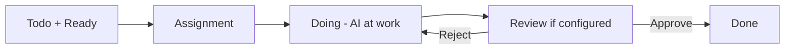

<!-- Generated by agents-md: DO NOT EDIT DIRECTLY. Edit *.agents.md fragments instead. Higher priority fragments appear first and win conflicts. -->

<!-- source: .solo/designs/10-features.md priority=0 -->
# Features Design

## Problems
- Hard to coordinate AI coding across repos and machines
- Need optional PR control without slowing iteration
- Real-time visibility into missions and agents is lacking
- Public collaboration needs granular permissions
- Cross-interface consistency between Web, CLI, MCP is hard

## Overview

### Vision
Build a modern, type-safe AI development system where humans define intent and flows, code agents execute work on user-controlled workstations, and teams collaborate via optional PR review and public projects.

### Product Goals
- Mission-centric workflow with flow-first creation and review gates
- Optional PR-based change control and fast YOLO mode
- Workstation-first execution with presence and push assignments
- Public projects with permission-aware UX and APIs
- One truth for operations via MCP tools + versioned /api

## Features

### FEAT-001 - Authentication & Authorization
- ID: FEAT-001
- Name: Authentication & Authorization
- Status: Shipped (MVP scope)

#### Intent
Securely authenticate users via Monster Auth and authorize actions by org/project roles without duplicating identity tables.

#### Goals
- Support Google OAuth and email/password via Monster Auth
- Support PATs (pat_...) and org keys (org_key_...) for CLI/MCP
- Org-based multi-tenancy and roles: owner, admin, member
- Canonical identity by email; no custom auth table
- Token refresh incl. server-initiated via realtime signal

#### Non-Goals
- Custom identity providers beyond Monster Auth (MVP)
- Fine-grained SQL permission logic as source of truth

#### Solution
Use Monster Auth for identity, app-layer TypeScript for authz, secure cookies for web (/rpc), and Authorization headers for /api and MCP.

#### User Flow Links
- [UF-AUTH-001](./20-gui/web.md#uf-auth-001---authentication-flow)

#### Transport Flow Links
- HTTP: GET /api/oauth/callback (OAuth)
- HTTP: /api/v1/... with PAT/org key for CLI/MCP

#### Design Notes
- Email is canonical identity; multiple providers allowed if same email
- CORS allowlist and CSRF for cookie APIs
- Rate limiting on public endpoints

#### Risks & Mitigations
- Token leaks → OS keychain storage + short-lived tokens
- Email change at IdP → out-of-band migration process

---

### FEAT-002 - Workstation Management
- ID: FEAT-002
- Name: Workstation Management
- Status: Shipped (MVP scope)

#### Intent
User-owned machines register as workstations that host agents, receive missions via push, and report presence/health.

#### Goals
- Register/start/stop/status via CLI
- Presence via Monster Realtime; channel per workstation
- Cross-platform (Windows/macOS/Linux)
- Background/daemon mode support
- Health and diagnostics visibility

#### Non-Goals
- Server-persisted agent configs (kept client-side)

#### Solution
CLI registers workstation, connects to realtime, reports available agents and dev server info; server stores minimal state for orchestration.

#### User Flow Links
- [UF-WS-001](./20-gui/web.md#uf-ws-001---workstation-view)

#### Transport Flow Links
- WS: workstation:{id} (presence, mission:assign)
- HTTP: POST /api/v1/workstations/register

#### Design Notes
- Availability, concurrency, versions reported by presence; not stored as config on server

---

### FEAT-003 - Code Agent Orchestration
- ID: FEAT-003
- Name: Code Agent Orchestration
- Status: Shipped (MVP scope)

#### Intent
Discover and track code agents on workstations, respecting rate limits and concurrency for mission assignment.

#### Goals
- agent scan/list/add via CLI
- Track availability and capacity via presence
- Health checks and rate-limit hints

#### Non-Goals
- Persist detailed agent configs server-side

#### Solution
Client stores ~/.solo-unicorn/code-agents.json; server maintains static type definitions; orchestration uses presence + minimal DB fields.

#### Transport Flow Links
- WS presence meta fields for available agents

#### Design Notes
- Server-side “type definitions” for agent capabilities

---

### FEAT-004 - Repository & Git Worktree Management
- ID: FEAT-004
- Name: Repositories & Worktrees
- Status: Shipped (MVP scope)

#### Intent
Enable parallel development through git worktrees managed by the CLI, with stable repo identification.

#### Goals
- Repository add/list/remove via CLI
- Auto-create worktrees per mission/branch on first use
- Stable identifier: GitHub numeric repository ID (BIGINT)
- Optional additionalRepositoryIds

#### Non-Goals
- User-facing worktree commands in MVP

#### Solution
CLI manages cloning and worktree pools in the workspace; server references repos by GitHub repo ID and links to projects.

#### Design Notes
- Worktree pool policy: reuse, keep vacant, cleanup after inactivity

---

### FEAT-005 - Mission Management & Flow
- ID: FEAT-005
- Name: Missions & Flows
- Status: Shipped (MVP scope)

#### Intent
Mission-centric workflow with flow-first creation; stages drive prompting; optional human review and dependencies.

#### Goals
- Columns: Todo, Doing, Review, Done; special Loop list
- Default stages: clarify → plan → code; custom stages allowed
- Flow-first creation with stage toggles and review flags
- Dependencies, priority, list order (DnD)
- Solution & tasks persisted hybrid (FS+DB)

#### Non-Goals
- Complex task append/reorder via MCP in MVP

#### Solution
Kanban UI + MissionModal tabs; DB fields for stage/flow/review; FS docs for solution and per-task notes in mission folder.

#### User Flow Links
- [UF-MISSION-001](./20-gui/web.md#uf-mission-001---mission-creation-flow)
- [UF-MISSION-002](./20-gui/web.md#uf-mission-002---mission-execution-flow)

#### Design Notes
- Review column shows PR status when PR mode
- Ready flag gates assignment

---

### FEAT-006 - Change Management: PR Mode and YOLO
- ID: FEAT-006
- Name: Change Management (PR/YOLO)
- Status: Shipped (MVP scope)

#### Intent
Let projects choose between direct commits for speed or PR-based flows for control, with AI reading PR comments.

#### Goals
- Optional PR mode per-project and per-mission override
- Auto-branch naming and PR creation in Review stage
- Read PR comments via gh CLI; iterate on changes
- YOLO mode for early-stage projects

#### Non-Goals
- Full in-app PR comment UI in MVP

#### Solution
If PR mode, create PR and surface status in UI; if rejection in app, prompt agent to read PR comments and iterate.

#### User Flow Links
- [UF-PR-001](./20-gui/web.md#uf-pr-001---pr-mode-workflow)

#### Transport Flow Links
- HTTP: GitHub REST via agent tools; no incoming webhooks required

#### Design Notes
- Merge strategies supported (merge/squash/rebase)
- Auto-delete branches post-merge (configurable)

---

### FEAT-007 - Real-time Communication
- ID: FEAT-007
- Name: Realtime Presence & Push
- Status: Shipped (MVP scope)

#### Intent
Use Monster Realtime for push-only presence and events; never for request/response RPC.

#### Goals
- Presence updates with available agents and activity
- Mission assignment push to workstations
- Project-wide workstation channels

#### Transport Flow Links
- WS channels: workstation:{id}, project:{id}:workstations, mission:{id}

#### Design Notes
- Web consumes push for status; all operations remain HTTP

---

### FEAT-008 - Project & Organization Management
- ID: FEAT-008
- Name: Projects & Orgs
- Status: Shipped (MVP scope)

#### Intent
Support multiple projects per org with member roles, project memory, and configuration defaults.

#### Goals
- Project creation/settings; org membership and roles
- Project memory; default flows/actors
- Workstation association to projects

#### User Flow Links
- [SR-PROJECTS](./20-gui/web.md#information-architecture)

---

### FEAT-009 - Configuration Management
- ID: FEAT-009
- Name: Configuration Management
- Status: Shipped (MVP scope)

#### Intent
Provide secure, typed configuration for CLI and per-project settings.

#### Goals
- CLI config in ~/.solo-unicorn/config.json
- Secure token storage via OS keychain
- Typed env via apps/*/env.ts (no process.env direct)

#### Transport Flow Links
- CLI commands: config get/set/list/reset

---

### FEAT-010 - Flow Review System
- ID: FEAT-010
- Name: Flow Reviews
- Status: Shipped (MVP scope)

#### Intent
Allow stages to require human review and provide a Review list with approve/reject and feedback.

#### Goals
- Per-stage review flags
- Review column, approve/reject with feedback
- Review history metadata (who/when/feedback)

#### Transport Flow Links
- MCP tool: request_review (agent-triggered)

---

### FEAT-011 - Solution & Tasks Document Management
- ID: FEAT-011
- Name: Solution & Tasks Docs
- Status: Shipped (MVP scope)

#### Intent
Persist rich solution write-ups and per-task notes on filesystem with DB progress tracking.

#### Goals
- FS: solo-unicorn-docs/missions/{id}/solution.md and tasks/{n}.md
- DB: solution TEXT, tasks JSON, tasks_current INT
- Cross-session context and version history via git

#### Design Notes
- Tasks fit a single agent session to avoid context bloat

---

### FEAT-012 - Public Projects & Access Control
- ID: FEAT-012
- Name: Public Projects & ACL
- Status: Shipped (MVP scope)

#### Intent
Enable public viewing and contribution with granular, role-based controls and workstation privacy settings.

#### Goals
- Visibility: private by default; opt-in public
- Roles: Public, Contributor, Collaborator, Maintainer, Owner
- Controls: mission read/write, workstation visibility, execution permissions, memory access
- Access requests with approval workflow

#### Transport Flow Links
- HTTP: /api/v1/public/* endpoints

#### Design Notes
- Permission checks in app layer; responses permission-aware and cacheable
 - Permission matrix (summary):
   - Read Missions: Public (conditional), Contributor+, Maintainer, Owner
   - Write Missions: Contributor*+, Collaborator+, Maintainer, Owner
   - Read Project Memory/Repository: Public (conditional) and above
   - View Workstations: Hidden | Status Only | Full Details (setting-based)
   - Execute Missions: Maintainer*, Owner
   - Manage Repositories/Permissions/Settings: Maintainer/Owner or Owner-only
 - Inheritance and overrides:
   - Role defaults with per-user overrides; org owners override within org; explicit user permissions can override role

---

### FEAT-013 - Public Project Discovery & Community
- ID: FEAT-013
- Name: Discovery & Community
- Status: Shipped (MVP scope)

#### Intent
Provide gallery, categories/tags, featured projects, metrics, and social actions (stars, follows) for public projects.

#### Goals
- Search/filter/sort gallery with pagination
- Templates library and one-click create-from-template
- Metrics and activity feeds; stars and follows

#### Transport Flow Links
- HTTP: GET /api/v1/public/projects, .../search, .../{slug}

---

### FEAT-014 - Public API Design & Security
- ID: FEAT-014
- Name: Public API & Security
- Status: Shipped (MVP scope)

#### Intent
Offer stable, versioned public endpoints with CORS, rate limits, and caching for high-traffic content.

#### Goals
- URL versioning (/api/v1)
- Rate limits with headers and burst (anon 100/hr/IP; auth 1000/hr; contributor+ 5000/hr)
- CORS and CSRF handling (public endpoints permissive origin; credentials supported)
- CDN caching and conditional requests (ETag/If-Modified-Since; smart invalidation; Vary headers)
- OpenAPI + interactive docs

#### Design Notes
- Permission-aware responses with Vary headers as needed
 - Response headers may include effective role when authenticated
 - Graceful degradation: anonymous gets reduced, non-error responses

---

### FEAT-015 - Development Server & Public Tunneling
- ID: FEAT-015
- Name: Dev Server & Tunneling
- Status: Shipped (MVP scope)

#### Intent
Expose local dev servers for preview via secure proxy/tunnel.

#### Goals
- CLI dev-server start/stop/status
- Public tunnel via Cloudflare Tunnel (MVP)
- Channel-based proxy path per workstation/project

#### Design Notes
- Cost-effective choice for MVP; no performance objectives

---

### FEAT-016 - Flow Templates & Prompt Strategy
- ID: FEAT-016
- Name: Flow Templates & Prompts
- Status: Shipped (MVP scope)

#### Intent
Treat flows/stages/prompts as versioned artifacts; allow static templates in MVP.

#### Goals
- Versioned flow/stage templates with semantic versions
- Static prompt templates in MVP; dynamic prompt fetch post-MVP

#### Design Notes
- Future: dynamic POST to client-hosted prompt endpoint. Example (post-MVP):
  - POST https://client-company.com/custom-prompt
  - Body: { mission: { id, title, description, tasks, solution }, stage, flow, workstation, repositoryId, additionalRepositoryIds, codeAgent }
  - Returns: { prompt: string }
<!-- /source: .solo/designs/10-features.md -->

<!-- source: .solo/designs/20-gui/web.md priority=0 -->
# GUI design - web

## Information Architecture

### Site Map / Screen Inventory


### Navigation Structure
Primary: Dashboard, Projects, Public Gallery, Community, Settings

Secondary: Kanban Board, Project Settings, Workstations, Members, Repositories, Flows, Actors

Breadcrumbs: Organization / Project / Area / Item

## User Flows

### UF-WS-001 - Workstation View
User Goal: Monitor workstation presence, agents, repositories, and activity

Entry Points: Project → Workstations tab; Organization overview → Workstations list

Success Criteria: Clear online status, agent availability, repos/worktrees, active missions

Steps:
1. Open Workstations tab
2. Inspect status (online/offline/idle), agents (type/health), repositories
3. View active missions and optional dev server/tunnel info
4. Take actions (View, Settings)

### UF-AUTH-001 - Authentication Flow
User Goal: Access Solo Unicorn securely as org member or public visitor

Entry Points: Sign In; deep links; public pages

Success Criteria: Authenticated and routed to org/project context or public page with permission-aware content

Steps:
1. Visit app and click Sign In
2. Redirect to Monster Auth and complete OAuth
3. Callback sets secure cookies
4. Land on Dashboard or last project

Interface References:
- GET /api/oauth/callback
- /rpc cookie-authenticated calls

Flow Diagram:


### UF-PROJ-001 - Project Creation Flow
User Goal: Create a new project and prepare it for missions

Entry Points: Create New Project (Dashboard/Projects)

Success Criteria: Project ready; optional sample mission created

Steps:
1. Open Project Create
2. Fill details (name, description)
3. Associate workstation (hints if none online)
4. Link repository (validate URL)
5. Optionally create sample mission

Flow Diagram:


### UF-MISSION-001 - Mission Creation Flow
User Goal: Create a mission with flow-first settings and set Ready

Entry Points: Create Mission from Kanban

Success Criteria: Mission appears in Todo with Ready enabled

Steps:
1. Select a Flow (primary selection)
2. Configure stages (enable/require review; choose start stage)
3. Fill Base fields (title, description, priority, list)
4. Add optional dependencies
5. Set Ready

Flow Diagram:


### UF-MISSION-002 - Mission Execution Flow
User Goal: Agent executes code; real-time updates; human review if required

Entry Points: Mission moves Todo → Doing → Review → Done

Success Criteria: Mission approved (if required) and completed

Steps:
1. Assignment when Ready and dependencies clear
2. Doing: AI at work; status updates live
3. Review: Approve or Reject with feedback
4. Done or Iterate back to Doing on reject

Flow Diagram:


Flow Diagram:


Process Badges
- Todo: Queueing
- Doing: AI at work
- Review/Done: no process badge

Stage Badges
- Display-only on cards; click opens Flow tab to make changes

### UF-PUBLIC-001 - Public Project Discovery
User Goal: Browse public projects and request access

Success Criteria: Understand project quickly; optionally request access

Steps:
1. Browse/search gallery; filter/sort
2. Open project and view overview/kanban read-only
3. Request access (Contributor/Collaborator)
4. Await owner decision

### UF-PR-001 - PR Mode Workflow
User Goal: Use PR-based change management with review

Success Criteria: PR approved and merged; mission Done

Steps:
1. Feature branch created on Doing
2. Create PR on entering Review
3. Human review on GitHub; if changes requested, iterate
4. Merge and Done

Flow Diagram:


## Wireframes & Mockups

### KanbanBoard
```
┌──────────────────────────────────────────────────────────────────────────────┐
│ [LOGO] [Project ▼]                           [🌙/☀️] [👤 User ▼]            │
├──────────────────────────────────────────────────────────────────────────────┤
│ Project Name      👤👤👤  🟢 Workstations: 2  [⏸️ Pause] [⚙️ Settings]       │
├──────────────────────────────────────────────────────────────────────────────┤
│                                                                              │
│ ┌─────────┬─────────┬─────────┬─────────┐                                    │
│ │  TODO   │  DOING  │ REVIEW  │  DONE   │                                    │
│ ├─────────┼─────────┼─────────┼─────────┤                                    │
│ │┌───────┐│         │         │         │                                    │
│ ││Normal ▼││         │         │         │                                    │
│ │├───────┤│         │         │         │                                    │
│ ││┌─────┐││┌───────┐│┌───────┐│┌───────┐│                                    │
│ │││Mission│││ Mission ││ Mission ││ Mission ││                                    │
│ │││P H   │││ P L    ││ P M    ││ P H    ││                                    │
│ │││Code  │││ Plan   ││ Review ││ Done   ││                                    │
│ │││🔄    │││🤖 AI   ││        ││        ││                                    │
│ │││Desc  │││ Desc   ││ Desc   ││ Desc   ││                                    │
│ │││Ready │││ Ready  ││ Review ││        ││                                    │
│ ││└─────┘││└───────┘│└───────┘│└───────┘│                                    │
│ │├───────┤│         │         │         │                                    │
│ ││Loop ▶ ││         │         │         │                                    │
│ │└───────┘│         │         │         │                                    │
│ └─────────┴─────────┴─────────┴─────────┘                                    │
└──────────────────────────────────────────────────────────────────────────────┘
```

### MissionCard (Todo)
```
┌───────────────────────────────────────┐
│ Mission Title Here                [⋮] │
├───────────────────────────────────────┤
│ P High [Code]                         │
├───────────────────────────────────────┤
│ Branch: solo-unicorn/mission-auth-123 │
├───────────────────────────────────────┤
│ Description snippet (3.5 lines max)   │
├───────────────────────────────────────┤
│                     [✓ Ready]          │
└───────────────────────────────────────┘
```
Overflow Menu [⋮]
- View & Edit (open MissionModal)
- Reset AI (when active)
- Delete Mission

### MissionCard (Review)
```
┌─────────────────────────────────────┐
│ Mission Title Here                  │
├─────────────────────────────────────┤
│ P Low [Code] [📝 PR #12]            │
├─────────────────────────────────────┤
│ Description snippet (3.5 lines max) │
├─────────────────────────────────────┤
│                       [Review]       │
└─────────────────────────────────────┘
```

### MissionModal
```
┌─────────────────────────────────────────────────────────────────────────────┐
│ Mission: Implement user authentication                                   [×]│
├─────────────────────────────────────────────────────────────────────────────┤
│ [Base] [Flow] [Clarify] [Plan] [Review] [Dependencies] [Settings]          │
├─────────────────────────────────────────────────────────────────────────────┤
│ Base Tab: Title, Description, Spec, Priority, List, Stage (display-only)    │
│ Attachments, Real-time status, Danger zone (Reset/Delete)                   │
└─────────────────────────────────────────────────────────────────────────────┘
```

Tabs
- Base: Title, Description, Spec, Priority, List; Stage display-only on card
- Flow: Switch flow; enable/disable stages; per-stage review; skip to later stage
- Clarify/Plan: Show raw input vs AI output, editing controls
- Review: Review instructions; Approve/Reject (Reject requires feedback)
- Dependencies: Depends-on and Blocks lists with add/remove
- Settings: Workstation/Repository; IDs; Danger zone (Reset AI/Delete)

### MissionCreatePopup
```
┌─────────────────────────────────────────────────────────────────────────────┐
│ Create New Mission                                                       [×] │
├─────────────────────────────────────────────────────────────────────────────┤
│ Title, Description (+ attachments)                                         │
│ Priority, List, Repository, Workstation, Agent, Model, Actor               │
│ Flow (primary): stages with enable/review toggles; tips for skipping ahead  │
│ Dependencies (optional)                                                    │
└─────────────────────────────────────────────────────────────────────────────┘
```

### Project Settings (PR Configuration)
```
┌─────────────────────────────────────────────────────────────────────────────┐
│ Project Settings — PR Mode                                                 │
├─────────────────────────────────────────────────────────────────────────────┤
│ Branch Prefix: [solo-unicorn/]                                             │
│ Target Branch: [main ▼]                                                    │
│ Require Review: [✓]                                                         │
│ Auto-merge: [✓]                                                             │
│ Delete Branch After Merge: [✓]                                              │
│ PR Template: [Edit Template…]                                               │
└─────────────────────────────────────────────────────────────────────────────┘
```

### Organization Page (Overview)
```
┌─────────────────────────────────────────────────────────────────────────────┐
│ Organization: My Org                                   [⚙️ Settings]        │
├─────────────────────────────────────────────────────────────────────────────┤
│ Projects grid, Workstations list, Team members list                         │
└─────────────────────────────────────────────────────────────────────────────┘
```

### Organization Settings Modal
```
┌─────────────────────────────────────────────────────────────────────────────┐
│ Organization Settings                                                 [×]   │
├─────────────────────────────────────────────────────────────────────────────┤
│ [General] [Members] [Security] [Integrations]                                │
├─────────────────────────────────────────────────────────────────────────────┤
│ General: Name, Domain, Logo; Defaults (project template, workstation reg)    │
│ Members: Invite/manage roles (Owner/Admin/Member)                            │
│ Security: Token policies; SSO providers (via Monster Auth)                   │
│ Integrations: GitHub linking; repo access guidance                           │
└─────────────────────────────────────────────────────────────────────────────┘
```

### PublicProjectGallery
```
┌─────────────────────────────────────────────────────────────────────────────┐
│ [LOGO] Discover Projects                              [Sign In] [Sign Up]   │
├─────────────────────────────────────────────────────────────────────────────┤
│ Search + Category filter + Featured + Recent projects with stats             │
└─────────────────────────────────────────────────────────────────────────────┘
```

### PublicProjectView
```
┌─────────────────────────────────────────────────────────────────────────────┐
│ [← Back] Project Title                      [⭐ Star] [🍴 Use Template]      │
├─────────────────────────────────────────────────────────────────────────────┤
│ Overview, Tags, Progress, Activity, Read-only Kanban, Permission-aware CTA  │
└─────────────────────────────────────────────────────────────────────────────┘
```

### AccessRequestModal
```
┌─────────────────────────────────────────────────────────────────────────────┐
│ Request Access                                                          [×] │
├─────────────────────────────────────────────────────────────────────────────┤
│ Levels: ○ Contributor  ○ Collaborator                                       │
│ Why do you want to contribute? (optional)                                   │
│ GitHub Profile (optional): github.com/[username]                            │
│ Project may auto-approve Contributor requests                               │
│                                                       [Cancel] [Request]     │
└─────────────────────────────────────────────────────────────────────────────┘
```

### ProjectPermissionsPanel
```
┌─────────────────────────────────────────────────────────────────────────────┐
│ Project Permissions                                                          │
├─────────────────────────────────────────────────────────────────────────────┤
│ Visibility: [Private ▼ | Public]                                            │
│ Anonymous Users Can: [✓ Read completed missions] [✓ Read docs] [✓ Repo info] │
│ Workstation Visibility: [Hidden | Status Only | Full Details]                │
│ Contributors Can: [✓ Create/Edit missions] [✓ Comment]                       │
│ Collaborators Can: [✓ Review] [✓ View workstation details]                   │
│ Maintainers Can: [✓ Execute missions] [✓ Manage repositories]                │
│ Owners: Full control                                                         │
└─────────────────────────────────────────────────────────────────────────────┘
```

## Theming & Style Guide

Visual Identity: Use existing brand; Tailwind tokens with dark/light mode

Color Palette: semantic tokens for Primary/Secondary/Accent/Success/Warning/Error/Neutral

Typography: project-standard fonts; accessible contrast and sizes

Spacing & Layout: 12-col grid; 4/8 spacing scale; mobile-first responsive

Accessibility
- Target WCAG 2.2 AA; keyboard-first workflows; clear focus; alt text; semantic structure

Responsiveness
- Breakpoints: Mobile/Tablet/Desktop/Wide; Kanban horizontal scroll on mobile; tabs collapse into overflow

Animation & Micro-interactions
- DnD affordances on Kanban (150–200ms, ease-out); Ready toggle transitions; modal open/close 160–220ms; respect reduce-motion

PR Status Badges
- ⚡ Direct (YOLO)
- 📝 PR #N (created and linked)
- ✅ Merged / ❌ Closed
- (Post-MVP) ✅ Approved / 👎 Changes
- Iterations: 👎 PR #N (iterate #k)
<!-- /source: .solo/designs/20-gui/web.md -->

<!-- source: .solo/designs/25-non-graphical-client-interfaces/cli.md priority=0 -->
# CLI Interface Design

## Overview

Solo Unicorn CLI is a Bun-compiled single-file tool that registers a workstation, connects to Monster Realtime, manages repositories and git worktrees, and coordinates AI code agents locally. It consumes versioned HTTP APIs (/api) and receives push events via realtime channels.

## Architecture

```
Solo Unicorn Server ──HTTP /api──▶ CLI (Workstation)
                      ◀─WS push─── Monster Realtime
CLI ⇄ Local Agents (Claude Code, Cursor...)
CLI ⇄ Git (clone, worktrees)
CLI ⇄ Dev server (optional) ⇄ Tunnel proxy
```

Key integrations:
- Monster Auth (PAT/org key); OS keychain for secret storage
- Monster Realtime (presence + mission push)
- Git worktrees (auto-managed pools)
- Optional dev server + Cloudflare Tunnel proxy (MVP)

## Commands (MVP)

Authentication
- `solo-unicorn auth login [--web|--api-key KEY|--org-key KEY] [--org ORG]`
- `solo-unicorn auth logout`
- `solo-unicorn auth whoami`

Workstation lifecycle (aliases: start/stop/status/restart)
- `solo-unicorn workstation register [--name NAME] [--force]`
- `solo-unicorn workstation start [--background]`
- `solo-unicorn workstation stop [--force]`
- `solo-unicorn workstation status [--json]`
- `solo-unicorn workstation restart`

Repositories (GitHub linking)
- `solo-unicorn repo add GITHUB_URL [--path PATH]`
- `solo-unicorn repo list`
- `solo-unicorn repo remove REPO_ID`

Configuration
- `solo-unicorn config get [KEY]`
- `solo-unicorn config set KEY VALUE`
- `solo-unicorn config list`
- `solo-unicorn config reset [KEY]`

Agents
- `solo-unicorn agent scan`
- `solo-unicorn agent list`
- `solo-unicorn agent add TYPE [--version VERSION]`

Dev Server & Tunnel (post-MVP friendly; MVP supports tunnel)
- `solo-unicorn dev-server start [--port PORT] [--project PROJECT_ID]`
- `solo-unicorn dev-server stop|status`
- `solo-unicorn tunnel open [--target-port PORT] [--project PROJECT_ID]`
- `solo-unicorn tunnel close|status`

Self-management
- `solo-unicorn self update|version`

## Realtime Integration

Channels
- `workstation:{workstation_id}` (presence + mission:assign)
- `project:{project_id}:workstations`
- `mission:{mission_id}`

Presence payload (example)
```json
{
  "status": "online",
  "availableCodeAgents": ["claude-code", "cursor"],
  "activeProjects": ["proj_123"],
  "devServerPort": 3000,
  "currentMissionCount": 1,
  "maxConcurrency": 2
}
```

Status surfaces (summary)
- Auth state (user/org, token freshness)
- Realtime connection (gateway, channels, latency)
- Repositories and worktrees (paths, branches, cloning status)
- Code agents (type, version, availability, health)
- Dev server (local URL, public tunnel URL)
- Active missions (id, repo/branch, agent)

## Repository & Worktree Management

Identifier
- `repository_id` = GitHub numeric repo ID (BIGINT); optional `additionalRepositoryIds[]`

Flow
1) Clone to workspace root on first use
2) On first mission/branch: auto-create worktree at `repo-branch` path
3) Reuse existing worktrees when possible; keep a small vacant pool
4) Cleanup unused worktrees after 7+ days (keep ≥1 vacant)

Pool policy
- Max worktrees per repo = `maxConcurrencyLimit + 3`
- Reuse same-branch worktree when available

## Dev Server & Public Tunneling

MVP choice: Cloudflare Tunnel (cloudflared). Server proxies via channel path:
`https://channel.solounicorn.lol/workstation/{ws}/project/{proj}`

Tunnel message shapes
```ts
type TunnelRequest = { type: 'http:request', requestId: string, method: string, path: string, headers: Record<string,string>, body?: string }
type TunnelResponse = { type: 'http:response', requestId: string, status: number, headers: Record<string,string>, body?: string }
```

Use cases
- Live preview, remote QA, demos, debugging

## Configuration Files

Main config: `~/.solo-unicorn/config.json`
```json
{
  "version": "1",
  "workstation": { "id": "ws_...", "name": "MacBook-Pro" },
  "auth": { "organizationId": "org_...", "email": "user@org.com", "personalAccessToken": "encrypted" },
  "realtime": { "gatewayUrl": "wss://...", "timeout": 30000 },
  "server": { "apiUrl": "https://api...", "tunnelUrl": "https://channel..." },
  "workspace": { "rootPath": "~/workspace", "defaultBranch": "main" },
  "devServer": { "enabled": true, "defaultPort": 3000, "publicTunneling": true },
  "repositories": [
    { "id": "repo_123", "githubUrl": "https://github.com/user/repo", "mainPath": "~/repos/repo", "worktrees": [] }
  ]
}
```

Agent config: `~/.solo-unicorn/code-agents.json`
```json
{
  "version": "1",
  "workstationId": "ws_...",
  "codeAgents": {
    "codeagent_claude_001": {
      "id": "codeagent_claude_001", "type": "claude-code", "name": "Claude Code",
      "customSettings": { "claudeCode": { "configDir": "~/.claude", "defaultModel": "claude-3.5-sonnet" } },
      "enabled": true, "healthStatus": "healthy"
    }
  },
  "settings": { "autoUpdateCodeAgentStatus": true, "healthCheckInterval": 300 }
}
```

## Errors & UX

Patterns
- Clear actionable errors with next steps
- Progress bars for long operations (clone)
- Status dashboards for workstation/agents/repos

Examples
- Not logged in → prompt to run `auth login`
- Branch not found → suggest creating or picking an existing branch
- Realtime failure → verify auth, check tunnel, retry

## Installation & Distribution

Methods
- npm/bun global install
- Direct binary install script
- Homebrew (macOS), Scoop (Windows), Snap (Linux)

Cross-platform
- Windows: PowerShell; Windows Service for background
- macOS: Keychain; launchd integration; notarized binaries
- Linux: systemd; distro packages; AppImage; container support

## PR Support

Modes
- YOLO: direct push to default branch
- PR Mode: auto-branch and PR, review cycles; merge strategies; auto-delete branch

Agent integration
- Read PR comments via `gh`; implement changes; respond if needed

## Future Enhancements

- Multi-agent orchestration per mission
- Mission templates
- Remote development (VS Code server)
- Team workstation pools
- CI/CD integration (GitHub Actions)
- Metrics & analytics
- Plugin system
- Loop mission scheduling

## Security & Best Practices

Token management
- Store access/refresh tokens in OS keychain
- Automatic refresh and rotation; handle server-initiated refresh via realtime
- Scope validation; revoke and cleanup on logout

Network security
- TLS only; validate certificates (pinning where supported)
- Corporate proxy detection and configuration support
- Respect API rate limits with backoff

Repository security
- SSH key management guidance; proper file permissions
- Isolate agent execution where feasible
- Audit logging for filesystem operations (where applicable)
<!-- /source: .solo/designs/25-non-graphical-client-interfaces/cli.md -->

<!-- source: .solo/designs/30-data.md priority=0 -->
# Data Design

## Overview
Workstation-centric, multi-tenant schema with projects, missions, flexible flows, optional PR support, and public projects. Hybrid storage persists Solution & Tasks in filesystem with DB progress tracking. Agent configurations live client-side; server stores minimal availability state for orchestration.

## Data Relations Diagram


## Conceptual Entities

### ENT-ORG - Organization
Purpose: Tenant boundary; owns projects, workstations
Relationships: has memberships (users), owns projects/workstations

### ENT-USER - User
Purpose: Canonical identity (email via Monster Auth)
Relationships: member of organizations; stars public projects

### ENT-MEM - Organization Membership
Purpose: Role in org (owner/admin/member)
Relationships: links user↔org

### ENT-WS - Workstation
Purpose: Registered machine hosting agents
Relationships: belongs to org; linked to projects; reports presence

### ENT-PROJ - Project
Purpose: Unit of collaboration and configuration
Relationships: repositories, flows, actors, missions; stars/activity

### ENT-REPO - Project Repository
Purpose: GitHub repository linkage (stable by GitHub numeric ID)
Relationships: belongs to project; referenced by missions/PRs

### ENT-FLOW - Flow
Purpose: Stage sequence with review flags
Relationships: used by missions

### ENT-ACTOR - Actor
Purpose: AI persona/methodology
Relationships: referenced by missions

### ENT-MISSION - Mission
Purpose: Work item with stage/flow, PR mode, tasks/solution
Relationships: depends on missions; has agent sessions; PRs

### ENT-PR - GitHub Pull Request
Purpose: Track PR metadata/status
Relationships: belongs to mission and repository

### ENT-PRC - GitHub PR Comment
Purpose: PR feedback for AI iteration
Relationships: belongs to PR

### ENT-STAR - Project Star
Purpose: Community engagement
Relationships: user stars project

### ENT-ACT - Project Activity
Purpose: Public analytics feed
Relationships: project-scoped events; optional user/mission/ws context

### ENT-HLP - Helpers
Purpose: System helpers (e.g., DB locking)
Relationships: standalone

## Database Schema (key tables)

Note: SQL defines enums and indexes optimized for high-frequency monitoring and mission assignment. AuthZ is enforced in the app layer; SQL helper functions exist for reference only.

```sql
-- Organizations
CREATE TABLE organizations (
  id VARCHAR(26) PRIMARY KEY,
  name VARCHAR(255) NOT NULL,
  slug VARCHAR(100) UNIQUE NOT NULL,
  domain VARCHAR(255),
  owner_email VARCHAR(255) NOT NULL,
  api_key VARCHAR(100) UNIQUE,
  api_key_created_at TIMESTAMP,
  api_key_expires_at TIMESTAMP,
  default_flow_id VARCHAR(26),
  auto_invite_to_projects BOOLEAN DEFAULT true,
  created_at TIMESTAMP DEFAULT NOW(),
  updated_at TIMESTAMP DEFAULT NOW(),
  deleted_at TIMESTAMP NULL
);

-- Users
CREATE TABLE users (
  id VARCHAR(26) PRIMARY KEY,
  email VARCHAR(255) UNIQUE NOT NULL,
  name VARCHAR(255),
  avatar TEXT,
  monster_auth JSONB,
  timezone VARCHAR(50) DEFAULT 'UTC',
  email_verified BOOLEAN DEFAULT false,
  status ENUM('active','suspended','deleted') DEFAULT 'active',
  created_at TIMESTAMP DEFAULT NOW(),
  updated_at TIMESTAMP DEFAULT NOW(),
  last_active_at TIMESTAMP DEFAULT NOW()
);

-- Organization Memberships
CREATE TABLE organization_memberships (
  id VARCHAR(26) PRIMARY KEY,
  organization_id VARCHAR(26) NOT NULL,
  user_id VARCHAR(26) NOT NULL,
  role ENUM('owner','admin','member') DEFAULT 'member',
  status ENUM('active','invited','suspended') DEFAULT 'active',
  invited_by VARCHAR(26),
  invited_at TIMESTAMP,
  joined_at TIMESTAMP,
  created_at TIMESTAMP DEFAULT NOW(),
  updated_at TIMESTAMP DEFAULT NOW()
);

-- Workstations
CREATE TABLE workstations (
  id VARCHAR(26) PRIMARY KEY,
  organization_id VARCHAR(26) NOT NULL,
  name VARCHAR(255) NOT NULL,
  hostname VARCHAR(255),
  os VARCHAR(50), arch VARCHAR(50), platform_version VARCHAR(100),
  cli_version VARCHAR(20), registration_token VARCHAR(100),
  last_ip_address INET, last_user_agent TEXT,
  status ENUM('online','offline','suspended') DEFAULT 'offline',
  last_seen_at TIMESTAMP, last_heartbeat_at TIMESTAMP,
  available_code_agents JSON,
  realtime_member_key JSON, realtime_presence_meta JSON,
  dev_server_enabled BOOLEAN DEFAULT false,
  dev_server_port INTEGER,
  dev_server_public_url TEXT,
  created_at TIMESTAMP DEFAULT NOW(),
  updated_at TIMESTAMP DEFAULT NOW(),
  deleted_at TIMESTAMP NULL
);

-- Projects
CREATE TABLE projects (
  id VARCHAR(26) PRIMARY KEY,
  organization_id VARCHAR(26) NOT NULL,
  name VARCHAR(255) NOT NULL,
  description TEXT,
  slug VARCHAR(100),
  visibility ENUM('private','public') DEFAULT 'private',
  public_slug VARCHAR(100) UNIQUE,
  category VARCHAR(50), tags JSON, featured BOOLEAN DEFAULT false,
  star_count INTEGER DEFAULT 0,
  public_mission_read BOOLEAN DEFAULT true,
  public_memory_read BOOLEAN DEFAULT true,
  public_repository_read BOOLEAN DEFAULT true,
  contributor_mission_write BOOLEAN DEFAULT true,
  collaborator_workstation_read BOOLEAN DEFAULT false,
  maintainer_mission_execute BOOLEAN DEFAULT false,
  workstation_visibility ENUM('hidden','status_only','full_details') DEFAULT 'hidden',
  default_flow_id VARCHAR(26), default_actor_id VARCHAR(26),
  memory TEXT,
  pr_mode_default ENUM('disabled','enabled') DEFAULT 'disabled',
  pr_require_review BOOLEAN DEFAULT true,
  pr_auto_merge BOOLEAN DEFAULT false,
  pr_delete_branch_after_merge BOOLEAN DEFAULT true,
  pr_template TEXT,
  status ENUM('active','archived','suspended') DEFAULT 'active',
  created_at TIMESTAMP DEFAULT NOW(), updated_at TIMESTAMP DEFAULT NOW(), archived_at TIMESTAMP NULL
);

-- Project Repositories
CREATE TABLE project_repositories (
  id VARCHAR(26) PRIMARY KEY,
  project_id VARCHAR(26) NOT NULL,
  name VARCHAR(255) NOT NULL,
  github_repo_id BIGINT,
  github_owner VARCHAR(100) NOT NULL,
  github_name VARCHAR(100) NOT NULL,
  github_full_name VARCHAR(255) NOT NULL,
  github_url TEXT NOT NULL,
  default_branch VARCHAR(100) DEFAULT 'main'
);

-- Project Stars
CREATE TABLE project_stars (
  id VARCHAR(26) PRIMARY KEY,
  project_id VARCHAR(26) NOT NULL,
  user_id VARCHAR(26) NOT NULL,
  created_at TIMESTAMP DEFAULT NOW()
);

-- Project Activity
CREATE TABLE project_activity (
  id VARCHAR(26) PRIMARY KEY,
  project_id VARCHAR(26) NOT NULL,
  user_id VARCHAR(26),
  activity_type ENUM('mission_created','mission_completed','user_joined','star_added','repository_updated') NOT NULL,
  activity_data JSON,
  mission_id VARCHAR(26),
  workstation_id VARCHAR(26),
  created_at TIMESTAMP DEFAULT NOW()
);

-- Project Workstations
CREATE TABLE project_workstations (
  id VARCHAR(26) PRIMARY KEY,
  project_id VARCHAR(26) NOT NULL,
  workstation_id VARCHAR(26) NOT NULL,
  can_receive_missions BOOLEAN DEFAULT true,
  priority INTEGER DEFAULT 100,
  created_at TIMESTAMP DEFAULT NOW(), updated_at TIMESTAMP DEFAULT NOW()
);

-- Workstation Repositories (Git Worktrees)
CREATE TABLE workstation_repositories (
  id VARCHAR(26) PRIMARY KEY,
  workstation_id VARCHAR(26) NOT NULL,
  project_repository_id VARCHAR(26) NOT NULL,
  main_path TEXT NOT NULL,
  main_branch VARCHAR(100) DEFAULT 'main',
  clone_status ENUM('cloning','ready','error') DEFAULT 'cloning',
  clone_error TEXT,
  last_synced_at TIMESTAMP,
  created_at TIMESTAMP DEFAULT NOW(),
  updated_at TIMESTAMP DEFAULT NOW()
);

-- Git Worktrees
CREATE TABLE git_worktrees (
  id VARCHAR(26) PRIMARY KEY,
  workstation_repository_id VARCHAR(26) NOT NULL,
  branch VARCHAR(100) NOT NULL,
  worktree_path TEXT NOT NULL,
  status ENUM('creating','ready','busy','error') DEFAULT 'creating',
  error_message TEXT,
  last_used_at TIMESTAMP,
  active_mission_count INTEGER DEFAULT 0,
  created_at TIMESTAMP DEFAULT NOW(),
  updated_at TIMESTAMP DEFAULT NOW()
);

-- Flows
CREATE TABLE flows (
  id VARCHAR(26) PRIMARY KEY,
  project_id VARCHAR(26) NOT NULL,
  name VARCHAR(255) NOT NULL,
  description TEXT,
  stage_sequence JSON NOT NULL,
  is_default BOOLEAN DEFAULT false,
  is_system BOOLEAN DEFAULT false,
  missions_using_count INTEGER DEFAULT 0,
  created_at TIMESTAMP DEFAULT NOW(), updated_at TIMESTAMP DEFAULT NOW()
);

-- Flow Stages
CREATE TABLE flow_stages (
  id VARCHAR(26) PRIMARY KEY,
  project_id VARCHAR(26) NULL,
  name VARCHAR(50) NOT NULL,
  display_name VARCHAR(255) NOT NULL,
  description TEXT,
  prompt_template TEXT,
  is_system BOOLEAN DEFAULT false,
  requires_code_execution BOOLEAN DEFAULT true,
  usage_count INTEGER DEFAULT 0,
  created_at TIMESTAMP DEFAULT NOW(), updated_at TIMESTAMP DEFAULT NOW()
);

-- Actors
CREATE TABLE actors (
  id VARCHAR(26) PRIMARY KEY,
  project_id VARCHAR(26) NOT NULL,
  name VARCHAR(255) NOT NULL,
  description TEXT,
  system_prompt TEXT,
  methodology TEXT,
  focus_areas JSON,
  is_default BOOLEAN DEFAULT false,
  missions_assigned_count INTEGER DEFAULT 0,
  created_at TIMESTAMP DEFAULT NOW(), updated_at TIMESTAMP DEFAULT NOW()
);

-- Missions
CREATE TABLE missions (
  id VARCHAR(26) PRIMARY KEY,
  project_id VARCHAR(26) NOT NULL,
  title VARCHAR(500) NOT NULL,
  description TEXT,
  clarification TEXT,
  priority INTEGER DEFAULT 3,
  list ENUM('todo','doing','review','done','loop') DEFAULT 'todo',
  list_order DECIMAL(10,5) DEFAULT 1000.00000,
  stage VARCHAR(50) DEFAULT 'clarify',
  flow_id VARCHAR(26),
  flow_config JSON,
  current_flow_task INTEGER DEFAULT 0,
  requires_review BOOLEAN DEFAULT false,
  repository_id BIGINT,
  project_repository_id VARCHAR(26),
  target_branch VARCHAR(100) DEFAULT 'main',
  actor_id VARCHAR(26),
  pr_mode ENUM('disabled','enabled','auto') DEFAULT 'auto',
  pr_created BOOLEAN DEFAULT false,
  github_pr_number INTEGER,
  github_pr_url TEXT,
  pr_branch_name VARCHAR(255),
  pr_merge_strategy ENUM('merge','squash','rebase') DEFAULT 'squash',
  is_loop BOOLEAN DEFAULT false,
  loop_schedule JSON,
  ready BOOLEAN DEFAULT false,
  agent_session_status ENUM('INACTIVE','PUSHING','ACTIVE') DEFAULT 'INACTIVE',
  agent_session_status_changed_at TIMESTAMP DEFAULT NOW(),
  code_agent_type VARCHAR(50),
  code_agent_name VARCHAR(255),
  last_code_agent_session_id VARCHAR(100),
  solution TEXT,
  tasks JSON,
  tasks_current INTEGER DEFAULT 0,
  review_status ENUM('pending','approved','rejected') DEFAULT NULL,
  review_feedback TEXT,
  review_requested_at TIMESTAMP NULL,
  review_completed_at TIMESTAMP NULL,
  reviewed_by_user_id VARCHAR(26),
  dependency_count INTEGER DEFAULT 0,
  created_at TIMESTAMP DEFAULT NOW(), updated_at TIMESTAMP DEFAULT NOW()
);

-- Mission Dependencies
CREATE TABLE mission_dependencies (
  id VARCHAR(26) PRIMARY KEY,
  mission_id VARCHAR(26) NOT NULL,
  depends_on_mission_id VARCHAR(26) NOT NULL,
  status ENUM('active','resolved') DEFAULT 'active',
  created_at TIMESTAMP DEFAULT NOW()
);

-- Code Agent Sessions
CREATE TABLE code_agent_sessions (
  id VARCHAR(26) PRIMARY KEY,
  mission_id VARCHAR(26) NOT NULL,
  code_agent_id VARCHAR(255),
  workstation_id VARCHAR(26),
  status ENUM('starting','active','stopped','failed') DEFAULT 'starting',
  started_at TIMESTAMP DEFAULT NOW(),
  ended_at TIMESTAMP NULL
);

-- GitHub Pull Requests
CREATE TABLE github_pull_requests (
  id VARCHAR(26) PRIMARY KEY,
  mission_id VARCHAR(26) NOT NULL,
  project_repository_id VARCHAR(26) NOT NULL,
  github_pr_number INTEGER NOT NULL,
  github_pr_id BIGINT,
  github_pr_url TEXT NOT NULL,
  source_branch VARCHAR(255) NOT NULL,
  target_branch VARCHAR(255) NOT NULL,
  title VARCHAR(500) NOT NULL,
  description TEXT,
  status ENUM('open','closed','merged','draft') NOT NULL,
  mergeable BOOLEAN,
  mergeable_state VARCHAR(50),
  review_status ENUM('pending','approved','changes_requested','dismissed') DEFAULT 'pending',
  required_reviews_count INTEGER DEFAULT 0,
  approved_reviews_count INTEGER DEFAULT 0,
  created_by_code_agent_type VARCHAR(50),
  created_by_code_agent_name VARCHAR(255),
  created_by_workstation_id VARCHAR(26),
  github_created_at TIMESTAMP,
  github_updated_at TIMESTAMP,
  github_merged_at TIMESTAMP,
  github_closed_at TIMESTAMP,
  last_synced_at TIMESTAMP DEFAULT NOW(),
  sync_status ENUM('synced','pending','error') DEFAULT 'pending',
  sync_error TEXT,
  created_at TIMESTAMP DEFAULT NOW(), updated_at TIMESTAMP DEFAULT NOW()
);

-- GitHub PR Comments
CREATE TABLE github_pr_comments (
  id VARCHAR(26) PRIMARY KEY,
  github_pr_id VARCHAR(26) NOT NULL,
  github_comment_id BIGINT NOT NULL,
  comment_type ENUM('issue','review','review_comment') NOT NULL,
  body TEXT NOT NULL,
  html_url TEXT,
  author_github_login VARCHAR(100),
  author_github_id BIGINT,
  author_type ENUM('user','bot') DEFAULT 'user',
  file_path TEXT,
  line_number INTEGER,
  diff_hunk TEXT,
  review_id BIGINT,
  review_state ENUM('pending','approved','changes_requested','commented'),
  processed_by_ai BOOLEAN DEFAULT false,
  ai_response TEXT,
  ai_response_at TIMESTAMP,
  github_created_at TIMESTAMP,
  github_updated_at TIMESTAMP,
  last_synced_at TIMESTAMP DEFAULT NOW(),
  created_at TIMESTAMP DEFAULT NOW(), updated_at TIMESTAMP DEFAULT NOW()
);

-- Helpers (DB locking/config)
CREATE TABLE helpers (
  id VARCHAR(26) PRIMARY KEY,
  code VARCHAR(100) UNIQUE NOT NULL,
  description TEXT,
  state JSON,
  active BOOLEAN DEFAULT true,
  created_at TIMESTAMP DEFAULT NOW(), updated_at TIMESTAMP DEFAULT NOW()
);
```

Indexes & Performance (highlights)
- Monitoring every 10s: partial indexes on missions by agent_session_status and list
- Assignment: composite indexes on missions by ready, session status, list, priority DESC, list_order
- Concurrency subqueries: indexes by repository_id and code_agent_type with ACTIVE/PUSHING
- Dependencies: partial index on mission_dependencies where status='active'
- Helpers: index by code/active/updated_at for locking
- Materialized views (post-MVP option): mv_active_mission_counts, mv_agent_capacity
- Reference index names: idx_monitoring_active_missions, idx_monitoring_ready_missions, idx_mission_assignment_complex, idx_repo_active_missions, idx_code_agent_active_missions, idx_mission_dependencies_blocking

Triggers (highlights)
- Update agent_session_status_changed_at on status change
- Update dependency_count on mission_dependencies changes
- Flow usage counter increment on mission insert with flow_id
- Update projects.star_count on star insert/delete
- Project activity on mission done and permission changes

Agent storage strategy
- Server: static code agent type definitions (capabilities, models)
- Client: ~/.solo-unicorn/code-agents.json with paths, env, health, stats

Reference SQL helpers (app-layer authz remains source of truth)
- get_user_project_role(userId, projectId)
- can_user_access_project(userId, projectId, action)

Seed data
- Insert required lock row for helpers: ('helper_01MISSION_PUSH_LOCK','MISSION_PUSH_LOCK', ...)

Project-level permissions
```sql
CREATE TABLE project_permissions (
  id VARCHAR(26) PRIMARY KEY,
  project_id VARCHAR(26) NOT NULL,
  user_id VARCHAR(26),
  role ENUM('public','contributor','collaborator','maintainer','owner') NOT NULL,
  can_read_missions BOOLEAN DEFAULT NULL,
  can_write_missions BOOLEAN DEFAULT NULL,
  can_read_workstations BOOLEAN DEFAULT NULL,
  can_execute_missions BOOLEAN DEFAULT NULL,
  can_admin_project BOOLEAN DEFAULT NULL,
  can_invite_users BOOLEAN DEFAULT NULL,
  can_manage_repositories BOOLEAN DEFAULT NULL,
  can_view_analytics BOOLEAN DEFAULT NULL,
  status ENUM('active','invited','revoked') DEFAULT 'active',
  invited_by VARCHAR(26),
  invited_at TIMESTAMP,
  accepted_at TIMESTAMP,
  created_at TIMESTAMP DEFAULT NOW(),
  updated_at TIMESTAMP DEFAULT NOW()
);
```

## Object Storage Layout
- N/A (MVP)

## Client Filesystem

Mission artifacts
```yaml
path: ./solo-unicorn-docs/missions/{mission-id}/
files:
  - solution.md
  - tasks/{n}.md  # detailed per-task notes
git_tracked: true
purpose: Rich solution and session-scoped context across iterations
```

## Lifecycle & Compliance
- PII: user email, names (users table); persisted per org/project with standard retention
- Retention: project data retained until deletion; PR metadata mirrors GitHub state; logs/events per product policy
<!-- /source: .solo/designs/30-data.md -->

<!-- source: .solo/designs/40-server-interfaces.md priority=0 -->
# System Interface Design

## High-Level System Overview

### Architecture Context
Consumers: Web app (/rpc), CLI and AI agents (/api via MCP), public users (public /api), Monster Auth (OAuth callback), Monster Realtime (push). Producers: Server services expose oRPC (/rpc) and versioned HTTP APIs (/api). WebSocket is strictly push-only.

### Boundaries
- Trust: /rpc for first-party web only (cookie auth, breakable); /api versioned and backward-compatible; MCP tools map to /api and are versioned (mission.v1.*)
- Deployment: Co-hosted Hono server (Bun) with MCP tools; PostgreSQL DB; Monster Realtime external service
- Security: Auth via Monster Auth tokens; PAT/org keys via Authorization header; CORS allowlist; CSRF for cookie APIs
- OpenAPI: /api uses oRPC API-format and emits OpenAPI (Swagger)
 - Repository identification: canonical GitHub numeric repo ID; future providers may use `provider:id` (e.g., `github:123`); MVP supports GitHub only

### Architecture Diagram
```mermaid
graph LR
  subgraph Client
    Web[Web App]
    CLI[CLI]
    Agent[AI Agents (MCP)]
  end

  subgraph Server["Solo Unicorn Server"]
    RPC[/ /rpc oRPC /]
    API[/ /api HTTP /]
    MCP[MCP Tools]
    Svc[Services]
    DB[(PostgreSQL)]
  end

  MR[Monster Realtime]
  MA[Monster Auth]
  GH[GitHub]

  Web --> RPC
  RPC --> Svc
  Svc --> DB

  Agent -- HTTP --> MCP
  MCP --> API
  API --> Svc

  CLI --> API

  Svc -- push --> MR
  MR -- presence/events --> Web
  MR -- assignments --> CLI

  Web -- OAuth --> MA
  MA -- callback --> API

  Agent -- "gh CLI" --> GH
```

## Transport Flows

### Web → /rpc
Pattern: HTTP
Path/Channel(s): POST /rpc/{method}
Notes: Internal only; typed; TanStack Query cache keys map to RPC methods

Flow Diagram:


### MCP Agent → MCP Tools → /api
Pattern: HTTP
Path/Channel(s): /api/v1/{resource}
Notes: Tools are versioned (mission.v1.*) and map 1:1 to /api

Flow Diagram:


### CLI/3P → /api and Realtime push
Pattern: HTTP + WS push
Path/Channel(s): /api/v1/*; WS channels workstation:{id}, project:{id}:workstations, mission:{id}
Notes: PAT/org key auth; push-only WS

## Endpoints (MVP)

### INT-AUTH-001 - OAuth Callback
- Purpose: Complete Monster Auth flow and set cookies
- Kind: HTTP
- Identifier/Path: GET /api/oauth/callback
- Input Fields: { code, state }
- Output Fields: redirect
- Notes: Sets httpOnly cookies for /rpc

### INT-WS-001 - Register Workstation
- Purpose: Register/re-register workstation
- Kind: HTTP
- Identifier/Path: POST /api/v1/workstations/register
- Input Fields: { name, os, arch, hostname, cliVersion }
- Output Fields: { workstationId }
- Notes: Idempotent; safe to run repeatedly

### INT-MISS-001 - List Missions
- Purpose: List missions by project
- Kind: HTTP
- Identifier/Path: GET /api/v1/projects/{projectId}/missions
- Input Fields: { filter? }
- Output Fields: Mission[] (id, title, list, stage, priority, pr info)

### INT-MISS-002 - Get Mission
- Purpose: Fetch mission details
- Kind: HTTP
- Identifier/Path: GET /api/v1/missions/{id}
- Output Fields: Mission

### INT-MISS-003 - Update Mission
- Purpose: Update mission fields
- Kind: HTTP
- Identifier/Path: PATCH /api/v1/missions/{id}
- Input Fields: { clarification?, solution?, priority?, list?, stage?, flowId?, tasks?, currentTask?, repositoryId?, prMode? }
- Output Fields: Mission

### INT-PUB-001 - Public Projects (discovery)
- Purpose: Browse/search public projects
- Kind: HTTP
- Identifier/Path: GET /api/v1/public/projects, /api/v1/public/projects/search
- Input Fields: { q?, filters? }
- Output Fields: { projects, pagination }

### INT-PUB-002 - Public Project Details
- Purpose: Get public project info
- Kind: HTTP
- Identifier/Path: GET /api/v1/public/projects/{slug}
- Output Fields: { project, missions? }

### INT-PUB-003 - Public Categories
- Purpose: List categories and counts
- Kind: HTTP
- Identifier/Path: GET /api/v1/public/categories
- Output Fields: { categories: Array<{ id, name, count }> }

### INT-PUB-004 - Public Featured Projects
- Purpose: Get featured projects
- Kind: HTTP
- Identifier/Path: GET /api/v1/public/featured
- Output Fields: { projects }

### INT-PUB-005 - Public Project Missions
- Purpose: List public missions for a project (permission-aware)
- Kind: HTTP
- Identifier/Path: GET /api/v1/public/projects/{slug}/missions
- Output Fields: Mission[] (filtered by public settings)

### INT-SYS-001 - System Schema
- Purpose: Machine-readable schema for system (API key auth)
- Kind: HTTP
- Identifier/Path: GET /api/v1/public/system-schema
- Output Fields: { version, resources }

## Error Model

- HTTP APIs: status code + `{ error: { code: string, message: string, details?: Object } }`
- MCP tools: `{ error: { code: string, message: string, details?: Object } }`

## Events

### EVT-WS-001 - presence.update
- Channel/Topic: workstation:{workstation_id}
- Producers: CLI (workstation)
- Consumers: Web, Server services
- Payload Fields: { status, availableCodeAgents[], activeProjects[], devServerPort?, currentMissionCount, maxConcurrency }
- Notes: Used for assignment and status indicators

### EVT-WS-002 - mission.assign
- Channel/Topic: workstation:{workstation_id}
- Producers: Server services
- Consumers: CLI (workstation)
- Payload Fields: { missionId, repositoryId, branch, actor, flow, prMode }
- Notes: CLI auto-prepares worktree and starts agent
<!-- /source: .solo/designs/40-server-interfaces.md -->

<!-- source: .solo/designs/50-codebase.md priority=0 -->
# Codebase Conventions

## Scope & Purpose
Defines repository-wide codebase conventions. Covers layout, boundaries, coding standards, testing, dependency rules, security, and performance practices. Not an implementation plan and not an interface or workflow spec.

## Repo Layout

- apps/web — React 19 + Vite + TanStack Router/Query
- apps/server — Bun + Hono; /rpc (oRPC), /api (OpenAPI)
- apps/cli — Bun single-file executable

Shared (intra-app)
- Web: `src/shared/{components,hooks,services,theme,utils}`
- Server: `src/{services,validators,lib}` (lib: `orpc.ts`, `context.ts`)
- CLI: `src/services/{configStore,mcpClient,realtimeClient,worktree}.ts`

```bash
solo-unicorn/
├─ apps/
│  ├─ web/                         # React + Vite app (UI, PWA)
│  │  ├─ src/
│  │  │  ├─ shared/               # App-shared UI primitives, hooks, utils, constants, theme
│  │  │  │  ├─ components/        # Button, Input, Modal, Toast, Badge, Skeleton
│  │  │  │  ├─ hooks/             # useAuth, useSession, useRPC, useRealtime, useToast
│  │  │  │  ├─ services/          # rpcClient.ts (oRPC client), errorToToast.ts, queryKeys.ts
│  │  │  │  ├─ theme/             # tokens, CSS vars, dark/light mode helpers
│  │  │  │  └─ utils/             # pure utils (ids, formatters)
│  │  │  ├─ features/             # Feature folders combine UI + data glue
│  │  │  │  ├─ mission/           # MissionCard, MissionBoard, MissionModal shell, service fns
│  │  │  │  ├─ project/           # ProjectSettingsModal, forms, service fns
│  │  │  │  └─ workstation/       # WorkstationView, status badges, service fns
│  │  │  ├─ routes/               # TanStack Router routes
│  │  │  ├─ main.tsx, index.css
│  │  │  └─ lib/                  # Presentation-only helpers (no domain)
│  │  ├─ public/
│  │  ├─ env.ts, vite.config.ts, tsconfig.json
│  │  └─ sst-env.d.ts (if used)
│  ├─ server/                      # Bun + Hono app (oRPC + /api)
│  │  ├─ src/
│  │  │  ├─ index.ts              # Server bootstrap (Hono, CORS, route mounts)
│  │  │  ├─ lib/
│  │  │  │  ├─ context.ts         # Request context (session/org/project)
│  │  │  │  ├─ orpc.ts            # oRPC server setup (publicProcedure, guards glue)
│  │  │  │  └─ openauth.ts        # Monster Auth client
│  │  │  ├─ routers/
│  │  │  │  ├─ rpc.ts             # oRPC router mount (/rpc)
│  │  │  │  ├─ api.ts             # API-format mount (/api) (REST-like or verbs), OpenAPI emit
│  │  │  │  ├─ rpc/
│  │  │  │  │  ├─ auth.ts
│  │  │  │  │  ├─ mission.ts      # RPC procedures for mission
│  │  │  │  │  └─ project.ts      # RPC procedures for project
│  │  │  │  └─ others/
│  │  │  │     └─ oauth-callback.ts
│  │  │  ├─ services/             # Domain services (auth, missions, flows, projects)
│  │  │  ├─ validators/           # Zod schemas used on server side
│  │  │  ├─ db/
│  │  │  │  ├─ db.ts
│  │  │  │  ├─ schema/            # Drizzle table definitions
│  │  │  │  └─ migrations/
│  │  │  └─ utils/                # Server-only helpers (intervals, adapters)
│  │  ├─ env.ts, drizzle.config.ts, tsconfig.json
│  │  └─ sst-env.d.ts (if used)
│  ├─ cli/                         # Bun-based CLI (single-file/binary target)
│  │  ├─ src/
│  │  │  ├─ commands/
│  │  │  │  ├─ auth.ts            # login/logout/whoami
│  │  │  │  ├─ workstation.ts     # register/start/stop/status
│  │  │  │  ├─ repo.ts            # repo add/list/remove
│  │  │  │  ├─ agent.ts           # agent scan/list/add
│  │  │  │  └─ status.ts          # combined status output
│  │  │  ├─ services/
│  │  │  │  ├─ configStore.ts     # ~/.solo-unicorn/config.json read/write
│  │  │  │  ├─ mcpClient.ts       # HTTP client to /api (PAT/org key)
│  │  │  │  ├─ realtimeClient.ts  # Monster Realtime wrapper
│  │  │  │  └─ worktree.ts        # git worktree helpers
│  │  │  ├─ bin.ts                # CLI entry (bun build target)
│  │  │  └─ index.ts              # program setup, command registration
│  │  └─ tsconfig.json
│  │
├─ docs/                           # Design/architecture/spec documents
│  ├─ foundation/                  # Source foundational docs (001–006)
│  ├─ architecture.md              # This architecture (authoritative)
│  └─ front-end-spec.md            # UI/UX spec and component inventory
│
├─ .solo/
│  └─ missions/{mission-id}/       # Mission solution/tasks filesystem storage
│
├─ scripts/                        # Dev/build/release scripts
├─ package.json                    # Workspaces (apps/*)
├─ bunfig.toml
└─ tsconfig.json                   # Base TS config
```

## Module Boundaries

- Web
  - Uses `/rpc` only; never calls `/api` directly
  - Network code lives under `src/shared/services` (typed oRPC client)
  - TanStack Query keys centralized in `queryKeys.ts`; mutate → invalidate via helpers
  - Routes under `src/routes`; features under `src/features/{feature}`

- Server
  - Routers in `src/routers/{rpc,api}`; keep handlers thin
  - Services in `src/services` hold domain logic; unit-testable; no HTTP concerns
  - Validation in `src/validators` with zod; validate at the boundary
  - `lib/orpc.ts` centralizes oRPC setup; `lib/context.ts` derives request context
  - Authn via Monster Auth; authz enforced in services (TypeScript)

- CLI
  - Commands in `src/commands`; orchestration-only code
  - HTTP in `src/services/mcpClient.ts`; realtime in `realtimeClient.ts`
  - Local state in `configStore.ts`; git helpers in `worktree.ts`

## Language & Style

- TypeScript everywhere; strict mode
- Interfaces over types; string unions over enums
- Named exports only; import from source files (avoid barrels)
- Function declarations (`function name() {}`), not arrow for top-level
- Indent 2 spaces; single quotes; no semicolons
- Variables in camelCase; React components in PascalCase; files/folders kebab-case
- Keep files ≤ ~300 lines; refactor before exceeding
- Exported functions first; small private helpers per step
- Prefer map/reduce and ts-pattern match; avoid mutations and for-loops when practical
- Comments only for logic/edge cases/trade-offs; no meta/progress comments

## Error Handling & Validation

- Validate inputs at the boundary with zod; return typed errors (no opaque any)
- Prefer Result-style returns or typed error objects across service boundaries
- Do not throw across network boundaries; map to error payloads
- In web, surface errors via shared toast utilities with friendly messages

## Logging & Observability

- Structured logs with levels; attach requestId/session when available
- Avoid logging secrets/PII; sanitize inputs in logs
- Add lightweight health checks where helpful; instrument hotspots pragmatically

## RPC/API Contracts & Cache

- /rpc is internal and breakable; align TanStack Query keys with RPC methods
- /api is versioned and stable; MCP tools call /api over HTTP
- Websocket is push-only (presence, notifications); no request/response RPC over WS

## Database Conventions

- PostgreSQL via Drizzle; migrations tracked and reversible
- IDs use ULIDs (`varchar(26)`) except GitHub repository IDs (BIGINT canonical)
- Validation and permission checks in application layer (TypeScript)
- Hybrid storage for mission artifacts: filesystem docs + DB progress fields
- Add purpose-built indexes for monitoring/assignment; follow documented names
- Use helpers table for DB locking; seed required lock rows in migrations

## Web UI Conventions

- Use shadcn/ui components; install via MCP tools; don’t handcraft equivalents
- Tailwind v4 with semantic tokens; dark/light mode supported
- Components live in `src/shared/components` for primitives; feature UI in `src/features/*`
- Accessibility: target WCAG 2.2 AA; keyboard-first; clear focus states

## CLI Code Organization

- Keep commands minimal; orchestrate via services
- All network and realtime code in services; no direct fetch/WebSocket in commands
- Persist local state under `configStore`; isolate fs interactions

## Testing Strategy

- Web: MSW for /rpc and /api; render helpers under `src/shared`
- Server: unit-test services; import schema/types from db `schema`
- CLI: integration-style tests with mocked HTTP and realtime

## Dependency Management

- Prefer native/platform capabilities; add deps only for clear value
- Avoid creating packages/* unless ≥2 apps need the code
- Apply “Rule of Three” before abstracting; compose over inherit

## Environment & Security

- Use `apps/{app}/env.ts`; never access `process.env` directly
- CORS allowlist; CSRF protection for cookie APIs
- Never commit secrets; store credentials in OS keychain (CLI)
- Sanitize user input and API responses; principle of least privilege

Environments (domains)
- Production: web `https://solounicorn.lol`, server `https://server.solounicorn.lol`, Monster Auth `https://auth.monstermake.limited`
- Alpha: web `https://alpha.solounicorn.lol`, server `https://server.alpha.solounicorn.lol`, Monster Auth `https://auth.alpha.monstermake.limited`
- Development/Test: require env vars `VITE_WEB_URL`, `VITE_SERVER_URL`, `DATABASE_URL`

## Performance Principles

- Index hot queries; serve public content with CDN + caching headers
- Web: use skeletons, optimistic updates where safe, reconcile via realtime
- Respect simplicity over micro-optimizations; revisit after MVP
<!-- /source: .solo/designs/50-codebase.md -->
