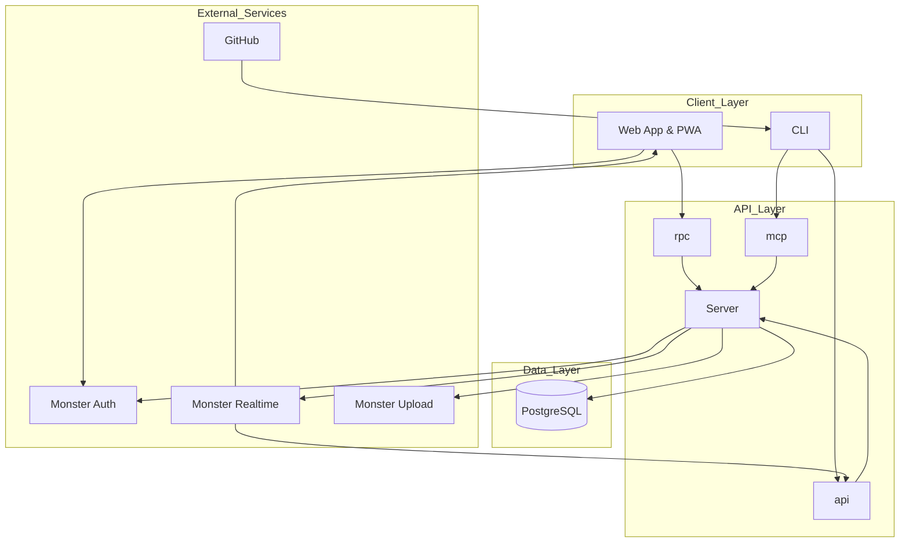
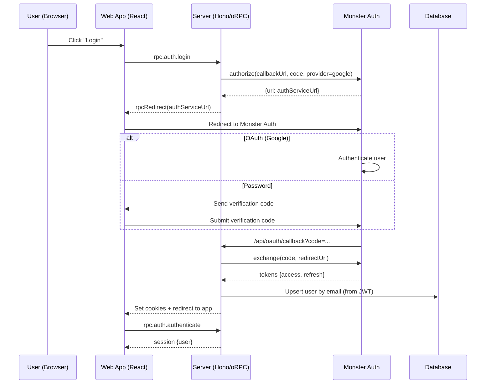
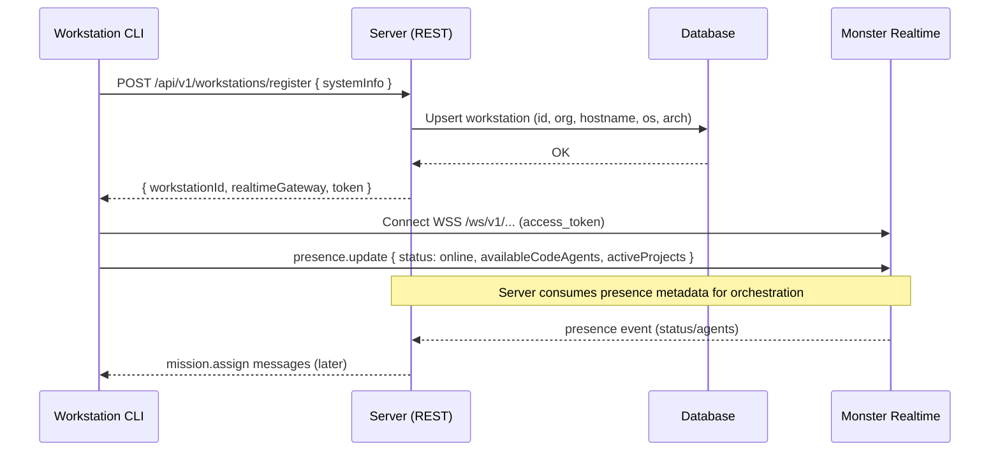
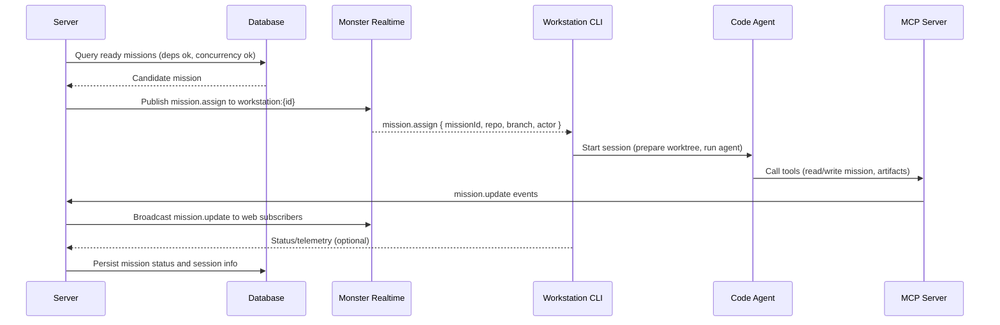
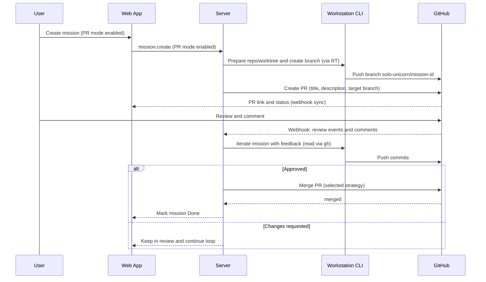

# Solo Unicorn Full-Stack Architecture

## Overview

This document describes the complete architecture for Solo Unicorn v3, an AI-centric platform that orchestrates AI agents through Kanban flows. The system implements a workstation-first architecture where AI agents run locally on user machines, orchestrated by a centralized server via Monster Realtime.

**Note**: This architecture depends on several external Monster services that are hosted in separate repositories:
- **Auth**: Monster Auth. Read more at [Monster Auth](/monster-wiki/shared-services/monster-auth.md).
- **Websocket**: Monster Realtime. Read more at [Monster Realtime](/monster-wiki/shared-services/monster-realtime.md).
- **User uploads**: Monster Upload. Read more at [Monster Upload](/monster-wiki/shared-services/monster-upload.md).

## System Architecture

### High-Level Architecture Diagram

### Core Principles

1. **Workstation-Centric**: AI agents execute locally on user workstations
2. **Real-Time Orchestration**: Server coordinates via Monster Realtime WebSocket
3. **Flexible Flows**: Template-based mission flows with customizable stages
4. **Git Worktree Support**: Parallel development with automatic worktree management
5. **MCP-First Design**: AI agent communication via Model Context Protocol
6. **Multi-Tenancy**: Organization-based isolation with project-level access control

## Component Architecture

### 1. Client Layer

#### Web Application (apps/web)
- **Framework**: React 19 with TanStack Router
- **State Management**: TanStack Query for server state, React Context for UI state
- **UI Components**: shadcn/ui with Tailwind CSS
- **Build Tool**: Vite with TypeScript
- **Communication**: oRPC for internal API, REST for external integrations
- **Real-Time**: WebSocket via Monster Realtime for live updates
- **PWA Support**: Service worker for offline capabilities

#### Command-Line Interface (apps/server CLI)
- **Runtime**: Bun-compiled single-file application
- **Functionality**:
  - Workstation registration and management
  - Git worktree automation
  - Code agent detection and configuration
  - Local development server with tunneling
  - Authentication with Monster Auth
- **Communication**: REST API for server communication, WebSocket via Monster Realtime for real-time

### 2. API Layer

#### Server Application (apps/server)
- **Framework**: Hono.js with oRPC for internal communication
- **Architecture**: Monolithic with clear module separation
- **Endpoints**:
  - `/rpc` - oRPC endpoints for web app (breaking changes allowed)
  - `/api` - REST API for external integrations (backward compatible)
  - `/ws` - WebSocket gateway for real-time communication via Monster Realtime
- **Authentication**: Monster Auth JWT tokens with cookie/session storage
- **Rate Limiting**: Middleware for API protection
- **CORS**: Configured for web app and third-party access

### 3. Service Layer

#### Monster Auth Integration (External Service)
- **Location**: Separate repository/service
- **OAuth Providers**: Google, email/password
- **Token Management**: JWT with refresh token rotation
- **User Identity**: Email as canonical identifier
- **Organization Support**: Multi-tenancy with org-based permissions

#### Monster Realtime Integration (External Service)
- **Location**: Separate repository/service
- **WebSocket Gateway**: Real-time communication channel
- **Presence System**: Workstation status and availability tracking
- **Channel Architecture**:
  - `workstation:{id}` - Direct workstation communication
  - `project:{id}:workstations` - Project-wide workstation updates
  - `mission:{id}` - Mission-specific coordination
- **Message Routing**: Efficient message delivery to relevant parties

#### GitHub Integration
- **Repository Linking**: GitHub numeric repository ID as canonical identifier
- **PR Automation**: Automatic PR creation, review handling, and merging
- **Webhook Support**: Real-time PR event synchronization
- **CLI Integration**: GitHub CLI (`gh`) for PR comment reading

### 4. Data Layer

#### PostgreSQL Database
- **Development**: NeonDB serverless PostgreSQL
- **Production**: Amazon RDS PostgreSQL
- **ORM**: Drizzle ORM for type-safe database operations
- **Schema Design**: ULID primary keys, proper indexing for high-frequency queries
- **Connection Management**: Connection pooling with appropriate configuration

## Module Architecture

### Server Modules (apps/server/src)

#### 1. Authentication Module
- **Location**: `src/lib/auth/`, `src/routers/rpc/auth/`
- **Dependencies**: Monster Auth SDK (external), Database
- **Responsibilities**:
  - Monster Auth integration for JWT token validation and refresh
  - Session management
  - Token validation and refresh via Monster Auth
  - User/Organization lookup
- **Key Components**:
  - `authMiddleware` - Authentication verification using Monster Auth
  - `sessionManager` - Session creation and validation
  - `tokenRefresher` - Automatic token renewal via Monster Auth

#### 2. Workstation Module
- **Location**: `src/routers/rpc/workstation/`, `src/services/workstation/`
- **Dependencies**: Monster Realtime SDK (external), Database
- **Responsibilities**:
  - Workstation registration and lifecycle management
  - Presence tracking via Monster Realtime
  - Agent availability reporting
  - Workstation assignment for missions
- **Key Components**:
  - `workstationRegistry` - Registration and validation
  - `presenceTracker` - Real-time status updates via Monster Realtime
  - `agentReporter` - Agent capability broadcasting via Monster Realtime

#### 3. Mission Module
- **Location**: `src/routers/rpc/mission/`, `src/services/mission/`
- **Dependencies**: Database, MCP SDK
- **Responsibilities**:
  - Mission creation, update, and deletion
  - Flow execution and stage management
  - Dependency resolution and validation
  - Assignment orchestration
- **Key Components**:
  - `missionManager` - CRUD operations
  - `flowEngine` - Flow execution and validation
  - `assignmentOrchestrator` - Mission assignment logic

#### 4. Repository Module
- **Location**: `src/routers/rpc/repository/`, `src/services/repository/`
- **Dependencies**: GitHub API, Git CLI, Database
- **Responsibilities**:
  - GitHub repository linking
  - Git worktree management
  - Repository concurrency controls
  - PR mode configuration
- **Key Components**:
  - `repoManager` - Repository operations
  - `worktreeAutomator` - Automatic worktree creation and cleanup
  - `concurrencyController` - Repository-level mission limits

#### 5. Project Module
- **Location**: `src/routers/rpc/project/`, `src/services/project/`
- **Dependencies**: Database, Auth Service
- **Responsibilities**:
  - Project creation and management
  - Permission system implementation
  - Public project controls
- **Key Components**:
  - `projectManager` - Project operations
  - `permissionEngine` - Role-based access control
  - `visibilityController` - Public/private project management

#### 6. Organization Module
- **Location**: `src/routers/rpc/organization/`, `src/services/organization/`
- **Dependencies**: Database, Auth Service (Monster Auth)
- **Responsibilities**:
  - Organization creation and management
  - Membership and invitation handling
  - Multi-tenancy enforcement
- **Key Components**:
  - `orgManager` - Organization operations
  - `membershipService` - User invitation and role management

#### 7. Code Agent Module
- **Location**: `src/services/agent/`
- **Dependencies**: Monster Realtime (external), Workstation presence
- **Responsibilities**:
  - Agent capability reporting via Monster Realtime
  - Session management
  - MCP tool implementation
- **Key Components**:
  - `agentReporter` - Workstation presence updates via Monster Realtime
  - `sessionTracker` - Agent execution monitoring
  - `mcpAdapter` - MCP tool implementations

### Web Application Modules (apps/web/src)

#### 1. Authentication Module
- **Location**: `src/hooks/useAuth.ts`, `src/components/auth/`
- **Dependencies**: TanStack Query, Monster Auth integration
- **Components**:
  - `LoginForm` - User authentication interface with Monster Auth
  - `AuthCallback` - OAuth callback handler from Monster Auth
  - `SessionProvider` - Authentication state management
- **Hooks**:
  - `useAuth()` - Authentication state and operations via Monster Auth
  - `useSession()` - Current user session

#### 2. Kanban Module
- **Location**: `src/components/kanban/`, `src/routes/projects/$projectId/`
- **Dependencies**: TanStack Query, DnD Kit, Monster Realtime
- **Components**:
  - `KanbanBoard` - Main board interface with real-time updates via Monster Realtime
  - `MissionCard` - Individual mission display
  - `ColumnHeader` - Column titles and controls
  - `DropZone` - Drag-and-drop target areas
- **Hooks**:
  - `useBoardData()` - Board state management
  - `useDragAndDrop()` - Drag-and-drop functionality

#### 3. Mission Module
- **Location**: `src/components/mission/`, `src/routes/missions/`
- **Dependencies**: TanStack Query, oRPC Client
- **Components**:
  - `MissionModal` - Mission creation and editing interface
  - `MissionDetails` - Detailed mission view
  - `FlowEditor` - Flow configuration interface
  - `ReviewPanel` - Review workflow controls
- **Hooks**:
  - `useMission()` - Mission data retrieval
  - `useMissionMutations()` - Mission update operations

#### 4. Project Module
- **Location**: `src/components/project/`, `src/routes/projects/`
- **Dependencies**: TanStack Query, oRPC Client
- **Components**:
  - `ProjectDashboard` - Main project overview
  - `ProjectSettings` - Configuration interface
  - `MemberManager` - Team collaboration tools
  - `RepoManager` - Repository linking controls
- **Hooks**:
  - `useProject()` - Project data retrieval
  - `useProjectMutations()` - Project update operations

## Data Flow Architecture

### 1. Authentication Flow

1. User initiates login from the web app
2. Web calls `rpc.auth.login`; server returns redirect to Monster Auth
3. User authenticates; Monster Auth redirects to server callback with code
4. Server exchanges code for tokens via OpenAuth and verifies JWT
5. Server sets secure HTTP-only cookies (access, refresh)
6. Server upserts user by email based on JWT payload
7. Web calls `rpc.auth.authenticate` to obtain session
8. Subsequent requests include cookies; server refreshes tokens as needed

### 2. Workstation Registration Flow

1. CLI collects system info and generates/loads a workstation ID
2. CLI registers with the server via REST
3. Server upserts workstation in DB and returns realtime params
4. CLI connects to Monster Realtime and joins `workstation:{id}`
5. CLI broadcasts presence (status, agents, projects)
6. Server consumes presence for assignment decisions

### 3. Mission Assignment Flow

1. Server selects ready missions respecting dependencies and concurrency
2. Server publishes `mission.assign` to the chosen workstation channel
3. CLI ensures repo/worktree readiness and starts the code agent session
4. Agent executes and uses MCP to interact with server-side tools/data
5. Server persists and broadcasts mission updates to the web app
6. Timeouts/errors are handled by resetting or reassigning the mission

### 4. PR Mode Workflow

1. User creates a mission with PR mode enabled
2. Server instructs CLI to prepare worktree and push a feature branch
3. Server creates a GitHub PR and syncs PR link/status to the web app
4. Human reviews on GitHub; comments and reviews arrive via webhooks
5. Server instructs CLI/agent to iterate based on feedback (via `gh`)
6. When approved, server merges PR and marks mission Done; otherwise loop continues

## Technology Stack

### Backend (Server)
- **Runtime**: Bun
- **Framework**: Hono.js
- **API**: oRPC (internal), REST (external)
- **Database**: PostgreSQL with Drizzle ORM
- **Real-Time**: WebSocket via Monster Realtime (external service)
- **Authentication**: Monster Auth JWT (external service)
- **AI Communication**: MCP (Model Context Protocol)
- **Deployment**: SST (Serverless Stack) on AWS Lambda

### Frontend (Web)
- **Framework**: React 19 with TanStack Router
- **State Management**: TanStack Query for server state, React Context for UI state
- **UI Components**: shadcn/ui with Tailwind CSS
- **Build Tool**: Vite with TypeScript
- **Communication**: oRPC for internal API, REST for external integrations
- **Real-Time**: WebSocket via Monster Realtime (external service)
- **Deployment**: Cloudflare Pages via SST V3

### CLI
- **Runtime**: Bun-compiled single-file application
- **Functionality**:
  - Workstation registration and management
  - Git worktree automation
  - Code agent detection and configuration
  - Local development server with tunneling
  - Authentication with Monster Auth
- **Communication**: REST API for server communication, WebSocket via Monster Realtime
- **Storage**: OS keychain for secure token storage

### Database
- **Development**: NeonDB (Serverless PostgreSQL)
- **Production**: Amazon RDS PostgreSQL
- **ORM**: Drizzle ORM
- **Migrations**: Drizzle Kit
- **Indexing**: Strategic indexes for high-frequency queries

### Infrastructure
- **Hosting**: Cloudflare (Frontend), AWS (Backend)
- **CDN**: Cloudflare CDN for static assets
- **Monitoring**: AWS CloudWatch
- **Logging**: Structured logging with correlation IDs
- **Security**: JWT tokens, CORS policies, rate limiting

## Security Architecture

### Authentication & Authorization
- **Identity Provider**: Monster Auth (OAuth 2.0/OpenID Connect) - External Service
- **Token Storage**: HTTP-only cookies for web, OS keychain for CLI
- **Session Management**: JWT with refresh token rotation via Monster Auth
- **Authorization**: Role-based access control (RBAC) implemented in application layer
- **Multi-Tenancy**: Organization-based isolation

### Data Protection
- **Encryption**: TLS in transit, encryption at rest for sensitive data
- **Secrets Management**: OS keychain integration, environment variables
- **Input Validation**: Strict validation on all API inputs
- **SQL Injection**: Parameterized queries via Drizzle ORM
- **XSS Prevention**: Sanitization of user-generated content

### API Security
- **Rate Limiting**: Per-endpoint and per-user rate limits
- **CORS**: Proper configuration for web app and third-party access
- **Authentication**: Required for all protected endpoints via Monster Auth
- **Authorization**: Checked at application layer for all operations
- **Audit Logging**: Comprehensive logging of security-relevant events

## Scalability & Performance

### Horizontal Scaling
- **Serverless**: AWS Lambda functions automatically scale
- **Database**: Connection pooling and read replicas
- **Caching**: Redis for frequently accessed data
- **CDN**: Cloudflare CDN for static asset distribution

### Performance Optimization
- **Database Indexes**: Strategic indexes for high-frequency queries
- **Query Optimization**: Efficient queries with proper joins and subqueries
- **Caching**: HTTP caching headers, in-memory caching for hot data
- **Connection Pooling**: Database connection pooling for efficient resource usage
- **Async Processing**: Non-blocking I/O for improved throughput

### Monitoring & Observability
- **Metrics**: Custom metrics for key performance indicators
- **Logging**: Structured logging with correlation IDs
- **Tracing**: Distributed tracing for request flow visualization
- **Alerting**: Automated alerts for system anomalies
- **Dashboards**: Real-time dashboards for system health

## Deployment Architecture

### Development Environment
- **Local Development**: Bun runtime with hot reloading
- **Database**: Local PostgreSQL or NeonDB branch
- **Services**: Mock services for Monster Auth and Monster Realtime
- **Testing**: Unit, integration, and end-to-end tests

### Staging Environment (Alpha)
- **Infrastructure**: AWS staging account
- **Database**: NeonDB for serverless PostgreSQL
- **Frontend**: Cloudflare Pages preview deployments
- **Monitoring**: Basic monitoring and alerting
- **External Services**: Integration with staging instances of Monster Auth and Monster Realtime

### Production Environment
- **Infrastructure**: AWS production account
- **Database**: Amazon RDS PostgreSQL
- **Frontend**: Cloudflare Pages with production domain
- **Monitoring**: Comprehensive monitoring, alerting, and dashboards
- **Backup**: Automated database backups and disaster recovery
- **External Services**: Integration with production instances of Monster Auth and Monster Realtime

## Dependency on External Services

### Monster Auth (External Service)
- **Purpose**: Authentication and identity management
- **Integration**: OAuth 2.0/OpenID Connect provider
- **Responsibilities**:
  - User authentication and identity management
  - JWT token issuance and validation
  - Multi-provider support (Google, email/password)
  - Organization-based multi-tenancy
- **API**: RESTful endpoints for authentication flows
- **Security**: Industry-standard security practices

### Monster Realtime (External Service)
- **Purpose**: Real-time communication and presence tracking
- **Integration**: WebSocket gateway for real-time communication
- **Responsibilities**:
  - Real-time messaging between server and clients
  - Presence tracking and status updates
  - Channel-based message routing
  - Connection management and scaling
- **API**: WebSocket protocol with REST management endpoints
- **Scalability**: Horizontally scalable architecture

### Monster Upload (External Service)
- **Purpose**: File upload and storage service
- **Integration**: RESTful API for file management
- **Responsibilities**:
  - Secure file uploads with signed URLs
  - Content delivery network integration
  - File metadata management
  - Access control and permissions
- **API**: RESTful endpoints for upload management
- **Storage**: Cloud storage integration (AWS S3, Cloudflare R2, etc.)

## Disaster Recovery & Backup

### Data Backup
- **Database**: Automated daily snapshots with point-in-time recovery
- **Configuration**: Version-controlled infrastructure as code
- **Assets**: CDN-distributed static assets with multiple replicas

### Recovery Procedures
- **Database**: Point-in-time recovery from snapshots
- **Infrastructure**: Infrastructure as code for quick rebuild
- **Services**: Health checks and automatic failover
- **Monitoring**: Automated alerts for system degradation

## Future Enhancements

### Short-Term (Post-MVP)
1. **Advanced Analytics**: Mission performance and agent effectiveness metrics
2. **Multi-Agent Orchestration**: Coordination of multiple agents on complex missions
3. **Extended Collaboration**: Real-time co-editing and commenting
4. **Enhanced Mobile**: Native mobile applications

### Long-Term
1. **Enterprise Features**: Advanced security, compliance, and governance
2. **AI Model Marketplace**: Support for multiple AI models and providers
3. **Low-Code Integration**: Visual workflow builder and integrations
4. **Extended Integrations**: Jira, Linear, Slack, and other development tools

## Conclusion

This architecture provides a solid foundation for Solo Unicorn v3, enabling the workstation-first AI agent orchestration model while maintaining scalability, security, and performance. The modular design allows for incremental development and future enhancements while the integration with Monster services (Auth, Realtime, Upload) provides robust authentication, real-time communication, and file storage capabilities.

The system is designed with clear separation between the core Solo Unicorn functionality and the external Monster services, ensuring that Solo Unicorn can evolve independently while leveraging enterprise-grade infrastructure services.
