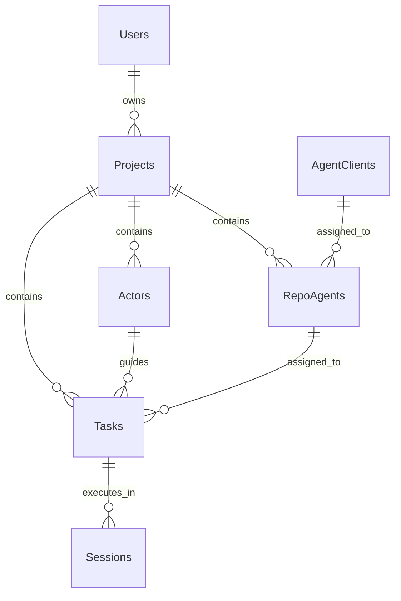
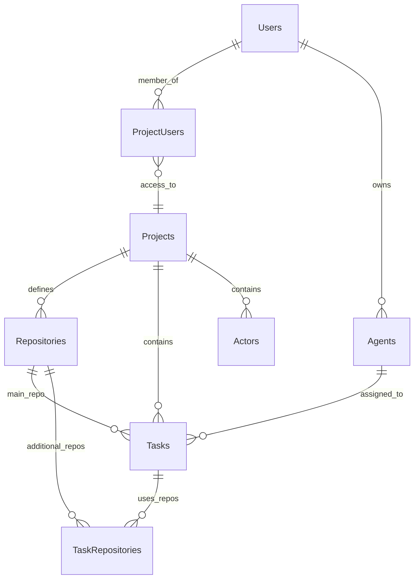

# Solo Unicorn V2 Architecture Plan

## Executive Summary

This document outlines the architectural evolution of Solo Unicorn from a single-project system to a robust multi-project platform that better supports multiple Claude Code accounts, flexible repository management, and sophisticated agent orchestration.

## Current Situation & Requirements

### Key Findings & Context

1. **Current Usage Pattern**: Primarily using Claude Code agent client type, which remains the most powerful option
2. **Claude Code Max Subscription**: Monthly access with unknown rate limits (hourly, daily, or monthly) that change without notice
3. **Claude Code Capabilities**:
   - Supports additional working directories for multi-repo access
   - Can switch accounts via `CLAUDE_CONFIG_DIR` environment variable
   - Rate limit refresh times are provided when limits are hit
4. **Conflict Management Philosophy**: Easier to maintain one active session per repo to avoid git conflicts, but should be configurable
5. **Rate Limit Handling**: Need to re-feed ongoing tasks when rate limits refresh

### Current Limitations Requiring Solutions

1. **Single Active Session**: Only one agent client session across entire application
2. **Project Isolation**: Multiple projects cannot operate independently
3. **Repository Inflexibility**: Current repo agent model too rigid for multi-repo workflows
4. **Account Management**: No support for multiple Claude Code accounts
5. **Session Management**: Need configurable concurrency limits per repository
6. **Class-Based Architecture**: V1 uses classes which are harder to test and maintain - V2 will use function modules

## Current Architecture Analysis

### Technical Analysis

1. **Agent Orchestrator Limitations**: Current `calculateAgentClientVacancy` operates at application level, not per-project or per-repository
2. **Session Tracking**: Current system tracks sessions in database but with limited flexibility for concurrent operations
3. **Resource Allocation**: No mechanism for distributing agent resources across multiple projects efficiently

### Current Data Model (Simplified)



## Proposed New Architecture

### Core Design Principles

1. **User-Centric Resource Management**: Agents belong to users, not projects
2. **Flexible Repository Access**: Projects define repo lists with configurable working directories
3. **Intelligent Rate Limit Handling**: Account switching and multi-account support
4. **Granular Concurrency Control**: Per-repo concurrency limits with project-level configuration
5. **Authorization-First**: All operations secured with project-user authorization

### New Data Model



## Detailed Schema Changes

### 1. User-Project Many-to-Many Relationship

```sql
-- New table for project membership
CREATE TABLE project_users (
  id UUID PRIMARY KEY DEFAULT gen_random_uuid(),
  user_id UUID NOT NULL REFERENCES users(id) ON DELETE CASCADE,
  project_id UUID NOT NULL REFERENCES projects(id) ON DELETE CASCADE,
  role TEXT NOT NULL DEFAULT 'member', -- member, admin (for future)
  created_at TIMESTAMP DEFAULT NOW() NOT NULL,
  UNIQUE(user_id, project_id)
);
```

### 2. User-Owned Agents

```sql
-- Agents table (replaces agentClients, now user-owned)
CREATE TABLE agents (
  id UUID PRIMARY KEY DEFAULT gen_random_uuid(),
  user_id UUID NOT NULL REFERENCES users(id) ON DELETE CASCADE,
  name TEXT NOT NULL, -- Auto-generated or user-defined
  agent_type TEXT NOT NULL DEFAULT 'CLAUDE_CODE', -- CLAUDE_CODE, CURSOR_CLI, OPENCODE
  agent_settings JSONB DEFAULT '{}' NOT NULL, -- { CLAUDE_CONFIG_DIR, etc. }
  max_concurrency_limit INTEGER DEFAULT 1, -- User configurable concurrency limit per agent
  last_task_pushed_at TIMESTAMP, -- Track when agent last got assigned a task
  state JSONB DEFAULT '{}' NOT NULL, -- Current state tracking (rate limits, etc.)
  created_at TIMESTAMP DEFAULT NOW() NOT NULL,
  updated_at TIMESTAMP DEFAULT NOW() NOT NULL
);
```

### 3. Project Repositories

```sql
-- Repositories table (replaces repo agents)
CREATE TABLE repositories (
  id UUID PRIMARY KEY DEFAULT gen_random_uuid(),
  project_id UUID NOT NULL REFERENCES projects(id) ON DELETE CASCADE,
  name TEXT NOT NULL,
  repo_path TEXT NOT NULL, -- Local filesystem path
  is_default BOOLEAN DEFAULT FALSE, -- One default per project
  max_concurrency_limit INTEGER DEFAULT 1, -- User configurable concurrency limit per repository
  last_task_pushed_at TIMESTAMP, -- Track when repo last got assigned a task
  created_at TIMESTAMP DEFAULT NOW() NOT NULL,
  updated_at TIMESTAMP DEFAULT NOW() NOT NULL
);
```

### 4. Enhanced Task Management

```sql
-- Updated tasks table - keep actor linkage, add session tracking
ALTER TABLE tasks
ADD COLUMN main_repository_id UUID NOT NULL REFERENCES repositories(id),
ADD COLUMN last_agent_session_id TEXT; -- Store agent session ID directly

-- Task-Repository many-to-many for additional repos
CREATE TABLE task_repositories (
  id UUID PRIMARY KEY DEFAULT gen_random_uuid(),
  task_id UUID NOT NULL REFERENCES tasks(id) ON DELETE CASCADE,
  repository_id UUID NOT NULL REFERENCES repositories(id) ON DELETE CASCADE,
  created_at TIMESTAMP DEFAULT NOW() NOT NULL,
  UNIQUE(task_id, repository_id)
);

-- Task-Agent many-to-many assignment
CREATE TABLE task_agents (
  id UUID PRIMARY KEY DEFAULT gen_random_uuid(),
  task_id UUID NOT NULL REFERENCES tasks(id) ON DELETE CASCADE,
  agent_id UUID NOT NULL REFERENCES agents(id) ON DELETE CASCADE,
  created_at TIMESTAMP DEFAULT NOW() NOT NULL,
  UNIQUE(task_id, agent_id)
);

-- No sessions table needed - session tracking handled via tasks.last_agent_session_id
```

### 5. Project Configuration

```sql
-- Add concurrency limits to projects
ALTER TABLE projects
ADD COLUMN repo_concurrency_limit INTEGER DEFAULT 1,
ADD COLUMN settings JSONB DEFAULT '{}';
```

## New Task Creation Flow

### UI Changes

```typescript
interface CreateTaskForm {
  title: string;
  description?: string;
  mainRepository: string; // Required - dropdown of project repos
  additionalRepositories: string[]; // Optional - multi-select
  assignedAgents: string[]; // Multi-select from user's agents
  actor?: string; // Optional actor assignment
  priority: 1 | 2 | 3 | 4 | 5;
  attachments?: File[];
}
```

### Backend Validation

1. Verify user has access to selected project
2. Validate repositories belong to the project
3. Confirm agents belong to the requesting user
4. Ensure at least one agent is assigned

## V2 Agent Orchestration Architecture

### Core Design Changes from V1

V2 introduces significant simplifications and improvements:

1. **Function-Based Modules**: Replace classes with pure functions for better testability
2. **Simplified Session Tracking**: Use `tasks.agentSessionStatus` as primary indicator instead of complex state
3. **Dual Concurrency Limits**: Both repositories and agents have configurable concurrency limits
4. **Enhanced Delay Handling**: Utilize `lastTaskPushedAt` timestamps for startup delays

### Key Components

1. **Repository Session Tracking**: Monitor active sessions per repository using `agentSessionStatus`
2. **Agent Session Tracking**: Monitor active sessions per agent using `agentSessionStatus`
3. **Delay Compensation**: Use `lastTaskPushedAt` on both agents and repositories
4. **Rate Limit Management**: Simplified rate limit checking without complex timestamps

### V2 Function Module Architecture

V2 replaces the following V1 class-based files with function modules:

#### Files to Replace:
- `apps/server/src/agents/agent-orchestrator.ts` → `apps/server/src/agents/v2/orchestrator.ts`
- `apps/server/src/agents/claude-code-client.ts` → `apps/server/src/agents/v2/claude-code-client.ts`

#### Function Module Benefits:
1. **Better Testability**: Pure functions are easier to unit test
2. **Reduced Complexity**: No `this` binding or class state management
3. **Functional Composition**: Functions can be easily composed and reused
4. **Tree Shaking**: Better dead code elimination in bundlers

### Session Counting Logic (Detailed Explanation)

#### getActiveRepositorySessionsAmount(repositoryId) Logic

This function determines how many tasks are currently using a specific repository:

1. **Task Selection Criteria**: Find all tasks where either:
   - The task's `mainRepositoryId` equals the target repository, OR
   - The task has the repository listed in its `taskRepositories` (additional repos)

2. **Active Session Indicators**: Only count tasks that meet ALL conditions:
   - `agentSessionStatus = 'ACTIVE'` (agent is currently working on this task)
   - `status != 'done'` (task is not completed)
   - Task must be assigned to at least one agent (via `taskAgents` table)

3. **Key Insight**: We rely on `agentSessionStatus` as the primary indicator rather than tracking separate session states. This is simpler and more reliable because:
   - When orchestrator assigns a task, it immediately sets `agentSessionStatus = 'ACTIVE'`
   - When agent completes work, it uses MCP to set `agentSessionStatus = 'INACTIVE'`
   - No complex timing logic or state transitions needed

4. **Repository Usage Counting**: A repository is "occupied" by any task that references it, regardless of whether it's the main repo or additional repo for that task.

#### getActiveAgentSessionsAmount(agentId) Logic

This function determines how many tasks a specific agent is currently working on:

1. **Task Selection Criteria**: Find all tasks where:
   - The agent is assigned to the task (via `taskAgents` table)
   - `agentSessionStatus = 'ACTIVE'` (agent is actively working)
   - `status != 'done'` (task is not completed)

2. **Agent Workload Tracking**: Simple count of concurrent tasks per agent
   - Default limit is 1 concurrent task per agent (configurable via `maxConcurrencyLimit`)
   - Prevents overloading agents and maintains session quality

3. **Cross-Repository Work**: An agent can work on tasks across different repositories simultaneously (if limits allow)

#### Delay Handling with lastTaskPushedAt

Both repositories and agents track `lastTaskPushedAt` to handle the startup delay:

1. **Repository Delay Logic**:
   - When a task is assigned to a repository, update `repositories.lastTaskPushedAt`
   - For next 20-30 seconds, consider repository "recently assigned" even if agent hasn't started MCP communication
   - Prevents double-assignment during startup window

2. **Agent Delay Logic**:
   - When an agent gets assigned a task, update `agents.lastTaskPushedAt`
   - Similar 20-30 second cooldown period to prevent overwhelming the agent
   - Allows time for Claude Code session to start and establish MCP connection

3. **Why Both Are Needed**:
   - Repository tracking prevents multiple tasks being assigned to same repo during startup
   - Agent tracking prevents single agent from getting multiple tasks rapidly
   - Together they provide robust protection against race conditions

#### Rate Limit Integration

Agent availability also considers rate limit status stored in `agents.state`:

1. **Rate Limit Check**: If `state.rateLimitResetAt` exists and is in the future, agent is unavailable
2. **Simplified State**: V2 removes `lastMessagedAt`, `lastSessionCreatedAt`, `lastSessionCompletedAt` - these proved unreliable
3. **Focus on Core Indicators**: Primary reliance on `agentSessionStatus` and `lastTaskPushedAt` for accurate state tracking

### Repository Session Vacancy Calculation

```typescript
interface RepositorySessionState {
  repositoryId: string;
  activeSessions: SessionInfo[];
  maxConcurrencyLimit: number; // User configurable per project
  lastActivityTimestamp: Date;
}

interface SessionInfo {
  taskId: string;
  agentId: string;
  agentSessionId?: string; // May be null during startup delay
  startedAt: Date;
  lastMcpUpdate?: Date; // When agent last updated via MCP
  status: 'starting' | 'active' | 'idle' | 'completing';
}

class EnhancedAgentOrchestrator {

  /**
   * Calculate if a repository can accept new sessions
   * Accounts for:
   * - Current active session count vs configured limit
   * - Sessions in startup phase (not yet confirmed via MCP)
   * - Agent availability and rate limits
   */
  private async calculateRepositoryVacancy(
    repositoryId: string
  ): Promise<'Available' | 'AtLimit' | 'NoAgents'> {

    // Get repository configuration and current sessions
    const repoConfig = await this.getRepositoryConfig(repositoryId);
    const activeSessions = await this.getActiveRepositorySessions(repositoryId);

    // Check if we're at the concurrency limit
    if (activeSessions.length >= repoConfig.maxSessions) {
      return 'AtLimit';
    }

    // Check if any agents are available for this repository
    const availableAgents = await this.getAvailableAgentsForRepository(repositoryId);
    if (availableAgents.length === 0) {
      return 'NoAgents';
    }

    return 'Available';
  }

  /**
   * Get active sessions for a repository
   * Includes sessions in all states except completed
   */
  private async getActiveRepositorySessions(repositoryId: string): Promise<SessionInfo[]> {

    // Query tasks that are currently using this repository
    const activeTasks = await db
      .select({
        task: tasks,
        agent: agents
      })
      .from(tasks)
      .innerJoin(taskAgents, eq(taskAgents.taskId, tasks.id))
      .innerJoin(agents, eq(agents.id, taskAgents.agentId))
      .where(
        and(
          or(
            eq(tasks.mainRepositoryId, repositoryId),
            exists(
              db.select()
                .from(taskRepositories)
                .where(
                  and(
                    eq(taskRepositories.taskId, tasks.id),
                    eq(taskRepositories.repositoryId, repositoryId)
                  )
                )
            )
          ),
          eq(tasks.agentSessionStatus, 'ACTIVE'), // Only working tasks count as active sessions
          ne(tasks.status, 'done')
        )
      );

    return activeTasks.map(({ task, agent }) => ({
      taskId: task.id,
      agentId: agent.id,
      agentSessionId: task.lastAgentSessionId,
      startedAt: task.lastAgentSessionStartedAt || task.updatedAt,
      lastMcpUpdate: this.getLastMcpUpdateTime(task.id),
      status: this.determineSessionStatus(task, agent)
    }));
  }

  /**
   * Determine session status based on task state and timing
   */
  private determineSessionStatus(task: Task, agent: Agent): SessionInfo['status'] {
    const now = new Date();
    const workingSince = task.lastAgentSessionStartedAt || task.updatedAt;
    const timeSinceStart = now.getTime() - workingSince.getTime();

    // If no agent session ID yet and started recently, it's starting
    if (!task.lastAgentSessionId && timeSinceStart < 30 * 1000) { // 30 second startup window
      return 'starting';
    }

    // Check agent state for rate limits or completion signals
    const agentState = agent.state as any || {};

    // If agent recently messaged and task is still ai working, it's active
    if (agentState.lastMessagedAt) {
      const lastMessage = new Date(agentState.lastMessagedAt).getTime();
      const timeSinceMessage = now - lastMessage;

      if (timeSinceMessage < 2 * 60 * 1000) { // Active within 2 minutes
        return 'active';
      }
    }

    // Check if session recently completed
    if (agentState.lastSessionCompletedAt) {
      const sessionCompleted = new Date(agentState.lastSessionCompletedAt).getTime();
      const timeSinceCompletion = now - sessionCompleted;

      if (timeSinceCompletion < 10 * 1000) { // Completed within 10 seconds
        return 'completing';
      }
    }

    // Default to idle if agent hasn't been active recently
    return 'idle';
  }
}
```

### Agent Availability Calculation

```typescript
/**
 * Find agents available for assignment to a repository
 * Considers:
 * - Agent rate limit status
 * - Agent current workload across all repositories
 * - Agent configuration compatibility
 */
private async getAvailableAgentsForRepository(
  repositoryId: string
): Promise<Agent[]> {

  // Get all agents that could work on tasks for this repository
  const candidateAgents = await db
    .select({ agent: agents })
    .from(agents)
    .innerJoin(taskAgents, eq(taskAgents.agentId, agents.id))
    .innerJoin(tasks, eq(tasks.id, taskAgents.taskId))
    .where(
      and(
        or(
          eq(tasks.mainRepositoryId, repositoryId),
          exists(
            db.select()
              .from(taskRepositories)
              .where(
                and(
                  eq(taskRepositories.taskId, tasks.id),
                  eq(taskRepositories.repositoryId, repositoryId)
                )
              )
          )
        ),
        eq(tasks.ready, true),
        ne(tasks.status, 'done')
      )
    )
    .groupBy(agents.id);

  const availableAgents: Agent[] = [];

  for (const { agent } of candidateAgents) {
    const isAvailable = await this.isAgentAvailable(agent);
    if (isAvailable) {
      availableAgents.push(agent);
    }
  }

  return availableAgents;
}

/**
 * Check if an individual agent is available for new work
 */
private async isAgentAvailable(agent: Agent): Promise<boolean> {
  const state = agent.state as any || {};
  const now = new Date().getTime();

  // Check rate limit status
  if (state.rateLimitResetAt) {
    const resetTime = new Date(state.rateLimitResetAt).getTime();
    if (resetTime > now) {
      return false; // Still rate limited
    }
  }

  // Check recent task assignment cooldown
  if (state.lastTaskPushedAt) {
    const lastPushTime = new Date(state.lastTaskPushedAt).getTime();
    const timeSinceLastPush = now - lastPushTime;

    if (timeSinceLastPush <= 20 * 1000) { // 20 second cooldown
      return false;
    }
  }

  // Check current workload - count active tasks across all repositories
  const activeTaskCount = await db
    .select({ count: sql`count(*)` })
    .from(tasks)
    .innerJoin(taskAgents, eq(taskAgents.taskId, tasks.id))
    .where(
      and(
        eq(taskAgents.agentId, agent.id),
        eq(tasks.agentSessionStatus, 'ACTIVE'),
        ne(tasks.status, 'done')
      )
    );

  // For now, limit agents to 1 concurrent task, but make this configurable later
  const maxConcurrentTasks = 1;
  if ((activeTaskCount?.[0]?.count as number) >= maxConcurrentTasks) {
    return false;
  }

  return true;
}
```

### Session Assignment & Startup Handling

```typescript
/**
 * Assign a task to an available agent and repository
 * Handles the startup delay between session creation and MCP communication
 */
private async assignTaskToAgent(
  task: Task,
  agent: Agent,
  mainRepo: Repository,
  additionalRepos: Repository[]
): Promise<void> {

  try {
    // Mark task as AI working immediately to prevent double assignment
    await db
      .update(tasks)
      .set({
        agentSessionStatus: 'ACTIVE',
        lastAgentSessionStartedAt: new Date(),
        status: 'doing',
        stage: task.stage || 'refine'
      })
      .where(eq(tasks.id, task.id));

    // Update agent state
    await this.updateAgentState(agent.id, {
      lastTaskPushedAt: new Date().toISOString()
    });

    // Create Claude Code session with main + additional working directories
    const sessionOptions = {
      projectPath: mainRepo.repoPath,
      additionalWorkingDirectories: additionalRepos.map(r => r.repoPath),
      agentConfig: agent.agentSettings,
      // ... other session options
    };

    // Start the session (this may take time before agent responds via MCP)
    await this.claudeCodeClient.startSession(prompt, sessionOptions);

    // Session ID will be updated later when agent communicates back via MCP

  } catch (error) {
    // Reset task state on error
    await db
      .update(tasks)
      .set({
        agentSessionStatus: 'INACTIVE',
        lastAgentSessionStartedAt: null,
        status: 'todo',
        stage: null
      })
      .where(eq(tasks.id, task.id));

    throw error;
  }
}
```

### Flexible Concurrency Limit Configuration

```typescript
interface ProjectSettings {
  repositoryConcurrencyLimits: {
    [repositoryId: string]: number; // Per-repo concurrency limits
  };
  globalConcurrencyLimit?: number; // Optional overall project limit
  agentConcurrencyLimit?: number; // Max tasks per agent
}

/**
 * Get effective concurrency limit for a repository
 * Considers project-level settings and repository-specific overrides
 */
async getRepositoryConcurrencyLimit(repositoryId: string): Promise<number> {
  const repository = await db.query.repositories.findFirst({
    where: eq(repositories.id, repositoryId),
    with: { project: true }
  });

  if (!repository) return 1; // Default to 1 if repo not found

  const projectSettings = repository.project.settings as ProjectSettings || {};

  // Check for repository-specific limit
  if (projectSettings.repositoryConcurrencyLimits?.[repositoryId]) {
    return projectSettings.repositoryConcurrencyLimits[repositoryId];
  }

  // Fall back to project default (usually 1 to avoid conflicts)
  return projectSettings.globalConcurrencyLimit || 1;
}
```

### Main Orchestration Loop

```typescript
/**
 * Main logic - runs every second
 * Checks each repository for vacancy and assigns tasks accordingly
 */
async checkAndAssignTasks(): Promise<void> {

  // Get all repositories that have ready tasks
  const repositoriesWithTasks = await this.getRepositoriesWithReadyTasks();

  for (const repository of repositoriesWithTasks) {

    // Check if repository can accept new sessions
    const vacancy = await this.calculateRepositoryVacancy(repository.id);

    if (vacancy === 'Available') {

      // Find the highest priority ready task for this repository
      const nextTask = await this.getNextTaskForRepository(repository.id);

      if (nextTask) {

        // Find available agents assigned to this task
        const availableAgents = await this.getAvailableAgentsForTask(nextTask.id);

        if (availableAgents.length > 0) {

          // Select best agent (could be based on workload, last used, etc.)
          const selectedAgent = this.selectBestAgent(availableAgents);

          // Get additional repositories for this task
          const additionalRepos = await this.getAdditionalRepositoriesForTask(nextTask.id);

          // Assign the task
          await this.assignTaskToAgent(nextTask, selectedAgent, repository, additionalRepos);

          this.logger.info('Task assigned', {
            taskId: nextTask.id,
            agentId: selectedAgent.id,
            repositoryId: repository.id,
            additionalRepos: additionalRepos.length
          });
        }
      }
    }
  }
}
```

This orchestrator design provides:

1. **Flexible Session Limits**: User-configurable per repository and project
2. **Startup Delay Handling**: Accounts for time between session start and MCP communication
3. **Multi-Repository Support**: Tasks can span multiple repositories with main + additional
4. **Intelligent Agent Selection**: Considers availability, rate limits, and current workload
5. **Robust State Tracking**: Monitors session states through multiple phases

## Claude Code Integration Enhancements

### Multiple Account Support

```typescript
interface ClaudeCodeAgent {
  id: string;
  userId: string;
  agentSettings: {
    CLAUDE_CONFIG_DIR?: string; // For account switching
    additionalSettings?: Record<string, any>;
  };
}
```

### Session Management

```typescript
interface ClaudeCodeSession {
  projectPath: string; // Main repository path
  additionalWorkingDirectories: string[]; // Additional repos
  agentConfig: ClaudeCodeAgent['agentSettings'];
  sessionOptions: {
    cwd: string;
    resume?: boolean;
    sessionId?: string;
  };
}
```

## Migration Strategy

### Phase 1: Database Schema Migration

1. Create new tables (`project_users`, `agents`, `repositories`, `task_repositories`, `task_agents`)
2. Migrate existing data:
   - Convert `agentClients` to user-owned `agents`
   - Convert `repoAgents` to project `repositories`
   - Create default project memberships for existing users
   - Migrate task assignments

### Phase 2: API Updates

1. Add authorization middleware for project access
2. Update task creation endpoints
3. Implement new agent management APIs
4. Add repository management endpoints

### Phase 3: Agent Orchestrator Overhaul

1. Implement repository-based vacancy calculation
2. Add multi-agent task assignment logic
3. Integrate Claude Code additional working directories
4. Implement rate limit handling with account switching

### Phase 4: UI Updates

1. Multi-select components for repos and agents
2. Agent management interface
3. Repository configuration UI
4. Enhanced task creation form

## Benefits Analysis

### Scalability Improvements

- **Multi-Project Support**: True isolation and resource allocation per project
- **Concurrent Sessions**: Multiple active sessions across different repositories
- **Resource Efficiency**: Better utilization of Claude Code accounts and rate limits

### Flexibility Gains

- **Repository Independence**: Projects can define any number of repositories
- **Agent Flexibility**: Users can configure multiple agents with different settings
- **Concurrency Control**: Configurable concurrency limits per project

### Rate Limit Optimization

- **Account Switching**: Automatic failover between Claude Code accounts
- **Intelligent Queuing**: Better task distribution based on agent availability
- **Rate Limit Recovery**: Automatic re-feeding when limits reset

## Risk Assessment

### Migration Complexity

**Risk**: Data migration complexity with existing projects
**Mitigation**: Comprehensive migration scripts with rollback capabilities

### Session Management

**Risk**: Increased complexity in managing multiple concurrent sessions
**Mitigation**: Robust session tracking and cleanup mechanisms

### Resource Contention

**Risk**: Multiple projects competing for the same repositories
**Mitigation**: Clear repository ownership model and conflict detection

## Implementation Timeline

### Week 1-2: Database Schema
- Design and implement new schema
- Create migration scripts
- Test data migration on development environment

### Week 3-4: Backend APIs
- Implement authorization layer
- Update existing APIs for new data model
- Create new agent and repository management endpoints

### Week 5-6: Agent Orchestrator
- Rewrite orchestrator for repository-based logic
- Implement multi-agent assignment
- Add Claude Code integration enhancements

### Week 7-8: Frontend Updates
- Update UI components for new workflows
- Implement agent and repository management interfaces
- Update task creation flow

### Week 9: Testing & Deployment
- Comprehensive testing across multiple projects
- Performance optimization
- Production deployment with monitoring

## Configuration Examples

### Project Repository Setup

```json
{
  "projectId": "proj-123",
  "repositories": [
    {
      "name": "Main Backend",
      "path": "/home/user/repos/backend",
      "isDefault": true
    },
    {
      "name": "Frontend",
      "path": "/home/user/repos/frontend",
      "isDefault": false
    },
    {
      "name": "Shared Utils",
      "path": "/home/user/repos/utils",
      "isDefault": false
    }
  ],
  "repoSessionLimit": 2
}
```

### User Agent Configuration

```json
{
  "userId": "user-456",
  "agents": [
    {
      "name": "Claude Pro Account",
      "agentType": "CLAUDE_CODE",
      "agentSettings": {
        "CLAUDE_CONFIG_DIR": "/home/user/.claude-pro"
      }
    },
    {
      "name": "Claude Personal",
      "agentType": "CLAUDE_CODE",
      "agentSettings": {
        "CLAUDE_CONFIG_DIR": "/home/user/.claude-personal"
      }
    }
  ]
}
```

### Task Assignment Example

```json
{
  "taskId": "task-789",
  "mainRepository": "Main Backend",
  "additionalRepositories": ["Frontend", "Shared Utils"],
  "assignedAgents": ["Claude Pro Account"],
  "claudeCodeConfig": {
    "projectPath": "/home/user/repos/backend",
    "additionalWorkingDirectories": [
      "/home/user/repos/frontend",
      "/home/user/repos/utils"
    ]
  }
}
```

## Conclusion

This new architecture addresses the core limitations of the current single-project system while maintaining the simplicity and local-first principles of Solo Unicorn. The user-centric agent model, flexible repository management, and enhanced Claude Code integration provide a robust foundation for multi-project development workflows.

The migration strategy ensures a smooth transition with minimal disruption to existing workflows, while the new capabilities enable significantly more sophisticated development scenarios including multi-repository projects, account management, and intelligent resource allocation.
