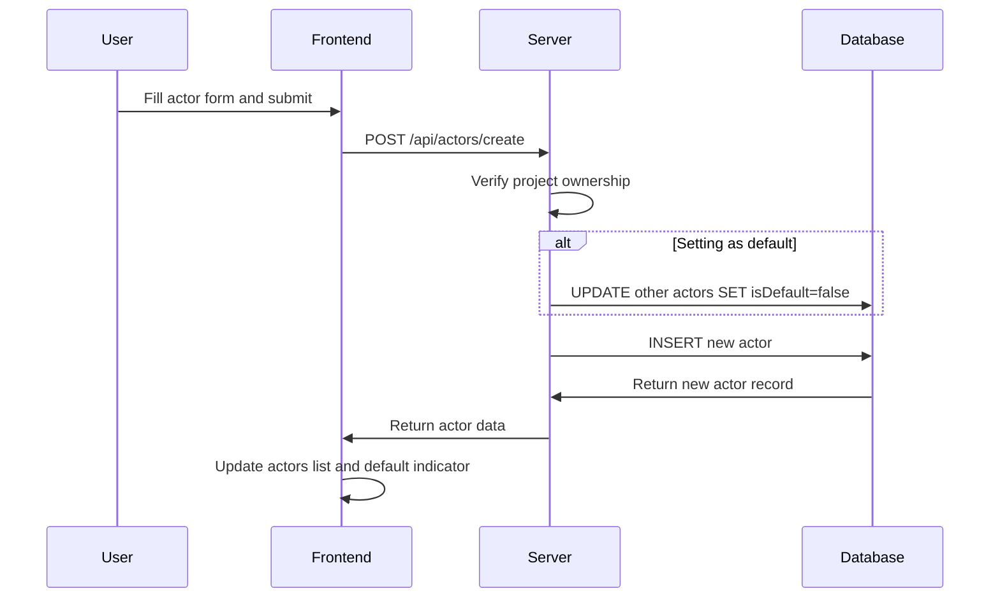
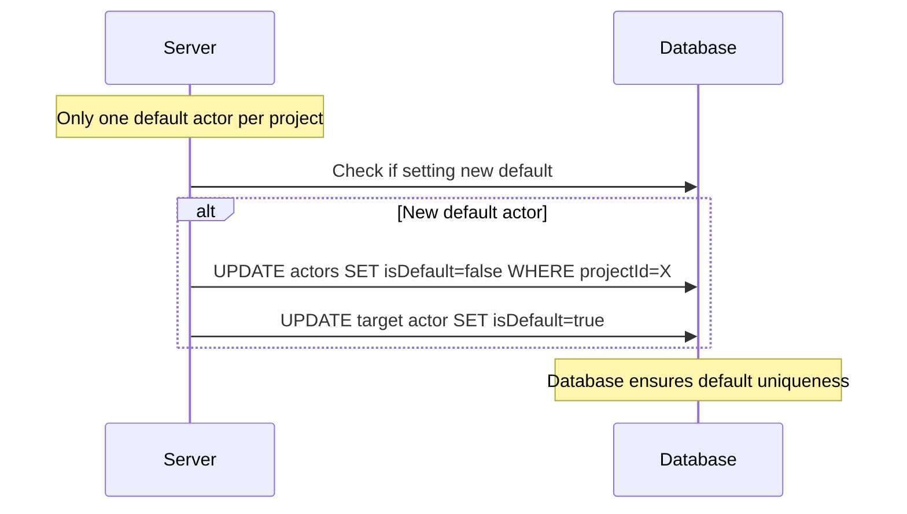
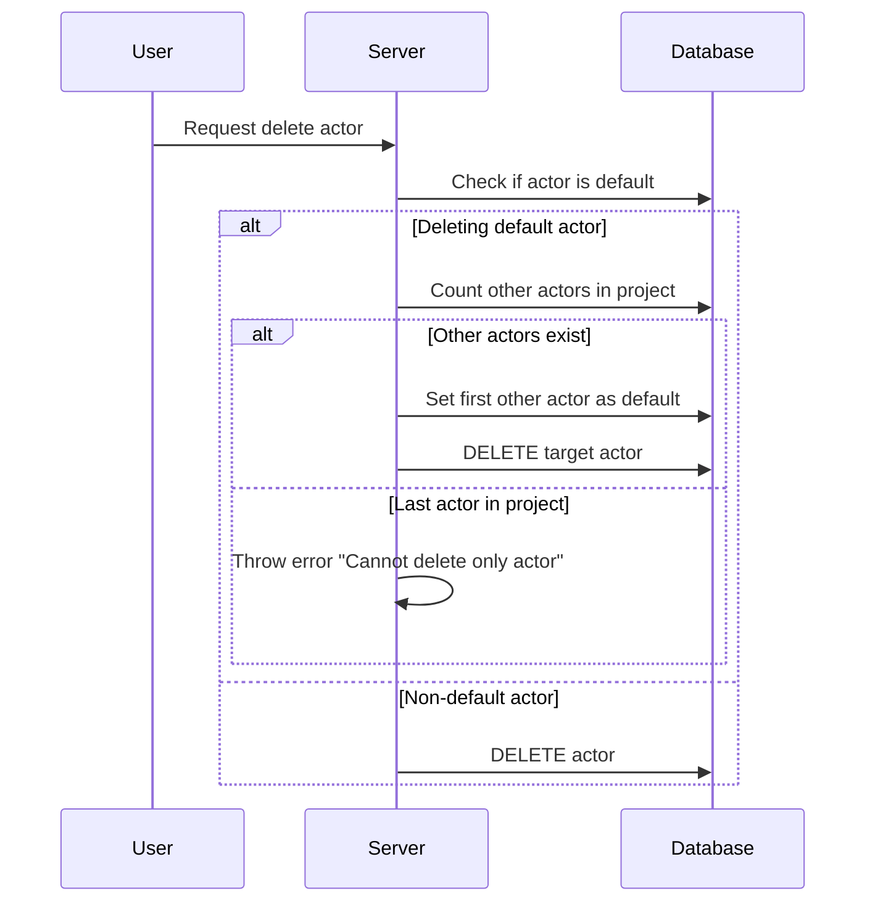
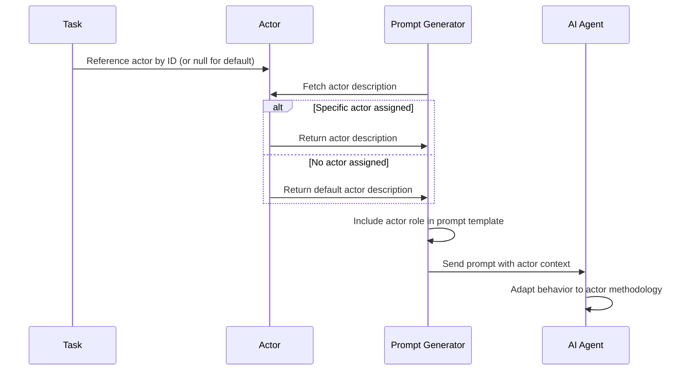

# Actor Management

## Overview

Actors in Solo Unicorn define AI agent personalities and methodologies. They represent different approaches to software development - from focused technical specialists to broad generalists. Each task can be assigned a specific actor to influence how the AI agent approaches the work, or use the project's default actor for consistency.

## UX Flow

### Creating Actors
1. **Open project settings** via gear icon in project header
2. **Navigate to "Actors" tab** in settings modal
3. **Click "+ Add Actor"** button
4. **Fill actor configuration form**:
   - Name (e.g., "Frontend Specialist", "DevOps Engineer")
   - Description (methodology, focus areas, principles)
   - Default flag (one per project)
5. **Submit form** to create actor
6. **Auto-refresh** actors list with new entry

### Managing Actors
1. **View all actors** in project settings with default indicator
2. **Edit actor details** via edit buttons
3. **Set default actor** via checkbox (auto-unsets previous default)
4. **Delete actors** with smart default handling
5. **Actor ordering** shows default first, then by creation date

### Actor Assignment to Tasks
1. **Task creation** includes actor selection dropdown
2. **Default actor** pre-selected for new tasks
3. **Override default** by selecting different actor
4. **Actor name** displayed on task cards
5. **Unassigned tasks** fall back to default actor

## System Flow

### Actor Creation Flow


### Default Actor Management


### Actor Deletion with Default Handling


### Task-Actor Integration Flow


## Data Models

### Actors Table (`apps/server/src/db/schema/index.ts:49-58`)
```sql
actors {
  id: uuid (PK)
  projectId: uuid (FK to projects.id)
  name: text (not null, max 255 chars)
  description: text (not null, min 1 char)
  isDefault: boolean (default false)
  createdAt: timestamp
  updatedAt: timestamp
}
```

### Actor Description Structure
Actors use free-form text descriptions that typically include:
```text
Role: [Primary function/specialty]
Mindset: [Approach to problem-solving]
Principles: [Core values and guidelines]
Focus: [Areas of emphasis]
Methodology: [Process and workflow preferences]
Values: [Technical and business priorities]
```

### Example Actor Definitions
```json
{
  "default_actor": {
    "name": "Default Actor",
    "description": "Startup founder and fullstack software engineer focused on speed to market. Think small. Ignore performance, cost, and scalability. Basic auth and access control is still essential. Obsessed with UX - less frictions; max magics.",
    "isDefault": true
  },
  "frontend_specialist": {
    "name": "Frontend Specialist",
    "description": "Expert in React, TypeScript, and modern frontend tooling. Focuses on component reusability, accessibility, and responsive design. Prioritizes user experience and performance optimization.",
    "isDefault": false
  },
  "backend_architect": {
    "name": "Backend Architect",
    "description": "Database design expert with focus on API architecture, security, and scalability. Emphasizes clean separation of concerns, proper error handling, and comprehensive testing.",
    "isDefault": false
  }
}
```

### Relationships
- **Many-to-One**: Actors → Projects
- **One-to-Many**: Actors → Tasks (nullable, optional assignment)

## API Endpoints

### Actor Routes (`apps/server/src/routers/actors.ts`)
- `GET /api/actors/list` - List actors for project (default first, then by creation date)
- `GET /api/actors/get` - Get single actor with ownership verification
- `POST /api/actors/create` - Create new actor with default handling
- `PUT /api/actors/update` - Update actor details and default status
- `DELETE /api/actors/delete` - Delete actor with smart default management

### Default Actor Logic
- **Automatic unset**: Setting new default automatically unsets previous
- **Deletion protection**: Cannot delete last actor in project
- **Auto-promotion**: Deleting default promotes another actor to default
- **Task fallback**: Tasks without explicit actor use project default

### Ownership & Security
- **Project-scoped**: Actors only accessible within their project
- **User isolation**: Owner verification on all operations
- **Cascade awareness**: Deletion considers task dependencies

## Prompt Integration

### Actor Context Injection (`apps/server/src/agents/prompts/index.ts`)
```typescript
// Actor description included in all prompt templates
const actorDescription = task.actor?.description || defaultActorDescription;

// Injected into prompt as role context
`**Your Role**: ${actorDescription}
**Project Context**: ${projectMemory}

**Task to ${stage}**: ...`
```

### Stage-Specific Usage
- **clarify Stage**: Actor guides interpretation of user requirements
- **Plan Stage**: Actor influences solution selection and approach
- **Execute Stage**: Actor shapes implementation style and priorities

### Default Actor Fallback
```typescript
const defaultActorDescription =
  'Startup founder and fullstack software engineer focused on speed to market. ' +
  'Think small. Ignore performance, cost, and scalability. ' +
  'Basic auth and access control is still essential. ' +
  'Obsessed with UX - less frictions; max magics.';
```

## Frontend Components

### Actor Management Interface
- **Tabbed section** within project settings modal
- **Default indicator** with visual badges
- **Inline editing** for quick updates
- **Confirmation dialogs** for destructive actions

### Actor Selection in Tasks
- **Dropdown component** in task creation form
- **Default pre-selection** for consistency
- **Actor preview** showing description snippet
- **Visual indicators** on task cards showing assigned actor

### Actor Display
- **Card-based layout** for easy scanning
- **Default badge** for identification
- **Description preview** with expand functionality
- **Usage statistics** showing task assignments

## Actor Design Patterns

### Specialization Strategies
1. **Technology-focused**: Frontend, Backend, DevOps, Mobile
2. **Domain-focused**: E-commerce, Finance, Healthcare, Education
3. **Methodology-focused**: TDD, Agile, Security-first, Performance
4. **Experience-focused**: Senior, Junior, Architect, Consultant

### Best Practices
- **Clear role definition** with specific expertise areas
- **Consistent methodology** across similar tasks
- **Balanced specificity** - not too narrow or too broad
- **Actionable guidance** that influences AI behavior

### Common Actor Examples
```yaml
Technical Specialist:
  - API Developer: REST/GraphQL focus, documentation-driven
  - Database Expert: Schema design, query optimization
  - Security Engineer: Threat modeling, secure coding practices
  - DevOps Engineer: Automation, monitoring, deployment

Domain Expert:
  - Product Manager: User-focused, business value optimization
  - UX Designer: User research, design systems, accessibility
  - Data Scientist: Analytics, machine learning, insights
  - QA Engineer: Testing strategies, quality assurance

Methodology Expert:
  - Agile Coach: Sprint planning, iterative development
  - Technical Writer: Documentation, API guides, tutorials
  - Code Reviewer: Best practices, maintainability focus
  - Performance Engineer: Optimization, monitoring, scalability
```

## Related Features
- [Project Management](./project-management.md) - Project-scoped actor definitions
- [Task Management](./task-management.md) - Actor assignment to tasks
- [Task Lifecycle](./task-lifecycle.md) - Actor influence on AI behavior
- [AI Agent Orchestration](./ai-orchestration.md) - Actor context in prompts
