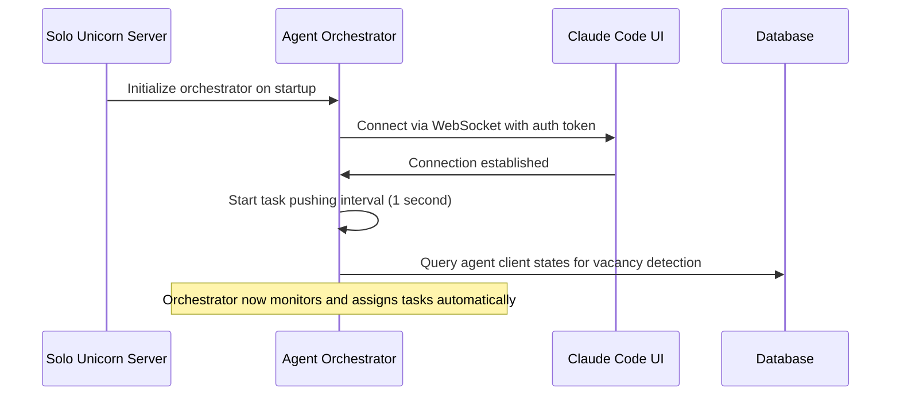
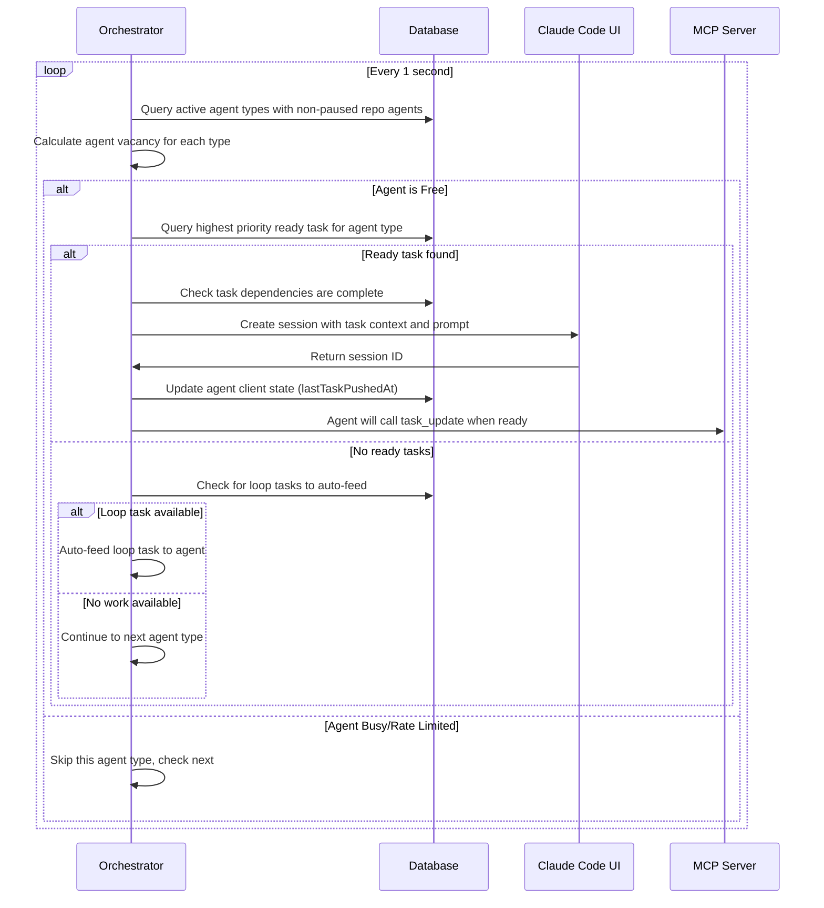
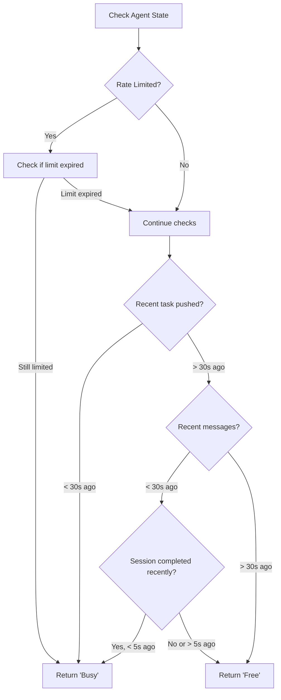
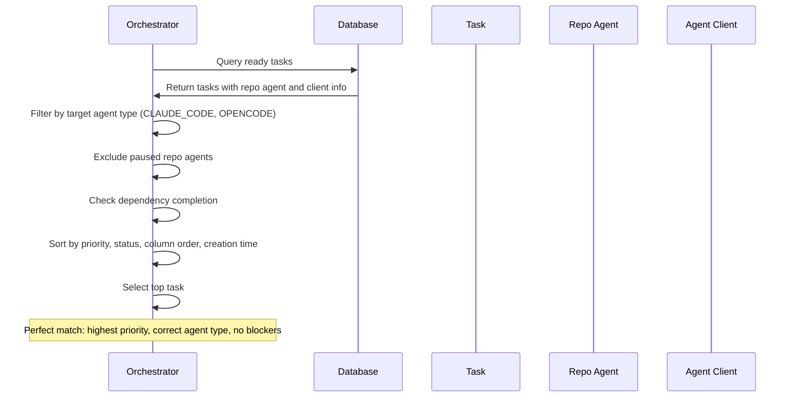
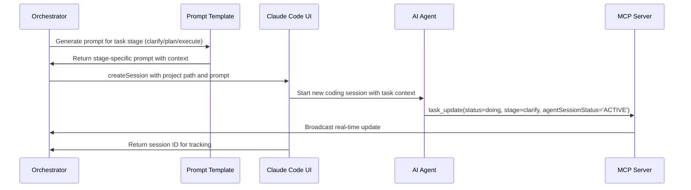
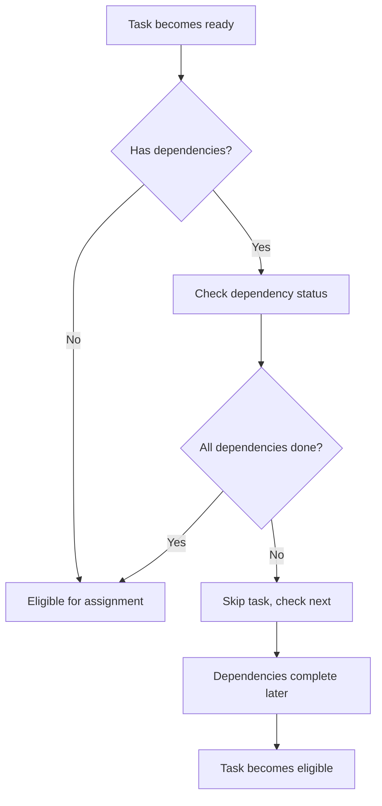
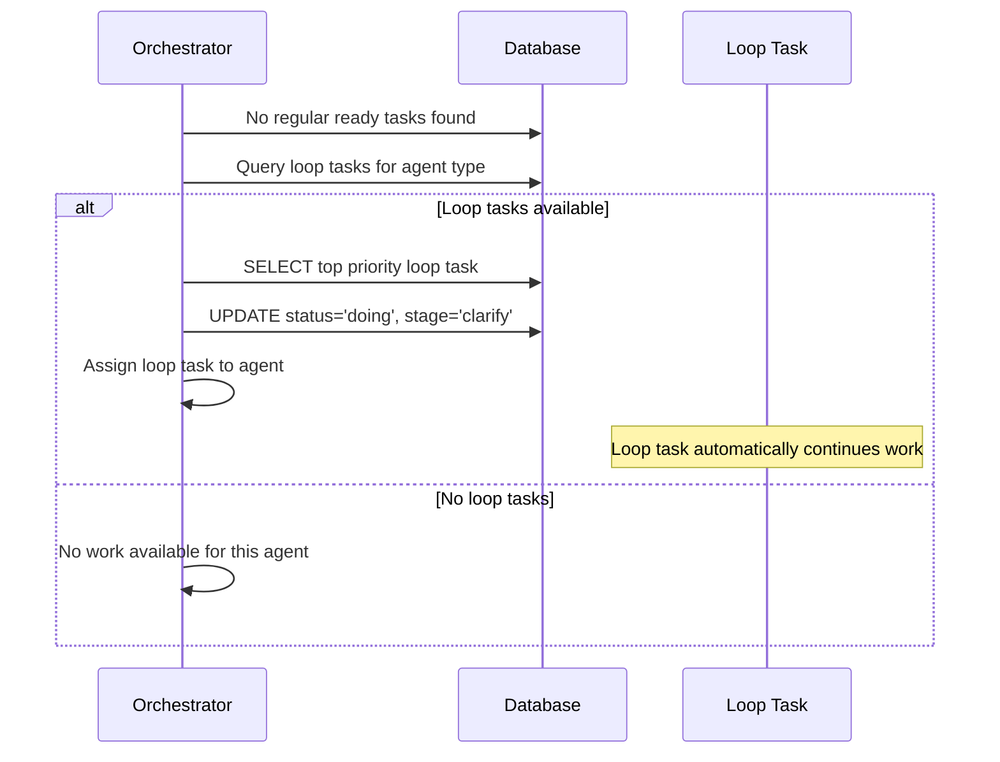

# AI Agent Orchestration

## Overview

The AI Agent Orchestrator is the central system that manages automatic task assignment to AI coding clients like Claude Code. It continuously monitors agent availability, selects the highest priority ready tasks, and coordinates task execution across multiple development environments while respecting rate limits and dependencies.

## UX Flow

### From User Perspective
1. **User marks task as ready** via checkbox on task card
2. **Task becomes eligible** for AI pickup (visual indicator changes)
3. **Orchestrator automatically detects** ready tasks within 1 second
4. **Task moves to "Doing" status** with "clarify" stage indicator
5. **Real-time AI activity badge** shows agent is working
6. **Progress updates** show stage transitions (clarify → Plan → Execute)
7. **Task completion** automatically moves to "Done" column

### Agent Status Indicators
- **🟢 Active**: Agent available and processing tasks
- **🔄 Working**: Agent currently executing a task
- **⏸️ Paused**: Repo agent manually disabled
- **⚠️ Rate Limited**: Agent temporarily unavailable due to API limits
- **🔴 Error**: Connection or configuration issues

### Automatic Task Selection
- **Priority-based**: Higher priority tasks (P5) picked before lower priority (P1)
- **Status preference**: "Doing" tasks prioritized over "Todo" tasks
- **Dependency-aware**: Tasks with incomplete dependencies are skipped
- **Agent-specific**: Tasks only assigned to their designated repo agent type

## System Flow

### Orchestrator Initialization


### Task Assignment Cycle


### Agent Vacancy Detection


### Task-Agent Matching


## Data Models

### Agent Clients Table (`apps/server/src/db/schema/index.ts:16-23`)
```sql
agentClients {
  id: uuid (PK)
  type: enum (CLAUDE_CODE, CURSOR_CLI, OPENCODE)
  state: jsonb (vacancy and activity tracking)
  createdAt: timestamp
  updatedAt: timestamp
}
```

### Agent Client State Structure
```json
{
  "lastMessagedAt": "2025-01-15T10:30:00Z",        // Last WebSocket activity
  "lastSessionCompletedAt": "2025-01-15T10:25:00Z", // Last session completion
  "lastSessionCreatedAt": "2025-01-15T10:20:00Z",   // Last session creation
  "lastTaskPushedAt": "2025-01-15T10:20:00Z",       // Last task assignment
  "rateLimitedUntil": "2025-01-15T11:00:00Z"        // Rate limit expiry time
}
```

### Task Selection Query
```sql
-- Find highest priority ready task for specific agent type
SELECT t.*, ra.*, a.*, p.*, ac.*
FROM tasks t
INNER JOIN repoAgents ra ON t.repoAgentId = ra.id
INNER JOIN agentClients ac ON ra.agentClientId = ac.id
LEFT JOIN actors a ON t.actorId = a.id
INNER JOIN projects p ON t.projectId = p.id
WHERE
  t.ready = true
  AND t.agentSessionStatus = 'NON_ACTIVE'
  AND t.status != 'done'
  AND t.status != 'loop'
  AND ac.type = 'CLAUDE_CODE'
  AND ra.isPaused = false
  AND NOT EXISTS (
    -- Exclude tasks with incomplete dependencies
    SELECT 1 FROM taskDependencies td
    INNER JOIN tasks dt ON td.dependsOnTaskId = dt.id
    WHERE td.taskId = t.id AND dt.status != 'done'
  )
ORDER BY
  t.priority DESC,                           -- Higher priority first
  CASE WHEN t.status = 'doing' THEN 2        -- Doing tasks before todo
       WHEN t.status = 'todo' THEN 1
       ELSE 0 END DESC,
  CAST(t.columnOrder AS DECIMAL),            -- Manual position
  t.createdAt                                -- Creation time tiebreaker
LIMIT 1;
```

## Agent Communication

### Claude Code Client (`apps/server/src/agents/claude-code-client.ts`)
```typescript
class ClaudeCodeClient {
  private ws: WebSocket | null = null;

  async connect(): Promise<void> {
    const wsUrl = `${claudeCodeUrl}/ws/agent?token=${agentToken}`;
    this.ws = new WebSocket(wsUrl);

    this.ws.on('message', (data) => {
      const message = JSON.parse(data.toString());
      this.handleMessage(message);
    });
  }

  async createSession(options: SessionOptions): Promise<string> {
    const sessionMessage = {
      type: 'createSession',
      projectPath: options.projectPath,
      cwd: options.cwd,
      prompt: options.prompt,
      soloUnicornTaskId: options.soloUnicornTaskId
    };

    return this.sendMessage(sessionMessage);
  }
}
```

### Session Creation Flow


### Message Handling
```typescript
private handleMessage(message: any) {
  switch (message.type) {
    case 'sessionCreated':
      // Track new session creation
      this.updateAgentState('lastSessionCreatedAt', new Date().toISOString());
      break;

    case 'sessionCompleted':
      // Session finished, agent available again
      this.updateAgentState('lastSessionCompletedAt', new Date().toISOString());
      break;

    case 'rateLimited':
      // Handle API rate limiting
      const resetTime = new Date(Date.now() + message.resetInMs);
      this.updateAgentState('rateLimitedUntil', resetTime.toISOString());
      break;
  }
}
```

## Vacancy Detection Algorithm

### Agent States
- **Free**: Available for new task assignment
- **Busy**: Currently working or recently active
- **null**: Error or unavailable

### Vacancy Calculation Logic (`apps/server/src/agents/agent-orchestrator.ts:130-171`)
```typescript
async calculateAgentClientVacancy(clientType: string): Promise<AgentClientVacancy> {
  const agentClient = await this.getAgentClientByType(clientType);
  const state = agentClient?.state || {};
  const now = Date.now();

  // Check rate limiting
  if (state.rateLimitedUntil) {
    const rateLimitTime = new Date(state.rateLimitedUntil).getTime();
    if (rateLimitTime > now) {
      return 'Busy'; // Still rate limited
    }
  }

  // Check recent task pushing (30 second cooldown)
  if (state.lastTaskPushedAt) {
    const timeSinceLastPush = now - new Date(state.lastTaskPushedAt).getTime();
    if (timeSinceLastPush <= 30 * 1000) {
      return 'Busy'; // Recently pushed a task
    }
  }

  // Check recent messaging activity (30 second cooldown)
  if (state.lastMessagedAt) {
    const timeSinceLastMessage = now - new Date(state.lastMessagedAt).getTime();
    if (timeSinceLastMessage <= 30 * 1000) {
      // If session completed recently, allow pickup after 5 seconds
      if (state.lastSessionCompletedAt) {
        const sessionCompletedTime = new Date(state.lastSessionCompletedAt).getTime();
        const timeSinceCompletion = now - sessionCompletedTime;

        if (Math.abs(sessionCompletedTime - lastMessageTime) <= 1000) {
          return timeSinceCompletion > 5 * 1000 ? 'Free' : 'Busy';
        }
      }
      return 'Busy'; // Recent activity
    }
  }

  return 'Free'; // Available for assignment
}
```

## Dependency Management

### Dependency Checking
```sql
-- Ensure task dependencies are complete before assignment
NOT EXISTS (
  SELECT 1 FROM taskDependencies td
  INNER JOIN tasks dt ON td.dependsOnTaskId = dt.id
  WHERE td.taskId = t.id AND dt.status != 'done'
)
```

### Dependency Resolution Flow


## Loop Task Auto-feeding

### Loop Task Handling


### Loop Task Query
```sql
-- Find loop tasks for auto-feeding when no regular work available
SELECT * FROM tasks t
INNER JOIN repoAgents ra ON t.repoAgentId = ra.id
INNER JOIN agentClients ac ON ra.agentClientId = ac.id
WHERE
  t.status = 'loop'
  AND t.stage = 'loop'
  AND t.agentSessionStatus = 'NON_ACTIVE'
  AND ac.type = 'CLAUDE_CODE'
  AND ra.isPaused = false
ORDER BY t.priority DESC, t.columnOrder, t.createdAt
LIMIT 1;
```

## Rate Limiting & Error Handling

### Rate Limit Management
- **Detection**: WebSocket messages report rate limit status
- **Storage**: Rate limit expiry stored in agent client state
- **Respect**: Orchestrator skips rate-limited agents
- **Recovery**: Automatic retry when rate limit expires

### Error Recovery
```typescript
// Connection resilience
private scheduleReconnect() {
  if (this.reconnectAttempts >= this.maxReconnectAttempts) {
    console.error('Max reconnect attempts reached');
    return;
  }

  const delay = Math.min(1000 * Math.pow(2, this.reconnectAttempts), 30000);
  this.reconnectTimeout = setTimeout(() => {
    this.reconnectAttempts++;
    this.connect().catch(() => this.scheduleReconnect());
  }, delay);
}
```

### Task Assignment Failures
- **Session creation fails**: Task remains ready for retry
- **Agent disconnection**: Task returns to ready state
- **Timeout handling**: Stuck tasks detected and reset
- **Dependency conflicts**: Tasks skipped until dependencies resolve

## Performance Optimizations

### Efficient Task Queries
- **Indexed sorting**: Database indexes on priority, status, columnOrder
- **Limited results**: LIMIT 1 for top task selection
- **Filtered queries**: WHERE clauses reduce unnecessary data
- **JOIN optimization**: Single query with all needed relations

### Connection Management
- **WebSocket pooling**: Reuse connections across tasks
- **Reconnection logic**: Exponential backoff for failed connections
- **Health monitoring**: Periodic ping/pong for connection health
- **Graceful degradation**: Continue operation with partial connectivity

### State Synchronization
- **Lazy updates**: State updated only when needed
- **Batched operations**: Multiple state changes in single transaction
- **Cache invalidation**: Smart cache refresh on state changes

## Configuration

### Environment Variables
```bash
# Claude Code UI integration
CLAUDE_CODE_URL=http://localhost:8303
CLAUDE_CODE_UI_AUTH_TOKEN=your-secure-token

# Orchestrator behavior
TASK_PUSH_ENABLED=true
DEBUG_ORCHESTRATOR=false

# Agent timing settings
AGENT_VACANCY_CHECK_INTERVAL=1000    # 1 second
TASK_PUSH_COOLDOWN=30000            # 30 seconds
SESSION_COMPLETION_GRACE=5000        # 5 seconds
```

### Orchestrator Options
```typescript
interface AgentOrchestratorOptions {
  claudeCodeUrl: string;           // Claude Code UI WebSocket endpoint
  agentToken: string;              // Authentication token
  taskPushEnabled?: boolean;       // Enable/disable automatic task pushing
}
```

## Related Features
- [Repo Agents](./repo-agents.md) - Agent configuration and pausing
- [Task Lifecycle](./task-lifecycle.md) - AI-driven task progression
- [MCP Integration](./mcp-integration.md) - Agent communication protocol
- [Real-time Features](./realtime-features.md) - Live status updates
- [Task Management](./task-management.md) - Ready flag and task preparation
