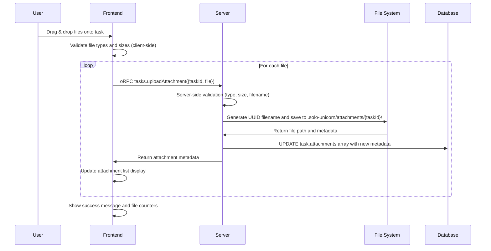
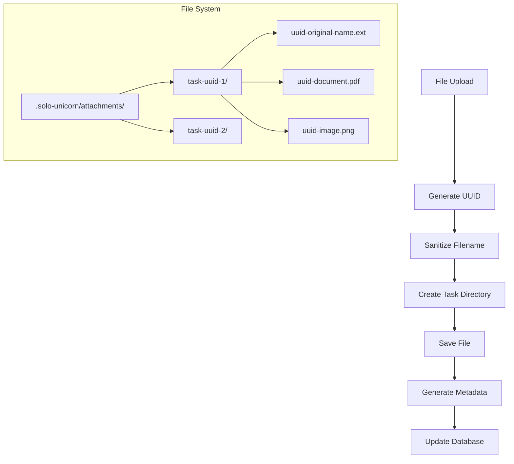
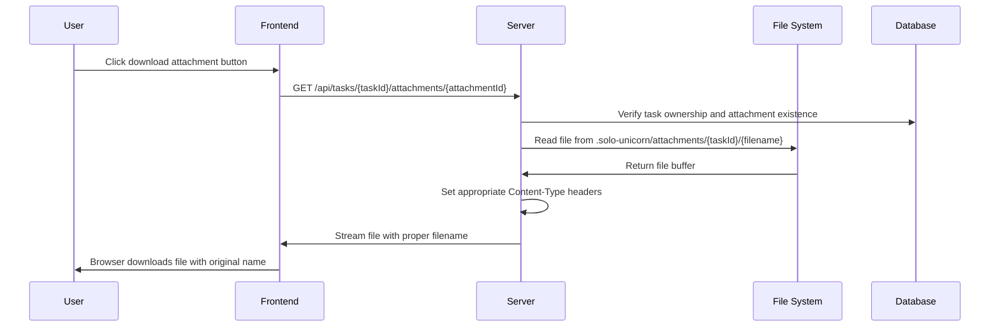
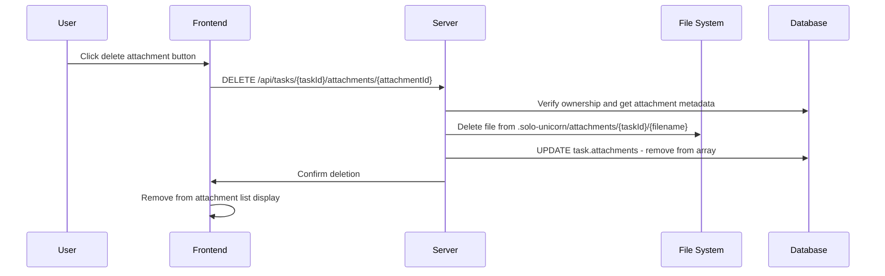

# File Attachment System

## Overview

Solo Unicorn's file attachment system enables users to attach relevant files, images, and documents to tasks for AI agent context. The system provides secure file upload, storage, validation, preview capabilities, and proper cleanup with comprehensive size limits and type restrictions.

## UX Flow

### Attaching Files to Tasks
1. **Task creation modal** includes attachment dropzone area
2. **Drag & drop files** onto dropzone or click to browse
3. **File validation** shows immediate feedback for type/size issues
4. **Preview thumbnails** display for images and supported file types
5. **Upload progress** shows for each file during upload
6. **Attachment counter** appears on task card (📎2 indicator)

### Managing Existing Attachments
1. **Click task card** to open task drawer
2. **Attachments tab** shows all attached files
3. **File previews** for images, documents, and code files
4. **Download buttons** for accessing original files
5. **Delete options** for removing unwanted attachments
6. **Add more files** via additional upload interface

### File Preview Experience
- **Images**: Inline preview with zoom capability
- **Text files**: Syntax-highlighted code preview
- **PDFs**: Embedded PDF viewer with pagination
- **Documents**: Download with file type icons
- **Archives**: File listing with extraction info

### Drag & Drop Interface
```
┌─────────────────────────────────────────────────────────┐
│ 📁 Drag files here or click to browse                  │
│                                                         │
│ Supported: Images, PDFs, Code files, Documents        │
│ Max size: 10MB per file, 50MB total                   │
│                                                         │
│ ┌─────────┐ ┌─────────┐ ┌─────────┐                    │
│ │ image.png│ │ doc.pdf │ │ code.js │                    │
│ │ 2.1 MB   │ │ 5.3 MB  │ │ 45 KB   │                    │
│ │    [×]   │ │   [×]   │ │   [×]   │                    │
│ └─────────┘ └─────────┘ └─────────┘                    │
│                                                         │
│ [ Upload Files ]                                        │
└─────────────────────────────────────────────────────────┘
```

## System Flow

### File Upload Flow


### File Storage Structure


### File Download Flow


### File Deletion Flow


## Data Models

### Attachment Metadata Structure
```json
{
  "id": "550e8400-e29b-41d4-a716-446655440000",
  "filename": "uuid-sanitized-name.pdf",
  "originalName": "User's Original File Name.pdf",
  "path": ".solo-unicorn/attachments/task-id/uuid-sanitized-name.pdf",
  "size": 2048576,
  "type": "application/pdf",
  "uploadedAt": "2025-01-15T10:30:00Z"
}
```

### Task Attachments Field
```sql
-- JSONB array in tasks table
tasks.attachments = [
  {
    "id": "uuid-1",
    "filename": "uuid-design.png",
    "originalName": "app-design.png",
    "path": ".solo-unicorn/attachments/task-id/uuid-design.png",
    "size": 1024000,
    "type": "image/png",
    "uploadedAt": "2025-01-15T10:30:00Z"
  },
  {
    "id": "uuid-2", 
    "filename": "uuid-requirements.pdf",
    "originalName": "requirements.pdf",
    "path": ".solo-unicorn/attachments/task-id/uuid-requirements.pdf",
    "size": 2048000,
    "type": "application/pdf",
    "uploadedAt": "2025-01-15T10:31:00Z"
  }
]
```

### File System Organization
```
.solo-unicorn/
└── attachments/
    ├── task-uuid-1/
    │   ├── 550e8400-e29b-original-file.png
    │   ├── 660f9511-f3ac-another-file.pdf
    │   └── 770e8622-g4bd-code-sample.js
    ├── task-uuid-2/
    │   └── 880e8733-h5ce-design-doc.pdf
    └── task-uuid-3/
        ├── 990e8844-i6df-screenshot.png
        └── aa0e8955-j7eg-requirements.md
```

## File Validation & Security

### Supported File Types (`apps/server/src/utils/file-storage.ts:19-29`)
```typescript
const SUPPORTED_TYPES = [
  // Images
  'image/png', 'image/jpeg', 'image/jpg', 'image/gif', 
  'image/svg+xml', 'image/webp',
  
  // Documents
  'application/pdf', 'text/plain', 'text/markdown',
  'application/msword', 
  'application/vnd.openxmlformats-officedocument.wordprocessingml.document',
  
  // Code files
  'text/javascript', 'text/typescript', 'application/json', 
  'text/html', 'text/css',
  
  // Archives
  'application/zip', 'application/x-tar', 'application/gzip'
];
```

### Size Limits
```typescript
const FILE_LIMITS = {
  MAX_FILE_SIZE: 10 * 1024 * 1024,      // 10MB per individual file
  MAX_TOTAL_SIZE: 50 * 1024 * 1024      // 50MB total per task
};
```

### Filename Sanitization
```typescript
function sanitizeFilename(filename: string): string {
  return filename
    .replace(/[^a-zA-Z0-9._-]/g, '_')    // Replace special chars with underscore
    .replace(/^\.+/, '')                 // Remove leading dots
    .substring(0, 255);                  // Limit length to 255 chars
}
```

### Security Measures
- **File type validation** against allowlist of MIME types
- **Filename sanitization** prevents path traversal attacks
- **UUID filenames** prevent direct file access guessing
- **Task-scoped directories** isolate attachments per task
- **Ownership verification** on all file operations
- **Size limits** prevent storage abuse
- **Content-Type headers** set correctly for downloads

## oRPC Procedures

### Upload Attachment
```typescript
client.tasks.uploadAttachment({
  taskId: string (UUID),
  file: File
})
```

### Download Attachment
```typescript
client.tasks.downloadAttachment({
  taskId: string (UUID),
  attachmentId: string (UUID)
})
// Returns: { buffer: ArrayBuffer, metadata: AttachmentMetadata }
```

### Delete Attachment
```typescript
client.tasks.deleteAttachment({
  taskId: string (UUID),
  attachmentId: string (UUID)
})
// Returns: { success: true }
```

### List Attachments (via task query)
```typescript
client.tasks.get({
  id: string (taskId)
})
// Returns: Task object with attachments array
```

## Frontend Components

### AttachmentDropzone (`apps/web/src/components/attachment-dropzone.tsx`)
```typescript
interface AttachmentDropzoneProps {
  attachments?: AttachmentFile[];
  onAttachmentsChange: (attachments: AttachmentFile[]) => void;
  maxFiles?: number;
  maxSize?: number;
  disabled?: boolean;
}

// Features:
// - Drag & drop file selection
// - File type and size validation
// - Preview generation for images
// - Error handling and user feedback
// - File removal before upload
```

### TaskAttachmentUpload (`apps/web/src/components/task-attachment-upload.tsx`)
```typescript
interface TaskAttachmentUploadProps {
  taskId: string;
}

// Features:
// - oRPC type-safe file upload
// - Sequential file upload with progress
// - Query invalidation after upload
// - Error handling and retry logic
```

### AttachmentList (`apps/web/src/components/attachment-list.tsx`)
```typescript
interface AttachmentListProps {
  attachments: AttachmentMetadata[];
  taskId: string;
  editable?: boolean;
}

// Features:
// - File preview and download
// - Delete functionality for editable mode
// - File type icons and size display
// - Responsive grid layout
```

### AttachmentPreview (`apps/web/src/components/attachment-preview.tsx`)
```typescript
interface AttachmentPreviewProps {
  attachment: AttachmentMetadata;
  taskId: string;
}

// Features:
// - Image preview with zoom
// - Text file syntax highlighting  
// - PDF embedded viewer
// - Download fallback for unsupported types
```

## File Upload Implementation

### oRPC File Handling
```typescript
// Frontend upload with oRPC client
const uploadMutation = useMutation({
  mutationFn: async (file: AttachmentFile) => {
    // Use oRPC client for type-safe file upload
    const result = await client.tasks.uploadAttachment({
      taskId,
      file: file.file
    });
    
    return result;
  }
});
```

### Server-side Upload Processing
```typescript
// oRPC procedure for file uploads
uploadAttachment: protectedProcedure
  .input(z.object({
    taskId: z.string().uuid(),
    file: z.instanceof(File)
  }))
  .handler(async ({ context, input }) => {
    // Convert File to buffer
    const buffer = await input.file.arrayBuffer();
    
    // Verify task ownership with project membership
    await verifyTaskOwnership(input.taskId, context.user.id);
    
    // Validate total size and save attachment
    const attachment = await saveAttachment(input.taskId, {
      buffer: new Uint8Array(buffer),
      originalName: input.file.name,
      type: input.file.type,
      size: input.file.size
    });
    
    // Update task with new attachment
    await updateTaskAttachments(input.taskId, attachment);
    
    return { attachment };
});
```

## Storage Management

### Directory Structure Creation
```typescript
async function ensureAttachmentDir(taskId: string): Promise<string> {
  const dir = path.join(process.cwd(), '.solo-unicorn', 'attachments', taskId);
  await fs.mkdir(dir, { recursive: true });
  return dir;
}
```

### File Cleanup on Task Deletion
```typescript
// Clean up attachments when task is deleted
async function deleteTaskAttachments(taskId: string) {
  const attachmentDir = getTaskAttachmentDir(taskId);
  
  try {
    await fs.rmdir(attachmentDir, { recursive: true });
  } catch (error) {
    console.warn(`Failed to delete attachment directory: ${error.message}`);
  }
}
```

### Storage Quota Management
```typescript
async function validateTotalAttachmentSize(taskId: string, newFileSize: number) {
  const task = await getTaskById(taskId);
  const currentTotalSize = task.attachments.reduce((sum, att) => sum + att.size, 0);
  
  if (currentTotalSize + newFileSize > MAX_TOTAL_SIZE) {
    throw new Error(`Total attachment size would exceed ${MAX_TOTAL_SIZE / 1024 / 1024}MB limit`);
  }
}
```

## Error Handling

### Client-side Validation
```typescript
// File type validation
if (!SUPPORTED_TYPES.includes(file.type) && !file.type.startsWith('text/')) {
  setError('Unsupported file type');
  return;
}

// File size validation
if (file.size > MAX_FILE_SIZE) {
  setError(`File size exceeds ${MAX_FILE_SIZE / 1024 / 1024}MB limit`);
  return;
}

// Total size validation
const currentTotalSize = attachments.reduce((sum, att) => sum + att.file.size, 0);
if (currentTotalSize + file.size > MAX_TOTAL_SIZE) {
  setError(`Total attachment size would exceed ${MAX_TOTAL_SIZE / 1024 / 1024}MB limit`);
  return;
}
```

### Server-side Error Handling
```typescript
try {
  const metadata = await saveAttachment(taskId, fileData);
  return c.json(metadata);
} catch (error) {
  if (error.message.includes('Unsupported file type')) {
    return c.json({ error: error.message }, 400);
  }
  if (error.message.includes('size exceeds')) {
    return c.json({ error: error.message }, 413);
  }
  console.error('Upload error:', error);
  return c.json({ error: 'Upload failed' }, 500);
}
```

## Performance Optimizations

### Streaming Uploads
- **Progressive upload** with real-time progress feedback
- **Chunked processing** for large files
- **Memory-efficient** file handling without loading entire files
- **Parallel uploads** for multiple files

### Caching Strategy
- **Metadata caching** in task queries
- **File existence checks** before download attempts
- **Preview generation** cached on client side
- **Lazy loading** of attachment lists

### Database Efficiency
- **JSONB indexing** for attachment metadata queries
- **Bulk operations** for multiple attachment updates
- **Query optimization** with selective field updates
- **Connection pooling** for file operations

## Integration with AI Agents

### Attachment Context for AI
```typescript
// Include attachment metadata in AI prompts
interface TaskContext {
  attachments?: AttachmentMetadata[];
  // ... other task fields
}

// AI agents can reference attachments by filename
"The user has attached a design mockup (design.png) and requirements document (requirements.pdf). 
Please implement the feature according to these specifications."
```

### File Access in Agent Sessions
- **Attachment paths** provided in task context
- **Read-only access** to attachment files during execution
- **File content** can be included in prompts for code generation
- **Image analysis** for UI implementation tasks

## Related Features
- [Task Management](./task-management.md) - Attachment integration with task CRUD
- [Task Lifecycle](./task-lifecycle.md) - AI agent access to attachments
- [Project Management](./project-management.md) - Project-scoped file organization
- [Real-time Features](./realtime-features.md) - Live updates for attachment changes