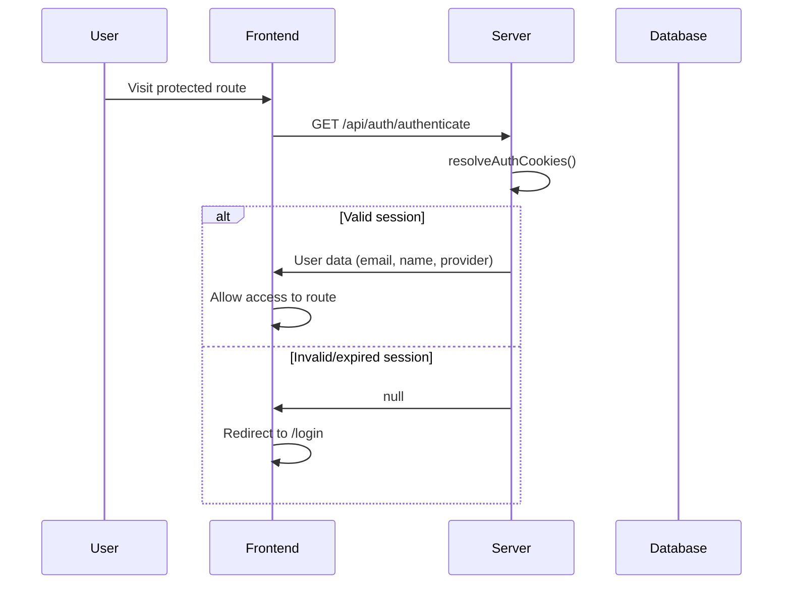
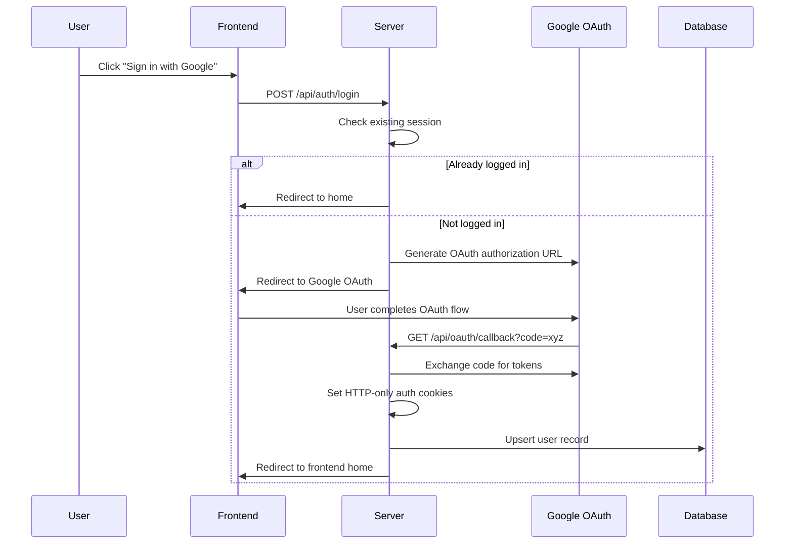
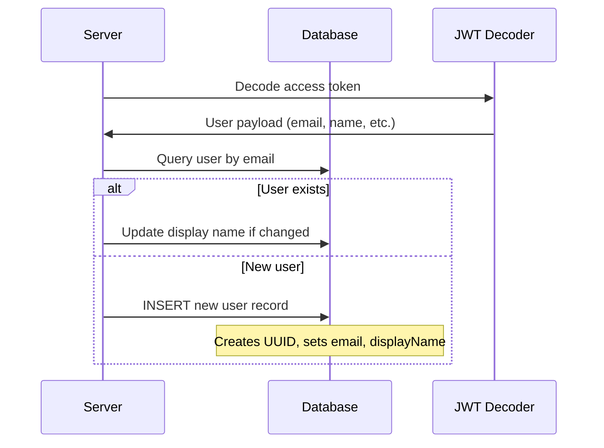

# Authentication & User Management

## Overview

Solo Unicorn uses OAuth-based authentication with Google as the primary provider. The system implements a single-user approach with session management via HTTP-only cookies and automatic user creation/updates.

## UX Flow

### Initial Access
1. **Unauthenticated User** visits any protected route
2. **Auto-redirect** to `/login` page via route guards
3. **Login Page** displays simple Google OAuth prompt
4. **User clicks** "Sign in with Google" button
5. **Loading state** shows "Redirecting..." while OAuth initializes

### OAuth Flow
1. **Redirect to Google** OAuth consent screen
2. **User grants permission** on Google's interface
3. **Google redirects back** to Solo Unicorn callback URL
4. **Auto-redirect** to main application (typically first project)

### Session Management
- **Session persists** across browser sessions via HTTP-only cookies
- **Auto-logout** when session expires or user explicitly logs out
- **User menu** in header shows current user info and logout option

## System Flow

### Authentication Check


### Login Process


### User Creation/Update


## Data Models

### Users Table (`apps/server/src/db/schema/index.ts:8-14`)
```sql
users {
  id: uuid (PK)
  email: text (unique, not null)
  displayName: text (not null)
  createdAt: timestamp
  updatedAt: timestamp
}
```

### Session Storage
- **HTTP-only cookies** store encrypted access/refresh tokens
- **No database session table** - stateless JWT-based sessions
- **Cookie security** includes SameSite, Secure flags for production

## API Endpoints

### Authentication Routes (`apps/server/src/routers/auth.ts`)
- `POST /api/auth/authenticate` - Check current session status
- `POST /api/auth/login` - Initiate OAuth flow or redirect if logged in
- `POST /api/auth/logout` - Clear session cookies and redirect

### OAuth Callback (`apps/server/src/routers/oauth-callback.ts`)
- `GET /api/oauth/callback` - Handle OAuth provider redirect
- Exchanges authorization code for tokens
- Creates/updates user record
- Sets session cookies
- Redirects to frontend

## Frontend Integration

### Auth Client (`apps/web/src/lib/auth-client.ts`)
- `useSession()` - React hook for current user session
- `useLogin()` - Hook for login functionality with loading states
- `useLogout()` - Hook for logout with cleanup

### Route Protection
- **Route guards** check authentication status
- **Automatic redirects** to `/login` for unauthenticated users
- **Session persistence** across page reloads

## Security Features

### Cookie Security
- **HTTP-only** cookies prevent XSS access to tokens
- **SameSite=Strict** prevents CSRF attacks
- **Secure flag** in production for HTTPS-only transmission

### Token Management
- **Access tokens** for API authorization
- **Refresh tokens** for session renewal
- **JWT validation** on every protected request

### Error Handling
- **Graceful degradation** when OAuth fails
- **Clear error messages** for authorization issues
- **Automatic retry** for expired sessions

## Environment Configuration

### Required Variables
```env
# OAuth Provider Settings
GOOGLE_CLIENT_ID=your_google_client_id
GOOGLE_CLIENT_SECRET=your_google_client_secret

# Application URLs
BASE_URL=http://localhost:8500
FRONTEND_ORIGIN=http://localhost:8302
CORS_ORIGIN=http://localhost:8302

# Session Security
JWT_SECRET=your_jwt_secret_key
```

## Related Features
- [Project Management](./project-management.md) - Requires authentication for project access
- [User Menu](./user-interface.md) - Shows user info and logout option