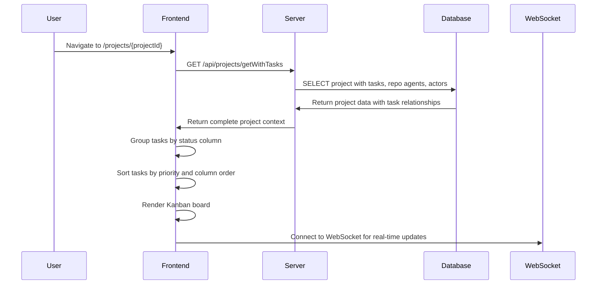
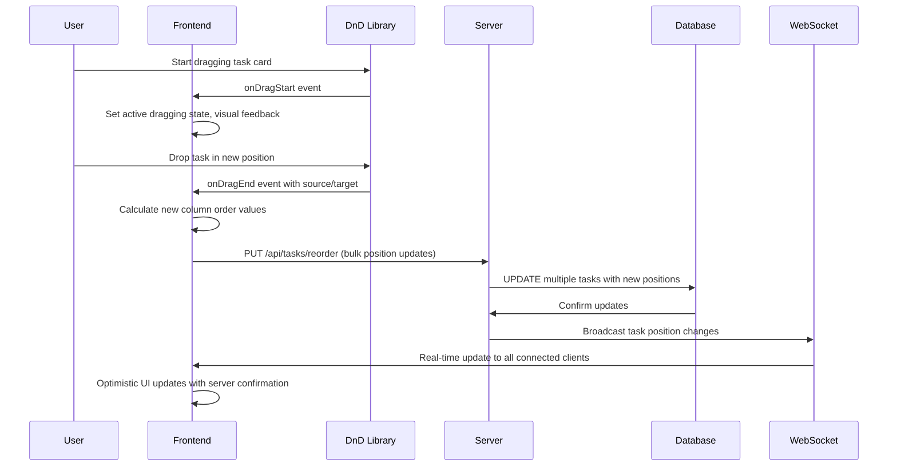
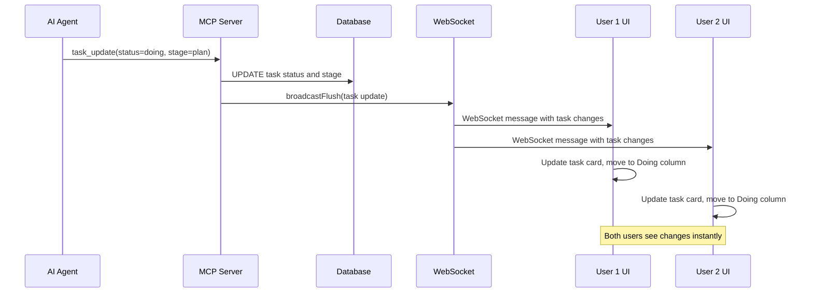

# Kanban Board

## Overview

The Solo Unicorn Kanban board provides a visual, interactive interface for managing tasks through their lifecycle. It features a simplified 3-column layout (Todo, Doing, Done) with drag & drop functionality, real-time updates, and comprehensive task management controls.

## UX Flow

### Board Layout
```
┌─────────────────────────────────────────────────────────────────────────────┐
│ Solo Unicorn | Project: My App [▼] | + New Task | Repo Agents | Profile │
├─────────────────────────────────────────────────────────────────────────────┤
│ Todo                    │ Doing                   │ Done                    │
│ ┌─────────────────────┐ │ ┌─────────────────────┐ │ ┌─────────────────────┐ │
│ │ [P5] Fix login bug  │ │ │ [P4] Add dashboard  │ │ │ [P3] Setup project  │ │
│ │ Main Repo (Claude)  │ │ │ Main Repo (Claude)  │ │ │ Main Repo (Claude)  │ │
│ │ Default Actor       │ │ │ Frontend Specialist │ │ │ Default Actor       │ │
│ │ Ready ☑ 📎2        │ │ │ Stage: Execute ●●●  │ │ │ Completed 2h ago    │ │
│ │ [Edit] [Delete]     │ │ │ [Reset] [Delete]    │ │ │ [Reopen] [Delete]   │ │
│ └─────────────────────┘ │ └─────────────────────┘ │ └─────────────────────┘ │
│                         │                         │                         │
│ ┌─────────────────────┐ │ ┌─────────────────────┐ │                         │
│ │ [P2] Update docs    │ │ │ [P1] New feature    │ │                         │
│ │ Main Repo (Claude)  │ │ │ Main Repo (Claude)  │ │                         │
│ │ Ready ☐             │ │ │ Stage: Plan ●●○     │ │                         │
│ │ [Edit] [Delete]     │ │ │ AI Working 🔄       │ │                         │
│ └─────────────────────┘ │ └─────────────────────┘ │                         │
└─────────────────────────────────────────────────────────────────────────────┘
```

### Task Card Information
**Todo Column Cards:**
- Priority indicator (P1-P5, colored badges)
- Task title (raw or refined)
- Repo agent assignment
- Actor assignment
- Ready checkbox with visual state
- Attachment count indicator
- Edit and delete actions

**Doing Column Cards:**
- Priority and refined title
- Repo agent and actor info
- Stage progress indicator (clarify ●○○, Plan ●●○, Execute ●●●)
- AI working status with real-time badge
- Reset agent button (available after 1 minute)
- Delete action

**Done Column Cards:**
- Priority and final title
- Repo agent and actor used
- Completion timestamp
- Reopen and delete actions

### Drag & Drop Interaction
1. **Hover over task card** - cursor changes to grab
2. **Click and drag** - card becomes semi-transparent
3. **Drag between columns** - visual feedback shows drop zones
4. **Drop on column header** - moves to end of target column
5. **Drop between cards** - inserts at specific position
6. **Auto-save** - position changes saved immediately
7. **Real-time sync** - other users see changes instantly

### Real-time Updates
1. **WebSocket connection** provides live updates
2. **Task status changes** update card position automatically
3. **AI progress updates** show current stage and activity
4. **New tasks** appear in real-time
5. **Deletions** remove cards with smooth animations
6. **Conflict resolution** handles concurrent edits gracefully

## System Flow

### Board Data Loading Flow


### Drag & Drop Flow


### Real-time Update Flow


### Task Position Calculation
```mermaid
flowchart TD
    A[User Drops Task] --> B{Target Position}
    B -->|Top of Column| C[Order = firstTask.order / 2]
    B -->|Bottom of Column| D[Order = lastTask.order + 1000]
    B -->|Between Tasks| E[Order = (prevTask.order + nextTask.order) / 2]

    C --> F[Update Database]
    D --> F
    E --> F
    F --> G[Broadcast to WebSocket]
    G --> H[Update All Connected UIs]
```

## Data Models

### Task Ordering System
```sql
tasks {
  status: text -- 'todo', 'doing', 'done'
  columnOrder: text -- Decimal string for precise positioning
  priority: integer -- 1-5 (5=highest)
}
```

### Column Order Algorithm
```javascript
// Fractional ordering system for smooth drag & drop
function calculateNewOrder(targetIndex, targetTasks) {
  if (targetTasks.length === 0) {
    return "1000"; // First task in empty column
  }

  if (targetIndex === 0) {
    // Insert at top
    const firstOrder = parseFloat(targetTasks[0].columnOrder);
    return (firstOrder / 2).toString();
  }

  if (targetIndex >= targetTasks.length) {
    // Insert at bottom
    const lastOrder = parseFloat(targetTasks[targetTasks.length - 1].columnOrder);
    return (lastOrder + 1000).toString();
  }

  // Insert between two tasks
  const prevOrder = parseFloat(targetTasks[targetIndex - 1].columnOrder);
  const nextOrder = parseFloat(targetTasks[targetIndex].columnOrder);
  return ((prevOrder + nextOrder) / 2).toString();
}
```

### Task Sorting Algorithm
```sql
-- Database ordering query
ORDER BY
  tasks.status,                           -- Column grouping
  tasks.priority DESC,                    -- Higher priority first (5 > 4 > 3 > 2 > 1)
  CAST(tasks.columnOrder AS DECIMAL),     -- Manual drag & drop order
  tasks.createdAt DESC                    -- Creation time as tiebreaker
```

## Frontend Implementation

### DnD Kit Integration (`apps/web/src/components/kanban-board.tsx`)
```typescript
import {
  DndContext,
  DragOverlay,
  PointerSensor,
  useSensor,
  useSensors,
  type DragEndEvent,
} from "@dnd-kit/core";
import { SortableContext, useSortable } from "@dnd-kit/sortable";

// Task cards use useSortable for drag functionality
const { attributes, listeners, setNodeRef, transform, transition, isDragging } =
  useSortable({ id: task.id });

// Board handles drag end events for position updates
const handleDragEnd = (event: DragEndEvent) => {
  // Calculate new positions and update database
};
```

### Real-time WebSocket Integration
```typescript
// WebSocket connection for live updates
const { data: project } = useQuery(
  orpc.projects.getWithTasks.queryOptions({
    input: { id: projectId }
  })
);

// Auto-refresh on WebSocket messages
useEffect(() => {
  const ws = new WebSocket(wsUrl);
  ws.onmessage = (event) => {
    const update = JSON.parse(event.data);
    queryClient.invalidateQueries(['projects', projectId]);
  };
}, []);
```

### Optimistic Updates
```typescript
// Immediate UI updates with server confirmation
const reorderMutation = useMutation({
  mutationFn: orpc.tasks.reorder.mutate,
  onMutate: async (variables) => {
    // Cancel outgoing refetches
    await queryClient.cancelQueries(['tasks']);

    // Snapshot previous value
    const previousTasks = queryClient.getQueryData(['tasks']);

    // Optimistically update to new value
    queryClient.setQueryData(['tasks'], (old) => {
      return applyReorderOptimistically(old, variables);
    });

    return { previousTasks };
  },
  onError: (err, variables, context) => {
    // Rollback on error
    queryClient.setQueryData(['tasks'], context.previousTasks);
  },
  onSettled: () => {
    // Sync with server
    queryClient.invalidateQueries(['tasks']);
  }
});
```

## Column Definitions

### Status Columns Configuration
```typescript
const statusColumns = [
  {
    id: 'todo',
    title: 'Todo',
    icon: Clock,
    description: 'Tasks ready for AI pickup or awaiting human review',
    color: 'bg-gray-100 text-gray-700'
  },
  {
    id: 'doing',
    title: 'Doing',
    icon: Play,
    description: 'Tasks currently being processed by AI agents',
    color: 'bg-blue-100 text-blue-700'
  },
  {
    id: 'done',
    title: 'Done',
    icon: CheckCircle,
    description: 'Completed tasks',
    color: 'bg-green-100 text-green-700'
  }
];
```

### Column-Specific Features
**Todo Column:**
- Ready checkbox for AI pickup control
- Bulk ready operations
- Priority sorting prominence
- New task creation

**Doing Column:**
- Stage progress indicators
- AI activity badges
- Agent reset functionality
- Real-time progress updates

**Done Column:**
- Completion timestamps
- Reopen functionality
- Archive capabilities
- Metrics display

## Task Actions

### Inline Actions
```typescript
// Actions available directly on task cards
interface TaskActions {
  onToggleReady: (taskId: string, ready: boolean) => void;
  onStageChange: (taskId: string, stage: string) => void;
  onResetAgent: (taskId: string) => void;
  onDeleteTask: (taskId: string) => void;
  onReopenTask: (taskId: string) => void;
}
```

### Context Menu Actions
- **Edit task** - opens task drawer for editing
- **View details** - shows complete task information
- **Change priority** - quick priority adjustment
- **Move to column** - keyboard-accessible column switching
- **Duplicate task** - create copy with similar settings

## Visual Indicators

### Priority Badges
```scss
.priority-badge {
  &.p1 { @apply bg-gray-100 text-gray-600; }      // Lowest
  &.p2 { @apply bg-blue-100 text-blue-600; }      // Low
  &.p3 { @apply bg-yellow-100 text-yellow-600; }  // Medium (default)
  &.p4 { @apply bg-orange-100 text-orange-600; }  // High
  &.p5 { @apply bg-red-100 text-red-600; }        // Highest
}
```

### Stage Progress Indicators
```typescript
const stageIndicators = {
  clarify: "●○○",  // First stage
  plan: "●●○",    // Second stage
  execute: "●●●"  // Final stage
};
```

### AI Activity Status
- **🔄 AI Working** - Active processing indicator
- **⏸️ Paused** - Repo agent manually paused
- **⚠️ Rate Limited** - Agent temporarily unavailable
- **✅ Ready** - Available for task pickup

## Performance Optimizations

### Virtual Scrolling
- **Large task lists** use virtual scrolling for performance
- **Viewport rendering** only renders visible task cards
- **Smooth scrolling** maintains drag & drop functionality

### Efficient Updates
- **Selective re-rendering** using React.memo and useMemo
- **Debounced position updates** for smooth dragging
- **Batch database operations** for multiple task moves

### Caching Strategy
- **Optimistic updates** provide immediate feedback
- **Background sync** ensures data consistency
- **Conflict resolution** handles concurrent modifications

## Responsive Design

### Mobile Adaptations
- **Horizontal scrolling** columns on small screens
- **Touch-friendly** drag & drop with haptic feedback
- **Simplified card layout** for mobile viewports
- **Swipe gestures** for quick actions

### Desktop Enhancements
- **Keyboard shortcuts** for task navigation
- **Multi-select operations** with Ctrl/Cmd+click
- **Hover states** for interactive elements
- **Context menus** with right-click

## Related Features
- [Task Lifecycle](./task-lifecycle.md) - Complete task progression through columns
- [Task Management](./task-management.md) - CRUD operations and task properties
- [Real-time Features](./realtime-features.md) - WebSocket updates and live sync
- [AI Agent Orchestration](./ai-orchestration.md) - Automatic task pickup from board
