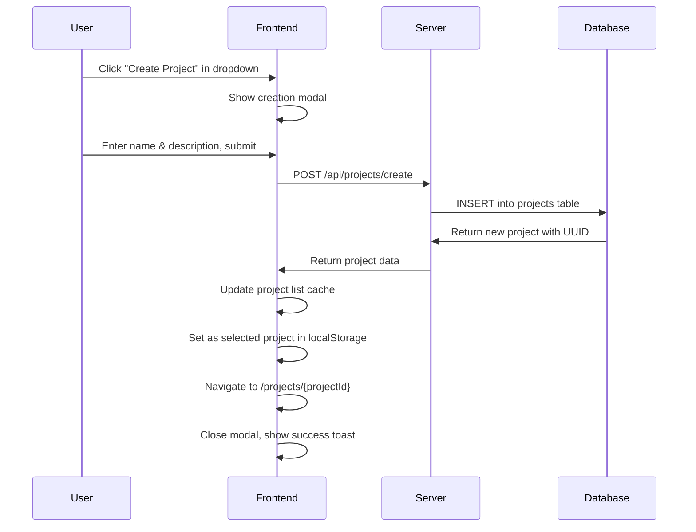
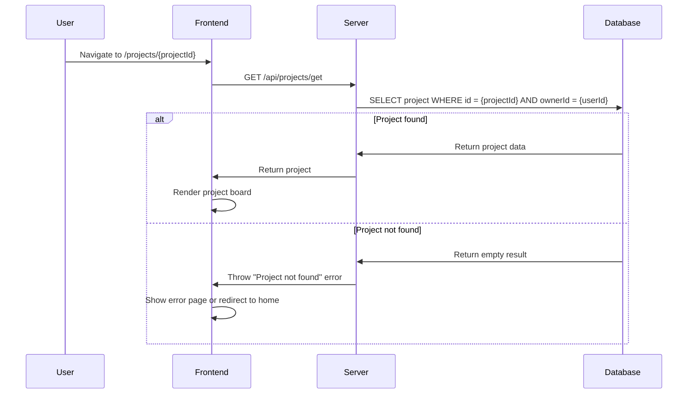
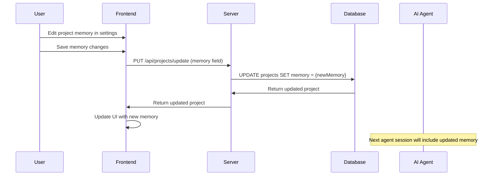
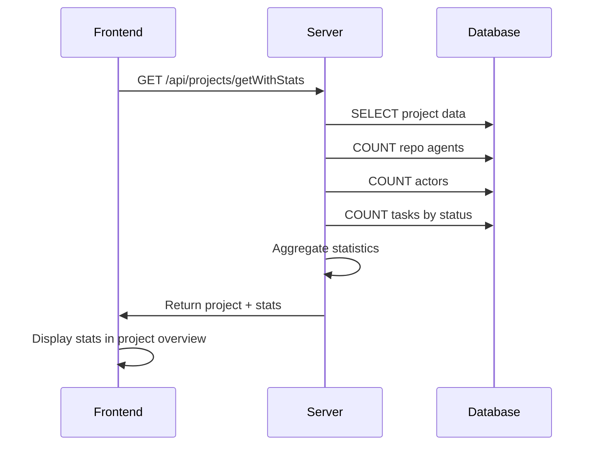

# Project Management

## Overview

Solo Unicorn projects are the top-level containers for organizing development work. Each project acts as a single board with tasks, configured repo agents, and actors. Projects also include memory storage for AI context that persists across all agent sessions.

## UX Flow

### Project Creation
1. **User clicks** project dropdown in header
2. **"Create Project"** option appears in dropdown menu
3. **Modal opens** with project creation form:
   - Project name (required)
   - Description (optional)
4. **User submits** form
5. **Auto-redirect** to new project board
6. **Auto-select** new project in dropdown

### Project Navigation
1. **Project dropdown** in header shows current project
2. **Click dropdown** to see all projects
3. **Search projects** by name in dropdown
4. **Select project** auto-navigates to project board
5. **Selection persists** across browser sessions via localStorage

### Project Settings
1. **Settings button** (gear icon) in project header
2. **Modal opens** with configuration tabs:
   - **Basic Info**: Name, description
   - **Project Memory**: AI context editor
   - **Repo Agents**: Repository configuration
   - **Actors**: Agent personalities
3. **Changes save** automatically or with explicit save action
4. **Real-time updates** reflect in UI immediately

### Project Memory Management
1. **"Edit Memory" button** in project settings
2. **Text editor** opens with current memory content
3. **User edits** project context information
4. **Save changes** updates database
5. **Memory included** in all future agent sessions

## System Flow

### Project Creation Flow


### Project Loading Flow


### Project Memory Update Flow


### Project Statistics Flow


## Data Models

### Projects Table (`apps/server/src/db/schema/index.ts:25-34`)
```sql
projects {
  id: uuid (PK)
  name: text (not null, max 255 chars)
  description: text (nullable)
  ownerId: uuid (FK to users.id)
  memory: jsonb (default {})
  createdAt: timestamp
  updatedAt: timestamp
}
```

### Project Memory Structure
```json
{
  "context": "Project-specific context for AI agents",
  "guidelines": "Development guidelines and preferences",
  "architecture": "System architecture notes",
  "conventions": "Coding conventions and standards",
  "notes": "Any additional context for agents"
}
```

### Project Relationships
- **One-to-Many**: Projects → Repo Agents
- **One-to-Many**: Projects → Actors  
- **One-to-Many**: Projects → Tasks
- **Many-to-One**: Projects → Users (owner)

## API Endpoints

### Core Project Routes (`apps/server/src/routers/projects.ts`)
- `GET /api/projects/list` - List all user projects (ordered by creation date)
- `GET /api/projects/get` - Get single project by ID with ownership check
- `POST /api/projects/create` - Create new project with name/description
- `PUT /api/projects/update` - Update project name, description, or memory
- `DELETE /api/projects/delete` - Delete project and all related data

### Extended Routes
- `GET /api/projects/getWithStats` - Get project with task/agent statistics
- `GET /api/projects/getWithTasks` - Get project with all tasks and session info

### Ownership & Security
- **All routes protected** by authentication middleware
- **Ownership verification** on every project access
- **User isolation** - users only see their own projects

## Frontend Components

### Project Switcher (`apps/web/src/components/project-switcher.tsx`)
- **Dropdown interface** for project selection
- **Integrated search** for project names
- **Create project modal** embedded in dropdown
- **localStorage persistence** for selected project
- **Auto-navigation** to selected project board

### Project Settings (`apps/web/src/components/project-settings.tsx`)
- **Modal-based settings** interface
- **Tabbed sections** for different configuration areas
- **Real-time validation** for form inputs
- **Optimistic updates** with error rollback

### Navigation Integration
- **Header integration** with project switcher
- **Auto-redirect logic** for authenticated users
- **Project-aware routing** with parameter validation

## Memory System

### Purpose
Project memory provides persistent context for AI agents across all sessions. This includes:
- Project-specific guidelines and preferences
- Architecture decisions and patterns
- Coding conventions and standards
- Domain knowledge and business rules

### Storage Format
- **JSONB field** in database for flexible structure
- **Markdown support** for rich text formatting
- **Versioning** through updatedAt timestamp
- **Size limits** enforced at application level

### Agent Integration
- **Automatic injection** into all agent session prompts
- **Read access** via MCP `project.memory.get` tool
- **Write access** via MCP `project.memory.update` tool
- **Cumulative context** builds over time

## Project Lifecycle

### Creation
1. User creates project with basic info
2. System generates UUID and timestamps
3. Empty memory object initialized
4. Default actor may be created automatically

### Configuration
1. User adds repo agents for different repositories
2. Custom actors defined for specific methodologies
3. Project memory populated with context
4. Initial tasks created

### Operation
1. Tasks assigned to repo agents
2. AI agents use project memory for context
3. Memory updated based on learnings
4. Statistics tracked for monitoring

### Deletion
1. **Cascade deletion** of all related data:
   - All tasks (including attachments)
   - All repo agents
   - All actors
   - All sessions
2. **Confirmation required** to prevent accidental loss
3. **Immediate removal** from user's project list

## Related Features
- [Authentication](./authentication.md) - Required for project ownership
- [Repo Agent Management](./repo-agents.md) - Project-scoped agent configuration
- [Actor Management](./actors.md) - Project-scoped agent personalities
- [Task Management](./task-management.md) - Project-scoped task organization