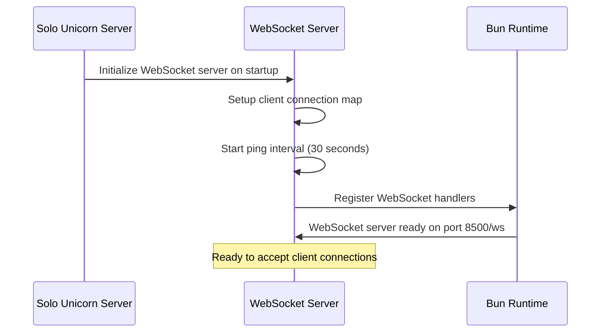
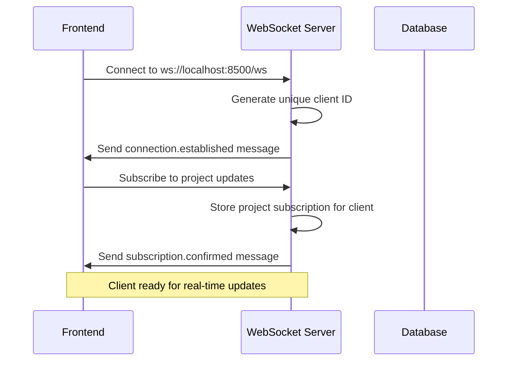
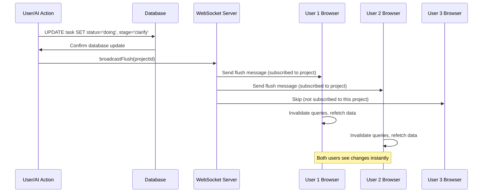
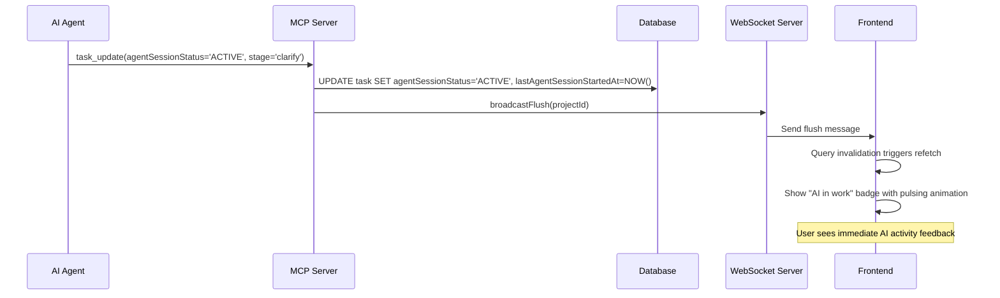
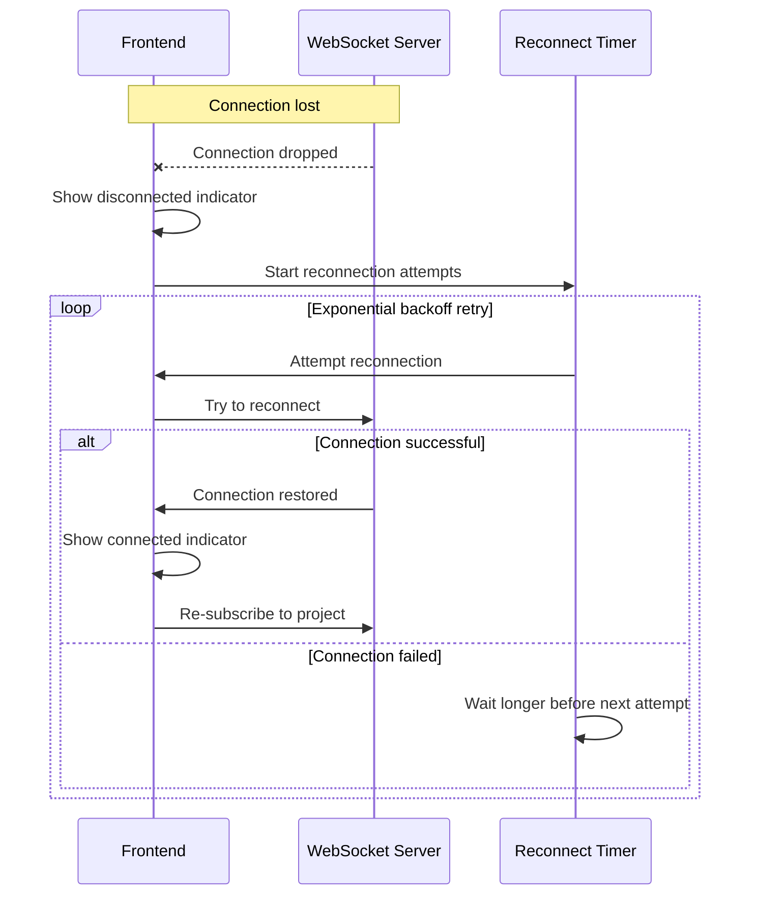

# Real-time Features

## Overview

Solo Unicorn provides comprehensive real-time synchronization across all connected clients through WebSocket communication, AI activity indicators, and optimistic UI updates. Users see immediate feedback for all system changes, including AI agent progress, task updates, and collaborative modifications.

## UX Flow

### Real-time Visual Indicators
1. **AI Activity Badges** show current agent status:
   - 🔄 "AI in work" (green, pulsing) - Agent actively processing task
   - ⏰ "Queueing" (blue) - Task ready and waiting for agent pickup
   - No badge - Task not ready or agent not available

2. **Stage Progress Indicators** update live:
   - clarify ●○○ - AI analyzing and clarifying requirements
   - Plan ●●○ - AI creating implementation strategy
   - Execute ●●● - AI implementing the solution

3. **Task Movement** happens automatically:
   - Cards move between columns as status changes
   - Position updates reflect drag & drop from other users
   - New tasks appear instantly across all connected browsers

### Multi-user Collaboration
1. **User A** marks task as ready via checkbox
2. **All connected users** see ready indicator immediately
3. **AI agent** picks up task automatically
4. **Real-time updates** show AI working badge on all screens
5. **Stage transitions** appear live as agent progresses
6. **Task completion** moves card to Done column for everyone

### WebSocket Connection States
- **🟢 Connected**: Real-time updates active, green indicator
- **🟡 Connecting**: Attempting to establish connection
- **🔴 Disconnected**: No real-time updates, red warning indicator
- **🔄 Reconnecting**: Automatic retry with exponential backoff

## System Flow

### WebSocket Server Initialization


### Client Connection Flow


### Real-time Update Broadcasting


### AI Activity Update Flow


### Connection Recovery Flow


## WebSocket Server Implementation

### Server Architecture (`apps/server/src/websocket/websocket-server.ts`)
```typescript
class WebSocketServer {
  private clients = new Map<string, ClientSubscription>();
  private pingInterval: NodeJS.Timeout | null = null;

  constructor() {
    // Keep connections alive with regular pings
    this.pingInterval = setInterval(() => {
      this.pingAllClients();
    }, 30000); // 30 seconds
  }

  addClient(ws: ServerWebSocket, clientId: string) {
    this.clients.set(clientId, { ws, lastPing: Date.now() });
    this.sendToClient(clientId, {
      type: 'connection.established',
      data: { clientId, timestamp: new Date().toISOString() }
    });
  }

  broadcastFlush(projectId?: string) {
    const message = {
      type: 'flush',
      data: { projectId, timestamp: new Date().toISOString() }
    };

    for (const [clientId, client] of this.clients.entries()) {
      if (!projectId || client.projectId === projectId) {
        client.ws.send(JSON.stringify(message));
      }
    }
  }
}
```

### Message Types
```typescript
interface WebSocketMessage {
  type: 'connection.established' | 'subscription.confirmed' | 'flush' | 'ping' | 'pong';
  data: {
    clientId?: string;
    projectId?: string;
    timestamp: string;
  };
}
```

### Client Subscription Management
```typescript
interface ClientSubscription {
  projectId?: string;        // Which project the client is viewing
  ws: ServerWebSocket<any>;  // WebSocket connection
  lastPing?: number;         // For connection health monitoring
}
```

## Frontend WebSocket Integration

### Connection Setup
```typescript
// WebSocket connection with automatic reconnection
const useWebSocket = (projectId: string) => {
  const [isConnected, setIsConnected] = useState(false);
  const [ws, setWs] = useState<WebSocket | null>(null);

  useEffect(() => {
    const connect = () => {
      const wsUrl = 'ws://localhost:8500/ws';
      const websocket = new WebSocket(wsUrl);

      websocket.onopen = () => {
        setIsConnected(true);
        setWs(websocket);

        // Subscribe to project updates
        websocket.send(JSON.stringify({
          type: 'subscribe',
          projectId: projectId
        }));
      };

      websocket.onmessage = (event) => {
        const message = JSON.parse(event.data);
        handleWebSocketMessage(message);
      };

      websocket.onclose = () => {
        setIsConnected(false);
        setWs(null);
        // Attempt reconnection with exponential backoff
        setTimeout(connect, getReconnectDelay());
      };
    };

    connect();
  }, [projectId]);
};
```

### Query Invalidation on Updates
```typescript
// Handle WebSocket messages for real-time updates
const handleWebSocketMessage = (message: WebSocketMessage) => {
  switch (message.type) {
    case 'flush':
      // Invalidate all queries for the project to trigger refetch
      queryClient.invalidateQueries(['projects', message.data.projectId]);
      queryClient.invalidateQueries(['tasks', message.data.projectId]);
      break;

    case 'connection.established':
      console.log('WebSocket connected:', message.data.clientId);
      break;

    case 'ping':
      // Respond to server ping to keep connection alive
      if (ws) {
        ws.send(JSON.stringify({ type: 'pong' }));
      }
      break;
  }
};
```

## AI Activity Indicators

### AI Activity Badge Component (`apps/web/src/components/ai-activity-badge.tsx`)
```typescript
interface AIActivityBadgeProps {
  ready: boolean | null;
  agentSessionStatus: 'INACTIVE' | 'PUSHING' | 'ACTIVE' | null;
  status: string;
}

export function AIActivityBadge({ ready, agentSessionStatus, status }: AIActivityBadgeProps) {
  // AI actively working - highest priority
  if (agentSessionStatus === 'ACTIVE') {
    return (
      <Badge className="bg-green-100 text-green-800 border-green-200">
        <Zap className="h-3 w-3 animate-pulse" />
        AI in work
      </Badge>
    );
  }

  // Task ready and queued for AI pickup
  if (status === "todo" && ready === true && agentSessionStatus !== 'ACTIVE') {
    return (
      <Badge className="bg-blue-100 text-blue-800 border-blue-200">
        <Clock className="h-3 w-3" />
        Queueing
      </Badge>
    );
  }

  return null; // No badge for other states
}
```

### Badge State Logic
```typescript
const getBadgeState = (task: Task) => {
  // Priority order for badge display:
  // 1. AI Working (green, pulsing) - agent actively processing
  // 2. Queueing (blue) - ready and waiting for pickup
  // 3. No badge - not ready or completed

  if (task.agentSessionStatus === 'ACTIVE' && task.status !== 'done') {
    return 'ai-working';
  }

  if (task.ready && task.status === 'todo' && task.agentSessionStatus !== 'ACTIVE') {
    return 'queueing';
  }

  return 'none';
};
```

### Stage Progress Indicators
```typescript
const StageIndicator = ({ stage }: { stage: string | null }) => {
  const stages = {
    clarify: { dots: '●○○', color: 'purple' },
    plan: { dots: '●●○', color: 'pink' },
    execute: { dots: '●●●', color: 'blue' }
  };

  if (!stage || !stages[stage]) return null;

  const { dots, color } = stages[stage];

  return (
    <span className={`text-${color}-600 font-mono`}>
      Stage: {stage} {dots}
    </span>
  );
};
```

## Optimistic UI Updates

### Optimistic Update Pattern
```typescript
const updateTaskMutation = useMutation({
  mutationFn: orpc.tasks.update.mutate,

  onMutate: async (variables) => {
    // Cancel outgoing refetches to avoid overwriting optimistic update
    await queryClient.cancelQueries(['tasks']);

    // Snapshot the previous value for rollback
    const previousTasks = queryClient.getQueryData(['tasks']);

    // Optimistically update to the new value
    queryClient.setQueryData(['tasks'], (old) => {
      return updateTaskInList(old, variables);
    });

    return { previousTasks };
  },

  onError: (err, variables, context) => {
    // Rollback to previous state on error
    queryClient.setQueryData(['tasks'], context.previousTasks);
    toast.error('Update failed - changes reverted');
  },

  onSettled: () => {
    // Always refetch after mutation to ensure consistency
    queryClient.invalidateQueries(['tasks']);
  }
});
```

### Conflict Resolution
```typescript
// Handle concurrent updates gracefully
const handleOptimisticConflict = (optimisticData, serverData) => {
  // Server data takes precedence over optimistic updates
  // But preserve any newer optimistic changes made after server data timestamp

  const mergedData = {
    ...serverData,
    // Keep local optimistic changes if they're newer
    ...getNewerOptimisticChanges(optimisticData, serverData.updatedAt)
  };

  return mergedData;
};
```

## Connection Health Monitoring

### Ping/Pong Heartbeat
```typescript
// Server-side ping to detect dead connections
setInterval(() => {
  for (const [clientId, client] of clients.entries()) {
    try {
      client.ws.send(JSON.stringify({ type: 'ping' }));
      client.lastPing = Date.now();
    } catch (error) {
      // Connection is dead, remove client
      clients.delete(clientId);
    }
  }
}, 30000); // 30 seconds

// Client-side pong response
websocket.onmessage = (event) => {
  const message = JSON.parse(event.data);
  if (message.type === 'ping') {
    websocket.send(JSON.stringify({ type: 'pong' }));
  }
};
```

### Connection Status UI
```typescript
const ConnectionStatusIndicator = () => {
  const { isConnected, isReconnecting } = useWebSocketStatus();

  if (isReconnecting) {
    return (
      <Badge variant="outline" className="bg-yellow-100 text-yellow-800">
        🔄 Reconnecting...
      </Badge>
    );
  }

  if (!isConnected) {
    return (
      <Badge variant="outline" className="bg-red-100 text-red-800">
        🔴 Offline
      </Badge>
    );
  }

  return (
    <Badge variant="outline" className="bg-green-100 text-green-800">
      🟢 Live
    </Badge>
  );
};
```

## Performance Optimizations

### Efficient Broadcasting
```typescript
// Only broadcast to clients subscribed to affected project
broadcastFlush(projectId); // Targeted broadcast

// Batch multiple updates to reduce message frequency
const batchedBroadcast = debounce((projectId) => {
  broadcastFlush(projectId);
}, 100); // 100ms debounce
```

### Query Invalidation Strategy
```typescript
// Smart invalidation - only refetch what's actually displayed
const handleFlushMessage = (message) => {
  const { projectId } = message.data;

  // Only invalidate if user is viewing the affected project
  if (currentProjectId === projectId) {
    queryClient.invalidateQueries(['tasks', projectId]);
    queryClient.invalidateQueries(['projects', projectId]);
  }
};
```

### Memory Management
```typescript
// Clean up dead WebSocket connections
const cleanupDeadConnections = () => {
  const now = Date.now();
  const TIMEOUT = 60000; // 1 minute

  for (const [clientId, client] of clients.entries()) {
    if (now - (client.lastPing || 0) > TIMEOUT) {
      clients.delete(clientId);
      console.log(`Cleaned up dead connection: ${clientId}`);
    }
  }
};
```

## Error Handling

### WebSocket Error Recovery
```typescript
// Exponential backoff for reconnection attempts
let reconnectAttempts = 0;
const maxReconnectAttempts = 10;

const getReconnectDelay = () => {
  return Math.min(1000 * Math.pow(2, reconnectAttempts), 30000); // Max 30 seconds
};

const attemptReconnect = () => {
  if (reconnectAttempts >= maxReconnectAttempts) {
    console.error('Max reconnection attempts reached');
    return;
  }

  setTimeout(() => {
    reconnectAttempts++;
    connect();
  }, getReconnectDelay());
};
```

### Graceful Degradation
```typescript
// Fall back to polling when WebSocket unavailable
const useFallbackPolling = (enabled: boolean) => {
  useEffect(() => {
    if (!enabled) return;

    const interval = setInterval(() => {
      // Poll for updates every 5 seconds as fallback
      queryClient.invalidateQueries(['tasks']);
    }, 5000);

    return () => clearInterval(interval);
  }, [enabled]);
};
```

## Integration Points

### MCP Server Integration
```typescript
// MCP server broadcasts after task updates
export async function updateTask(taskId: string, updates: any) {
  const result = await db.update(tasks).set(updates).where(eq(tasks.id, taskId));

  // Broadcast changes to all connected clients
  const task = await db.query.tasks.findFirst({ where: eq(tasks.id, taskId) });
  broadcastFlush(task.projectId);

  return result;
}
```

### Orchestrator Integration
```typescript
// Agent orchestrator triggers real-time updates
await this.assignTaskToAgent(taskData);
broadcastFlush(taskData.project.id); // Notify all users of assignment
```

## Related Features
- [Task Lifecycle](./task-lifecycle.md) - Real-time stage progression updates
- [Kanban Board](./kanban-board.md) - Live task movement and positioning
- [AI Agent Orchestration](./ai-orchestration.md) - AI activity status broadcasting
- [MCP Integration](./mcp-integration.md) - Agent updates trigger WebSocket broadcasts
- [Task Management](./task-management.md) - Live CRUD operation synchronization
