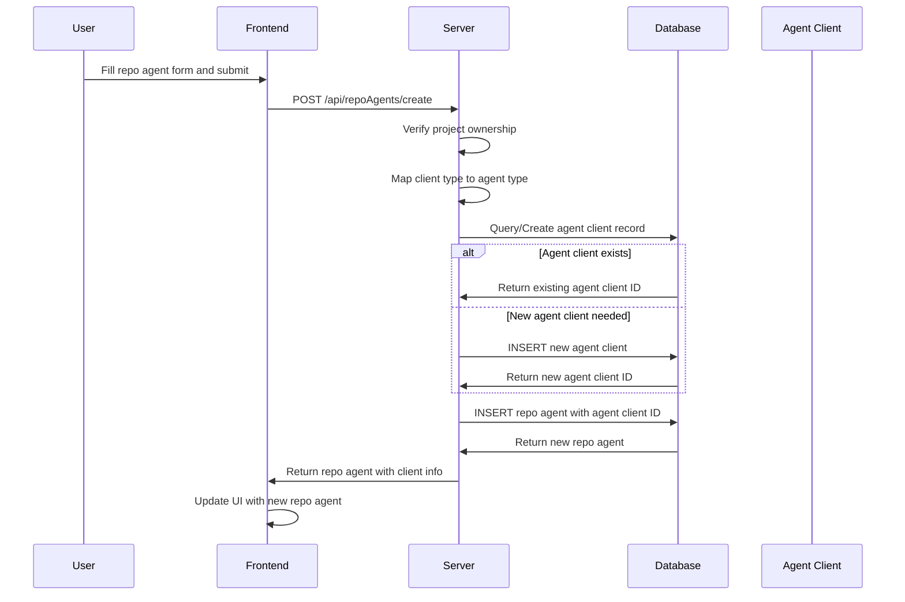
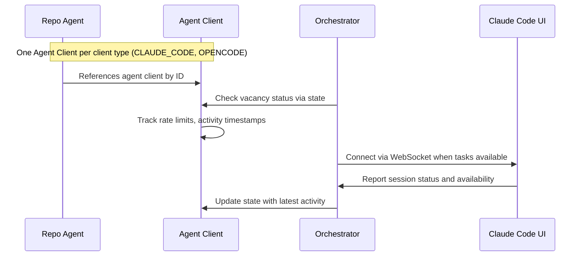
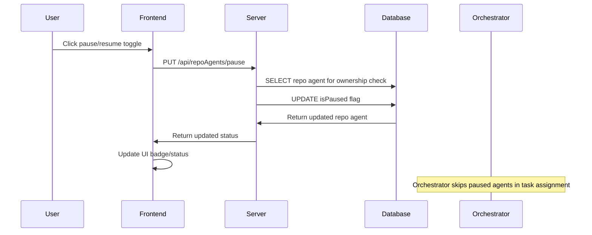
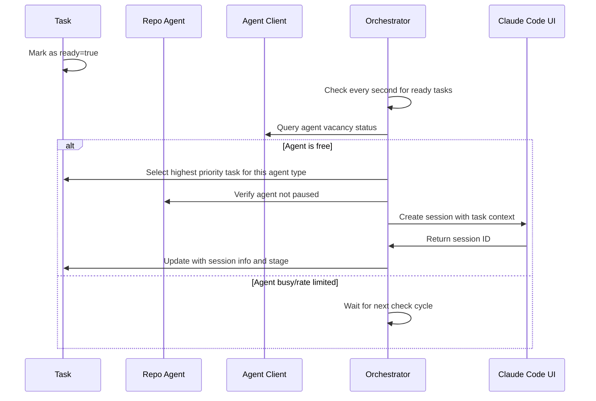

# Repo Agent Management

## Overview

Repo agents are the bridge between Solo Unicorn projects and AI coding clients like Claude Code or OpenCode. Each repo agent represents a combination of a local repository path and a specific coding client type, enabling tasks to be automatically assigned to the appropriate development environment.

## UX Flow

### Creating Repo Agents
1. **Open project settings** via gear icon in project header
2. **Navigate to "Repo Agents" tab** in settings modal
3. **Click "+ Add Repo Agent"** button
4. **Fill configuration form**:
   - Name (e.g., "Main Repo (Claude Code)")
   - Repository path (local file system path)
   - Client type (Claude Code, OpenCode, etc.)
   - Optional configuration settings
5. **Submit form** to create repo agent
6. **Auto-refresh** repo agents list with new entry

### Managing Repo Agents
1. **View all repo agents** in project settings
2. **Status indicators** show agent state:
   - **Active**: Ready to receive tasks
   - **Paused**: Manually disabled by user
   - **Rate Limited**: Temporarily unavailable due to API limits
3. **Pause/Resume agents** via toggle buttons
4. **Edit agent configuration** via edit buttons
5. **Delete agents** with confirmation dialog

### Agent Status Monitoring
1. **Real-time status updates** via WebSocket connections
2. **Visual badges** indicate current agent state
3. **Rate limit information** shows when agent will be available
4. **Activity indicators** show recent task assignments

## System Flow

### Repo Agent Creation Flow


### Agent Client Management


### Repo Agent Pause/Resume Flow


### Task Assignment Flow


## Data Models

### Repo Agents Table (`apps/server/src/db/schema/index.ts:36-47`)
```sql
repoAgents {
  id: uuid (PK)
  projectId: uuid (FK to projects.id)
  agentClientId: uuid (FK to agentClients.id)
  name: text (not null)
  repoPath: text (not null)
  config: jsonb (default {})
  isPaused: boolean (default false)
  createdAt: timestamp
  updatedAt: timestamp
}
```

### Agent Clients Table (`apps/server/src/db/schema/index.ts:16-23`)
```sql
agentClients {
  id: uuid (PK)
  type: enum (CLAUDE_CODE, CURSOR_CLI, OPENCODE)
  state: jsonb (default {})
  createdAt: timestamp
  updatedAt: timestamp
}
```

### Agent Client State Structure
```json
{
  "lastMessagedAt": "2025-01-15T10:30:00Z",
  "lastSessionCompletedAt": "2025-01-15T10:25:00Z", 
  "lastSessionCreatedAt": "2025-01-15T10:20:00Z",
  "lastTaskPushedAt": "2025-01-15T10:20:00Z",
  "rateLimitedUntil": "2025-01-15T11:00:00Z"
}
```

### Relationships
- **Many-to-One**: Repo Agents → Projects
- **Many-to-One**: Repo Agents → Agent Clients  
- **One-to-Many**: Repo Agents → Tasks
- **One-to-Many**: Agent Clients → Repo Agents

## API Endpoints

### Repo Agent Routes (`apps/server/src/routers/repo-agents.ts`)
- `GET /api/repoAgents/list` - List repo agents for project with client info
- `GET /api/repoAgents/get` - Get single repo agent with ownership check
- `POST /api/repoAgents/create` - Create new repo agent and link to agent client
- `PUT /api/repoAgents/update` - Update repo agent configuration
- `PUT /api/repoAgents/pause` - Pause/resume repo agent
- `DELETE /api/repoAgents/delete` - Delete repo agent (orphans tasks)

### Client Type Mapping
```javascript
// Frontend uses lowercase, backend uses uppercase enums
const clientTypeMap = {
  "claude_code": "CLAUDE_CODE",
  "opencode": "OPENCODE",
  "cursor_cli": "CURSOR_CLI"
}
```

### Agent Client Management
- **Auto-creation** of agent client records when needed
- **Shared agent clients** across multiple repo agents of same type
- **State tracking** for vacancy determination and rate limiting

## Agent Orchestration

### Vacancy Detection (`apps/server/src/agents/agent-orchestrator.ts`)
```javascript
// Agent considered vacant if:
// 1. Not rate limited (rateLimitedUntil < now)
// 2. No recent task pushed (lastTaskPushedAt > 30s ago)
// 3. No recent session activity (lastMessagedAt > 30s ago)
```

### Task Selection Priority
1. **Status**: `doing` tasks before `todo` tasks
2. **Priority**: 5 (highest) to 1 (lowest)
3. **Column Order**: Manual drag & drop order within status
4. **Creation Time**: Oldest first as tiebreaker

### Session Management
- **WebSocket connection** to Claude Code UI
- **Session reuse** for task continuity across stages
- **Real-time status** updates via MCP

## Frontend Components

### Repo Agent List
- **Status badges** with color-coded states
- **Pause/resume toggles** for manual control
- **Edit/delete actions** for configuration management
- **Real-time updates** via query invalidation

### Repo Agent Form
- **Path validation** for local file system access
- **Client type selection** with supported options
- **Configuration editor** for client-specific settings
- **Ownership verification** on all operations

### Project Settings Integration
- **Tabbed interface** within project settings modal
- **Inline creation** without leaving settings context
- **Bulk operations** for multiple agent management

## Configuration Options

### Client-Specific Settings
```json
{
  "workingDirectory": "/path/to/repo",
  "environmentVariables": {
    "NODE_ENV": "development"
  },
  "preferredEditor": "code",
  "customPrompts": {}
}
```

### Repository Path Requirements
- **Absolute paths** to local directories
- **Git repository** recommended but not required
- **Write permissions** needed for agent operations
- **Path validation** on creation and updates

## Rate Limiting & Availability

### Rate Limit Handling
- **API rate limits** tracked per agent client type
- **Automatic retry** when limits reset
- **User notification** of rate limit status
- **Graceful degradation** during peak usage

### Availability States
- **Active**: Ready to receive tasks immediately
- **Paused**: Manually disabled, skipped by orchestrator
- **Rate Limited**: Temporarily unavailable, auto-resumes
- **Error**: Connection or configuration issues

## Security & Isolation

### Access Control
- **Project ownership** verification on all operations
- **User isolation** - agents only accessible to owner
- **Path restrictions** prevent access outside allowed directories

### Agent Isolation
- **Separate sessions** per repo agent
- **Independent configuration** and state tracking
- **Isolated file system** access per repository

## Related Features
- [Project Management](./project-management.md) - Project-scoped agent configuration
- [Task Management](./task-management.md) - Tasks assigned to specific repo agents
- [AI Agent Orchestration](./ai-orchestration.md) - Automatic task assignment logic
- [MCP Integration](./mcp-integration.md) - Agent communication protocol