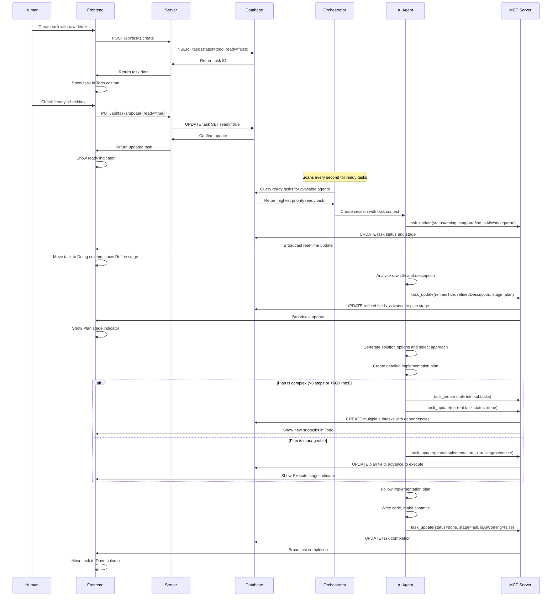
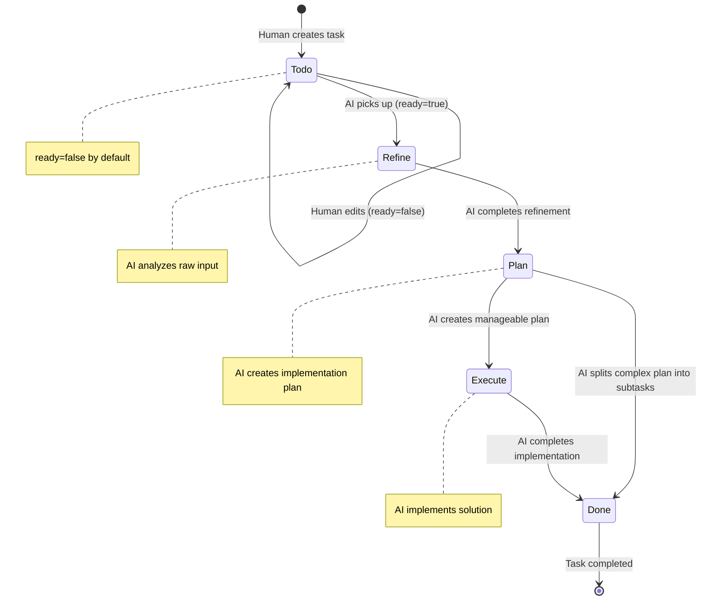
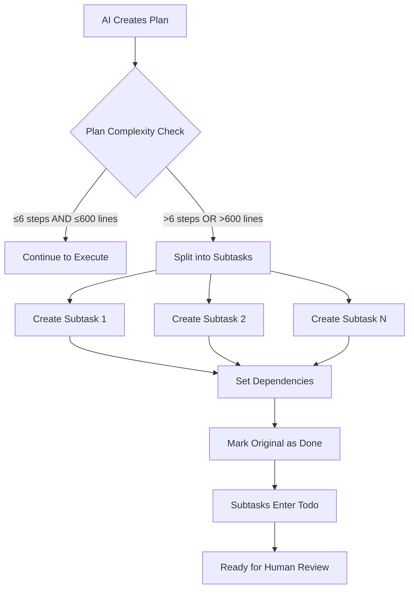
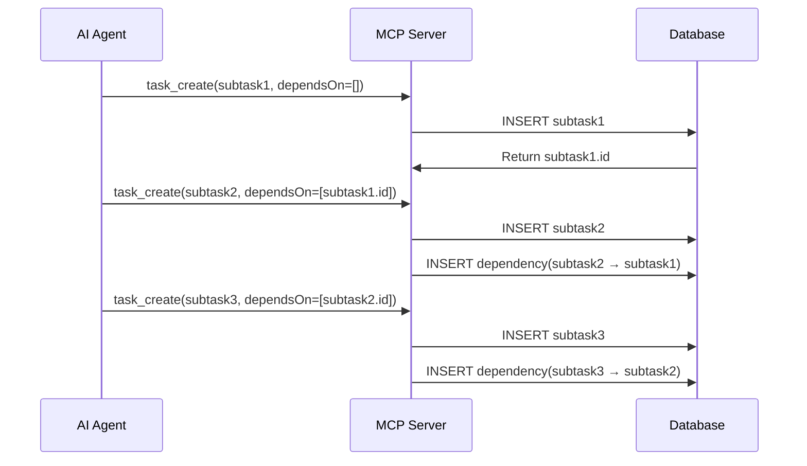

# Task Lifecycle

## Overview

The Solo Unicorn task lifecycle represents the complete journey from human task creation to AI-driven implementation. Tasks flow through distinct stages with AI agents automatically progressing them from raw ideas to completed implementations, with humans maintaining control through the "ready" flag.

## UX Flow

### Task Creation by Human
1. **Click "+ New Task"** button on project board
2. **Fill task creation form**:
   - Raw title (required, brief description)
   - Raw description (optional, additional context)
   - Repo agent selection (mandatory)
   - Actor selection (optional, defaults to project default)
   - Priority level (1-5, defaults to 3)
   - Attachments (optional, drag & drop files/images)
3. **Submit form** - task created in "Todo" status, not ready
4. **Review task details** in task drawer if needed
5. **Mark as ready** when prepared for AI pickup

### Human Readiness Control
1. **Ready checkbox** on task cards (unchecked by default)
2. **Human reviews** task details, attachments, context
3. **Tick ready checkbox** when satisfied with task definition
4. **AI automatically picks up** ready tasks based on priority
5. **Uncheck ready** to pause AI processing at any time

### AI-Driven Progression
1. **Orchestrator scans** for ready tasks every second
2. **AI picks up** highest priority ready task for available agent type
3. **Automatic progression** through refine → plan → execute stages
4. **Real-time updates** show current stage and AI activity
5. **Completion** moves task to "Done" column automatically

## System Flow

### Complete Task Lifecycle Flow


### Stage Transitions


### Task Splitting Logic


## Data Models

### Task Status and Stage Fields
```sql
tasks {
  status: text -- 'todo', 'doing', 'done', 'loop'
  stage: text -- 'refine', 'plan', 'execute', null (only when status='doing')
  ready: boolean -- Human control for AI pickup
  isAiWorking: boolean -- AI activity indicator
  aiWorkingSince: timestamp -- When AI started working
}
```

### Task Data Evolution
```json
{
  "creation": {
    "rawTitle": "user login",
    "rawDescription": "need login page",
    "status": "todo",
    "stage": null,
    "ready": false
  },
  "after_refine": {
    "rawTitle": "user login",
    "rawDescription": "need login page", 
    "refinedTitle": "Implement user authentication with email/password",
    "refinedDescription": "Create login page, authentication service, and session management",
    "status": "doing",
    "stage": "plan"
  },
  "after_plan": {
    "plan": {
      "selectedSolution": "OAuth + JWT tokens",
      "spec": "Implement Google OAuth integration...",
      "steps": ["Create auth service", "Build login UI", "Add session management"]
    },
    "status": "doing", 
    "stage": "execute"
  },
  "after_execute": {
    "status": "done",
    "stage": null,
    "isAiWorking": false
  }
}
```

## AI Prompt Templates

### Refine Stage Prompt (`apps/server/src/agents/prompts/index.ts:23-50`)
- **Purpose**: Convert raw human input into clear, actionable requirements
- **Input**: Raw title, raw description, actor context, project memory
- **Output**: Refined title and description with clear scope
- **MCP Calls**: Start with `task_update(status=doing, stage=refine, isAiWorking=true)`, finish with stage transition to "plan"

### Plan Stage Prompt (`apps/server/src/agents/prompts/index.ts:53-102`)
- **Purpose**: Create comprehensive implementation plan with solution evaluation
- **Process**:
  1. List viable solution options
  2. Evaluate based on UX, simplicity, best practices
  3. Select final approach
  4. Create detailed implementation plan
  5. Check complexity and split if needed
- **Complexity Limits**: >6 implementation steps OR >600 lines of code triggers splitting
- **MCP Calls**: Can create subtasks via `task_create` or advance to "execute" stage

### Execute Stage Prompt (`apps/server/src/agents/prompts/index.ts:104-132`)
- **Purpose**: Implement the solution following the established plan
- **Input**: Refined requirements, implementation plan, project context
- **Process**: Follow plan, write code, make commits, complete task
- **MCP Calls**: Start execution, finish with `task_update(status=done)`

## MCP Integration

### Task Update Tool
```typescript
// Core MCP tool for task lifecycle management
task_update({
  taskId: string,
  status?: 'todo' | 'doing' | 'done' | 'loop',
  stage?: 'refine' | 'plan' | 'execute' | null,
  isAiWorking?: boolean,
  refinedTitle?: string,
  refinedDescription?: string,
  plan?: object
})
```

### Task Creation Tool (for splitting)
```typescript
// MCP tool for creating subtasks during plan stage
task_create({
  projectId: string,
  repoAgentId: string,
  actorId?: string,
  refinedTitle: string,
  refinedDescription: string,
  plan?: object,
  priority: number,
  stage: 'execute', // Skip refine/plan for subtasks
  dependsOn: string[] // Dependency chain
})
```

### Real-time Broadcasting
- **WebSocket updates** broadcast task changes to all connected clients
- **Optimistic UI updates** with server confirmation
- **Live stage indicators** show current AI progress

## Task Dependencies

### Dependency Management
- **Sequential dependencies** for subtasks created during plan splitting
- **Dependency chains** ensure proper execution order
- **Blocking indicators** show tasks waiting on dependencies
- **Auto-resolution** when dependency tasks complete

### Dependency Creation Flow


## Priority and Ordering

### Task Selection Algorithm
1. **Ready status**: `ready=true` AND `isAiWorking=false`
2. **Status priority**: `doing` tasks before `todo` tasks
3. **Priority level**: 5 (highest) to 1 (lowest)
4. **Column order**: Manual drag & drop position within status
5. **Creation time**: Oldest first as final tiebreaker

### Agent Type Matching
- **Repo agent assignment** determines which AI client can pick up task
- **Agent availability** checked before task assignment
- **Rate limiting** prevents overloading individual agents

## Error Handling and Recovery

### Failed Task Recovery
- **Loop status** for tasks that encounter issues
- **Manual intervention** options for stuck tasks
- **Stage restart** capability for debugging
- **Agent reset** to clear problematic sessions

### Timeout Handling
- **AI working timeout** detects stuck agents
- **Automatic recovery** resets stuck tasks to ready state
- **Session cleanup** removes orphaned agent sessions

## Human Control Points

### Ready Flag Management
- **Default to not ready** for human review
- **Manual ready control** at any time during lifecycle
- **Batch ready operations** for multiple tasks
- **Ready indicators** show current readiness state

### Manual Interventions
- **Force stage transitions** for debugging
- **Edit refined content** if AI misunderstood requirements
- **Cancel AI work** by unchecking ready flag
- **Delete tasks** at any lifecycle stage

## Related Features
- [Task Management](./task-management.md) - CRUD operations and task properties
- [Kanban Board](./kanban-board.md) - Visual representation of task flow
- [AI Agent Orchestration](./ai-orchestration.md) - Automatic task pickup logic
- [MCP Integration](./mcp-integration.md) - Agent communication protocol
- [Actors](./actors.md) - AI personality influence on task execution