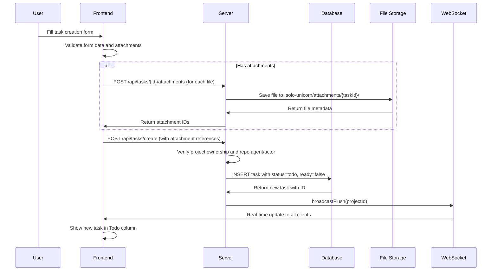
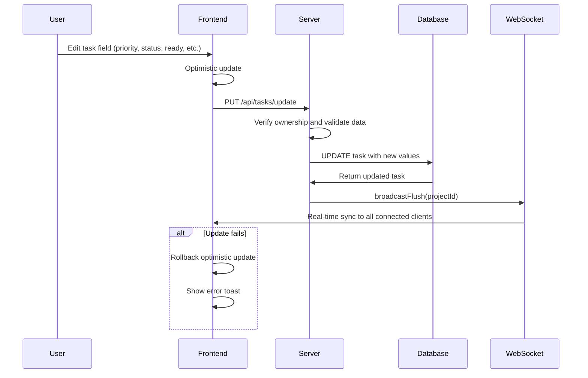
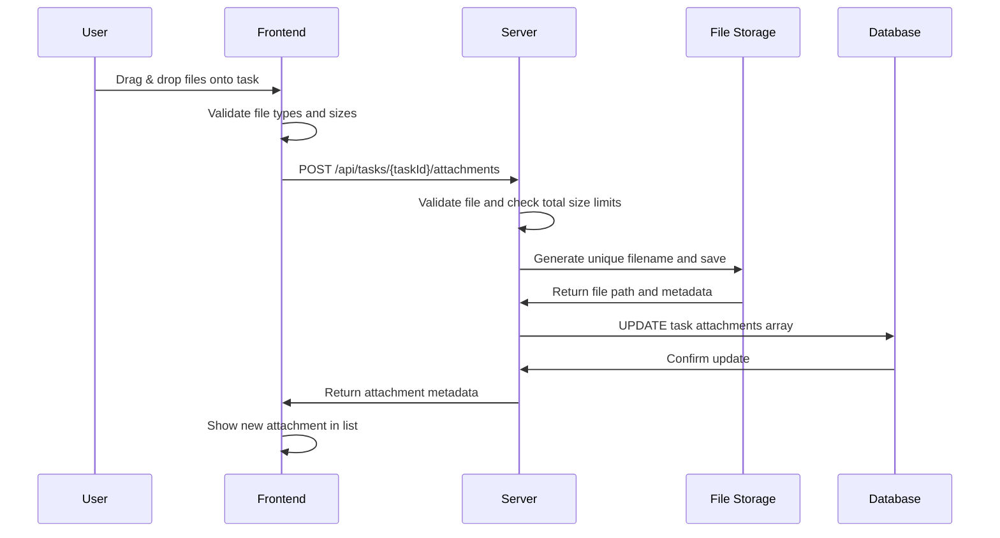
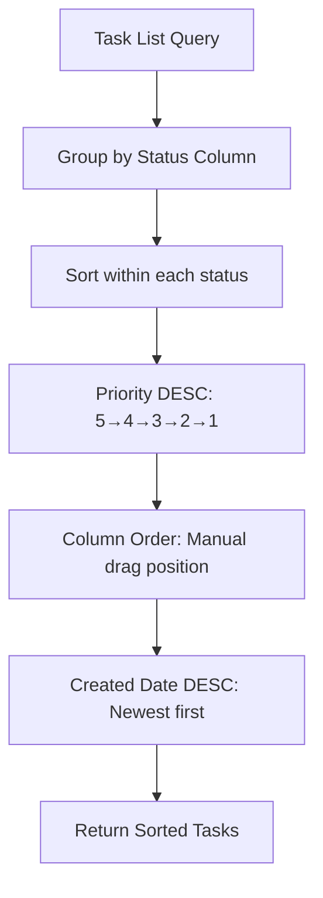

# Task Management

## Overview

Solo Unicorn's task management system provides comprehensive CRUD operations for tasks with priority management, file attachments, ready state control, and rich metadata tracking. Tasks serve as the fundamental work units that flow through the AI-assisted development pipeline.

## UX Flow

### Task Creation
1. **Click "+ New Task"** button on Kanban board
2. **Task creation modal** opens with form fields:
   - **Raw Title** (required): Brief description of what needs to be done
   - **Raw Description** (optional): Additional context and requirements
   - **Repo Agent** (required): Which repository/client will handle the task
   - **Actor** (optional): AI personality, defaults to project default
   - **Priority** (optional): 1-5 scale, defaults to 3 (Medium)
   - **Attachments** (optional): Drag & drop files, images, documents
3. **Submit form** creates task in Todo column, not ready by default
4. **Review and edit** task details in task drawer if needed
5. **Mark as ready** when satisfied with task definition

### Task Editing
1. **Click task card** to open task drawer
2. **Tabbed interface** shows different aspects:
   - **Overview**: Basic task information and status
   - **Details**: Raw and refined content, descriptions
   - **Attachments**: File management and preview
   - **History**: Task progression and changes
3. **Inline editing** for most fields with auto-save
4. **Status and priority** changes with dropdown selectors
5. **Real-time updates** sync across all connected users

### Priority Management
1. **Visual priority badges** on task cards (P1-P5)
2. **Color-coded indicators**:
   - P1 (Gray): Lowest priority
   - P2 (Blue): Low priority  
   - P3 (Yellow): Medium priority (default)
   - P4 (Orange): High priority
   - P5 (Red): Highest priority
3. **Quick priority changes** via task drawer dropdown
4. **Automatic sorting** by priority within each column

### Attachment Management
1. **Drag & drop files** onto task creation modal or task drawer
2. **Supported file types**: Images, documents, code files, archives
3. **File validation**: Size limits (10MB per file, 50MB total per task)
4. **Preview functionality** for images and text files
5. **Download and delete** operations for attachments
6. **Attachment counter** on task cards shows file count

### Ready State Control
1. **Ready checkbox** on each task card (unchecked by default)
2. **Human control** over AI pickup timing
3. **Visual indicators** show ready vs not-ready state
4. **Bulk operations** for marking multiple tasks ready
5. **AI automatic pickup** only for ready tasks

## System Flow

### Task Creation Flow


### Task Update Flow


### Attachment Upload Flow


### Priority-Based Task Sorting


## Data Models

### Tasks Table (`apps/server/src/db/schema/index.ts:60-105`)
```sql
tasks {
  id: uuid (PK)
  projectId: uuid (FK to projects.id)
  repoAgentId: uuid (FK to repoAgents.id)
  actorId: uuid (FK to actors.id, nullable)
  
  -- Human input
  rawTitle: text (not null)
  rawDescription: text (nullable)
  
  -- AI generated
  refinedTitle: text (nullable)
  refinedDescription: text (nullable)
  plan: jsonb (default {})
  
  -- Status management
  status: text (todo/doing/done/loop, default 'todo')
  stage: text (refine/plan/execute/loop, nullable)
  priority: integer (1-5, default 3)
  columnOrder: text (decimal string for drag & drop)
  ready: boolean (default false)
  
  -- AI coordination
  isAiWorking: boolean (default false)
  aiWorkingSince: timestamp (nullable)
  author: text (human/ai, default 'human')
  
  -- Attachments
  attachments: jsonb (default [], array of metadata objects)
  
  createdAt: timestamp
  updatedAt: timestamp
}
```

### Attachment Metadata Structure
```json
{
  "id": "uuid-string",
  "filename": "sanitized-file-name.ext",
  "originalName": "User Original File Name.ext",
  "path": ".solo-unicorn/attachments/task-id/uuid-filename.ext",
  "size": 1024000,
  "type": "image/png",
  "uploadedAt": "2025-01-15T10:30:00Z"
}
```

### Priority System
```typescript
type Priority = 1 | 2 | 3 | 4 | 5;

const priorityConfig = {
  1: { label: "Lowest", color: "bg-gray-100 text-gray-600" },
  2: { label: "Low", color: "bg-blue-100 text-blue-600" },
  3: { label: "Medium", color: "bg-yellow-100 text-yellow-600" }, // default
  4: { label: "High", color: "bg-orange-100 text-orange-600" },
  5: { label: "Highest", color: "bg-red-100 text-red-600" }
};
```

## API Endpoints

### Core Task Routes (`apps/server/src/routers/tasks.ts`)
- `GET /api/tasks/list` - List tasks for project with related data (repo agents, actors)
- `GET /api/tasks/get` - Get single task by ID with ownership verification
- `POST /api/tasks/create` - Create new task with validation and attachments
- `PUT /api/tasks/update` - Update task fields with optimistic UI support
- `DELETE /api/tasks/delete` - Delete task and cleanup attachments
- `PUT /api/tasks/reorder` - Bulk update task positions for drag & drop

### Attachment Routes
- `POST /api/tasks/{id}/attachments` - Upload file attachment
- `GET /api/tasks/{id}/attachments/{attachmentId}` - Download attachment file
- `DELETE /api/tasks/{id}/attachments/{attachmentId}` - Delete attachment

### Task State Management
- `PUT /api/tasks/{id}/ready` - Toggle ready flag for AI pickup
- `PUT /api/tasks/{id}/status` - Change task status (todo/doing/done)
- `PUT /api/tasks/{id}/priority` - Update task priority

## File Storage System

### Storage Structure (`apps/server/src/utils/file-storage.ts`)
```
.solo-unicorn/
└── attachments/
    └── {task-id}/
        ├── {uuid}-original-filename.ext
        ├── {uuid}-document.pdf
        └── {uuid}-image.png
```

### File Validation
```typescript
const SUPPORTED_TYPES = [
  // Images
  'image/png', 'image/jpeg', 'image/gif', 'image/svg+xml', 'image/webp',
  // Documents  
  'application/pdf', 'text/plain', 'text/markdown',
  // Code files
  'text/javascript', 'application/json', 'text/html',
  // Archives
  'application/zip', 'application/gzip'
];

const FILE_LIMITS = {
  maxFileSize: 10 * 1024 * 1024,    // 10MB per file
  maxTotalSize: 50 * 1024 * 1024    // 50MB per task
};
```

### Security Measures
- **Filename sanitization** removes dangerous characters
- **File type validation** against allowlist
- **Size limits** prevent storage abuse
- **UUID filenames** prevent path traversal
- **Task-scoped directories** isolate attachments

## Frontend Components

### Task Drawer (`apps/web/src/components/task-drawer.tsx`)
- **Sheet-based modal** for detailed task management
- **Tabbed interface** organizing different task aspects
- **Inline editing** with auto-save functionality
- **Attachment management** with drag & drop upload
- **Status and priority** controls with visual feedback

### Task Creation Modal
- **Form validation** for required fields
- **Repo agent selection** with project filtering
- **Actor selection** with default fallback
- **Priority picker** with visual indicators
- **Attachment dropzone** with file preview

### Task Cards (in Kanban Board)
- **Priority badges** with color coding
- **Status indicators** (ready checkbox, AI activity)
- **Attachment counter** with file icon
- **Quick actions** (edit, delete, ready toggle)
- **Drag handles** for position changes

## Real-time Synchronization

### WebSocket Updates
```typescript
// Broadcast task changes to all connected clients
broadcastFlush(projectId); // Invalidates all task queries

// Frontend handles real-time updates
useEffect(() => {
  const ws = new WebSocket(wsUrl);
  ws.onmessage = () => {
    queryClient.invalidateQueries(['tasks', projectId]);
  };
}, []);
```

### Optimistic Updates
```typescript
// Immediate UI feedback with server confirmation
const updateMutation = useMutation({
  mutationFn: orpc.tasks.update.mutate,
  onMutate: async (variables) => {
    // Cancel outgoing queries and snapshot current state
    await queryClient.cancelQueries(['tasks']);
    const previousTasks = queryClient.getQueryData(['tasks']);
    
    // Apply optimistic update
    queryClient.setQueryData(['tasks'], (old) => {
      return applyTaskUpdate(old, variables);
    });
    
    return { previousTasks };
  },
  onError: (err, variables, context) => {
    // Rollback on error
    queryClient.setQueryData(['tasks'], context.previousTasks);
    toast.error('Failed to update task');
  },
  onSettled: () => {
    // Always refetch to ensure consistency
    queryClient.invalidateQueries(['tasks']);
  }
});
```

## Task Validation and Business Rules

### Creation Validation
- **Raw title required** (minimum 1 character)
- **Repo agent required** and must belong to project
- **Actor optional** but must belong to project if specified
- **Priority range** 1-5, defaults to 3
- **Attachment limits** enforced per file and total size

### Update Validation
- **Ownership verification** on every operation
- **Status transitions** validated (e.g., can't skip stages)
- **Ready flag logic** (can't be ready if AI is working)
- **Stage consistency** (stage only valid when status='doing')

### Deletion Rules
- **Attachment cleanup** removes all associated files
- **Dependency handling** considers task dependencies
- **Session cleanup** terminates any active AI sessions

## Sorting and Filtering

### Default Task Ordering
```sql
ORDER BY 
  tasks.status,                           -- Column grouping (todo/doing/done)
  tasks.priority DESC,                    -- Higher priority first (5→4→3→2→1)
  CAST(tasks.columnOrder AS DECIMAL),     -- Manual drag & drop position
  tasks.createdAt DESC                    -- Newest first as tiebreaker
```

### Filtering Options
- **By status**: Todo, Doing, Done tasks
- **By priority**: High priority (4-5), Medium (3), Low (1-2)
- **By ready state**: Ready vs not ready for AI pickup
- **By repo agent**: Tasks assigned to specific agents
- **By actor**: Tasks using specific AI personalities

## Error Handling

### Validation Errors
- **Form validation** with field-specific error messages
- **File upload errors** with clear size/type feedback
- **Permission errors** for unauthorized operations
- **Dependency errors** when requirements not met

### Recovery Mechanisms
- **Optimistic update rollback** on server errors
- **Retry logic** for transient failures
- **Conflict resolution** for concurrent edits
- **Orphaned attachment cleanup** for failed uploads

## Related Features
- [Task Lifecycle](./task-lifecycle.md) - Complete progression through AI stages
- [Kanban Board](./kanban-board.md) - Visual task management interface
- [Attachments](./attachments.md) - File upload and storage system
- [Real-time Features](./realtime-features.md) - WebSocket synchronization
- [Repo Agents](./repo-agents.md) - Task assignment to development environments