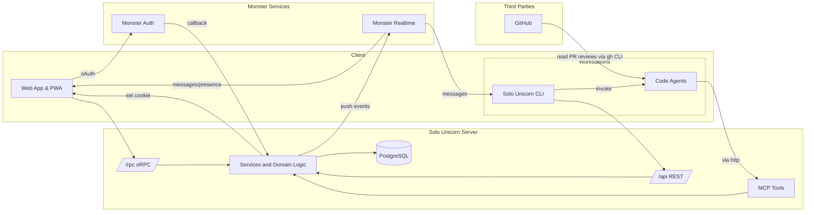
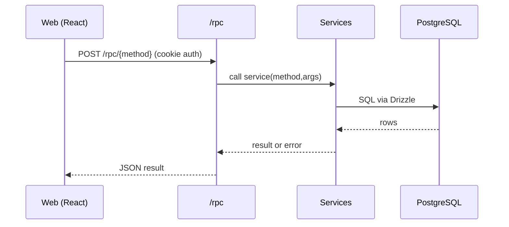
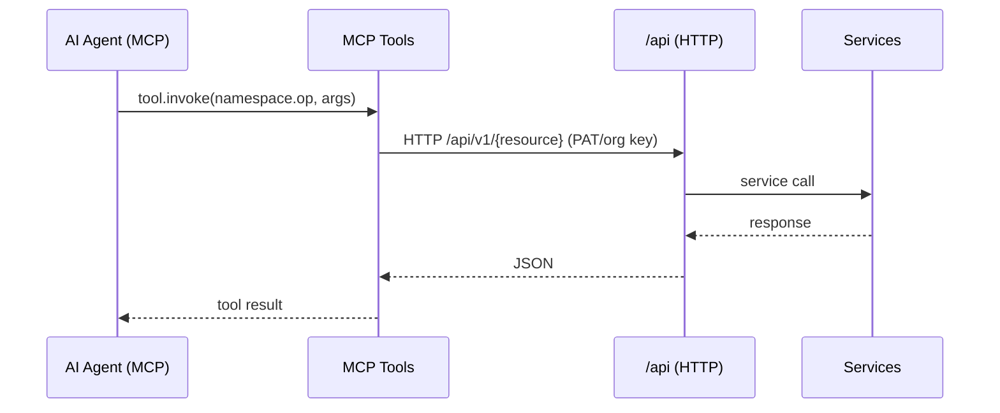
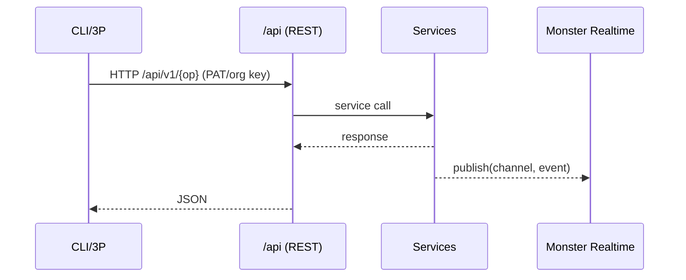

# Solo Unicorn v3 — Fullstack Architecture

This document defines the complete fullstack architecture for Solo Unicorn, unifying backend, frontend, real‑time, and AI‑agent interfaces. It is the single source of truth for AI-driven development and must be kept consistent with docs/foundation.

Scope and basis:
- Based on docs/foundation: 001-feature-requirements.md, 002-web-design.md, 003-cli-design.md, 004-db-design.md, 005-api-and-mcp-design.md, 006-rpc-design.md
- Aligned with current code under apps/server (`/rpc` + `/api`) and apps/web (React + Vite + TanStack Router/Query)
- Enforces strict interface boundaries defined below


## 1) Interface Boundary Rules (MANDATORY)

Use least powerful approach and consistent entrypoints:
- Web app → /rpc only
  - For internal, bundle-deployed web↔server calls where breaking changes are allowed (web+server update together)
  - Typed RPC methods, TanStack Query caching
- AI agents via MCP → /api (HTTP) through MCP tools (not via WebSocket)
  - MCP tools are the stable source of truth; tools delegate to HTTP endpoints under /api
  - Authentication with Monster Auth tokens, PATs, or org keys
- Other consumers → /api (HTTP)
  - Endpoints may be REST-like or verb-based
  - Examples: Monster Realtime message forwarders, Monster Auth OAuth callback, CLI workstation register, public discovery endpoints
- oRPC supports both RPC format (/rpc) and API format (/api). In API format, oRPC generates OpenAPI (Swagger) automatically.
- WebSocket is push-only
  - Monster Realtime provides presence and event push; never used for request/response RPCs

Implications:
- /rpc is internal, not versioned; can change freely with the web build
- /api is versioned (e.g., /api/v1) and must preserve backward compatibility
- MCP tool namespaces are versioned (e.g., mission.v1.*) and map to /api


## 2) High-Level System Overview

Components:
- Web (React + Vite + TanStack Router/Query): consumes /rpc with credentials:include, uses TanStack Query cache and oRPC client
- Server (Bun + Hono): exposes /rpc and /api (oRPC API-format; REST-like or verb-based; OpenAPI generation); handles OAuth callback under /api
- MCP Tools (co-hosted service): stable tool surface that calls /api over HTTP
- Database (PostgreSQL via Drizzle): application data; hybrid FS+DB for solution/tasks artifacts
- Monster Realtime (WebSocket): presence + push notifications for workstations and missions
- External: GitHub (PRs; no incoming webhooks required), Cloudflared Tunnel for dev public access

Mermaid — System Context



## 3) Endpoint Responsibilities Matrix

- Web (browser):
  - Transport: HTTP JSON (oRPC)
  - Path: /rpc
  - Auth: Session cookies (httpOnly, secure as per env), CORS allowlist
  - Caching: TanStack Query (keys map to RPC methods)

- MCP (AI agents):
  - Transport: HTTP via /api (no WebSocket)
  - Tools: mission.v1.*, repository.*, project.* (namespaced)
  - Delegation: Tools call /api over HTTP
  - Auth: PAT/org keys/Monster Auth tokens in Authorization header

- CLI / Other Consumers (e.g., forwarders, scripts):
  - Transport: HTTP (REST-like or verb-based)
  - Path: /api/v1/... (public and auth-required endpoints)
  - Examples:
    - Monster Auth callback: GET /api/oauth/callback
    - Public discovery: GET /api/v1/public/projects, etc.
    - Workstation register: POST /api/v1/workstations/register

- WebSocket (Monster Realtime):
  - Purpose: push presence and notifications only; no RPC over WS
  - Channels: workstation:{id}, project:{id}:workstations, mission:{id}

Versioning and compatibility:
- /rpc: not versioned; breakable with web bundle
- /api: versioned (/api/v1), backward compatibility guaranteed
- MCP tools: versioned namespaces (mission.v1.*) and stable signatures


## 4) Transport Flows (Sequence)

### Web → /rpc


### MCP Agent → MCP Tools → /api


### Third Parties → /api and Realtime push


### GitHub PR Integration
```mermaid
sequenceDiagram
  participant SU as Solo Unicorn
  participant Agent as Code Agent
  participant GH as GitHub
  SU->>GH: Create PR / Update Status (HTTP)
  Agent->>GH: gh pr view/comments (pull PR comments)
  Note right of Agent: No GitHub webhooks; agent reads PR data on demand
```

## 5) Tech Stack (grounded in repo)

- Frontend: React + Vite + TanStack Router/Query, Tailwind, PWA
  - oRPC client at apps/web/src/utils/orpc.ts → base URL ${VITE_SERVER_URL}/rpc with credentials: 'include'
- Backend: Bun + Hono
  - oRPC router (/rpc) at apps/server/src/routers/rpc.ts
  - oRPC API-format under /api (OpenAPI/Swagger generation; REST-like or verb-based) at apps/server/src/routers/api.ts
  - OAuth callback under apps/server/src/routers/others/oauth-callback.ts → GET /api/oauth/callback
  - Bootstrap and CORS at apps/server/src/index.ts
- Database: PostgreSQL via Drizzle (see docs/foundation/004-db-design.md)
- Realtime: Monster Realtime (presence + push)
- Auth: Monster Auth (Google OAuth, PATs, org keys)
- MCP: MCP tools co-hosted; tools pass through to /api


## 6) Data Model and Storage Strategy

Canonical decisions (ref: foundation/004-db-design.md):
- Organizations, Users, Memberships
- Workstations (client machines) report available code agents via presence; server stores minimal agent knowledge
- Projects, Repositories; repository identifier is flexible: prefer GitHub numeric repo ID if available; otherwise use the GitHub URL; store both when helpful
- Missions with flows and stages (clarify → plan → code); PR mode vs direct push
- GitHub PR tracking (PR number, branch, merge status)
- Public projects and granular permissions with role hierarchy
- Code Agent Sessions (tracking per mission)
- Hybrid storage for Solution & Tasks
  - Filesystem docs: ./solo-unicorn-docs/missions/{mission-id}/
  - DB tracking: solution TEXT, tasks JSON, tasks_current index

Indexes optimized for high-frequency monitoring and assignment; permission checks enforced in the app layer (TypeScript), not SQL-only.


## 7) Mission Lifecycle and PR Support

- Flow-first mission creation; default flow clarify → plan → code
- Optional review gates per stage; Review column shows PR status badge when PR mode
- PR Mode:
  - Branch naming: solo-unicorn/mission-{id}-{slug}
  - Auto-create PR upon entering Review; iterate by reading PR comments via gh CLI (no webhooks)
- Direct Push Mode: fast iteration to main branch for early-stage projects
- Assignment: presence-aware (Monster Realtime), repository concurrency respected


## 8) Realtime Strategy (Monster Realtime)

- WebSocket strictly for push: presence and notifications
- Channel examples:
  - workstation:{workstation_id}
  - project:{project_id}:workstations
  - mission:{mission_id}
- Workstation presence meta includes available agents, active projects, optional dev server tunnel info


## 9) Authentication & Authorization

- Web login flow:
  - /rpc.auth.login returns rpcRedirect to Monster Auth hosted page
  - OAuth provider callback handled at GET /api/oauth/callback
  - On success: set httpOnly cookies; session accessible to /rpc
- Tokens:
  - Monster Auth tokens (access/refresh)
  - PAT (pat_...) and org keys (org_key_...) for CLI/agents via /api
- CORS: allowlist origins; credentials true for /rpc
- CSRF: cookie-based APIs (/rpc) must be protected (SameSite, CSRF token where needed)
- Permissions: enforced in app/service layer with role-based and per-project capabilities; public endpoints gracefully degrade


## 10) Public Projects & Access Control

- Visibility: private by default; opt-in public
- Roles: Public (anonymous), Contributor, Collaborator, Maintainer, Owner
- Granular controls: mission read/write, workstation visibility, execution permissions, memory access
- Public API endpoints (examples):
  - GET /api/v1/public/projects
  - GET /api/v1/public/projects/{slug}
  - GET /api/v1/public/projects/{slug}/missions
- Rate limits and CORS configured for public endpoints; caching and CDN for discovery


## 11) Environments & Configuration

- Domains (apps/server/env.ts, apps/web/env.ts):
  - Production: web https://solounicorn.lol, server https://server.solounicorn.lol, Monster Auth https://auth.monstermake.limited
  - Alpha: web https://alpha.solounicorn.lol, server https://server.alpha.solounicorn.lol, Monster Auth https://auth.alpha.monstermake.limited
  - Development/Test: VITE_WEB_URL, VITE_SERVER_URL, DATABASE_URL envs required
- Dev tunneling (MVP): Cloudflared to expose local dev server public URL when needed
- CORS allowlist per env; cookies secure flags in prod


## 12) API & MCP Design Notes (foundation/005-api-and-mcp-design.md)

- MCP tools invoke /api over HTTP; /api may be REST-like or verb-based
- oRPC supports both RPC format (/rpc) and API format (/api); API format emits OpenAPI (Swagger)
- Versioning:
  - /api may use URL versioning (e.g., /api/v1) where appropriate
  - MCP tools use namespaced versioning (e.g., mission.v1.*)
- Error models:
  - MCP: { error: { code, message, details? } }
  - HTTP: status code + { error: { code, message, details? } }


## 13) Security, Performance, Observability

- Security: input validation (zod), rate limiting (middleware), strict CORS, sanitized responses, audit logging
- Performance: index strategy for monitoring and assignment queries; caching for public content; CDN for public discovery
- Observability: structured logging, request IDs, health checks (/rpc.healthCheck, /api health), plan for tracing/metrics


## 14) Open Questions / Assumptions

- MCP server co-hosted with HTTP server: yes
- Public API shapes beyond discovery: evolve with stories; maintain OpenAPI coverage
- CSRF: limited to api.solounicorn.limited and solounicorn.limited; SameSite cookies sufficient (no extra token for now)
- GitHub webhooks: not required (agents read via gh CLI)


## 16) Unified Project Structure & Shared Modules

This section defines a pragmatic monorepo layout that minimizes cross-app shared packages. “Shared modules” here primarily means intra-app modules that ensure UI/behavior consistency within each app. Cross-app imports can use simple relative paths when needed (e.g., in apps/web you can import server types: `import type { RpcRouterClient } from '../../../server/src/routers/rpc'`).

It aligns with:
- Web → /rpc via oRPC (internal)
- MCP tools → /api over HTTP (no WebSocket)
- Other consumers → /api (HTTP; REST-like or verb-based)
- Monster Realtime for push-only presence/notifications

---

## 17) Change Log

- 2025-09-10 v1.0 — Initial fullstack architecture aligned to foundation docs and codebase; interface boundaries enforced (/rpc ↔ web, MCP→/api, others→/api).
