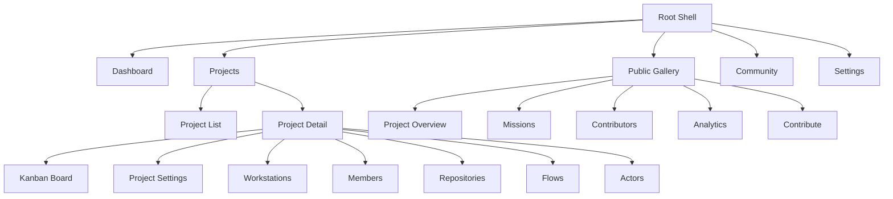
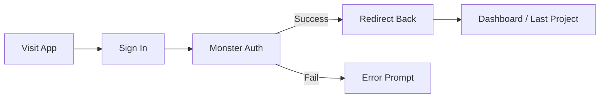
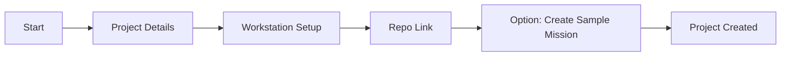
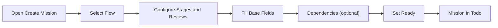
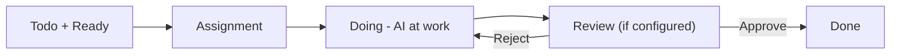
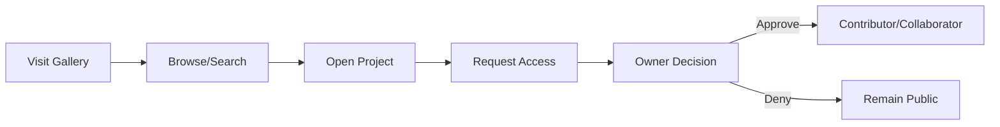
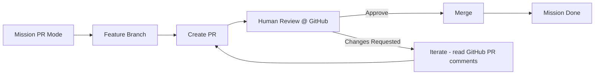

# Solo Unicorn UI/UX Specification

Source documents: docs/foundation/001–006. This spec synthesizes those files into a cohesive, user-centered UI/UX reference for design and frontend implementation.

## Change Log

| Date       | Version | Description                                   | Author     |
|------------|---------|-----------------------------------------------|------------|
| 2025-09-10 | 1.0.0   | Initial specification generated from foundation | UX Expert |

---

## Introduction

This document defines the user experience goals, information architecture, core user flows, and visual design specifications for Solo Unicorn’s web interface. It translates foundational requirements into actionable UI/UX guidance to ensure a cohesive, accessible, and efficient product experience across devices.

Scope and priorities are aligned to the MVP emphasis in the foundation docs: correctness and reliability first, with performance optimizations and extended features planned post-MVP.

---

## Overall UX Goals & Principles

### Target User Personas (derived from foundation)
- Solo Developer
  - Works independently; prioritizes speed and simplicity; heavy CLI usage; often YOLO (direct push).
- Small Team Lead
  - Coordinates 2–10 devs; needs visibility, quality gates, and PR workflows; manages permissions.
- Project Maintainer (Public Projects)
  - Curates community contributions; requires permission controls, review flow, and analytics.
- Open Source Contributor
  - Browses public projects; requests access; learns from missions and PR feedback.

### Usability Goals
- Time to First Mission (TTFM): Create and ready a mission in under 3 minutes for a new project.
- Review Efficiency: In PR mode, average ≤ 2 human review cycles per mission to approval.
- Visibility & Control: Real-time presence and mission status clarity within 1–2 obvious clicks.
- Public Project Clarity: Anonymous users can grok project goals and progress within 30 seconds.

### Design Principles
1) Clarity over cleverness – clear status, state, and next actions at all times.
2) Progressive disclosure – show details on demand (e.g., flow settings inside modal tabs).
3) Consistent patterns – Trello-like Kanban with predictable cards, badges, and actions.
4) Immediate feedback – optimistic UI where safe; live updates via WebSocket.
5) Accessible by default – WCAG 2.2 AA standards; keyboard-first workflows supported.

---

## Information Architecture (IA)

### Site Map / Screen Inventory

### Navigation Structure
- Primary Navigation: Dashboard, Projects, Public Gallery, Community, Settings
- Secondary (Project-level): Kanban Board, Project Settings, Workstations, Members, Repositories, Flows, Actors
- Breadcrumbs: Organization / Project / Area / Item (e.g., Solo Unicorn / My Project / Missions / mission_123)

---

## User Flows

Each flow includes the basic path and notable edge cases pulled from foundation docs.

### 1) Authentication Flow
- User Goal: Access Solo Unicorn securely as an org member or public visitor.
- Entry Points: Sign In; deep links from invites; public pages.
- Success Criteria: Authenticated and routed to org/project context or public page with permission-aware content.

Edge Cases & Error Handling
- OAuth failure or token expiry → clear error, retry CTA.
- Org selection needed → simple chooser with recent memory.

Notes
- Auth via Monster Auth; email is canonical identity (001, 005).

### 2) Project Creation Flow
- Goal: Create a new project and prepare it for missions.
- Entry: “Create New Project” from Dashboard or Projects.
- Success: Project ready; optional sample mission created.

Edge Cases
- No workstation online → step includes CLI registration hints (003).
- Invalid repo URL → inline validation; cannot proceed until fixed.

### 3) Mission Creation Flow
- Goal: Create a mission with flow-first settings and ready it for AI.
- Entry: “Create Mission” from Kanban.
- Success: Mission appears in Todo; Ready toggled on.

Edge Cases
- Missing required fields → clear inline messages.
- Conflicting dependencies → highlight with guidance.

Notes
- Flow-first with stage selection; Ready controls assignment (001, 002).

### 4) Mission Execution Flow
- Goal: AI agent executes code; real-time updates; human review if required.
- Entry: Mission moves from Todo → Doing → Review → Done.
- Success: Mission approved (if required) and completed.

Edge Cases
- Agent unavailable or rate-limited → status shown; retry/backoff.
- Stuck sessions → timeout detection and reset (004, 001 basics).

### 5) Public Project Discovery Flow
- Goal: Browse public projects; request access where allowed.
- Entry: Public Gallery; project share links.
- Success: User gains clarity on project and optionally requests access.

Edge Cases
- Permission-aware responses; workstation visibility controlled (001, 004).

### 6) PR Mode Workflow
- Goal: Use PR-based change management for production-grade control.
- Entry: Mission with PR mode enabled.
- Success: PR approved and merged; mission moves to Done.

Edge Cases
- Merge conflict → surface PR status/badges; guide iteration.
- Permission limitations for external contributors → reflect in UI (001, 002).

---

## Wireframes & Mockups (Conceptual)

Primary Design Files: (to link once available)

Key Screen Layouts
- Kanban Board
  - Purpose: Mission visibility and flow progression.
  - Key Elements: Columns (Todo/Doing/Review/Done), Mission cards, badges (priority, stage, process), Ready toggle.
  - Interaction Notes: Drag-and-drop reorder; click badges to open Flow tab; mobile horizontal scroll.
- Mission Modal
  - Purpose: Full mission context and settings.
  - Key Elements: Tabs (Base, Flow, Clarify, Plan, Review, Dependencies, Settings).
  - Interaction Notes: Real-time status; review actions; required feedback on reject.
- Project Creation Wizard
  - Purpose: Guided project setup.
  - Key Elements: Steps (Details → Workstation → Repository), validation, sample mission toggle.
- Project Settings
  - Purpose: Administrative configuration.
  - Key Elements: General, Members, Repositories, Actors, Flows tabs.
- Organization Page
  - Purpose: Portfolio and team overview.
  - Key Elements: Projects grid, Workstations, Team Members.
- Public Project View
  - Purpose: Permission-aware public access.
  - Key Elements: Overview, Missions (read-only or limited), Contributors, Analytics, Contribute.
- Workstation View
  - Purpose: Workstation health and activity.
  - Key Elements: Overview, Agents, Repositories, Activity, Settings.

---

## Component Library / Design System

Design System Approach
- Consistent, accessible, and responsive components driven by tokens (color, type, spacing). MVP focuses on usability; full theming can expand post-MVP.

Core Components (top 10)
1) KanbanBoard
   - Purpose: Visualize mission flow
   - Anatomy: Columns, column headers, column footers (optional), scroll area
   - Variants: 4-column default; loop sections in Todo
   - States: Loading (skeleton), Empty, Error
   - Behavior: DnD reorder updates list order; live updates via WebSocket
   - Accessibility: Columns are landmarks; keyboard reordering (post-MVP); color-contrast badges
   - Responsive: Horizontal scroll on mobile with snap points
2) MissionCard
   - Purpose: Mission summary and quick actions
   - Anatomy: Title, badges (priority, stage, process/PR), description snippet, Ready toggle, overflow menu
   - Variants: With PR badge; with Review CTA
   - States: Ready/Not Ready; Active; Review-required
   - Behavior: Click stage badge → Flow tab; Review column shows PR link
   - Accessibility: Buttons with labels; focus order; aria-describedby for badges
3) MissionModal
   - Purpose: Full mission details and controls
   - Anatomy: Header (title, close), Tabs (Base, Flow, Clarify, Plan, Review, Dependencies, Settings)
   - Variants: Review tab active with Approve/Reject
   - States: Real-time status indicators; disabled fields when AI active
   - Behavior: Reject requires feedback; files attach; tabs preserve scroll state
   - Accessibility: Dialog with focus trap; Esc to close; labeled controls
4) ProjectSettingsModal
   - Tabs: General, Members, Repositories, Actors, Flows
   - Patterns: Inline validation; status badges for repositories; danger zone
5) ProjectCreateWizard
   - Steps: Details → Workstation → Repository
   - Validation: Real-time; smart defaults; hints for missing workstation registration
6) PublicProjectView
   - Tabs: Overview, Missions, Contributors, Analytics, Contribute
   - Permission-aware: Adjust visibility for anonymous vs roles
7) WorkstationView
   - Tabs: Overview, Agents, Repositories, Activity, Settings
   - Presence: Online/offline; active missions; quick actions
8) AccessRequestModal
   - Levels: Contributor, Collaborator (+ details)
   - Required rationale (optional) and submission
9) PriorityBadge / StageBadge / PRStatusBadge
   - Visual status chips; tooltips for clarity; consistent spacing and contrast
10) Toasts & Notifications
   - Mission status changes; PR review events; errors and recoverables

For each component, ensure:
- Props/config guidelines documented with defaults
- State matrix: default/hover/focus/active/disabled/loading/error
- Accessible names/roles; keyboard navigation
- Token usage for colors/spacing/typography
- Mobile adaptations (density, line lengths, tap targets)

---

## Branding & Style Guide (MVP placeholders)

Visual Identity
- Brand guidelines: (link TBD)

Color Palette (semantic tokens)

| Color Type | Hex | Usage |
|------------|-----|-------|
| Primary    | TBD | Actions, highlights |
| Secondary  | TBD | Secondary actions |
| Accent     | TBD | Accents/links |
| Success    | TBD | Positive states/confirmations |
| Warning    | TBD | Cautions/attention |
| Error      | TBD | Errors/destructive actions |
| Neutral    | TBD | Text/borders/backgrounds |

Typography
- Primary: TBD
- Secondary: TBD
- Monospace: TBD

Type Scale

| Element | Size | Weight | Line Height |
|---------|------|--------|-------------|
| H1      | TBD  | TBD    | TBD         |
| H2      | TBD  | TBD    | TBD         |
| H3      | TBD  | TBD    | TBD         |
| Body    | TBD  | TBD    | TBD         |
| Small   | TBD  | TBD    | TBD         |

Iconography
- Library: TBD
- Guidelines: Consistent stroke weight; meaningful metaphors; alt text for informative icons.

Spacing & Layout
- Grid: 12-column responsive
- Spacing scale: 4/8-based (TBD specifics)

Dark/Light Mode
- Support both; ensure contrast; preserve badge legibility in both schemes.

---

## Accessibility Requirements

Compliance Target
- WCAG 2.2 AA

Key Requirements
- Visual
  - Contrast: ≥ 4.5:1 body text; ≥ 3:1 for large text and UI elements
  - Focus indicators: prominent, not solely color-dependent
  - Text sizing: resizable to 200% without loss of content
- Interaction
  - Full keyboard navigation for all interactive components
  - Screen reader support with semantic HTML and ARIA where needed
  - Touch targets: ≥ 44px for mobile/touch
- Content
  - Descriptive alt text for informative media
  - Proper heading structure; label all form controls

Testing Strategy
- Automated checks via axe; manual screen reader passes; keyboard-only walkthroughs of core flows.

---

## Responsiveness Strategy

Breakpoints (guideline)

| Breakpoint | Min Width | Max Width | Target Devices |
|------------|-----------|-----------|----------------|
| Mobile     | 0         | 768px     | Phones         |
| Tablet     | 769px     | 1024px    | Tablets        |
| Desktop    | 1025px    | 1440px    | Laptops        |
| Wide       | 1441px    | —         | Large displays |

Adaptation Patterns
- Layout: Kanban horizontal scroll with snap on mobile; columns may stack in summaries
- Navigation: Condense tabs into overflow on small screens; hamburger for primary nav
- Content priority: Cards over tables on small screens; truncate with tooltip
- Interaction: Larger tap targets; full-screen modals; sticky action bars when helpful

---

## Animation & Micro-interactions

Motion Principles
- Purposeful, subtle, and informative; never block task flow; respect OS reduce-motion.

Key Animations
- Drag-and-drop affordances on Kanban (150–200ms, ease-out)
- Status transitions (Ready/Not Ready toggle) with fade/scale (120–160ms)
- Modal open/close with scale+opacity (160–220ms)

---

## Performance Considerations

Performance Goals
- Initial load: under pragmatic MVP constraints; skeletons for mission board and lists
- Interaction response: < 100ms perceived for common actions
- Animation: 60 FPS target where possible; fallbacks for low-power devices

Design Strategies
- Skeleton screens for Kanban and modals
- Optimistic updates for non-destructive changes (e.g., Ready toggle)
- Real-time sync via WebSocket; reconcile conflicts in UI with clear status

---

## Next Steps

Immediate Actions
1. Stakeholder review and sign-off on IA, flows, and component priorities
2. Produce low/high-fidelity mockups based on this spec
3. Frontend architecture doc alignment (routing, state, data fetching)
4. Define brand tokens (color, type, spacing) and map to components
5. Accessibility test plan for MVP flows

Design Handoff Checklist
- [ ] All user flows documented
- [ ] Component inventory complete
- [ ] Accessibility requirements defined
- [ ] Responsive strategy clear
- [ ] Brand guidelines incorporated
- [ ] Performance goals established

---

## Checklist Results
- To be filled after running UI/UX checklist against this document.

---

## Appendices

### A) Foundation → Spec Mapping

| Foundation Doc | Spec Sections Informed |
|----------------|------------------------|
| 001-feature-requirements.md | Personas, Design principles, Mission flow, Review/PR, Public Projects |
| 002-web-design.md | IA, Flows, Components, Screens, Interactions, Mobile patterns |
| 003-cli-design.md | Workstation presence hints, repo/worktree concepts surfaced in UI |
| 004-db-design.md | Permission-aware UI, PR status surfaces, fields and states |
| 005-api-and-mcp-design.md | MCP-first operations reflected in mission updates and lists |
| 006-rpc-design.md | oRPC internal flows; cache invalidation patterns in UI |

### B) Foundation Source Index
- docs/foundation/001-feature-requirements.md – Core features, flows, public projects, permissions, mission lifecycle
- docs/foundation/002-web-design.md – Detailed UI components and flows (Kanban, Mission Modal, Settings, Public pages)
- docs/foundation/003-cli-design.md – CLI architecture, workstation registration, presence, repo management
- docs/foundation/004-db-design.md – Schema and performance considerations; PRs; permissions and visibility
- docs/foundation/005-api-and-mcp-design.md – MCP-first design; REST adapters
- docs/foundation/006-rpc-design.md – Internal oRPC conventions and TanStack Query cache mapping

### C) Open Questions / Elicit Items
- Brand tokens (colors, type, spacing) – provide or confirm
- Component prop-level specifications (finalize with FE architecture)
- Keyboard reordering on Kanban (scope and timing)
- Exact analytics/telemetry events and parameters

---

