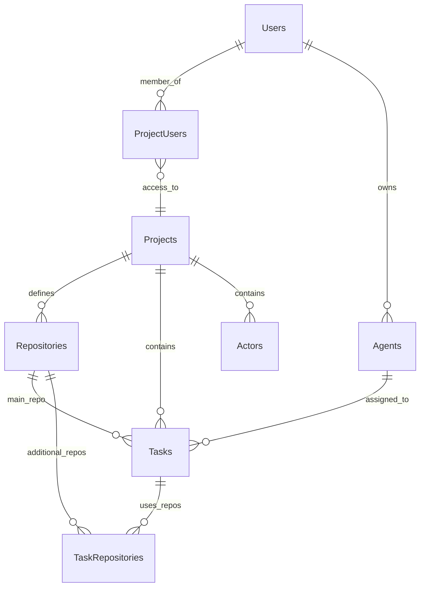

# Solo Unicorn Project Overview

## Vision and Goal

Build a minimal, local-first task management system for dispatching coding tasks to AI agents. Extreme simplification: one user, one machine, one coding session at a time. Projects manage tasks through a simple 4-column board where agents automatically pick up and complete work.

- AI agents autonomously clarify, plan, execute and loop tasks
- Create project, configure repo, agents, and start tasking

## Tech stack

- Web: React + TanStack Router (apps/web)
- UI: TailwindCSS + shadcn/ui component library
- Server: Hono + oRPC (apps/server)
- Runtime: Bun
- ORM: Drizzle
- Database: Local PostgreSQL
- Validation: Valibot
- MCP: stateless http @modelcontextprotocol/sdk/server/mcp
- WebSocket: Bun std `Bun.serve({ websocket })`

## Database Implementation

- Local PostgreSQL only (no cloud production deployment)
- Prefer jsonb for flexible fields (`metadata`, `plan`, `config`)
- Minimal normalization - evolve as needed
- Fresh migrations - can delete and recreate database

## Core Entities

### Project

- Single board per project (no separate board entity)
- Project memory stored in database (viewable/editable by human)
- Contains configured repo agents and actors

### Repo Agent

- Combination of repository path + coding client (e.g., Claude Code, OpenCode)
- Examples: `/home/repos/todo` + Claude Code, `/home/repos/calendar` + Claude Code
- Only one active session per coding client type (rate limit enforcement)

### Actor

- Describes agent mindset, principles, focus, methodology, values
- Not bound to repo agent - assigned per card
- Default Actor for unspecified tasks

### Task (Card)

- **Regular tasks**: Todo → Doing → Done
- **Loop tasks**: Loop → Doing → Loop (infinite cycle)
- Doing has 3 stages: clarify → Plan → Execute
- Loop has 1 stage: loop (never changes)
- Must have repo agent assigned
- Optional actor assignment
- "Ready" checkbox replaces auto-start/start agent buttons

## Default Actor

**Role**: Full-Stack Engineering Agent
**Mindset**: Pragmatic problem-solver focused on working solutions over perfect code
**Principles**:

- **Think Small**: Ignore performance, cost, and scalability. Day-0 mindset with extreme simplicity.
**Focus**: Deliver functional features that solve real user problems
**Methodology**: clarify → Plan → Execute with clear documentation of decisions
**Values**: Simplicity, reliability, user experience, maintainable code

## Project Setup UX

1. **Create Project**: Simple name and description
2. **Configure Repo Agents**:
   - Add repository path + coding client combinations
   - Each repo agent represents one coding environment
   - Examples: "Main Repo (Claude Code)", "Frontend (OpenCode)"
3. **Configure Actors** (Optional):
   - Define agent personalities/methodologies
   - Assign to specific cards or use default
4. **Project Memory**:
   - Stored in database (not git submodule)
   - Viewable and editable by human
   - Included in every session prompt like CLAUDE.md
   - Agents can read/modify via MCP

## Task Workflow

### Human Creates Card

- Write raw title and optional raw description
- Add optional attachments
- Select repo agent (mandatory - limit 1 per card)
- Optionally select actor (or use default)
- Tick "Ready" checkbox when ready for AI pickup

### Agent Picks Up Card

Agents automatically pick up ready cards in priority order (5-1, then card order within column).

**Stage 1: clarify**

- Agent understands and refines the raw title/description
- Updates card with refined title and refined description
- Raw versions remain for reference
- Uses MCP to update card

**Stage 2: Plan**

- List solution options and rank them
- Select final solution approach
- Write spec if needed
- Store all plan work in card for reference
- Final solution and spec stored in card's `plan` field
- Interaction via MCP

**Stage 3: Execute**

- Real implementation using refined title, description, attachments, plan, actor, and project memory
- Make commits and push as needed
- Move to Done when complete

## Loop Column - Repeatable Tasks

The Loop column stores repeatable tasks that cycle infinitely to maintain project momentum.

**Loop Purpose:**
- **Repeatable Tasks**: Tasks that should be executed regularly (brainstorming, maintenance, reviews)
- **Project Continuity**: When Todo and Doing are empty, agents pick from Loop
- **Infinite Cycling**: Loop tasks never reach "Done" - they return to Loop after completion

**Loop Workflow:**
1. **Task Selection**: When no regular tasks available, agent picks from Loop (top of column)
2. **Execution**: Loop task moves to Doing with stage="loop" (never changes stage)
3. **Completion**: After execution, task returns to Loop (bottom of column)
4. **Rotation**: Bottom placement ensures all Loop tasks get cycled through

**Loop Task Examples:**
- "Brainstorm new feature ideas. Document in wiki."
- "Review and refactor old code for improvements."
- "Update project documentation and README."
- "Research competitor features and document findings."
- "Run comprehensive project health checks."

**Infinite Cycling Logic:**
- **Regular tasks**: Todo → Doing → Done ✓
- **Loop tasks**: Loop → Doing → Loop → Doing → Loop... (never Done)

**Column Priority:**
1. Todo and Doing tasks (highest priority)
2. Loop tasks (when no regular tasks available)
3. Bottom placement after completion ensures fair rotation

The Loop column ensures projects never run out of productive work while maintaining continuous improvement and innovation cycles.

## Data Model

## Code Agent Management

### Claude Code UI

Claude Code UI is a open source project. It support not only Claude Code but other agent clients like Cursor CLI. We have cloned Claude Code UI to local and modified it. We aim to keep pulling its latest upstream version so that we gets all its up-to-dated features. We aim to make minimum modificaftions so that reduce conflicts during new version pull.

- CCU originally uses its WebSocket server to communicate with code agent shell, CCU server and CCU UI.
- Now we modified and added basic auth (bearer header of env var `CLAUDE_CODE_UI_AUTH_TOKEN`) to its websocket server.
- Solo Unicorn server connects to CCU websocket.
- Solo Unicorn push tasks to CCU via its ws.

### Solo Unicorn MCP Server

- Solo Unicorn provides MCP server for code agents (e.g. CCU) to communicate back.
- MCP tools includes:
  - create task
  - Update task
  - Report agent rate limited
  - Update project memory

## API Endpoints

**Authentication**: All routes protected by Monster Auth

## Implementation Notes

- all AI prompts must be stored at `apps/server/src/agents/prompts`
