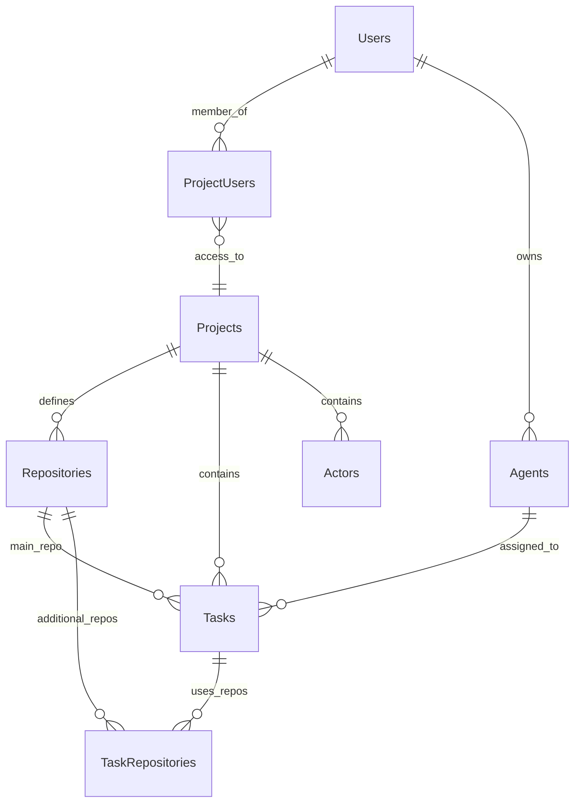

# Solo Unicorn Project Overview

## Vision and Goal

Build a minimal, local-first task management system for dispatching coding tasks to AI agents. Extreme simplification: one user, one machine, one coding session at a time. Projects manage tasks through a simple 4-column board where agents automatically pick up and complete work.

- AI agents autonomously clarify, plan, execute and loop tasks
- Create project, configure repo, agents, and start tasking

## Tech stack

- Web: React + TanStack Router (apps/web)
- UI: TailwindCSS + shadcn/ui component library
- Server: Hono + oRPC (apps/server)
- Runtime: Bun
- ORM: Drizzle
- Database: PostgreSQL
- Validation: Valibot
- MCP: stateless http @modelcontextprotocol/sdk/server/mcp
- WebSocket: Bun std `Bun.serve({ websocket })`
- Auth: Monster Auth

## Database Implementation

- PostgreSQL
- Prefer jsonb for flexible fields (`state`, `plan`, `config`)
- Minimal normalization - evolve as needed

## Facts

1. **Current Usage Pattern**: Primarily using Claude Code agent client type, which remains the most powerful option
2. **Claude Code Max Subscription**: Monthly access with unknown rate limits (hourly, daily, or monthly) that change without notice
3. **Claude Code Capabilities**:
   - Supports additional working directories for multi-repo access and all-in-one manipulation
   - Rate limit refresh times are provided when limits are hit
   - Can switch accounts via `CLAUDE_CONFIG_DIR` environment variable
4. **Conflict Management Philosophy**: Easier to maintain one active session per repo to avoid git conflicts, but should be configurable
5. **Rate Limit Handling**: Need to re-feed ongoing tasks when rate limits refresh

## Core Entities

### Project

- Single board per project (no separate board entity)
- Project memory stored in database (viewable/editable by human)
- Contains configured repos, agents and actors
- **Authorization-First**: All operations secured with project-user authorization

### Repo

- Repo path is a directory on the filesystem.
- configurable concurrency limit
- `lastTaskPushedAt` to avoid spamming

## Agent

- The only agent type is Claude Code
- configurable concurrency limit
- `lastTaskPushedAt` to avoid spamming
- `agentSettings` to store fields like CLAUDE_CONFIG_DIR. CLAUDE_CONFIG_DIR basically represents Claude Code account, so that we can switch agent (i.e. Claude Code account) while one agent is rate limited. This is also why task can have multiple agents assigned.

### Actor

- Describes agent mindset, principles, focus, methodology, values
- Not bound to repo or agent - assigned per task
- Default Actor for unspecified tasks

### Task (Card)

- `ready` checkbox to mark ready for AI pickup
- `stage` controls what prompt to use. Eventually, we might allow user to create and modify stage and prompt.
- **Regular tasks**: Todo → Doing → Done
- **Loop tasks**: Loop → Doing → Loop (infinite cycle)
- Doing has 3 stages: clarify → Plan → Execute
- Loop has 1 stage: loop (never changes)
- Must have repo(s) and agent(s) assigned
- Optional additional repos for multi codebases manipulation at once.
- Optional actor assignment

## Project Setup UX

1. **Create Project**: Simple name and description
2. **Configure Repos and Agents**:
   - Add repository path. E.g. Todo app at "/home/repos/todo"
   - Add agent. E.g. "Claude Code"
3. **Configure Actors** (Optional):
   - Define agent personalities/methodologies
   - Assign to specific cards or use default
4. **Project Memory**:
   - Stored in database (not git submodule)
   - Viewable and editable by human
   - Included in every session prompt like CLAUDE.md
   - Agents can read/modify via MCP

## Task Workflow

### Human Creates Card

- Write raw title and optional raw description
- Add optional attachments
- Select repo and agent
- Optionally select actor (or use default)
- Tick "Ready" checkbox when ready for AI pickup

### Agent Picks Up Card

Agents automatically pick up ready cards in priority order (5-1, then card order within column).

**Stage 1: clarify**

- Agent understands and refines the raw title/description
- Updates card with refined title and refined description
- Raw versions remain for reference
- Uses MCP to update card

**Stage 2: Plan**

- List solution options and rank them
- Select final solution approach
- Write spec
- Step breakdown
- Evaluate size and complexity.
  - If it's too big, split it into smaller tasks. Move this task to Done.
  - If not too big, store plan (final solution, spec, step breakdown) in card's `plan` field.
- Interaction via MCP

**Stage 3: Execute**

- Real implementation using refined title, description, attachments, plan, actor, and project memory
- Make commits and push as needed
- Move to Done when complete

## Loop Column - Repeatable Tasks

The Loop column stores repeatable tasks that cycle infinitely to maintain project momentum.

**Loop Purpose:**
- **Repeatable Tasks**: Tasks that should be executed regularly (brainstorming, maintenance, reviews)
- **Project Continuity**: When Todo and Doing are empty, agents pick from Loop
- **Infinite Cycling**: Loop tasks never reach "Done" - they return to Loop after completion

**Loop Workflow:**
1. **Task Selection**: When no regular tasks available, agent picks from Loop (top of column)
2. **Execution**: Loop task moves to Doing with stage="loop" (never changes stage)
3. **Completion**: After execution, task returns to Loop (bottom of column)
4. **Rotation**: Bottom placement ensures all Loop tasks get cycled through

**Loop Task Examples:**
- "Brainstorm new feature ideas. Document in wiki."
- "Review and refactor old code for improvements."
- "Update project documentation and README."
- "Research competitor features and document findings."
- "Run comprehensive project health checks."

**Infinite Cycling Logic:**
- **Regular tasks**: Todo → Doing → Done ✓
- **Loop tasks**: Loop → Doing → Loop → Doing → Loop... (never Done)

**Column Priority:**
1. Todo and Doing tasks (highest priority)
2. Loop tasks (when no regular tasks available)
3. Bottom placement after completion ensures fair rotation

The Loop column ensures projects never run out of productive work while maintaining continuous improvement and innovation cycles.

## Data Model

## Server-to-Agent Communication

### Claude Code UI

- We extended its HTTP API, added endpoints with basic auth (bearer header of env var `CLAUDE_CODE_UI_AUTH_TOKEN`)
- Solo Unicorn server pushs tasks to CCU via via these endpoints.

### Solo Unicorn HTTP callback endpoints

- When Solo Unicorn pushs tasks, there are callback URLs in the push payload.
- We modified CCU to call these callback endpoints when task is started, completed, or rate limited.

### Solo Unicorn MCP Server

- Solo Unicorn provides MCP server for code agents (e.g. CCU) to communicate back.
- MCP tools includes:
  - Create task
  - Update task
  - Update project memory

## Implementation Notes

- all AI prompts must be stored at `apps/server/src/agents/prompts`
