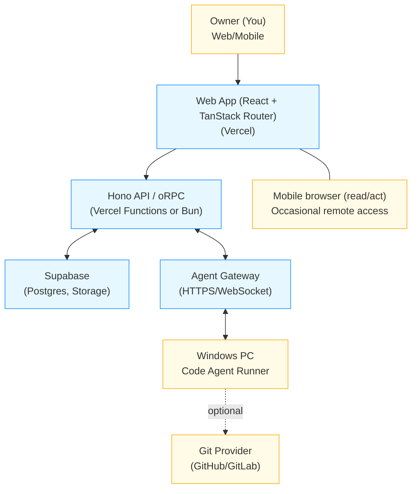
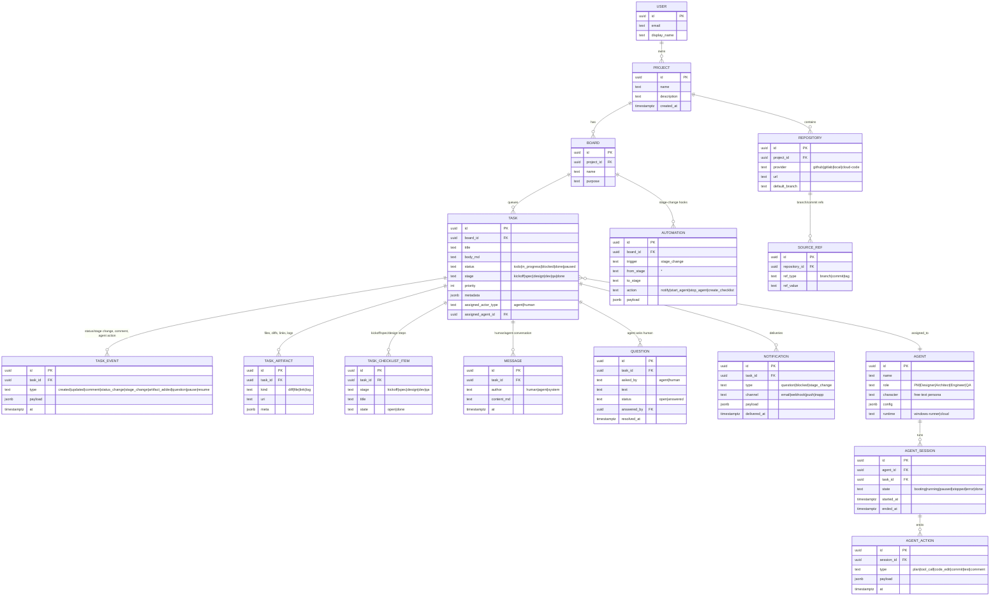

# Solo Unicorn — MVP Requirements

## Vision and Goal

- Build a web-based, agent-tasked workflow app with a Kanban-like GUI for creating and dispatching coding tasks to AI agents.
- Optimize for single-user, local-first usage with occasional mobile access.
- MVP supports a single owner, multiple projects, each with one or more repositories, and one “cloud-code” execution path plus a Windows PC code agent.
- Use Solo Unicorn to recursively and continuously improve itself.

## Principles

- Think small: ignore performance, cost, and scalability at MVP.
- Single-user only (you).
- Local-first: primary usage from your environment; remote via mobile browser occasionally.
- Day-1 Auth: every endpoint/operation must pass through a minimal auth guard so no route ships unauthenticated. Guard = `requireOwnerAuth()` for app/API; `requireAgentAuth()` for agent gateway.
- Tech stack (aligned with this repo):
  - Web: React + TanStack Router (apps/web)
  - UI: TailwindCSS + shadcn/ui component library
  - Server: Hono + oRPC (apps/server)
  - Runtime: Bun
  - ORM: Drizzle
  - Database: PGlite for local development; Supabase PostgreSQL for later/production
  - Hosting: Vercel (app + server functions), Supabase (DB/Storage)
- Agent runner on personal Windows PC.

## Database Implementation (Day-0 pragmatism)

- Prefer jsonb for flexible fields (`metadata`, `payload`, `config`, etc.).
- Minimize up-front normalization; evolve schema later as patterns stabilize.
- Local dev DB: PGlite (embedded Postgres/WASM) to avoid external setup; migrations kept compatible with Postgres.
- Production DB: Supabase PostgreSQL; move to Supabase when ready without changing application semantics.
- Index selectively (e.g., status, stage, assigned actor) and defer advanced indexing.
- Keep migrations small and reversible; refactor-friendly.

## In-Scope (MVP)

- Projects, repositories, boards, and tasks.
- Task lanes (status): todo, in_progress, blocked, done, paused.
- Task stages (pipeline): kickoff → spec → design → dev → qa → done.
- Assign tasks to an actor (agent or human); start/stop a single agent session.
- Event log, conversations, and simple artifacts (links, logs, file/diff references).
- Web UI with a board view, task details, activity feed, and stage checklist.
- Agent gateway to communicate with the Windows code agent and/or cloud-code executor.
- Single-owner access; Better Auth for app; token auth for agent; all routes guarded from day 1.
- Mobile-friendly basics (responsive layouts).

## Out of Scope (MVP)

- Multi-user, permissions, and organizations.
- Performance optimization and horizontal scale.
- Robust CI/CD integrations and test orchestration.
- Full Git integration beyond optional commit links.
- Multiple concurrent agents or multi-tenant support.

## Actors and Concepts

- Owner (You): the only human user.
- Agent: an automated worker (Windows runner or cloud code) that picks tasks and executes steps.
- Roleplay: the functional role of an agent (e.g., business owner, product manager, UI/UX designer, architect, software engineer, QA).
- Character: persona/style guiding behavior (e.g., startup 0-day think-small fail-fast; enterprise risk-reward balancing).
- Board: a columnar view of tasks by status, within a project.

## High-Level Architecture

Note: The server will also expose MCP servers (Model Context Protocol) for agents to fetch context and manipulate cards safely.

## Core Workflows

- Create project → add repositories → create boards → add tasks.
- Assign task to actor (agent or human) or allow agent to claim tasks.
- Advance task stage: kickoff → spec → design → dev → qa → done.
- Start agent session → agent performs plan/tool calls/code edits → produce artifacts → complete task.
- Maintain task event log, conversations, questions, and artifacts for traceability.

## Kanban Enrichments (MVP)

- Dev Kickoff checklist on each task:
  - Clarify the requirement
  - Challenge the requirement (assumptions/risks)
  - List and rank solution options
  - Select option
  - Write spec/requirements/acceptance criteria
- During kickoff: involve card creator and assignee; record steps and agent/human conversation on the card.
- Questions to human: when an agent cannot proceed, raise a question, notify the human, flag the card as blocked, and resume when answered.
- Human-in-the-loop controls: ability to pause/resume a task or an agent session at any time; override stage; edit checklist; add messages.
- Direct chat with the code agent: human can send messages/commands to the agent from the task view.
- Voice input: text areas support speech-to-text via OpenAI Audio API (optional toggle per field).

## Stage Flow and Triggers

- Default pipeline: business_owner → product_owner → brainstorm → design (UX/UI) → dev → qa → done.
- On stage change, run automation hooks:
  - Notify assigned actor
  - Start/stop agent session
  - Create next-stage checklist
  - Escalate blockers/questions
- Hooks are configurable per board (MVP: predefined defaults; table-driven hooks ready for later customization).

## Data Model (ERD)

## Minimal Table Definitions

- user: id, email, display_name
- project: id, name, description, created_at
- repository: id, project_id, provider (github|gitlab|local|cloud-code), url, default_branch
- board: id, project_id, name, purpose
- task: id, board_id, title, body_md, status (todo|in_progress|blocked|done|paused), stage (kickoff|spec|design|dev|qa|done), priority, metadata (jsonb), assigned_actor_type (agent|human), assigned_agent_id
- task_event: id, task_id, type (created|updated|comment|status_change|stage_change|artifact_added|question|pause|resume), payload (jsonb), at
- task_artifact: id, task_id, kind (diff|file|link|log), uri, meta (jsonb)
- task_checklist_item: id, task_id, stage, title, state (open|done)
- message: id, task_id, author (human|agent|system), content_md, at
- question: id, task_id, asked_by (agent|human), text, status (open|answered), answered_by, resolved_at
- notification: id, task_id, type (question|blocked|stage_change), channel (email|webhook|push|inapp), payload, delivered_at
- automation: id, board_id, trigger (stage_change), from_stage, to_stage, action (notify|start_agent|stop_agent|create_checklist), payload
- agent: id, name, role, character, config (jsonb), runtime (windows-runner|cloud)
- agent_session: id, agent_id, task_id, state (booting|running|paused|stopped|error|done), started_at, ended_at
- agent_action: id, session_id, type (plan|tool_call|code_edit|commit|test|comment), payload (jsonb), at
- source_ref: id, repository_id, ref_type (branch|commit|tag), ref_value

## Requirements Storage Options (ranked)

1. Dedicated "requirements" Git repository per project
   - Pros: versioned, reviewable PRs, local-first; agents can pull read-only; easy linking from tasks
   - Cons: extra repo management; cross-repo references via docs conventions
2. Project-level `/docs/requirements` folder in a shared mono-repo
   - Pros: co-located with code; simple for single-user; easy agent context loading
   - Cons: mixed concerns; permissions tied to code repo
3. Supabase Storage bucket with Markdown files (and attachments)
   - Pros: simple API; fine for single-user; signed URLs; easy for agents to fetch specific docs
   - Cons: weaker review workflow vs Git; must add metadata for versioning
4. Supabase Postgres tables storing Markdown and metadata
   - Pros: structured queries; easy to relate to tasks/boards; great for search
   - Cons: less natural for large docs and diffs; need export tooling
5. Git submodule with a shared "requirements" repo mounted into each project repo
   - Pros: decoupled yet linkable; Git-native
   - Cons: submodule complexity; easy to mis-sync

Recommendation (MVP): start with option 2 if using a mono-repo, otherwise option 1. Add option 3 for large assets and quick attachments. Keep schema fields on `task` to link canonical requirement doc and section anchors.

## MCP Servers (for Agents)

- Purpose: provide a standardized interface (Model Context Protocol) for agents to:
  - Fetch context: project, repositories, boards, tasks, messages, requirements docs
  - Manipulate cards: create/update tasks, change status/stage, add checklist items, post messages, attach artifacts, raise questions
  - Subscribe/poll: task events and notifications
- Transport: HTTP/WebSocket under the Agent Gateway
- Auth: `requireAgentAuth()` with scoped tokens (read-only or read-write)
- Namespaces (example):
  - `context.read` (project/board/task/doc fetch)
  - `cards.list`, `cards.get`, `cards.create`, `cards.update`
  - `cards.stage.set`, `cards.status.set`, `cards.pause`, `cards.resume`
  - `cards.message.post`, `cards.artifact.add`
  - `cards.question.raise`, `cards.question.resolve`
  - `events.subscribe` (WS) / `events.poll` (HTTP)

## API Surface (MVP)

- Auth (applies to every route):
  - App/API: `requireOwnerAuth()` middleware must wrap all routes and oRPC handlers
  - Agent gateway: `requireAgentAuth()` via signed token
- Projects: list/create
- Repositories: add/list; provider supports `cloud-code` or optional Git link
- Boards: create/list
- Tasks: CRUD; assign/unassign; status/stage transitions; pause/resume; list events; create artifact; add checklist items; post messages; raise/resolve questions; mark blocked/unblocked
- Agent sessions: start/stop for a task; stream/poll actions/events
- MCP servers as above (read/manipulate/subscribe)
- Notifications: list per task; (delivery in MVP: in-app; email/webhook optional)

## UI (MVP)

- Built with React + TanStack Router; styled with TailwindCSS; components via shadcn/ui
- Project switcher
- Board: columns by status; cards show title, assignee (actor), priority, stage, blocked flag
- Task detail: description, assigned actor, stage pipeline UI, kickoff checklist, events feed, messages, artifacts, questions
- Controls: pause/resume, stage advance, run with agent, escalate question, direct chat
- Voice input toggle on text areas (OpenAI Audio API)
- Mobile-friendly layout for board and task detail

## Agent Runner (Windows PC)

- Long-lived process or service
- Connects to Agent Gateway via HTTPS/WebSocket with an agent token
- Claims tasks, executes step-by-step actions (plan → tool calls → code edits → commit or produce artifacts)
- For `cloud-code` repositories, persist diffs and outputs in storage/artifacts instead of pushing to remote Git
- Optional Git integration: if repository provider is GitHub/GitLab, allow commit and PR creation when configured
- Can post questions and wait for responses; respects pause/resume

## Security and Privacy (MVP)

- Single-user app; no multi-tenant isolation required
- All endpoints must be behind `requireOwnerAuth()` or `requireAgentAuth()` guards
- Prepare for future roles with route-level authorization gates (owner-only by default)
- Store secrets in Vercel/Supabase env vars, not in the DB
- Basic audit trail via `task_event` and `agent_action`

## Deployment

- Development DB: PGlite; no external DB needed for local dev
- Production DB: Supabase PostgreSQL when ready
- App/UI: apps/web on Vercel
- API: apps/server on Vercel Functions or Bun server
- Database/Storage: Supabase (Postgres, Storage)
- Agent runner: Windows service/process; configured with gateway URL and token
- Environment variables: Supabase URL/Key (when enabled), Agent gateway secret, optional Git tokens, optional email/webhook keys

## Telemetry and Logging

- Store minimal logs as `task_artifact kind=log` or `agent_action` payloads
- Basic server logs via hosted platform defaults

## Roadmap (Post-MVP)

- Multiple agents and scheduling
- Rich Git integrations (branching, PR lifecycle)
- Templates for roleplay/character per board
- Multi-user and permissions
- Cost controls and basic scaling
- Custom automation builder for stage hooks
- Notification channels beyond in-app (email, webhook)

## Acceptance Criteria (MVP)

- Can create projects, repositories, boards, and tasks
- Board shows tasks by status and stage; mobile view usable
- Can start an agent session on a task and see actions/events stream or update
- Can pause/resume a task and agent session
- Artifacts/logs, messages, and questions appear on the task detail
- For `cloud-code` repo type, diffs/logs are saved as artifacts
- Windows agent can register, claim a task, post actions, ask questions, and complete a task
- MCP servers available for agents to fetch context and manipulate cards with auth
- Local development runs fully with PGlite (no Supabase required); production can switch to Supabase without app changes
- All app/API/gateway routes are guarded by minimal auth middleware

## Open Questions

- Preferred notification channel for questions/blockers (in-app only vs email/webhook)?
- Final choice for requirements storage (Git-based vs bucket vs DB) and indexing for agent context?
- Voice input scope (which fields/screens) and on-device vs server transcription?
- Do we allow assigning to non-code actors (e.g., PM/Designer agents) in MVP or later?
