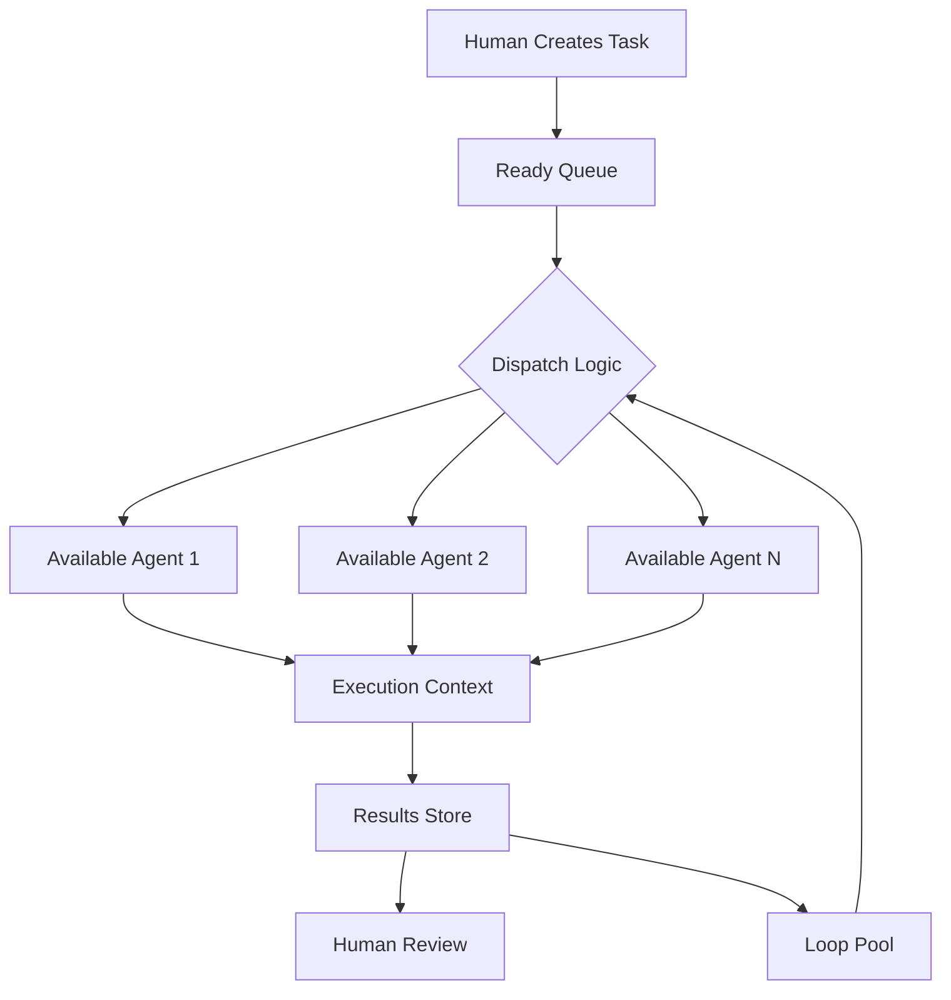
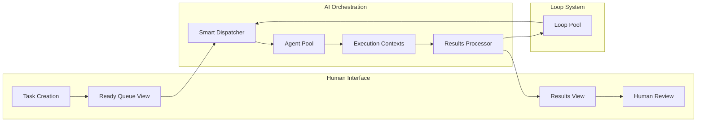

# Is Kanban the Best Way to Manage AI Tasks?

**Executive Summary**: Kanban's linear workflow metaphor fundamentally mismatches AI task execution patterns, creating artificial constraints that reduce system efficiency and user experience.

## Original Task
- **Title**: Is kanban the best way to manage AI tasks
- **Description**: Let me know your view. I don't want conventions or route dependency. I might be too focusing on trello experience.

## Analysis: First Principles of AI Task Management

### Essential Differences Between Human and AI Work Patterns

**Human Work Reality:**
- Sequential execution (one task at a time)
- Context switching costs are high
- Progress is linear and visible
- Collaboration requires explicit handoffs
- Status updates are manual and periodic

**AI Agent Work Reality:**
- Parallel execution across multiple contexts
- No context switching costs (spawn new processes)
- Progress is atomic (nothing → complete)
- No collaboration overhead within agent sessions
- Status updates are real-time and automatic

### Core Assumptions to Challenge

**Assumption 1**: "Tasks need visible progress states"
- **Reality**: AI agents operate in atomic completion cycles. They either complete successfully or fail/retry. Intermediate states like "50% complete" are meaningless.
- **Root Limit**: AI work is binary (done/not-done), not progressive.

**Assumption 2**: "Workflow stages reflect natural work progression"  
- **Reality**: AI agents can simultaneously clarify requirements, generate plans, and execute code within a single session.
- **Root Limit**: AI cognitive processes don't map to human sequential thinking patterns.

**Assumption 3**: "Visual boards improve task management"
- **Reality**: Visual boards optimize for human spatial cognition, not system efficiency or AI orchestration.
- **Root Limit**: The interface should optimize for dispatch efficiency, not visual metaphors.

## Options Analysis

### Option 1: Pure Queue System
**Concept**: Simple priority queue with ready/running/complete states

**Pros:**
- Matches AI execution reality (pick next → execute → complete)
- Minimal cognitive overhead for humans
- Perfect for automated dispatch
- No artificial workflow constraints

**Cons:**
- Less visual feedback for human oversight
- Harder to understand project scope at a glance
- No natural place for different task types (regular vs loop)

**Score**: 8/10 - Best matches AI execution patterns

### Option 2: Status-Based Lists  
**Concept**: Backlog → Ready → Running → Complete columns

**Pros:**
- Clear execution states
- Separates human preparation from AI execution
- Still allows automation while providing visibility

**Cons:**
- Still forces linear progression model
- Extra column management overhead
- Doesn't handle loop tasks elegantly

**Score**: 6/10 - Better than Kanban but still constrained

### Option 3: Tag-Based Organization
**Concept**: All tasks in single list, organized by tags (priority, type, status)

**Pros:**
- Ultimate flexibility
- No artificial workflow constraints
- Can filter/view multiple ways
- Perfect for AI dispatch logic

**Cons:**
- Can become overwhelming without structure
- Requires more complex UI for filtering
- Less intuitive for human mental models

**Score**: 7/10 - Most flexible but potentially chaotic

### Option 4: Modified Kanban (Current Approach)
**Concept**: Traditional columns with AI-specific adaptations

**Pros:**
- Familiar mental model
- Visual project overview
- Easy to understand for stakeholders

**Cons:**
- Forces unnatural workflow progression
- Creates bottlenecks (why can't AI plan and execute simultaneously?)
- Loop tasks feel artificially constrained
- Optimizes for human viewing, not AI efficiency

**Score**: 4/10 - Familiar but fundamentally mismatched

### Option 5: Hybrid Dispatch Board
**Concept**: Smart board that presents different views based on context

**Ready Queue**: Tasks prepared by humans
**Active Sessions**: Currently running AI agents
**Results**: Completed work with outcomes
**Loop Pool**: Repeatable tasks for continuous work

**Pros:**
- Optimized for AI dispatch patterns
- Clear separation of concerns
- Handles different task types naturally
- Maintains human oversight capability

**Cons:**
- Novel interface requires learning
- More complex to implement initially

**Score**: 9/10 - Purpose-built for AI orchestration

## Business Perspective

**Current Kanban Issues:**
- Forces artificial "planning phase" when AI can plan during execution
- Creates bottlenecks where none exist in AI workflows  
- Optimizes for human visual scanning, not system throughput
- Loop tasks feel awkward in linear progression

**Opportunity Cost:**
- Every forced workflow step reduces system velocity
- Visual metaphors that don't match reality create confusion
- Missing opportunities for AI agents to self-optimize task order

## UX Perspective

**User Mental Models:**
- Developers understand queues and async processing
- Founders need visibility into what's happening
- Both groups want maximum system velocity

**Friction Points in Kanban:**
- Manual progression between artificial states
- Visual clutter that doesn't provide actionable information
- Cognitive overhead of managing columns vs. focusing on outcomes

**Magic Opportunities:**
- Auto-prioritization based on dependencies and agent availability
- Intelligent batching of related tasks
- Real-time optimization of task dispatch order

## Architect Perspective

**System Design Implications:**

**Kanban Forces:**
- State machines for workflow progression
- Manual state transitions
- Column-based data organization
- Visual rendering optimizations

**Queue-Based Design Enables:**
- Event-driven architecture
- Auto-scaling based on queue depth
- Intelligent dispatch algorithms
- Real-time system optimization

**Technical Debt:**
- Current Kanban implementation constrains future AI orchestration features
- Visual metaphor locks in suboptimal data structures
- Harder to implement advanced features like auto-batching or intelligent scheduling

## Architecture Diagrams

**Hybrid Dispatch Board Flow:**

## Recommendation

**Hybrid Dispatch Board** wins as the optimal approach for AI task management:

1. **Purpose-Built**: Designed for AI agent orchestration, not human work patterns
2. **Maximum Velocity**: Removes artificial workflow constraints
3. **Smart Defaults**: Intelligent dispatch based on priority, dependencies, and agent availability  
4. **Loop Integration**: Natural handling of repeatable tasks
5. **Human Oversight**: Clear visibility without forcing unnatural interactions

**Implementation Priority:**
1. Replace column-based Kanban with queue-based dispatch system
2. Implement smart dispatcher with auto-prioritization
3. Create loop pool for continuous work
4. Add real-time optimization features

The current Kanban approach is indeed limiting the system's potential by forcing AI workflows into human work metaphors. A purpose-built dispatch system would unlock significant velocity improvements while maintaining the visibility and control humans need.