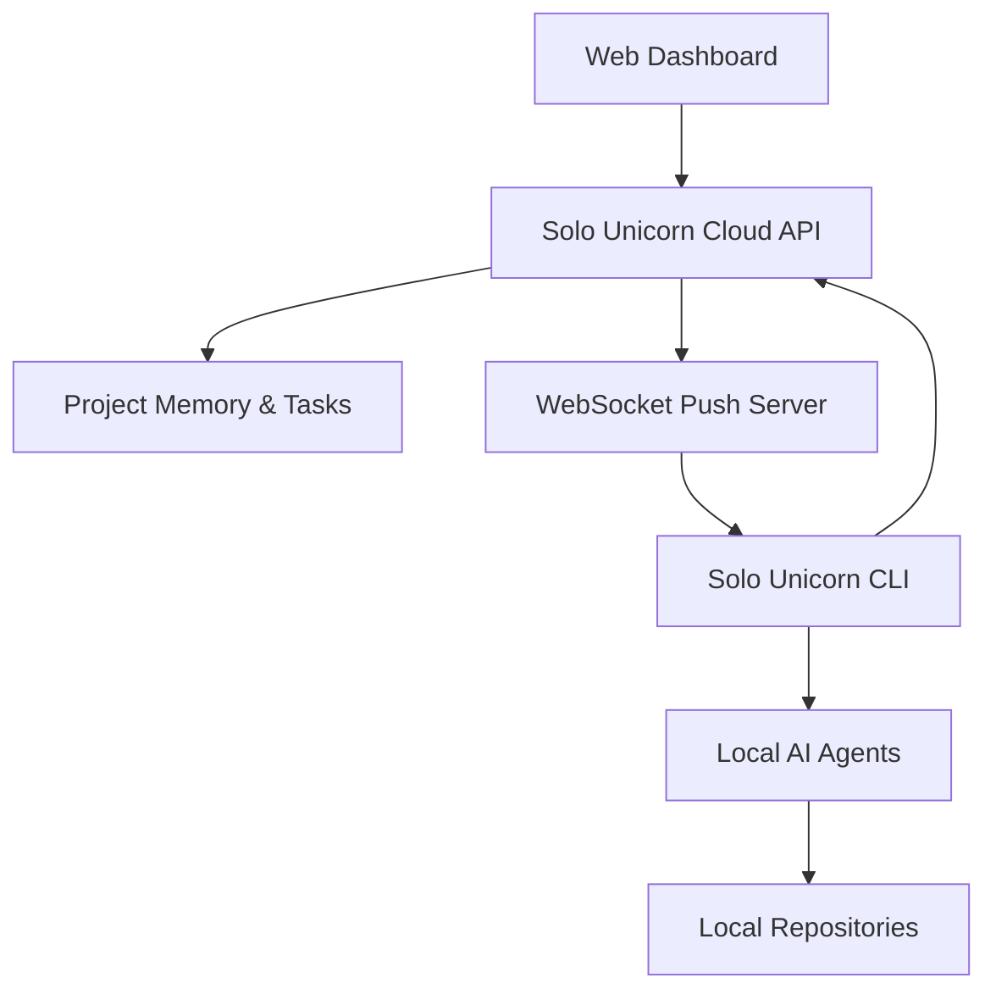
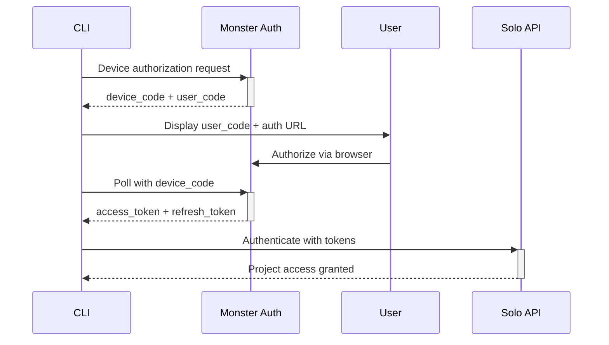

# CLI-Based AI Task Orchestration Go-To-Market Master Plan

**Executive Summary**: Transform Solo Unicorn into a CLI-first dev tool for AI task orchestration, positioning it as the missing layer between human requirements and AI coding agents with hybrid local-cloud architecture.

## Original Task

**Title**: Create Go-To-Market Plan for Solo Unicorn CLI-Based AI Task Management Platform

**Description**: Current idea - make solo unicorn a dev tool. Solo unicorn is only in charge of AI task management. Coding will be done on client machine. Adding CLI/SDK/EXE client for:
1. User login with JWT tokens
2. Repo initialization and registration
3. MCP tool integration for AI agents
4. Passive backend communication for task pushing
5. Local code agent invocation

Considering WebSocket solutions (Elixir vs API Gateway vs Bun), Docker support, generic auth protocols, and potential complete rebuild options.

## Analysis: First-Principles Breakdown

### The Core Problem
Current AI coding tools solve individual tasks but lack **orchestration intelligence**. Developers jump between:
- Claude Code for complex implementations
- Cursor for quick edits  
- GitHub Copilot for autocomplete
- ChatGPT for planning

**The Missing Layer**: A task orchestration system that understands project context, manages dependencies, and routes work to appropriate AI agents while preserving all context.

### Market Reality Check
**Current Pain Points**:
1. **Context Switching Overhead**: Developers manually explain project context to each AI tool
2. **Task Fragmentation**: No system tracks what was done, what's next, or dependencies
3. **Agent Silos**: Each AI tool operates independently without shared project memory
4. **Scale Limitations**: Managing multiple repos/projects becomes exponentially complex

**Our Unique Position**: We're building the **"OpenRouter for AI Coding Agents"** - the intelligent routing and orchestration layer.

### Architecture Philosophy
**Hybrid Local-Cloud Design**:
- **Cloud**: Task management, project memory, orchestration intelligence
- **Local**: Code execution, file system access, git operations, AI agent spawning

This splits concerns perfectly: cloud handles the "brain" (what to do), local handles the "hands" (how to do it).

## Options: Architectural & Go-To-Market Approaches

### Option 1: CLI-First Dev Tool (Recommended)
**Positioning**: "The Missing Layer Between Ideas and Code"

**Architecture**:


**Implementation Stack**:
- **CLI**: Go binary (single executable, cross-platform)
- **WebSocket Server**: Bun + uWebSockets.js (simpler than Elixir for MVP)
- **Auth**: Extend existing Monster Auth with device flow
- **Cloud API**: Current Hono setup with WebSocket upgrade capability

**Pros**:
- Leverages existing codebase
- Familiar development stack
- Faster time to market
- Local-first security model

**Cons**:
- WebSocket scaling challenges on serverless
- CLI installation friction

### Option 2: Complete SaaS Pivot
**Positioning**: "GitHub Copilot for Project Management"

**Architecture**: Fully cloud-based with IDE extensions

**Pros**: Lower user friction, easier distribution
**Cons**: Security concerns, latency issues, complete rebuild required

### Option 3: Hybrid Plugin Ecosystem
**Positioning**: "Zapier for AI Development"

**Architecture**: Core CLI + marketplace of AI agent connectors

**Pros**: Extensible, community-driven growth
**Cons**: Complex integration management, slower initial growth

## Recommended Option: CLI-First Dev Tool

### Technical Implementation Strategy

#### 1. CLI Architecture
```go
// Core CLI structure
type SoloUnicornCLI struct {
    Config    *Config
    APIClient *APIClient
    WSClient  *WebSocketClient
    Agents    map[string]Agent
}

// Key commands
solo init          // Initialize project
solo auth login    // Device-based OAuth flow
solo agent add     // Configure local AI agents
solo start         // Start task listener daemon
solo dashboard     // Open web dashboard
```

#### 2. WebSocket Infrastructure Decision
**Recommendation: Bun + uWebSockets.js on EC2**

**Comparison**:
```
| Solution          | Development | Performance | Cost    | Scalability |
|-------------------|-------------|-------------|---------|-------------|
| Lambda + API GW   | Familiar    | Good        | Low     | Excellent   |
| Bun + EC2         | Familiar    | Excellent   | Medium  | Good        |
| Elixir + EC2      | Learning    | Excellent   | Medium  | Excellent   |
```

**Why Bun + EC2**:
- Reuse existing TypeScript expertise
- Better local development experience
- Cost-effective for expected scale
- Easier debugging and monitoring

#### 3. Authentication Flow


### Go-To-Market Strategy

#### Phase 1: Developer MVP (Months 1-2)
**Target**: 50 power users
**Features**:
- CLI with basic task management
- Claude Code integration
- Single repo support
- WebSocket task pushing

**Distribution**:
- GitHub releases
- Hacker News launch
- DevTwitter promotion
- Claude Code community

#### Phase 2: Team Beta (Months 3-4)
**Target**: 500 active developers
**Features**:
- Multi-repo support
- Team collaboration
- Additional AI agents (Cursor, Codeium)
- Project templates

**Distribution**:
- YC network
- Developer conferences
- Partnership with Claude Code
- Content marketing

#### Phase 3: Commercial Launch (Months 5-6)
**Target**: 5,000 active developers
**Features**:
- Enterprise auth integration
- Advanced orchestration rules
- Analytics and insights
- Marketplace ecosystem

### Pricing Strategy
**Free Tier**: 
- Single user
- 2 repos
- Basic AI agents
- Community support

**Pro Tier ($29/month)**:
- Team collaboration
- Unlimited repos
- Priority AI agents
- Email support

**Enterprise Tier ($199/month)**:
- SSO integration
- Advanced analytics
- Custom AI agents
- Dedicated support

### Key Metrics & Success Criteria
**Month 1-2**:
- 50 CLI installations
- 10 daily active users
- Basic functionality working

**Month 3-4**:
- 500 CLI installations  
- 100 daily active users
- First paying customers

**Month 5-6**:
- 5,000 CLI installations
- 1,000 daily active users
- $10k MRR

### Risk Mitigation

**Technical Risks**:
- WebSocket scaling: Start with EC2, plan for clustering
- CLI distribution: Use GitHub releases + homebrew
- Agent compatibility: Start with Claude Code, expand gradually

**Market Risks**:
- AI tool fragmentation: Position as orchestration layer, not replacement
- Enterprise adoption: Focus on developer experience first
- Competition: Emphasize unique hybrid architecture

**Business Risks**:
- Pricing sensitivity: Generous free tier to prove value
- Support overhead: Strong documentation + community
- Platform dependencies: Multi-agent support reduces lock-in

### Immediate Next Steps

1. **Week 1-2**: Prototype CLI with basic WebSocket connection
2. **Week 3-4**: Implement device-based OAuth flow
3. **Week 5-6**: Build task synchronization between web and CLI
4. **Week 7-8**: Create Claude Code MCP integration
5. **Week 9-10**: Alpha testing with 10 power users
6. **Week 11-12**: Iterate based on feedback, prepare beta launch

This approach leverages our existing strengths while positioning Solo Unicorn as the essential missing piece in the AI development toolchain - the intelligent orchestration layer that every developer needs but nobody else is building.