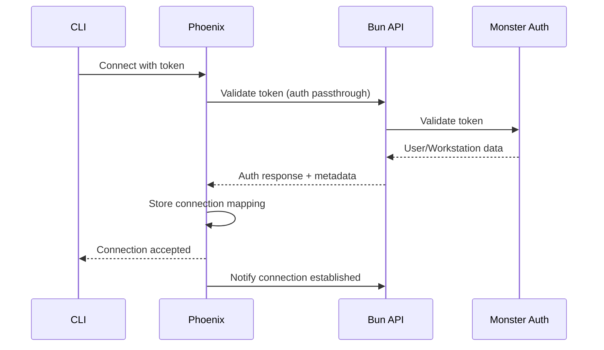
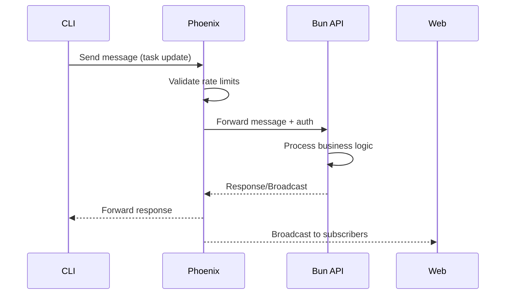

# Elixir Phoenix WebSocket Server Architecture

## Executive Summary

A generic, shared WebSocket gateway infrastructure using Elixir Phoenix to enable real-time communication for Solo Unicorn and other Monster Make applications. This server acts as a thin routing layer between clients and business logic APIs with dynamically defined channels.

## Key Requirements Addressed

✅ **Dynamic Channels**: Channel patterns fetched from `api.solo-unicorn.lol/messages-schema` - no hardcoded channels
✅ **Auth Passthrough**: All authentication handled by Bun API, which then talks to Monster Auth
✅ **OCI Free Tier**: Deploys to 4 Oracle Cloud ARM instances (24GB RAM total) - completely FREE
✅ **Clustering**: Full Erlang clustering across 4 nodes for high availability
✅ **Zero Business Logic**: Pure message routing, all logic stays in application APIs
✅ **Multi-Tenant Ready**: Single deployment serves multiple applications

## Core Principles

1. **Stateless Business Logic**: No business logic in WebSocket server - purely message routing
2. **Multi-Tenant**: Support multiple applications (Solo Unicorn, future products)
3. **Authentication Passthrough**: All auth handled by application APIs (not Monster Auth directly)
4. **Dynamic Channels**: Channel definitions fetched from application schema endpoints
5. **Minimal State**: Only track connection mappings, no persistent storage
6. **High Availability**: Clustering support across 4 OCI ARM instances
7. **Cost Effective**: FREE on Oracle OCI free tier (vs $50-100/month on AWS Lambda)

## Architecture Overview

```
┌─────────────────┐         ┌──────────────────┐         ┌─────────────────┐
│   CLI Client    │────────▶│  Phoenix WS      │────────▶│  Bun API        │
│  (Workstation)  │◀────────│  (OCI Cluster)   │◀────────│  (Lambda)       │
└─────────────────┘         └──────────────────┘         └─────────────────┘
        ▲                            │                            │
        │                            │                            ▼
┌─────────────────┐                 │                    ┌─────────────────┐
│   Web Client    │                 │                    │  Monster Auth   │
│  (React Query)  │                 │                    │  (auth.monster) │
└─────────────────┘                 │                    └─────────────────┘
                                     │                            ▲
                                     ▼                            │
                            ┌──────────────────┐                  │
                            │  Schema Endpoint │──────────────────┘
                            │  /messages-schema│    (Auth passthrough)
                            └──────────────────┘
```

## Database Design (No Database - Memory Only)

```elixir
# Connection Registry (in-memory ETS tables)
ConnectionRegistry {
  connection_id: string (Phoenix socket ID)
  app_id: string ("solo-unicorn", "other-app")
  client_type: string (dynamically from schema)
  client_id: string (workstation_id, user_id, etc)
  metadata: map (project_id, org_id, etc)
  connected_at: datetime
  last_ping: datetime
}

# App Configuration (loaded from config file + schema endpoint)
AppConfig {
  app_id: string
  auth_endpoint: string          # Bun API endpoint for auth
  message_endpoint: string       # Bun API endpoint for messages
  schema_endpoint: string        # Endpoint to fetch channel definitions
  allowed_origins: list
  rate_limits: map
}

# Dynamic Channel Schema (fetched from app's schema endpoint)
ChannelSchema {
  channels: [
    {
      pattern: string,           # e.g., "{resource}:{id}"
      variables: list,           # ["resource", "id"]
      validation: map,           # Rules for variable validation
      permissions: list          # Required permissions
    }
  ],
  events: [
    {
      name: string,              # e.g., "task:update"
      channel_patterns: list,    # Which channels can receive
      payload_schema: map        # JSON schema for validation
    }
  ]
}
```

## Message Flow Specification

### 1. Connection Flow


### 2. Message Routing Flow


## API Contracts

### WebSocket Connection
```typescript
// Connection URL format
wss://realtime.monstermake.limited/socket/websocket?token=JWT&app=solo-unicorn

// Connection params
{
  token: string,      // JWT from Monster Auth
  app: string,        // Application identifier
  client_type: string // "workstation" | "web" | "mobile"
}
```

### Message Format
```typescript
// Incoming from client
{
  topic: string,        // "workstation:123" or "project:456"
  event: string,        // "task:update", "heartbeat", etc
  payload: any,         // Message data
  ref: string          // Client reference for tracking
}

// Outgoing to client
{
  topic: string,
  event: string,
  payload: any,
  ref: string,
  status: "ok" | "error"
}
```

### Dynamic Channel Topics
```typescript
// Channels are dynamically defined by each app's schema endpoint
// Example response from GET api.solo-unicorn.lol/messages-schema
{
  "channels": [
    {
      "pattern": "{resource}:{id}",
      "description": "Resource-specific channels",
      "examples": ["workstation:123", "project:456", "task:789"],
      "variables": {
        "resource": {
          "type": "string",
          "enum": ["workstation", "project", "task", "org"]
        },
        "id": {
          "type": "string",
          "format": "uuid"
        }
      }
    },
    {
      "pattern": "user:{userId}:notifications",
      "description": "User notification channel",
      "variables": {
        "userId": {
          "type": "string",
          "format": "uuid"
        }
      }
    }
  ],
  "events": [
    {
      "name": "task:assigned",
      "channels": ["workstation:*", "project:*"],
      "payload": {
        "taskId": "string",
        "workstationId": "string"
      }
    }
  ]
}
```

## Dynamic Schema Management

### Schema Refresh Mechanism
```elixir
defmodule PhoenixGateway.SchemaManager do
  use GenServer
  
  # Periodically refresh schemas
  def init(_) do
    schedule_refresh()
    {:ok, %{schemas: %{}}}
  end
  
  def handle_info(:refresh_schemas, state) do
    new_schemas = fetch_all_schemas()
    schedule_refresh()
    {:noreply, %{state | schemas: new_schemas}}
  end
  
  # API endpoint to trigger immediate refresh
  def handle_call({:refresh_app_schema, app_id}, _from, state) do
    case fetch_app_schema(app_id) do
      {:ok, schema} ->
        new_schemas = Map.put(state.schemas, app_id, schema)
        {:reply, :ok, %{state | schemas: new_schemas}}
      error ->
        {:reply, error, state}
    end
  end
  
  defp fetch_app_schema(app_id) do
    schema_url = get_schema_endpoint(app_id)
    
    case HTTPoison.get(schema_url) do
      {:ok, %{status_code: 200, body: body}} ->
        {:ok, Jason.decode!(body)}
      _ ->
        {:error, :schema_fetch_failed}
    end
  end
  
  defp schedule_refresh do
    # Refresh every 5 minutes
    Process.send_after(self(), :refresh_schemas, 5 * 60 * 1000)
  end
end
```

### Schema Endpoint Format (Bun API)
```typescript
// GET /messages-schema endpoint response
export const messageSchema = {
  version: "1.0.0",
  channels: [
    {
      pattern: "{resource}:{id}",
      description: "Resource-specific channels",
      variables: {
        resource: {
          type: "string",
          enum: ["workstation", "project", "task", "org", "user"]
        },
        id: {
          type: "string",
          format: "uuid"
        }
      },
      permissions: {
        join: ["read:{resource}:{id}"],
        send: ["write:{resource}:{id}"]
      }
    }
  ],
  events: [
    {
      name: "task:assigned",
      description: "Task assignment notification",
      allowedChannels: ["workstation:*", "project:*"],
      payload: {
        type: "object",
        properties: {
          taskId: { type: "string" },
          workstationId: { type: "string" },
          priority: { type: "number" }
        }
      }
    },
    {
      name: "heartbeat",
      description: "Connection heartbeat",
      allowedChannels: ["workstation:*"],
      payload: {
        type: "object",
        properties: {
          timestamp: { type: "string", format: "date-time" }
        }
      }
    }
  ],
  rateLimits: {
    default: {
      windowMs: 60000,
      maxRequests: 100
    },
    byEvent: {
      "heartbeat": {
        windowMs: 30000,
        maxRequests: 10
      }
    }
  }
}
```

## Phoenix Implementation

### Application Structure
```
phoenix_gateway/
├── config/
│   ├── config.exs
│   ├── prod.exs
│   └── runtime.exs
├── lib/
│   ├── phoenix_gateway/
│   │   ├── application.ex
│   │   ├── auth.ex
│   │   ├── rate_limiter.ex
│   │   └── router.ex
│   └── phoenix_gateway_web/
│       ├── channels/
│       │   ├── app_channel.ex
│       │   └── user_socket.ex
│       ├── controllers/
│       │   └── health_controller.ex
│       └── endpoint.ex
├── mix.exs
└── Dockerfile
```

### Core Modules

#### 1. User Socket (Authentication via Passthrough)
```elixir
defmodule PhoenixGatewayWeb.UserSocket do
  use Phoenix.Socket
  
  # Dynamic channel registration based on schema
  channel "*", PhoenixGatewayWeb.DynamicChannel
  
  def connect(%{"token" => token, "app" => app_id}, socket, _connect_info) do
    with {:ok, schema} <- fetch_channel_schema(app_id),
         {:ok, auth_data} <- authenticate_via_app(token, app_id),
         :ok <- check_rate_limit(auth_data) do
      socket = 
        socket
        |> assign(:app_id, app_id)
        |> assign(:client_id, auth_data.client_id)
        |> assign(:client_type, auth_data.client_type)
        |> assign(:metadata, auth_data.metadata)
        |> assign(:channel_schema, schema)
      
      {:ok, socket}
    else
      {:error, reason} -> {:error, %{reason: reason}}
    end
  end
  
  defp authenticate_via_app(token, app_id) do
    # Pass through auth to app's Bun API
    auth_url = get_auth_endpoint(app_id)
    
    body = %{
      token: token,
      connection_type: "websocket"
    }
    
    case HTTPoison.post(auth_url, Jason.encode!(body), headers()) do
      {:ok, %{status_code: 200, body: response_body}} ->
        # Bun API handles Monster Auth validation internally
        {:ok, Jason.decode!(response_body)}
      {:ok, %{status_code: 401}} ->
        {:error, "unauthorized"}
      _ ->
        {:error, "auth_service_error"}
    end
  end
  
  defp fetch_channel_schema(app_id) do
    schema_url = get_schema_endpoint(app_id)
    
    case HTTPoison.get(schema_url) do
      {:ok, %{status_code: 200, body: body}} ->
        {:ok, Jason.decode!(body)}
      _ ->
        {:error, "schema_fetch_failed"}
    end
  end
end
```

#### 2. Dynamic Channel (Schema-based Routing)
```elixir
defmodule PhoenixGatewayWeb.DynamicChannel do
  use Phoenix.Channel
  
  def join(topic, _params, socket) do
    # Validate topic against dynamic schema
    if validate_channel_pattern(topic, socket.assigns.channel_schema) do
      send(self(), :after_join)
      {:ok, socket}
    else
      {:error, %{reason: "invalid_channel_pattern"}}
    end
  end
  
  def handle_info(:after_join, socket) do
    # Notify business API about join
    notify_api(socket.assigns.app_id, "channel:joined", %{
      topic: socket.topic,
      client_id: socket.assigns.client_id,
      metadata: socket.assigns.metadata
    })
    {:noreply, socket}
  end
  
  def handle_in(event, payload, socket) do
    # Validate event against schema
    if validate_event(event, socket.topic, socket.assigns.channel_schema) do
      forward_to_api(socket, event, payload)
    else
      {:reply, {:error, %{reason: "invalid_event_for_channel"}}, socket}
    end
  end
  
  defp validate_channel_pattern(topic, schema) do
    # Check if topic matches any pattern in schema.channels
    Enum.any?(schema["channels"], fn channel ->
      pattern = channel["pattern"]
      match_pattern?(topic, pattern)
    end)
  end
  
  defp validate_event(event, topic, schema) do
    # Check if event is allowed for this channel pattern
    event_def = Enum.find(schema["events"], &(&1["name"] == event))
    
    case event_def do
      nil -> false
      def -> 
        Enum.any?(def["channels"], fn pattern ->
          match_pattern?(topic, pattern)
        end)
    end
  end
  
  defp match_pattern?(topic, pattern) do
    # Convert pattern like "workstation:*" or "{resource}:{id}" to regex
    regex_pattern = 
      pattern
      |> String.replace("*", ".*")
      |> String.replace(~r/\{[^}]+\}/, "[^:]+")
      |> Regex.compile!()
    
    Regex.match?(regex_pattern, topic)
  end
  
  defp forward_to_api(socket, event, payload) do
    message_url = get_message_endpoint(socket.assigns.app_id)
    
    body = %{
      event: event,
      payload: payload,
      channel: socket.topic,
      metadata: socket.assigns.metadata
    }
    
    case HTTPoison.post(message_url, Jason.encode!(body), headers()) do
      {:ok, %{status_code: 200, body: response_body}} ->
        handle_api_response(Jason.decode!(response_body), socket)
      _ ->
        {:reply, {:error, %{reason: "api_error"}}, socket}
    end
  end
  
  defp handle_api_response(%{"action" => "reply", "data" => data}, socket) do
    {:reply, {:ok, data}, socket}
  end
  
  defp handle_api_response(%{"action" => "broadcast", "data" => data, "event" => event}, socket) do
    broadcast!(socket, event, data)
    {:noreply, socket}
  end
  
  defp handle_api_response(%{"action" => "noreply"}, socket) do
    {:noreply, socket}
  end
end
```

#### 3. Rate Limiter
```elixir
defmodule PhoenixGateway.RateLimiter do
  use GenServer
  
  # Sliding window rate limiting
  def check_rate(client_id, app_id) do
    limits = get_limits(app_id)
    key = "#{app_id}:#{client_id}"
    
    case Hammer.check_rate(key, limits.window_ms, limits.max_requests) do
      {:allow, _count} -> :ok
      {:deny, _limit} -> {:error, :rate_limited}
    end
  end
end
```

## Deployment Plan

### Phase 1: MVP (Week 1-2)
- [ ] Set up Phoenix project with basic channels
- [ ] Implement authentication proxy to Monster Auth
- [ ] Create simple message forwarding to Bun API
- [ ] Deploy to Fly.io staging environment
- [ ] Test with Solo Unicorn CLI

### Phase 2: Production Ready (Week 3-4)
- [ ] Add rate limiting with Hammer library
- [ ] Implement connection registry and monitoring
- [ ] Add health checks and metrics
- [ ] Set up clustering for high availability
- [ ] Configure SSL and custom domain

### Phase 3: Multi-Tenant (Week 5-6)
- [ ] Abstract app configuration system
- [ ] Add dynamic app registration
- [ ] Implement per-app rate limits
- [ ] Add admin API for configuration
- [ ] Create monitoring dashboard

## Oracle OCI Free Tier Deployment

### OCI Free Tier Resources
```yaml
# Available resources (always free)
- 4 ARM-based Ampere A1 compute instances
- 24 GB total memory (6 GB per instance)
- 3,000 OCPU hours/month (enough for 4 instances 24/7)
- 200 GB block storage
- 10 TB outbound data transfer/month
```

### Cluster Architecture
```
┌─────────────────────────────────────────────────────────┐
│                    Load Balancer                        │
│                  (OCI Load Balancer)                    │
└──────────┬──────────┬──────────┬──────────┬───────────┘
           │          │          │          │
    ┌──────▼───┐ ┌───▼─────┐ ┌──▼──────┐ ┌▼──────────┐
    │  Node 1  │ │ Node 2  │ │ Node 3  │ │  Node 4   │
    │  Master  │ │ Worker  │ │ Worker  │ │  Worker   │
    │  6GB RAM │ │ 6GB RAM │ │ 6GB RAM │ │  6GB RAM  │
    └──────────┘ └─────────┘ └─────────┘ └───────────┘
          └──────────┬──────────┬──────────┘
                     │  Erlang  │
                     │ Cluster  │
                     │   Mesh   │
                     └──────────┘
```

### Terraform Configuration for OCI
```hcl
# main.tf - OCI Infrastructure as Code
terraform {
  required_providers {
    oci = {
      source = "oracle/oci"
      version = "~> 5.0"
    }
  }
}

# Create 4 ARM compute instances
resource "oci_core_instance" "phoenix_nodes" {
  count               = 4
  availability_domain = data.oci_identity_availability_domain.ad.name
  compartment_id      = var.compartment_ocid
  display_name        = "phoenix-node-${count.index + 1}"
  
  shape = "VM.Standard.A1.Flex"
  
  shape_config {
    ocpus         = 1
    memory_in_gbs = 6
  }
  
  source_details {
    source_type = "image"
    source_id   = var.ubuntu_arm_image_id # Ubuntu 22.04 ARM
  }
  
  metadata = {
    ssh_authorized_keys = file("~/.ssh/id_rsa.pub")
    user_data = base64encode(templatefile("${path.module}/cloud-init.yaml", {
      node_index = count.index
      cluster_nodes = [for i in range(4) : "phoenix-node-${i + 1}"]
    }))
  }
  
  create_vnic_details {
    subnet_id        = oci_core_subnet.phoenix_subnet.id
    display_name     = "phoenix-vnic-${count.index + 1}"
    assign_public_ip = true
  }
}

# Load Balancer
resource "oci_load_balancer_load_balancer" "phoenix_lb" {
  compartment_id = var.compartment_ocid
  display_name   = "phoenix-gateway-lb"
  shape          = "flexible"
  
  shape_details {
    minimum_bandwidth_in_mbps = 10
    maximum_bandwidth_in_mbps = 10
  }
  
  subnet_ids = [oci_core_subnet.phoenix_subnet.id]
}
```

### Ansible Playbook for Deployment
```yaml
# deploy-phoenix.yml
---
- hosts: phoenix_nodes
  become: yes
  vars:
    erlang_cookie: "{{ vault_erlang_cookie }}"
    
  tasks:
    - name: Install Erlang/Elixir dependencies
      apt:
        name:
          - build-essential
          - autoconf
          - m4
          - libncurses5-dev
          - libwxgtk3.0-gtk3-dev
          - libgl1-mesa-dev
          - libglu1-mesa-dev
          - libpng-dev
          - libssh-dev
          - unixodbc-dev
        state: present
    
    - name: Install asdf version manager
      git:
        repo: https://github.com/asdf-vm/asdf.git
        dest: /opt/asdf
        version: v0.13.1
    
    - name: Install Erlang via asdf
      shell: |
        source /opt/asdf/asdf.sh
        asdf plugin add erlang
        asdf install erlang 26.0
        asdf global erlang 26.0
    
    - name: Install Elixir via asdf
      shell: |
        source /opt/asdf/asdf.sh
        asdf plugin add elixir
        asdf install elixir 1.15
        asdf global elixir 1.15
    
    - name: Deploy Phoenix application
      git:
        repo: https://github.com/monstermake/phoenix-gateway.git
        dest: /opt/phoenix-gateway
        version: main
    
    - name: Configure clustering
      template:
        src: vm.args.j2
        dest: /opt/phoenix-gateway/rel/vm.args
      vars:
        node_name: "phoenix@{{ ansible_hostname }}"
        cookie: "{{ erlang_cookie }}"
    
    - name: Start Phoenix as systemd service
      systemd:
        name: phoenix-gateway
        enabled: yes
        state: started
        daemon_reload: yes
```

### Clustering Configuration
```elixir
# config/runtime.exs - Dynamic cluster configuration
config :libcluster,
  topologies: [
    oci_cluster: [
      strategy: Cluster.Strategy.Epmd,
      config: [
        hosts: [
          :"phoenix@phoenix-node-1",
          :"phoenix@phoenix-node-2",
          :"phoenix@phoenix-node-3",
          :"phoenix@phoenix-node-4"
        ]
      ]
    ]
  ]

# Alternative: Use Redis for service discovery
config :libcluster,
  topologies: [
    redis_cluster: [
      strategy: Cluster.Strategy.Redis,
      config: [
        redis_nodes: ["redis://redis.internal:6379"],
        node_list_key: "phoenix:nodes"
      ]
    ]
  ]
```

### Environment Variables
```bash
# /etc/phoenix-gateway/env
NODE_NAME=phoenix@phoenix-node-1
ERLANG_COOKIE=super-secret-cookie
SECRET_KEY_BASE=<generated>
PHX_HOST=realtime.monstermake.limited
PORT=4000
POOL_SIZE=2

# Application endpoints
SOLO_UNICORN_API=https://api.solounicorn.lol
SOLO_UNICORN_SCHEMA_ENDPOINT=https://api.solounicorn.lol/messages-schema
SOLO_UNICORN_AUTH_ENDPOINT=https://api.solounicorn.lol/auth/websocket
SOLO_UNICORN_MESSAGE_ENDPOINT=https://api.solounicorn.lol/messages

# CORS
ALLOWED_ORIGINS=https://solounicorn.lol,http://localhost:3000
```

## Monitoring & Operations

### Health Endpoints
```elixir
GET /health          # Basic health check
GET /health/ready    # Readiness probe
GET /health/live     # Liveness probe
GET /metrics         # Prometheus metrics
```

### Key Metrics
- Active connections by app
- Messages per second
- API forward latency
- Authentication failures
- Rate limit hits
- Memory usage
- CPU usage

### Logging
```elixir
# Structured logging with metadata
Logger.info("connection.established", %{
  app_id: app_id,
  client_id: client_id,
  client_type: client_type
})
```

## Security Considerations

1. **Token Validation**: All tokens validated against Monster Auth
2. **Rate Limiting**: Per-client and per-app limits
3. **CORS**: Strict origin validation
4. **SSL/TLS**: Enforced for all connections
5. **Secrets Management**: Via Fly.io secrets, never in code
6. **Channel Authorization**: Topic-level access control

## Cost Analysis

### Oracle OCI Free Tier
```
Compute (4 ARM instances): $0 (Always Free)
Memory (24GB total): $0 (Always Free)
Block Storage (200GB): $0 (Always Free)
Load Balancer (10Mbps): $0 (Always Free)
Bandwidth (10TB/month): $0 (Always Free)

Total monthly cost: $0 (FREE FOREVER)
```

### Cost Comparison
```
AWS API Gateway WebSocket: $53-103/month
Fly.io Phoenix: $4-10/month
Oracle OCI Free Tier: $0/month
Savings: $53-103/month (100% reduction)
```

### Capacity Planning
```
# With 4 nodes × 6GB RAM each:
- ~10,000 concurrent WebSocket connections per node
- ~40,000 total concurrent connections
- ~100 messages/second per node
- ~400 messages/second cluster-wide
- Automatic failover with 4-node redundancy
```

## Testing Strategy

### Unit Tests
```elixir
defmodule PhoenixGatewayWeb.AppChannelTest do
  use PhoenixGatewayWeb.ChannelCase
  
  test "authenticated user can join workstation channel" do
    {:ok, socket} = connect(UserSocket, %{"token" => valid_token()})
    {:ok, _, socket} = subscribe_and_join(socket, "workstation:123", %{})
    assert socket.assigns.client_id == "workstation-123"
  end
end
```

### Integration Tests
- Test auth proxy with Monster Auth
- Test message forwarding to Bun API
- Test rate limiting behavior
- Test reconnection handling

### Load Tests
```bash
# Using Artillery for WebSocket load testing
artillery run websocket-load-test.yml
```

## Migration from API Gateway

### Gradual Migration Path
1. Deploy Phoenix alongside API Gateway
2. Route new CLI connections to Phoenix
3. Keep web clients on API Gateway initially
4. Monitor performance and stability
5. Migrate web clients once stable
6. Decommission API Gateway

## Future Enhancements

1. **Message Queue Integration**: Add RabbitMQ/Kafka for reliability
2. **Presence Tracking**: Built-in Phoenix Presence for online status
3. **Binary Protocol**: Protocol Buffers for efficiency
4. **Geographic Distribution**: Multi-region deployment
5. **WebRTC Support**: For future P2P features
6. **GraphQL Subscriptions**: Alternative to WebSocket channels

## Decision Log

- **Why Phoenix over Node.js**: Superior WebSocket handling, built for real-time, excellent clustering
- **Why OCI over AWS/Fly.io**: 100% FREE forever with generous resources (24GB RAM, 4 ARM cores)
- **Why stateless**: Easier scaling, no database dependency, simpler recovery
- **Why proxy pattern**: Keeps business logic in existing services
- **Why multi-tenant**: Future-proof for other Monster Make products
- **Why auth passthrough**: Keeps Monster Auth logic centralized in Bun, Phoenix stays generic
- **Why dynamic channels**: Maximum flexibility, no Phoenix redeploy for channel changes
- **Why ARM instances**: Better performance per dollar, OCI free tier offers ARM
- **Why 4-node cluster**: High availability, automatic failover, load distribution

## References

- [Phoenix Channels Guide](https://hexdocs.pm/phoenix/channels.html)
- [Fly.io Phoenix Deployment](https://fly.io/docs/elixir/getting-started/)
- [Phoenix Clustering](https://hexdocs.pm/phoenix/clustering.html)
- [Hammer Rate Limiting](https://github.com/ExHammer/hammer)